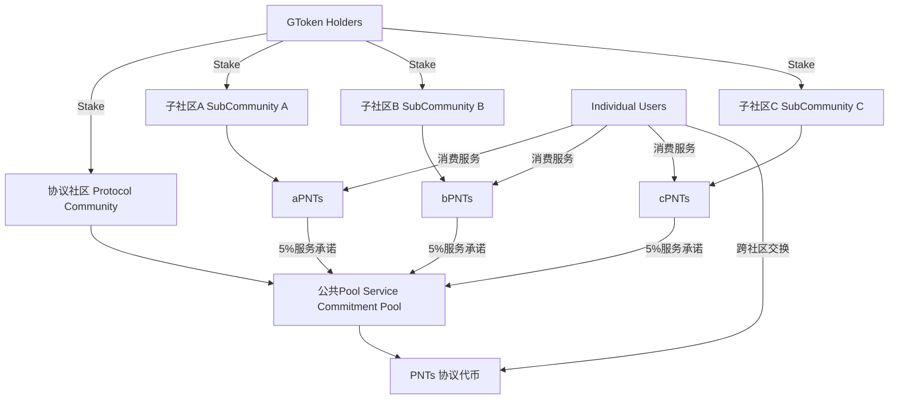

# MushroomDAO 多层次代币经济模型设计

## 模型概述

本文档作为金融学和货币银行学视角下的代币经济模型设计，旨在建立一个基于**服务承诺锁定机制**的可持续多层次代币生态系统。该模型通过创新的"未来服务资产化"机制，实现了去中心化协议治理与实际服务价值的深度绑定。本机制和模型遵守关于商业积分，会员积分的法律和法规。

### 核心创新点
1. **传统商业积分代币化**：将现实世界成熟的会员积分机制区块链化和互联化
2. **服务承诺资产化**：将未来服务承诺转化为可交易的价值载体
3. **多层次价值捕获**：协议层、子社区层、个体层的价值流向设计
4. **Credit驱动的动态汇率**：防止通胀和滥发的内生机制
5. **全球合规友好**：严格基于各国现有商业积分法规，确保全球普及性

---


## 第零部分：现实世界商业积分机制融合

### 0.1 传统商业积分的法律地位与实践

#### 全球商业积分的合法性基础
传统商业积分制度在全球范围内被广泛接受和法律认可：

**美国**：
- 《联邦贸易委员会法》允许企业发行会员积分
- 《萨班斯-奥克斯利法》要求上市公司披露积分负债
- 州级消费者保护法规范积分的使用期限和兑换规则

**欧盟**：
- 《消费者权益保护指令》保护积分持有者权益
- 《电子货币指令2》明确区分商业积分与电子货币
- GDPR要求积分系统保护用户数据隐私

**中国**：
- 《单用途商业预付卡管理办法》规范积分发行
- 《消费者权益保护法》保护积分兑换权利
- 商务部备案要求确保资金安全

**其他主要经济体**：
- 日本：《消费者合同法》保护积分使用权
- 新加坡：《消费者保护法》规范积分期限
- 澳大利亚：《竞争与消费法》防止误导性积分营销

#### 商业积分的核心特征与限制
```
特征：
✓ 预付费性质：用户先付费购买商品/服务，获得积分奖励
✓ 专用性：仅限特定商户或联盟内使用
✓ 非投资性：不承诺投资回报，仅提供消费折扣
✓ 有限期限：通常设置1-3年有效期

限制：
✗ 不可现金兑换（多数法域）
✗ 发行量需要对应实际负债能力
✗ 需要遵循反洗钱（AML）要求
✗ 跨境使用需要额外合规审查
```

### 0.2 xPNTs作为标准化商业积分的创新

#### 技术赋能传统积分的优势
本经济模型的核心创新在于**用区块链技术升级传统商业积分**：

**传统积分痛点**：
1. **孤岛效应**：每家商户积分独立，无法互通
2. **中心化风险**：商户倒闭导致积分失效
3. **透明度缺失**：用户无法验证积分发行总量
4. **跨境困难**：国际使用面临汇率和合规问题

**xPNTs解决方案**：
1. **互操作性**：通过PNTs实现跨商户积分流通
2. **去中心化备份**：区块链记录防止单点失败
3. **透明发行**：链上可验证的发行量和使用情况
4. **全球通用**：统一技术标准支持跨境使用

#### 合规性框架设计
```
第一层：本地商业积分合规
- 每个子社区严格遵循当地商业积分法规
- 发行量对应实际服务承诺能力
- 设置合理的积分有效期和使用条款

第二层：跨域流通协议
- PNTs作为"积分兑换券"而非独立货币
- 明确标注为"服务预付费"而非"投资产品"
- 实施KYC/AML但保持用户友好的准入门槛

第三层：技术合规保障
- 智能合约自动执行合规规则
- 可审计的链上交易记录
- 监管友好的数据接口和报告机制
```

### 0.3 全球普及策略

#### 分地区合规部署
**第一阶段：积分友好地区**
- 新加坡、瑞士、阿联酋等区块链友好国家
- 建立标准化的商业积分发行模板
- 与当地商户合作进行试点

**第二阶段：主要经济体**
- 美国、欧盟、日本等成熟市场
- 重点强调"技术升级传统积分"而非"创造新货币"
- 与现有积分联盟和商户协会合作

**第三阶段：新兴市场**
- 东南亚、拉美、非洲等市场
- 提供普惠金融服务，帮助小商户数字化
- 重点解决跨境支付和汇率问题

#### 商户接入标准
```
技术要求：
- 提供真实商品/服务
- 具备基本的数字化经营能力
- 同意接受技术审计和合规检查

法律要求：
- 在当地合法注册的商业实体
- 遵循当地消费者保护法律
- 同意接受跨境交易的额外合规要求

经济要求：
- 具备足够资金支持积分兑换承诺
- Stake一定数量的GToken作为保证金
- 维护积分流动性池的最低要求
```

---

## 第一部分：理论基础与架构设计

### 1.1 基于商业积分的货币银行学理论基础

#### 传统货币职能分析
本经济模型中的代币体系承担了传统货币的多重职能：

**PNTs（协议代币）**：
- **价值尺度**：作为跨社区服务的统一计价单位
- **交换媒介**：促进不同子社区间的价值流通
- **价值储存**：基于服务承诺的内在价值支撑

**xPNTs（子社区积分代币）**：
- **会员积分升级版**：传统商业积分的区块链化实现
- **专用消费券**：特定商户服务场景下的支付工具
- **服务预付费凭证**：代表对特定服务的预付费索取权
- **跨境通用**：支持全球范围内的积分互通和兑换

**GToken（治理代币）**：
- **权益凭证**：协议治理权的载体
- **准入门槛**：通过Stake机制控制生态准入

#### 创新的"服务承诺资产化"理论

传统金融中，资产的价值基于：
1. 现金流折现
2. 资产重置成本
3. 市场比较法

本模型创新性地将**未来服务承诺**作为资产定价基础：

```
资产价值 = Σ(服务承诺价值 × 履约概率 × 时间折现因子)
```

这种模式类似于传统金融中的"应收账款证券化"，但具有以下优势：
- **去中心化风险评估**：通过Credit机制实现
- **实时价值发现**：通过DEX流动性池实现
- **自动化执行**：通过智能合约实现

### 1.2 系统架构设计



---

## 第二部分：核心代币机制设计

### 2.1 GToken治理代币机制

#### 基本参数
- **总供应量**：21,000,000 GToken（向比特币致敬）
- **发行方式**：分阶段发行，避免过度集中
- **核心功能**：治理权重、生态准入凭证

#### 分配机制建议
```
创始团队：     15% (3,150,000 GToken) - 4年线性解锁
早期贡献者：   20% (4,200,000 GToken) - 按贡献动态分配
社区激励：     35% (7,350,000 GToken) - 任务奖励和流动性挖矿
公开发行：     20% (4,200,000 GToken) - Fair Launch机制
生态发展基金： 10% (2,100,000 GToken) - DAO控制
```

#### Stake机制设计
- **最低Stake要求**：不同等级准入
  - 个人用户：1,000 GToken
  - 小型子社区：10,000 GToken
  - 大型子社区：100,000 GToken
- **Stake奖励**：参与治理获得额外GToken奖励
- **Slash风险**：恶意行为或服务违约的惩罚机制

### 2.2 公共Pool服务承诺锁定机制

#### 核心设计原理

**传统问题**：子社区滥发代币稀释价值
**创新解决方案**：锁定服务承诺而非代币数量

```javascript
// 伪代码示例
struct ServiceCommitment {
    address subCommunity;           // 子社区地址
    string serviceType;             // 服务类型
    uint256 serviceUnits;           // 服务单位数量
    uint256 unitPrice;              // 单位价格（当时的市场价）
    uint256 timestamp;              // 锁定时间戳
    uint256 validUntil;             // 有效期
    bool executed;                  // 是否已执行
}
```

#### 具体操作流程

**步骤1：服务承诺快照**
当AAStar铸造1000 aPNTs时：
- 市场价：每aPNTs = 0.09 USDC（gas赞助基础价值）
- 协议收取：50 aPNTs（5%）
- Pool锁定：33次基础gas赞助服务承诺（50/1.5 = 33.33）
- 不锁定4.5 USDC，而是锁定具体服务承诺

**步骤2：服务承诺验证**
- 智能合约记录服务标准
- Oracle获取服务执行状态
- Credit评分影响未来服务承诺的折现率

**步骤3：价值实现**
- 用户消费服务时，对应的服务承诺被标记为"已执行"
- 如果服务无法提供，触发清算机制

### 2.3 PNTs发行与货币政策

#### 发行原则
PNTs的发行严格基于公共Pool中锁定的服务承诺总价值：

```
PNTs发行量 = Pool服务承诺总价值 / PNTs单位价值
```

#### 初始定价策略
建议PNTs初始定价为：
```
1 PNTs = 1 USDC 等值的服务组合
```

具体组合示例：
- 1.11次基础gas赞助（0.09×1.11=0.1U）
- 或 0.33个面包（假设面包0.3U）
- 或 0.25杯咖啡（假设咖啡0.4U）
- 或其他服务的等值组合

#### 增发机制
- **触发条件**：Pool价值增长超过已发行PNTs价值10%
- **增发额度**：等于新增Pool价值的95%（保留5%缓冲）
- **治理要求**：需要GToken持有者投票确认

#### 通缩机制
- **服务消费**：消费服务时对应PNTs销毁
- **违约清算**：子社区违约时相关PNTs销毁
- **定期审计**：季度审计调整PNTs供应量

---

## 第三部分：Credit评分与风险控制

### 3.1 Credit评分系统

#### 评分维度
```javascript
CreditScore = Weighted_Average(
    Service_Delivery_Rate × 0.4,      // 服务履约率
    Stake_Ratio × 0.2,                // Stake比例
    Historical_Performance × 0.2,      // 历史表现
    Community_Reputation × 0.1,        // 社区声誉
    Technical_Capacity × 0.1           // 技术能力
)
```

#### 动态汇率机制
```
Exchange_Rate = Base_Rate × Credit_Multiplier × Supply_Demand_Factor

其中：
Credit_Multiplier = 0.5 + (Credit_Score / 1000)  // Credit 0-1000分
Supply_Demand_Factor = sqrt(Demand / Supply)      // 市场供需调节
```

### 3.2 风险控制机制

#### 子社区准入控制
1. **最低Stake要求**：根据提供服务规模确定
2. **技术审核**：代码审计和安全检查
3. **试运行期**：3个月观察期，限制发行量
4. **社区投票**：GToken持有者表决

#### 违约处理机制
```
违约等级1：服务延迟 → Credit扣分 + 警告
违约等级2：服务质量下降 → Credit扣分 + 降低汇率
违约等级3：系统性违约 → Slash Stake + 清算
```

#### 保险机制设计
- **保险池**：从协议收入中提取10%建立
- **赔付条件**：子社区技术故障导致服务中断
- **赔付额度**：最高覆盖池中该社区承诺价值的50%

---

## 第四部分：DEX流动性与市场机制

### 4.1 多池流动性设计

#### Uniswap V4集成方案
```
主要交易对：
PNTs/USDC     - 协议代币基础流动性
aPNTs/PNTs    - AAStar服务代币
bPNTs/PNTs    - 面包店社区代币
cPNTs/PNTs    - 其他服务社区代币
GToken/USDC   - 治理代币流动性
```

#### 流动性激励机制
- **子社区激励**：维护流动性获得更多任务者支持
- **协议激励**：向LP提供者分发GToken奖励
- **手续费分享**：交易手续费的50%分配给LP

### 4.2 价格发现机制

#### 内在价值锚定
PNTs价格不应长期偏离其内在价值：
```
内在价值 = Pool中服务承诺总价值 / PNTs总供应量
```

#### 套利机制
- **正向套利**：PNTs价格过高时，用户可直接购买服务
- **反向套利**：PNTs价格过低时，子社区可购买PNTs换取服务承诺

#### 价格稳定机制
- **弹性供应**：价格波动触发增发/回购
- **缓冲基金**：使用DAO金库平滑价格波动
- **Circuit Breaker**：极端情况下的熔断机制

---

## 第五部分：清算与应急机制

### 5.1 子社区清算流程

#### 触发条件
1. **技术故障**：超过7天无法提供承诺服务
2. **恶意行为**：故意违约或操纵价格
3. **资不抵债**：Stake价值低于承诺服务价值的50%

#### 清算优先级
```
第一优先：个人用户的服务承诺
第二优先：其他子社区的协议费用
第三优先：协议社区的5%承诺
第四优先：返还Stake
```

#### 清算资产分配
1. **立即可执行服务**：转移给其他子社区或协议社区执行
2. **Stake资产**：按优先级分配给受影响用户
3. **剩余价值**：进入保险池

### 5.2 系统性风险应对

#### 大型子社区失败
- **影响评估**：计算对Pool总价值的影响
- **应急增发**：必要时增发GToken补充资金
- **服务迁移**：协助用户转移到其他服务提供商

#### 外部市场冲击
- **稳定机制启动**：动用DAO金库稳定价格
- **流动性支持**：向关键交易对注入流动性
- **暂停机制**：极端情况下暂停新发行

---

## 第六部分：合规性与法律分析

### 6.1 积分制度的合规优势

#### 法律定性
- **非证券性质**：基于服务积分，不涉及投资收益预期
- **消费凭证**：代表对特定服务的索取权
- **区域限制**：可根据不同法域调整服务范围

#### 监管友好特征
1. **服务绑定**：每个代币都有明确的服务对应关系
2. **非投机设计**：价值基于实际服务而非市场炒作
3. **透明机制**：所有规则通过智能合约公开执行

### 6.2 跨国合规策略

#### 分层合规框架
- **协议层**：选择友好司法管辖区建立基础
- **子社区层**：遵循当地服务业法规
- **用户层**：KYC/AML要求的弹性实施

#### 风险控制措施
- **地域限制**：限制高风险地区用户参与
- **额度控制**：单用户持有额度限制
- **报告机制**：定期向监管机构报告运营状况

---

## 第七部分：关键问题与后续讨论

### 7.1 需要进一步明确的关键问题

#### A. 服务承诺的时效性管理
**问题**：如何处理长期服务承诺的价值变化？

**讨论点**：
1. 服务承诺是否需要设定有效期？
2. 如何处理服务成本上涨对历史承诺的影响？
3. 是否需要建立服务承诺的"重定价机制"？

**建议方案**：
- 短期服务（<6个月）：固定价格执行
- 长期服务（>6个月）：价格浮动机制 + 最低保障

#### B. PNTs的最终定位
**问题**：PNTs应该是纯粹的服务券还是可投资的价值存储？

**影响分析**：
- 如果是服务券：更好的合规性，但流动性受限
- 如果是价值存储：更好的流动性，但监管风险增加

**折中方案**：
- 核心功能：服务兑换券
- 附加功能：有限的价值存储（设定持有上限）

#### C. 治理权重的动态调整
**问题**：随着生态发展，GToken的治理权重是否需要调整？

**考虑因素**：
1. 大型子社区的话语权问题
2. 新加入社区的权益保护
3. 协议社区与子社区的权力平衡

#### D. 跨链扩展策略
**问题**：如何在多链环境下维护经济模型的完整性？

**技术挑战**：
1. 跨链服务承诺的验证
2. 多链流动性的统一管理
3. 不同链的gas费差异处理

### 7.2 数学模型验证需求

#### 参数敏感性分析
需要通过建模验证以下参数的合理性：
- Credit评分权重分配
- 动态汇率调节系数
- 保险池资金比例
- 清算优先级设置

#### 极端情况压力测试
- 50%子社区同时违约的系统影响
- 外部市场暴跌对内部价格的传导
- 大量用户同时退出的流动性冲击

---

## 第八部分：实施路线图建议

### Phase 1: 基础设施建设（0-6个月）
- [ ] GToken发行和分配
- [ ] 基础智能合约开发
- [ ] Credit评分系统上线
- [ ] 第一个子社区（AAStar）接入

### Phase 2: 生态扩展（6-18个月）
- [ ] 3-5个子社区接入
- [ ] PNTs首次发行
- [ ] DEX流动性池建立
- [ ] 基础治理功能实现

### Phase 3: 市场化运营（18-36个月）
- [ ] 外部DEX集成
- [ ] 跨链功能开发
- [ ] 高级金融产品（如借贷）
- [ ] 机构合作伙伴接入

---

## 结论

本经济模型的核心创新在于**"传统商业积分的区块链化升级"**，通过将全球成熟的会员积分机制代币化和互联化，实现了最大化的合规性和普及性。该模型具有以下优势：

1. **法律基础坚实**：基于各国现有商业积分法规，避免监管不确定性
2. **全球普及性**：利用传统积分的广泛接受度，降低用户认知门槛
3. **内在价值支撑**：每个积分都有明确的服务价值背书
4. **技术创新升级**：解决传统积分的孤岛效应和透明度问题
5. **可持续发展**：多层次价值捕获机制确保生态长期繁荣

**战略定位明确**：
我们不是在创造新的金融产品，而是在**升级现有的商业积分系统**，这是确保全球合规和快速普及的关键策略。

---

## 附录：专家深度提问清单

### 🎯 战略定位与合规性问题

#### Q1: 商业积分法律边界的精确界定
基于您强调的"标准商业积分"定位，需要明确：
- **有效期设置**：传统积分通常有1-3年有效期，xPNTs是否也应设置类似期限？这会如何影响Pool中的服务承诺锁定？
- **现金兑换限制**：多数法域禁止积分直接兑现，但允许商品/服务兑换。PNTs在DEX交易是否会突破这一限制？需要什么技术或法律结构来保持合规？
- **发行主体责任**：传统积分由商户承担履约责任，在我们的模型中，当子社区违约时，协议社区是否承担连带责任？如何界定责任边界？

#### Q2: 跨境积分流通的监管策略
- **汇率风险处理**：当用户在不同国家使用积分时，如何处理汇率变动？是锁定当地货币价值还是锁定服务价值？
- **税务合规**：跨境积分兑换是否触发税务申报？各国对数字积分的税务处理差异如何应对？
- **数据本地化**：GDPR、《数据安全法》等要求数据本地化，如何确保全球链上记录符合各国数据主权要求？

### 💰 经济机制精细化设计问题

#### Q3: Credit评分体系的具体算法
我建议的5维度评分需要您确认权重分配：
```
建议权重：
- 服务履约率：40% （历史服务完成质量）
- Stake保证金比例：20% （财务安全保障）
- 历史信用表现：20% （长期信誉记录）
- 社区声誉评分：10% （用户评价反馈）
- 技术服务能力：10% （系统稳定性）
```
- 这个权重分配是否合理？
- 如何防止刷分行为？
- Credit分数多久更新一次？

#### Q4: 服务承诺的标准化与执行
- **服务分类标准**：如何建立标准化的服务分类体系？（如：基础服务、增值服务、奢侈服务等）
- **质量评估机制**：谁来评估服务质量？用户评分、第三方审计还是AI自动评估？
- **违约界定标准**：什么情况算违约？服务延迟几天？质量下降多少百分比？
- **争议解决机制**：用户对服务不满意时的仲裁流程？

#### Q5: Pool资产管理的精确机制
您强调锁定"服务承诺"而非"稳定币价值"，需要明确：
- **服务通胀调整**：当gas费用、面包价格等普遍上涨时，Pool中的历史承诺如何处理？
- **服务标准变化**：技术升级导致服务标准提高（如更快的区块确认），历史承诺是否需要补偿？
- **Pool再平衡机制**：当某类服务承诺过多/过少时，如何调节Pool结构？

### 🔄 运营流程与用户体验问题

#### Q6: 用户onboarding的合规友好设计
- **KYC程度**：为保持"积分"特性，KYC要求应该多严格？是否可以设置分级KYC（小额免KYC，大额需要完整KYC）？
- **钱包集成**：如何设计对Web2用户友好的界面？是否需要开发专门的"积分钱包"而非标准的"加密钱包"？
- **法币接入**：用户如何购买xPNTs？直接法币购买还是必须先购买GToken？

#### Q7: 商户接入的标准化流程
- **审核标准**：除了我建议的技术、法律、经济要求外，还需要什么审核维度？
- **试运行机制**：新商户的3个月试运行期具体如何操作？发行量限制多少？
- **技术支持**：如何帮助传统小商户（如夫妻店）完成数字化改造？

#### Q8: 危机管理与应急响应
- **系统性风险**：如果多个大型子社区同时出现问题，Pool资产不足以覆盖所有承诺时的处理顺序？
- **技术故障**：链上系统出现bug或被攻击时，如何保护用户权益？
- **监管突变**：某个重要市场突然改变积分监管政策时的应对策略？

### 🌍 全球扩展与生态建设问题

#### Q9: 生态激励机制的可持续性
- **早期激励**：如何激励前100个商户加入？纯粹的网络效应还是需要代币激励？
- **网络效应临界点**：预计多少商户和用户能够形成自我强化的网络效应？
- **竞争壁垒**：传统积分联盟（如航空里程联盟）试图模仿我们的模式时，我们的差异化优势是什么？

#### Q10: 技术架构的扩展性
- **TPS要求**：全球商业积分交易量可能非常大，对区块链TPS的要求？是否考虑Layer2解决方案？
- **存储优化**：大量的服务承诺记录如何高效存储和检索？
- **隐私保护**：在保持透明性的同时，如何保护用户和商户的商业隐私？

### 📊 数据驱动的模型优化问题

#### Q11: 关键指标的定义与追踪
建议追踪的核心KPI：
```
用户侧：
- 积分活跃使用率（每月使用积分的用户比例）
- 跨商户兑换频率（用户使用PNTs跨社区消费的频率）
- 平均持有时长（积分从获得到使用的时间）

商户侧：
- 履约率（承诺服务的实际完成率）
- Credit分数变化趋势
- 积分发行与兑换的比例

协议侧：
- Pool价值增长率
- PNTs价格稳定性（与内在价值的偏离度）
- 治理参与度（GToken持有者的投票参与率）
```
这些指标是否全面？还需要补充什么？

#### Q12: 模型参数的动态调整机制
- **协议费率调整**：当前建议AAStar向协议支付1.2-2.6 aPNTs，这个范围如何动态调整？基于什么指标？
- **Stake要求更新**：不同规模社区的Stake要求是否需要定期调整？基于通胀、风险还是网络价值？
- **Credit权重优化**：基于实际运营数据，如何优化Credit评分的权重分配？

---

---

## 真实用户视角的尖锐质疑

### 👤 **普通消费者（张三，上海白领）**

#### 现实痛点质疑：
**Q1: "我为什么要用你们的积分而不是支付宝积分？"**
- 支付宝积分我熟悉，商家多，兑换方便，你们有什么实际优势？
- 学习成本：我要下载新App，注册钱包，学习新概念，值得吗？
- 风险担忧：万一你们公司倒闭了，我的积分怎么办？支付宝至少有政府背书

**Q2: "具体使用场景的计算实例"**
假设我每月消费3000元：
- 在星巴克花200元，传统可得20积分，你们给多少aPNTs？
- 这些aPNTs能在面包店用吗？汇率怎么算？手续费多少？
- 如果面包店倒闭了，我的aPNTs变废纸吗？

**Q3: "实际便利性质疑"**
- 跨境优势：我在日本旅游，真的能用国内咖啡店的积分吗？汇率、手续费、延迟问题？
- 兑换麻烦：传统积分直接扫码就用，你们需要几步操作？
- 客服问题：出问题找谁？本地商家还是你们协议？

### 🏪 **小商户（李老板，社区面包店）**

#### 经营成本质疑：
**Q4: "我的实际成本收益分析"**
以月营业额3万元的面包店为例：
- 技术成本：接入系统、培训员工、维护设备的月成本？
- 资金占用：需要Stake多少GToken？这些钱放银行定期能赚多少？
- 履约风险：如果原材料涨价，历史低价承诺怎么办？破产风险？

**Q5: "竞争力分析"**
- 为什么要发积分？现金折扣不是更直接？
- 大型连锁店也加入，我的小店怎么竞争？
- 积分营销真的能带来更多客户吗？有数据支撑吗？

**Q6: "操作复杂度担忧"**
- 我文化水平不高，能操作这些区块链技术吗？
- 出问题时的技术支持响应时间？
- 税务申报会更复杂吗？

### 🏢 **企业服务方（AAStar团队）**

#### 商业模式质疑：
**Q7: "收入模型的可持续性"**
具体计算：
- Gas赞助服务成本0.09U，收费1.5-3 aPNTs，利润率多少？
- 协议抽成1.2-2.6 aPNTs，我们净利润还剩多少？
- 竞争对手（如Biconomy）降价怎么办？

**Q8: "技术风险与责任边界"**
- 服务宕机导致用户损失，赔偿责任如何界定？
- Credit评分下降影响业务，申诉机制是什么？
- 智能合约升级时，历史承诺如何处理？

### 🔍 **监管者视角（金融监管局官员）**

#### 合规风险质疑：
**Q9: "实质vs形式的监管判断"**
- 虽然叫"积分"，但DEX交易、跨境流通、投资属性明显，如何解释？
- PNTs价格波动，用户买入期望升值，这不是变相ICO？
- 协议收入分配给GToken持有者，这不是证券分红？

**Q10: "系统性风险评估"**
- 大量小商户参与，类似P2P风险，如何防范？
- 跨境资金流动的反洗钱监控机制？
- 用户投诉激增时的处理能力？

### 💻 **技术开发者（区块链工程师）**

#### 技术实现质疑：
**Q11: "扩容与性能挑战"**
具体数据需求：
- 全球积分交易TPS需求预估？以太坊主网2万TPS够吗？
- 服务承诺数据存储成本？IPFS还是链上存储？
- 跨链互操作的技术复杂度与安全风险？

**Q12: "用户体验的技术挑战"**
- Web2用户如何无感使用区块链？私钥管理方案？
- 交易确认时间vs用户即时性需求的矛盾？
- 移动端性能优化，特别是低端安卓设备？

---

## 核心使用场景的残酷现实检验

### 📊 **场景一：大学生日常消费**

**用户：** 小王，北京大学生，月生活费1500元

**现状对比：**
- 传统方式：校园卡+支付宝，简单直接
- 我们的方案：需要额外学习成本

**尖锐问题：**
1. 小王在校内咖啡店花30元，得到多少aPNTs？
2. 这些aPNTs在校外面包店的兑换率？手续费？
3. 寒假回家，这些积分在老家能用吗？
4. **最关键：相比传统方式，小王的实际得失是什么？**

### 📊 **场景二：中小企业员工福利**

**用户：** 50人创业公司，想用积分发员工福利

**现状对比：**
- 传统方式：现金奖金或购物卡
- 我们的方案：发行公司内部积分

**尖锐问题：**
1. 公司需要Stake多少GToken？资金成本？
2. 员工离职时积分如何处理？
3. 积分税务处理比现金复杂吗？
4. **最关键：对公司和员工，实际价值增量在哪里？**

### 📊 **场景三：跨境电商小卖家**

**用户：** 王姐，做跨境电商，月销售额5万人民币

**现状对比：**
- 传统方式：PayPal+信用卡积分
- 我们的方案：发行店铺积分

**尖锐问题：**
1. 汇率波动风险如何转嫁？
2. 不同国家用户的积分如何统一管理？
3. 客户投诉积分问题，处理成本？
4. **最关键：相比现有方案，净收益提升多少？**

---

## 经济模型的生死存亡问题

### 💀 **死亡螺旋风险分析**

**Q13: "网络效应失败的连锁反应"**
- 如果前100个商户中50个退出，对剩余商户的信心冲击？
- Pool价值下降→PNTs贬值→更多商户退出的恶性循环如何避免？
- 用户发现积分"不值钱"后的集体抛售风险？

**Q14: "经济衰退压力测试"**
- 经济衰退时，用户优先使用现金还是积分？
- 商户资金紧张时，会不会停止履行历史积分承诺？
- 失业率上升，积分消费需求下降的影响？

### 🔥 **竞争压力的现实检验**

**Q15: "巨头碾压风险"**
- 支付宝推出"全球积分互通"功能，我们如何应对？
- 微信、Apple Pay跟进类似功能，我们的护城河在哪？
- 传统积分联盟（如星空联盟）区块链化，我们还有优势吗？

**Q16: "监管政策突变风险"**
- 中国突然收紧数字积分监管，大量用户无法使用怎么办？
- 欧盟要求积分必须欧盟内存储，技术架构如何调整？
- 美国要求所有积分交易KYC，用户体验受损的后果？

---

## 直击核心的价值质疑

### ❓ **根本价值怀疑**

**Q17: "解决了谁的真实痛点？"**
- 用户角度：现有积分系统真的有那么多不便吗？
- 商户角度：发行积分的投入产出比真的高于现金促销吗？
- 社会角度：这个系统创造的社会价值在哪？还是只是技术炫技？

**Q18: "成本效益的残酷计算"**
以一个月活1万用户的系统为例：
- 开发维护成本：年成本多少？
- 用户获取成本：每个用户的获取和留存成本？
- 与传统积分系统相比，单位效益的提升比例？

**Q19: "可持续发展的终极考验"**
- 没有投机炒作，纯粹使用需求能支撑多大规模？
- 团队如何盈利维持长期开发？
- 10年后，这个系统还会存在吗？基于什么判断？

---

**残酷的现实总结：**
以上所有问题都指向一个核心：**这个系统对真实用户的实际价值增量在哪里？**

不要用"去中心化"、"区块链创新"等概念回避这些问题。用户只关心：更便宜、更方便、更安全、更有价值。请用具体数据和案例回答这些质疑。

---

**免责声明**：本文档为经济模型设计建议，不构成投资建议。实际实施需要根据法律法规和市场条件进行调整。

------
补充
经济模型 v0.1 完成草图，开始表述和绘图给别人理解，类比其他模型
IPO-->ICO-->CCO（Community Coin Offering）
DCredit-->流动性-->换客户资产-->确定性需求资产化-->价值传递完成
三面体：商业积分（商业模型），透明链上积分（技术模型），去中心获客（经济模型）
协议：无状态，无许可，去中心化
流动性Token：未来协议持续促成交易，获得收入和持续分配，基于pool+（商家+客户）增长+交易量增长，需要流动性
协议收入分配：对比传统获客成本和CPS收入模型，促成一次交易，商家支付意愿（多种套餐：新店，持续获客，价值发现），用户，vault；提供本地数据比例计算，市场定价
支付意愿是商家获客分层，提供多种支付方式：自有积分（DCredit赋予流动性，兑付服务或商品），直接PNTs支付（需要法币购买）
确定性需求是客户选择，滑动左中右，应对了不同风险、口味、价格、区域等偏好的选择，选择某个coupon后，显示完成交易获得的PNTs和xPNTs，完成交易，获得确定性需求的资产化
本质是去CPS+去中心化集客，协议极低收入，促成信息和资产基于交易的充分流通。
为何可以存在和获得市场份额？极端的低成本对比：
- 两人研发和运维
- 去中心化计算节点，无需可加入
- 极端的分配：8020原则，大头给客户的确定性需求资产化
- 自组织+病毒传播：永远分配收入的3.5%（最低要求，店主可调节增加）给去中心化店长top5
- 开放的研发生态
