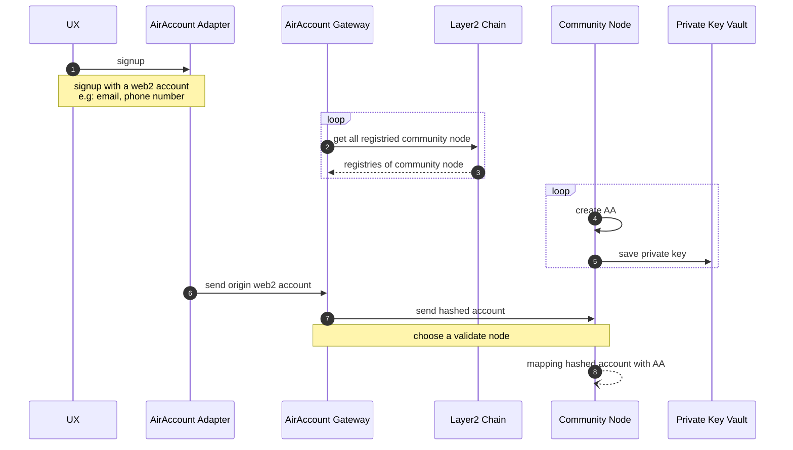
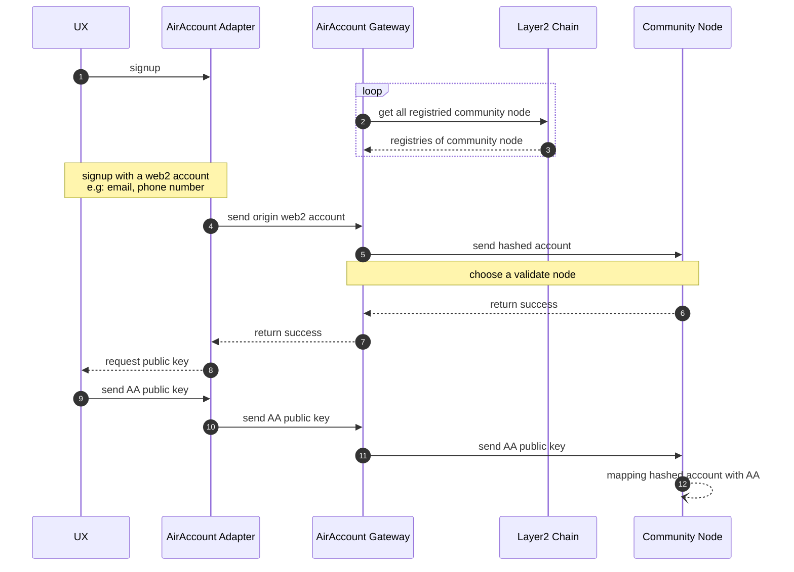
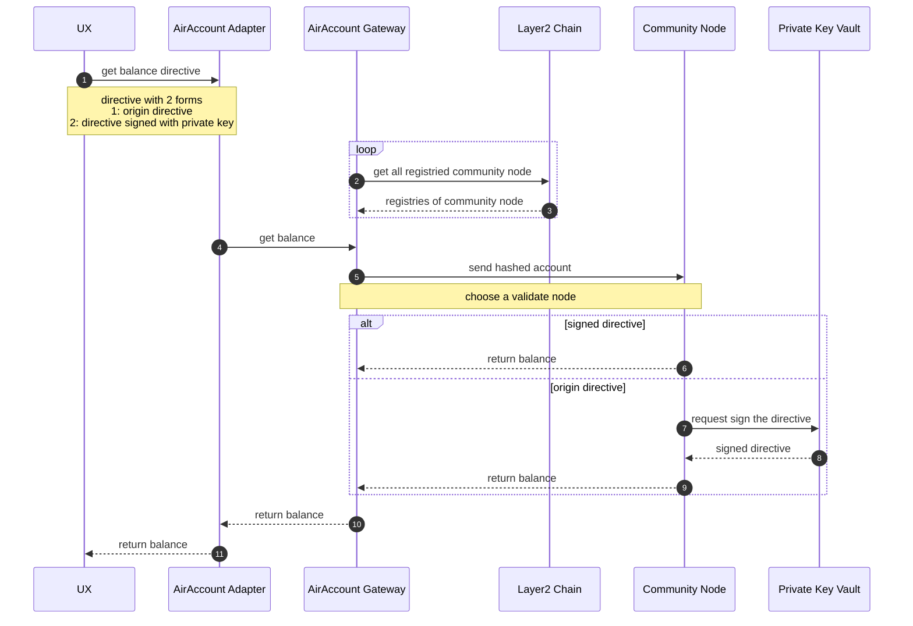
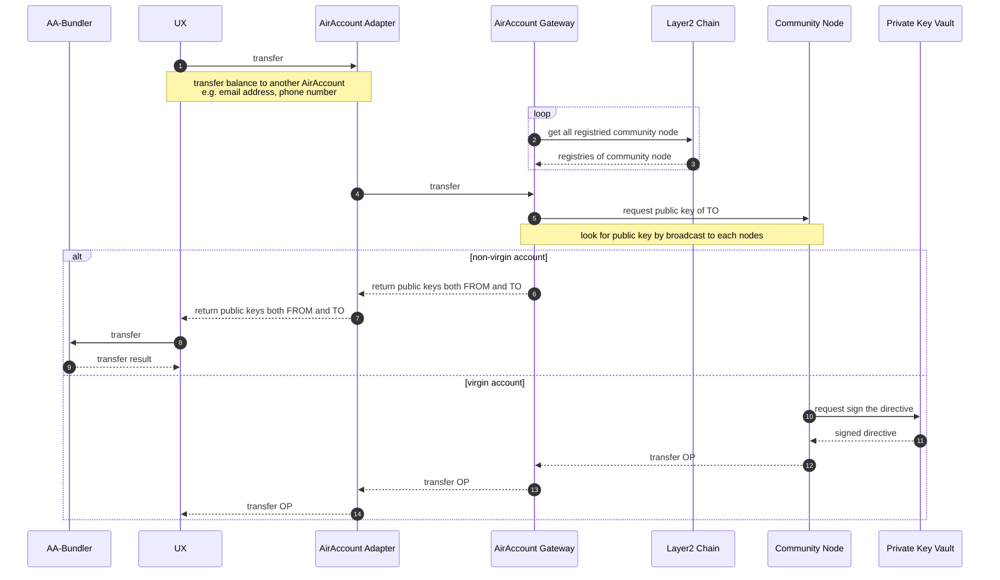

# AirAccount POC

# Signup

1. Signup AirAccount in virgin way

<aside>
💡 virgin way means there is an web2 account only, community node will create an AA and mapping to the web2 account.

</aside>

1. Signup Account with non-virgin way

<aside>
💡 non-virigin way means it has an AA already

</aside>

# Balance

1. Get balance of AirAccount

1. Transfer

# **Appendix**

- UX: a friendly interface which obscured the distinctions between web2 and web3, it could be a webpage, a smart phone or even a feature phone.

<aside>
💡 if the account is signup with a non-virgin way, a feature phone is not supported due to hardly operate of transferring a public key or signing a directive

</aside>

<aside>
🀄 UX是一个用户与web2/web3世界沟通的桥梁，包括但不限于App，dApp，Email，甚至手机，作用就是通过UI与背后的世界交互，这一点与我们传统意义上所说的“上网”没有任何区别

</aside>

- AirAccount Adapter, AirAccount Gateway both are independent stateless off-chain service

<aside>
💡 web2 account will hashed before transfer to community node.

</aside>

<aside>
🀄 Adapter：适配器，与用户的UX“适配”，Gateway，网关，相对于CommunityNode而言；

</aside>

- Community Node是一个off-chain的由社区或个人运行的服务程序，通过安全可信方案保存私钥，以及hashed account与私钥的关联关系

<aside>
💡 每个Community Node都会自动预创建私钥，在用户通过web2 account进行signup的时候，如果是virgin模式，则自动分配（即将hashed web2 account mapping with AA)；理论上，使用AirAccount的web2 account，一个account可能会有多个AA（因为通过gateway分配到了不同的community node)

</aside>

<aside>
🀄 以一个典型的微服务架构场景来类比Adapter，Gateway与CommunityNode 的关系，Adapter就是BFF层，适配来自种UX的指令，转换为一种统一的语言（指令，或者说协议Payload）；然后将这个统一的语言转发给Gateway，可以理解为在Web2的世界中，前端发送指令，进入真正的业务服务之前，会经过Gateway进行统一路由分派；最后才会进入CommunityNode；

这么设计的原因是，web2的世界中，App仅服务于中心化的业务服务，所有的协议不需要经过Adapter适配转换，直接经由Gateway传入后端服务即可；对于Web3而言，UX+Adapter 等效于Web2的APP；Gateway可以简单等价于传统的Gateway，CommunityNode简单的等价于Web2的业务服务

</aside>

# Question

> Q1: 由于一个web2 account与AA是一对多关系，那么通过web2转账时，应该如何选择转到哪个AA呢？
> 
> 
> 只会一对一
> 

> Q2: 是否应该让用户知道他和web2 account名下有多个AA，还是仅需要汇总即可？
> 

不存在这个问题

> Q3: Community Node是否需要使用P2P协议实现数据同步，以达到社区节点之间的去中心化？
> 
> 
> 如果是，那么，哪些数据是需要实现同步的，我的理解是这些数据应该是轻量的，例如仅同步~~public key~~ hased后的web2account及所在的节点rpc，这样可以定位到具有完全数据的节点实现后续操作
> 

gossip；创世节点（们）地址hard code在L1/2 chain