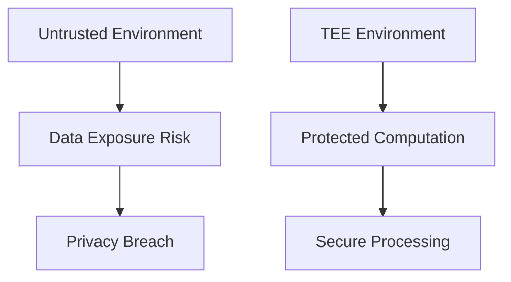
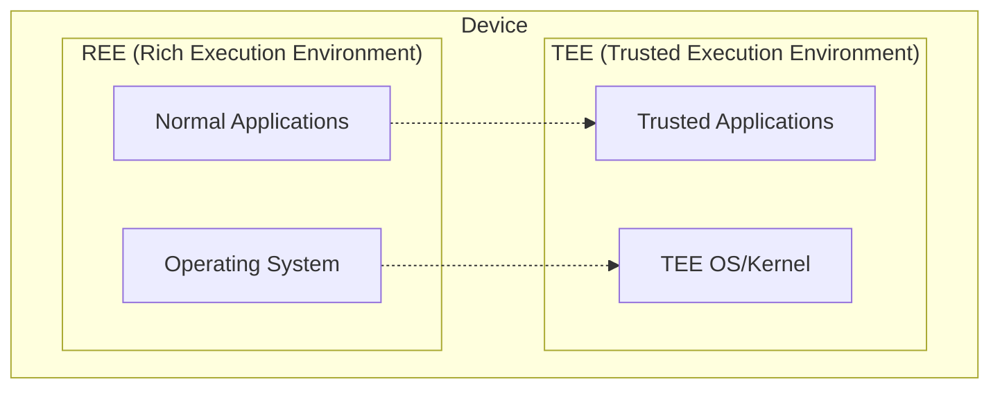
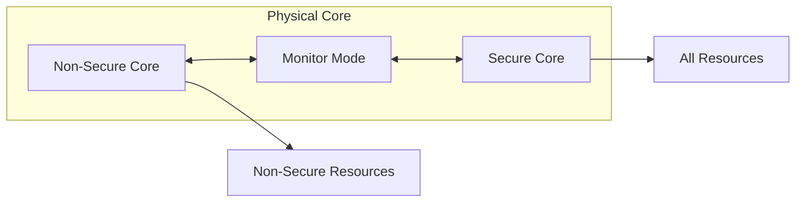
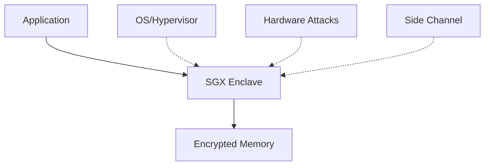
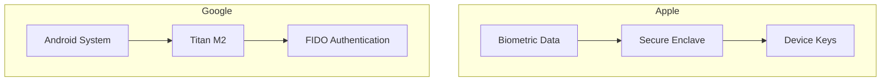
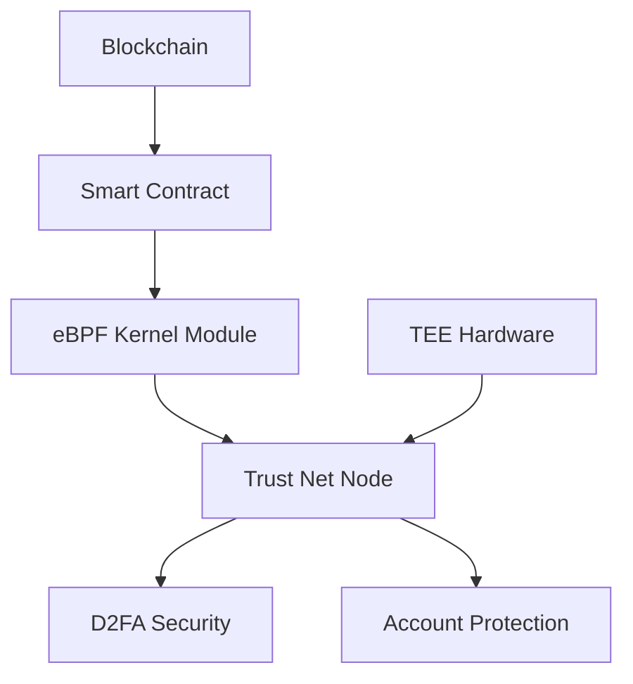
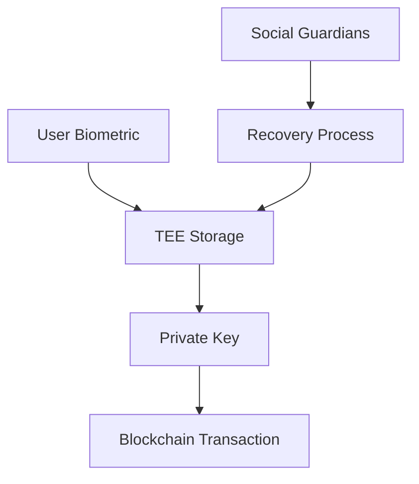

# TEE, Enclave, Titan, and Trust Net
## Academic Seminar Presentation

---

## Slide 1: Title Page
# Trusted Execution Environment (TEE) and Trust Net
## Building Secure Computing Infrastructure for Decentralized Systems

**Presenter:** [Your Name]  
**Date:** [Conference Date]  
**Conference:** [Seminar Name]

---

## Slide 2: Agenda
# Presentation Outline

1. **Background & Motivation**
2. **TEE Fundamentals**
3. **Hardware Implementations**
4. **Mobile TEE Solutions**
5. **Trust Net Architecture**
6. **Security Assumptions**
7. **Future Directions**

---

## Slide 3: Background & Motivation
# Why TEE Matters?

## Current Challenges:
- **Data Privacy vs. Computation Needs**
- **Trust in Centralized Systems**
- **Secure Multi-party Collaboration**

## Key Problems:
- Traditional computing exposes data in plaintext
- Lack of hardware-level security guarantees
- Need for verifiable computation environments

---

## Slide 4: TEE Fundamentals
# Trusted Execution Environment (TEE)

## Core Concept:
**Hardware-supported secure environment protecting applications and data from malicious software attacks**

## Three-Layer Isolation:
1. **TEE ↔ REE (Rich Execution Environment)**
2. **TA ↔ TEE Kernel**
3. **TA ↔ TA (Trusted Applications)**

---

## Slide 5: ARM TrustZone Architecture
# ARM TrustZone Implementation

## Architecture Overview:
- **Secure World** vs **Non-Secure World**
- **Monitor Mode** for switching
- **AMBA3 AXI Bus** security infrastructure

## Key Features:
- Virtual dual-core design
- Time-slice based execution
- Hardware-enforced isolation

---

## Slide 6: Intel SGX Enclave
# Intel Software Guard Extensions (SGX)

## Enclave Characteristics:
- **Memory encryption** and **integrity protection**
- **Remote attestation** capabilities
- **Broad security boundary** (BIOS, OS independent)

## Security Model:
- Protected from OS, hypervisor, BIOS attacks
- Vulnerable to side-channel attacks
- Hardware-based root of trust

---

## Slide 7: Mobile TEE Solutions
# Apple Secure Enclave & Google Titan

## Apple Secure Enclave:
- **A7+ processors** with custom TrustZone
- **Touch/Face ID** biometric protection
- **Unique device keys** with AES-256 encryption

## Google Titan M/M2:
- **RISC-V based** security chip
- **Android StrongBox** integration
- **Common Criteria** certification

---

## Slide 8: Virtual TEE Solutions
# Cloud and Virtualized TEE

## AliCloud Virtual Enclave:
- **Virtualized isolation** within ECS instances
- **Software-based** security boundaries
- **Scalable** cloud deployment

## Occlum (Ant Group):
- **Rust-based** LibOS for Intel SGX
- **Multi-process** support with 1000x faster startup
- **Memory safety** guarantees

---

## Slide 9: Trust Net Architecture
# eBPF-S and Blockchain Integration

## Trust Net Concept:
**Network-level TEE combining eBPF with Smart Contracts**

## Key Components:
- **eBPF** for kernel-level security
- **Smart Contract** verification
- **WebAssembly** code execution
- **Chain-based** audit trails

---

## Slide 10: Security Assumptions
# Trust Model and Assumptions

## What We Trust:
1. **Chip-level TEE** hardware integrity
2. **TEE OS** implementation security
3. **Cryptographic algorithms** resistance

## Risk Factors:
- **Quantum computing** threats
- **Side-channel attacks**
- **Implementation vulnerabilities**

## Verification Methods:
- Hardware attestation
- Remote verification
- Cryptographic proofs

---

## Slide 11: D2FA and Account Security
# Decentralized Two-Factor Authentication

## D2FA Architecture:
- **TEE-based** private key storage
- **Biometric** authentication
- **Social recovery** mechanisms

## Security Benefits:
- **Hardware-level** protection
- **No single point** of failure
- **User-controlled** recovery

---

## Slide 12: Privacy Computing Evolution
# From Privacy to Confidential Computing

## Traditional Approach:
- **Data mining** for platform benefit
- **Centralized** processing
- **Limited** user control

## TEE-Enabled Approach:
- **Collaborative** computation
- **Privacy-preserving** analytics
- **Verifiable** results

## Trust Net Vision:
- **Decentralized** trust network
- **User-sovereign** data control
- **Cryptographic** guarantees

---

## Slide 13: Future Directions
# Research and Development Roadmap

## Technical Challenges:
1. **Quantum-resistant** cryptography
2. **Scalable** attestation mechanisms
3. **Cross-platform** interoperability

## Application Areas:
- **DeFi** security enhancement
- **Healthcare** data collaboration
- **IoT** device protection

## Research Opportunities:
- **Formal verification** methods
- **Performance optimization**
- **Standardization** efforts

---

## Slide 14: Conclusion
# Key Takeaways

## TEE Technology Impact:
- **Hardware-based** security foundation
- **Multi-vendor** ecosystem development
- **Growing adoption** across industries

## Trust Net Innovation:
- **Blockchain integration** with TEE
- **Decentralized** trust infrastructure
- **User-centric** security model

## Call to Action:
- **Collaborative research** needed
- **Standard development** critical
- **Real-world deployment** opportunities

**Thank you for your attention!**  
**Questions & Discussion** 