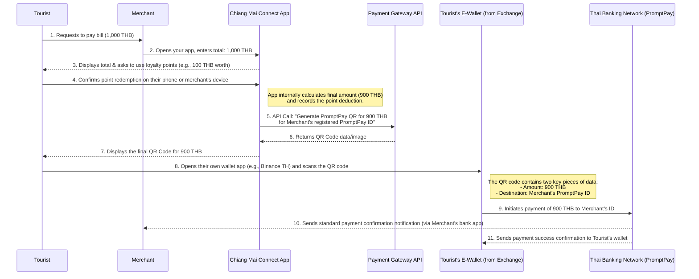

# CNX Connect

Interaction Sequence Diagram




Business Data Flow Diagram

```mermaid
graph TD
    subgraph Merchant's Premise
        M[Merchant] -- "Total Bill Amount (1,000 THB)" --> App(Chiang Mai Connect App)
        App -- "Points Balance & Redemption Offer" --> T(Tourist)
        T -- "Redemption Confirmation" --> App
    end

    subgraph Your Systems (Cloud)
        App -- "Internal Update" --> DB
        App -- "API Request: Final Amount (900 THB) + Merchant's PromptPay ID" --> PG(Payment Gateway API)
        PG -- "QR Code Data" --> App
    end

    subgraph Tourist's Phone
        App -- "Displays QR Code Image" --> T
        T -- "Scans QR Code" --> TW(Tourist's E-Wallet App)
    end
    
    subgraph Financial Networks
        TW -- "Payment Instruction (900 THB to Merchant's ID)" --> PPN(PromptPay Network)
        PPN -- "Funds Transfer" --> MB(Merchant's Bank Account)
    end

    subgraph Merchant's Confirmation
        MB -- "Payment Notification" --> M
    end
    ```


Of course. These are excellent, practical questions that get to the heart of operational feasibility. Minimizing friction for the merchant is absolutely critical for adoption.

Here is a detailed breakdown, including the requested diagrams and a strategy for ensuring merchants face the lowest possible burden.

-----

### **Visualizing the Payment and Loyalty Flow**

To clarify the interactions, I've created two diagrams using standard modeling syntax. The first is a **Sequence Diagram** showing the step-by-step interactions between all parties. The second is a **Data Flow Diagram** illustrating what information moves between the systems.

#### **1. Interaction Sequence Diagram**

This diagram shows the chronological order of messages exchanged between the different roles and systems.

```mermaid
sequenceDiagram
    participant Tourist
    participant Merchant
    participant YourApp as Chiang Mai Connect App
    participant PaymentGateway as Payment Gateway API
    participant TouristWallet as Tourist's E-Wallet (from Exchange)
    participant PromptPay as Thai Banking Network (PromptPay)

    Tourist->>Merchant: 1. Requests to pay bill (1,000 THB)
    Merchant->>YourApp: 2. Opens your app, enters total: 1,000 THB
    YourApp-->>Tourist: 3. Displays total & asks to use loyalty points (e.g., 100 THB worth)
    Tourist->>YourApp: 4. Confirms point redemption on their phone or merchant's device
    
    Note right of YourApp: App internally calculates final amount (900 THB) <br/> and records the point deduction.

    YourApp->>PaymentGateway: 5. API Call: "Generate PromptPay QR for 900 THB <br/> for Merchant's registered PromptPay ID"
    PaymentGateway-->>YourApp: 6. Returns QR Code data/image

    YourApp-->>Tourist: 7. Displays the final QR Code for 900 THB
    Tourist->>TouristWallet: 8. Opens their own wallet app (e.g., Binance TH) and scans the QR code
    
    Note right of TouristWallet: The QR code contains two key pieces of data: <br/> - Amount: 900 THB <br/> - Destination: Merchant's PromptPay ID

    TouristWallet->>PromptPay: 9. Initiates payment of 900 THB to Merchant's ID
    PromptPay-->>Merchant: 10. Sends standard payment confirmation notification (via Merchant's bank app)
    PromptPay-->>TouristWallet: 11. Sends payment success confirmation to Tourist's wallet
```

#### **2. Business Data Flow Diagram**

This diagram focuses on the data being created and transferred throughout the process.

```mermaid
graph TD
    subgraph Merchant's Premise
        M[Merchant] -- "Total Bill Amount (1,000 THB)" --> App(Chiang Mai Connect App)
        App -- "Points Balance & Redemption Offer" --> T(Tourist)
        T -- "Redemption Confirmation" --> App
    end

    subgraph Your Systems (Cloud)
        App -- "Internal Update" --> DB
        App -- "API Request: Final Amount (900 THB) + Merchant's PromptPay ID" --> PG(Payment Gateway API)
        PG -- "QR Code Data" --> App
    end

    subgraph Tourist's Phone
        App -- "Displays QR Code Image" --> T
        T -- "Scans QR Code" --> TW(Tourist's E-Wallet App)
    end
    
    subgraph Financial Networks
        TW -- "Payment Instruction (900 THB to Merchant's ID)" --> PPN(PromptPay Network)
        PPN -- "Funds Transfer" --> MB(Merchant's Bank Account)
    end

    subgraph Merchant's Confirmation
        MB -- "Payment Notification" --> M
    end
```

-----

### **Minimizing the Burden on Merchants**

Your question is spot on: if this process is complicated for the merchant, it will fail. The entire model is designed to be **as close to their current workflow as possible**.

#### **Has any new action or concept been added for the merchant?**

**Almost nothing.** This is the key selling point. The merchant does **not** need to:

  * Understand or handle cryptocurrency.
  * Install new, dedicated hardware (like an EDC machine). They use their existing smartphone or tablet.
  * Learn a complex new accounting system.
  * Change their bank or how they receive money. They still receive 100% Thai Baht directly into their existing bank account via PromptPay.[1, 2]

The **only change** in their workflow is *which app they open to type in the bill amount*.

#### **How to Reduce the Burden: The "Zero Friction" Strategy**

Here is a practical plan to make this seamless for merchants.

**1. Ultra-Simple Onboarding (One-Time Setup):**

  * **No Paperwork:** The merchant downloads the "Chiang Mai Connect for Business" app from the App Store/Play Store.
  * **Instant Registration:** They register their shop using basic information.
  * **One-Scan Linking:** To link their payment account, they don't need to type in bank details. They simply use your app to **scan their own existing PromptPay QR code** that their bank already provided them.[3, 4, 5] Your app will read their PromptPay ID from the QR code and save it to their profile. This is a secure, fast, and error-proof process.

**2. The Daily Payment Process (The Merchant's Experience):**

Let's compare the proposed workflow to what they already do today.

| **Current Process (Using Bank App)** | **New Process (Using Your App)** |
| :--- | :--- |
| 1. Customer asks to pay. | 1. Customer asks to pay. |
| 2. Open their bank's merchant app (e.g., K-Shop).[6] | 2. Open the **Chiang Mai Connect** app. |
| 3. Type in the total amount. | 3. Type in the total amount. |
| 4. Show the generated QR code to the customer. | 4. Show the phone to the customer (who then interacts with the loyalty points option). |
| 5. Wait for the payment notification from their bank. | 5. Wait for the **exact same** payment notification from their bank. |

As you can see, the physical actions are virtually identical. The cognitive load is minimal.

**3. The Value Proposition to the Merchant:**

When you approach a merchant, the pitch is simple and powerful:

> "You continue to accept QR payments exactly as you do now, receiving Thai Baht instantly in your bank account. The only difference is you use our app to generate the QR code. In exchange for this tiny change, you gain access to a new group of high-spending international tourists and a tool to build loyalty with all your customers. There is no new hardware, no setup fee, and no risk."

This approach transforms the proposition from "please adopt this complex new technology" to "here is a free marketing tool that fits into your current workflow." This is how you achieve widespread adoption with minimal resistance.    