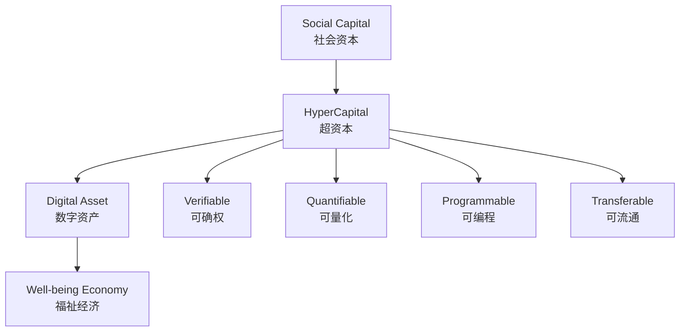
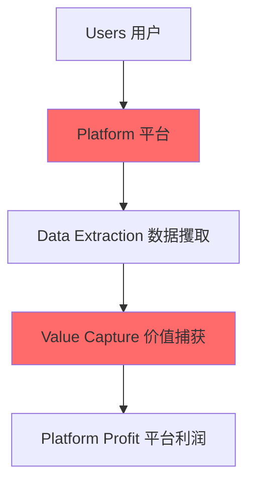
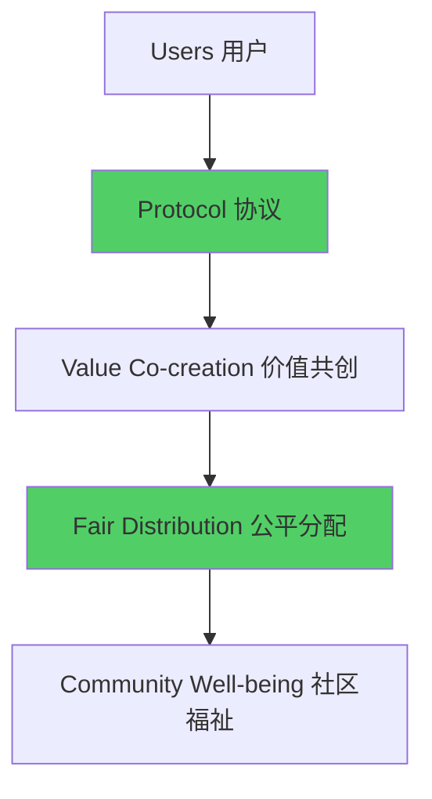
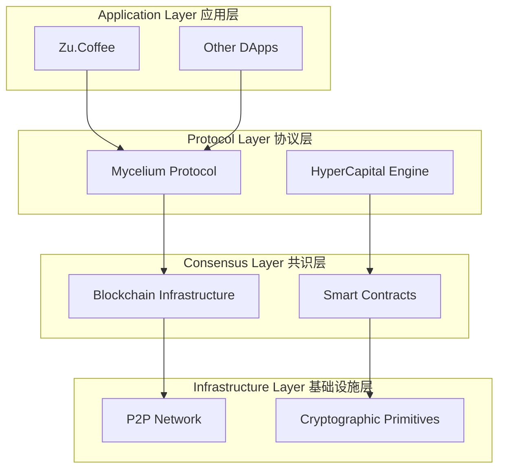
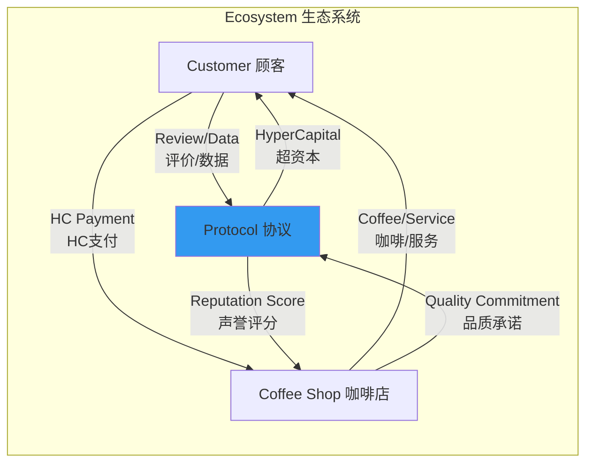
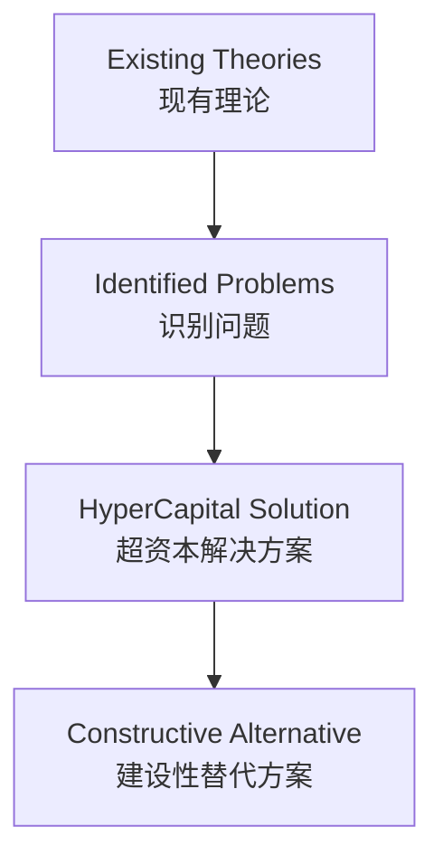
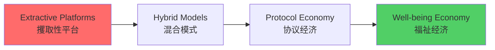

# HyperCapital: Building a Well-being Economy After Platform Capitalism
## Academic Conference Presentation

---

## Slide 1: Title Page
# HyperCapital: Building a Well-being Economy After Platform Capitalism
## 博士论文研究汇报 PhD Research Presentation

**研究者 Presenter:** [Your Name]  
**会议 Conference:** [Academic Conference Name]  
**日期 Date:** [Presentation Date]  
**版本 Version:** v0.13

---

## Slide 2: Research Problem & Motivation
# 核心问题 Core Problem

## Platform Capitalism Crisis 平台资本主义危机
- **价值攫取 Value Extraction**: Google 2023年广告收入2378.6亿美元
- **结构性不公 Structural Inequality**: 用户创造价值，平台获得收益
- **数据隐私侵蚀 Privacy Erosion**: 监控资本主义模式
- **创新抑制 Innovation Suppression**: 垄断地位压制社会创新

## Research Question 研究问题
**如何设计新的数字经济范式，取代攫取性平台资本主义，实现社会资本的公平确权和价值分配？**

---

## Slide 3: Theoretical Innovation
# HyperCapital 理论创新

## Definition 定义
**HyperCapital (超资本)**: 基于去中心化共识协议的、可编程的、标准化的数字资产，对个体数字网络中社会资本进行封装和确权的数字信用凭证

## Core Attributes 核心属性
1. **可确权性 Verifiability** - 技术验证贡献真实性
2. **可量化性 Quantifiability** - 数学模型量化价值
3. **可编程性 Programmability** - 智能合约自动执行
4. **可流通性 Transferability** - 跨平台价值流转

---

## Slide 4: Measurement Model
# HyperCapital 测量模型

## Computational Framework 计算框架
`HyperCapital Score = w₁×NPC + w₂×TRC + w₃×AIC + w₄×DCC + w₅×CCC`

## Five Dimensions 五个维度
1. **NPC - Network Position Capital 网络位置资本**
   - PageRank算法衡量网络中心性
2. **TRC - Trust Reputation Capital 信任声誉资本**
   - 历史行为加权评分
3. **AIC - Attention Influence Capital 注意力影响资本**
   - 内容传播范围和互动深度
4. **DCC - Data Contribution Capital 数据贡献资本**
   - 数据质量、独特性和使用频率
5. **CCC - Collaboration Contribution Capital 协作贡献资本**
   - 集体行动参与度和项目成果

---

## Slide 5: From Platform to Protocol
# 从平台到协议的转变

## Platform Capitalism Model 平台资本主义模式

## HyperCapital Protocol Model 超资本协议模式

---

## Slide 6: Research Methodology
# 研究方法论

## Design Science Research 设计科学研究
基于Hevner et al. (2004)和Peffers et al. (2007)的六步流程模型

1. **Problem Identification 问题识别**
   - 平台资本主义的攫取性问题
2. **Objective Definition 目标定义**
   - 社会资本公平确权和价值分配
3. **Design & Development 设计开发**
   - HyperCapital理论 + Mycelium协议
4. **Demonstration 演示**
   - Zu.Coffee模拟案例
5. **Evaluation 评估**
   - 案例分析和理论对比
6. **Communication 沟通**
   - 学术论文发表

---

## Slide 7: Mycelium Protocol Architecture
# Mycelium 协议架构

## Nature-Inspired Design 自然启发设计
仿照自然界菌丝网络的协作机制

## Core Components 核心组件
- **Proof of Contribution 贡献证明**
- **Reputation Algorithm 声誉算法**  
- **Value Circulation Module 价值循环模块**

---

## Slide 8: Zu.Coffee Case Study
# Zu.Coffee 案例研究

## Scenario Description 场景描述
城市咖啡爱好者社群的微型福祉经济原型

## Value Flow Model 价值流转模型

## Key Innovation 核心创新
- **去除平台佣金 No Platform Commission**
- **用户数据变现 User Data Monetization**
- **社区价值循环 Community Value Loop**

---

## Slide 9: Simulation Results
# 模拟实验结果

## 30-Day Simulation Data 30天模拟数据

| 指标 Metric | 数值 Value | 分析 Analysis |
|-------------|------------|---------------|
| 活跃用户 Active Users | 150 | 显示初步吸引力 Initial attraction |
| 参与商户 Merchants | 12 | 覆盖核心商家 Core coverage |
| HC总生成量 HC Generated | 50,000 HC | 社区活跃度高 High activity |
| HC流转量 HC Circulated | 35,000 HC | 70%流转率 70% circulation |
| 咖啡兑换 Coffee Redemptions | 280次 | 有效价值媒介 Effective medium |
| 平均评价奖励 Avg. Review Reward | 15 HC | 量化数字劳动 Quantified labor |

## Qualitative Evidence 质性证据
> "通过Mycelium协议，我不再需要向平台支付30%的佣金，用节省的成本为高质量反馈的顾客提供免费升级。"
> - 参与商户反馈

---

## Slide 10: Theoretical Contributions
# 理论贡献

## 1. Social Capital Evolution 社会资本理论演进
- **从Bourdieu到数字时代**: 传统理论的数字化扩展
- **技术性确权**: 将内嵌社会关系转化为独立价值载体
- **可操作化**: 从社会学概念到经济学工具

## 2. Response to Platform Capitalism 平台资本主义回应
- **监控资本主义**: 对Zuboff (2019)的建设性回应
- **数字劳动**: 对Fuchs (2014)无偿劳动问题的解决方案
- **网络效应**: 从攫取性到生成性的范式转换

## 3. Well-being Economics 福祉经济学
- **目标转换**: 从利润最大化到福祉最优化
- **价值重新定义**: 激励协作而非零和博弈

---

## Slide 11: Dialogue with Existing Theories
# 与现有理论的对话

## Critical Responses 批判性回应

### vs. Surveillance Capitalism (Zuboff, 2019)
- **问题**: 行为剩余价值被单方面攫取
- **回应**: HyperCapital将价值返还给用户

### vs. Platform Capitalism (Srnicek, 2017)  
- **问题**: 平台的"攫取性"特征
- **回应**: 提供"生成性"的协作替代方案

### vs. Digital Labor Theory (Fuchs, 2014)
- **问题**: 用户无偿数字劳动
- **回应**: 将无偿劳动转化为可量化资产

---

## Slide 12: Ethical Considerations
# 伦理考量与风险缓解

## Ethical Risks 伦理风险
1. **过度量化 Over-quantification**
   - 社会交往功利化
   - 侵蚀利他主义关系

2. **隐私担忧 Privacy Concerns**
   - 数据使用透明度
   - 用户控制权

## Mitigation Strategies 缓解策略
1. **补充机制 Complementary Mechanisms**
   - 非交易性"社区贡献徽章"
   - 利他行为更高权重

2. **治理保障 Governance Safeguards**
   - DAO社区治理
   - 算法透明度要求

3. **价值平衡 Value Balance**
   - 经济激励与内在价值并存
   - 多元化评价体系

---

## Slide 13: Practical Implications & Applications
# 实践意涵与应用前景

## Transformation Path 转型路径

## Application Domains 应用领域
- **内容创作平台 Content Platforms**: 创作者价值回归
- **社交网络 Social Networks**: 用户数据主权
- **共享经济 Sharing Economy**: 去平台化协作
- **数字医疗 Digital Healthcare**: 数据协作激励
- **教育生态 Education**: 知识共享价值化

## Policy Implications 政策意涵
- 数字产权法律框架
- 去中心化治理机制
- 新型经济模式监管

---

## Slide 14: Future Research & Conclusion
# 未来研究与结论

## Research Limitations 研究局限
- **理论探讨阶段**: 缺乏大规模实证数据
- **技术实现细节**: 需要更深入的技术架构设计
- **宏观经济影响**: 系统性影响评估不足

## Future Research Directions 未来研究方向
1. **原型开发 Prototype Development**
   - Zu.Coffee MVP开发和实证检验
2. **跨学科融合 Interdisciplinary Integration**
   - 法学、政治学、计算机科学、人类学交叉
3. **政策研究 Policy Research**
   - 支持性公共政策和法律框架

## Key Takeaways 核心要点
- **理论创新**: HyperCapital作为社会资本数字化的新范式
- **技术路径**: 区块链+协作经济的深度融合
- **实践价值**: 为后平台时代提供建设性替代方案
- **社会意义**: 从攫取性向生成性经济的转变

**谢谢聆听！欢迎讨论交流！**  
**Thank you! Questions & Discussion Welcome!** 