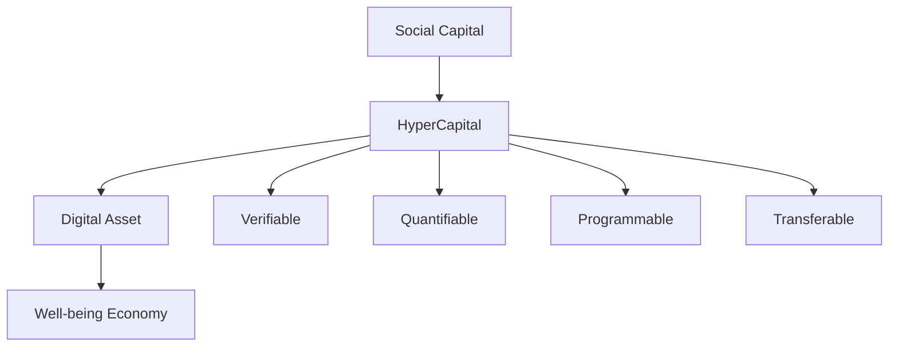
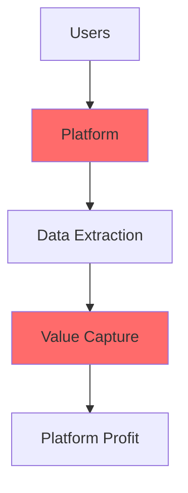
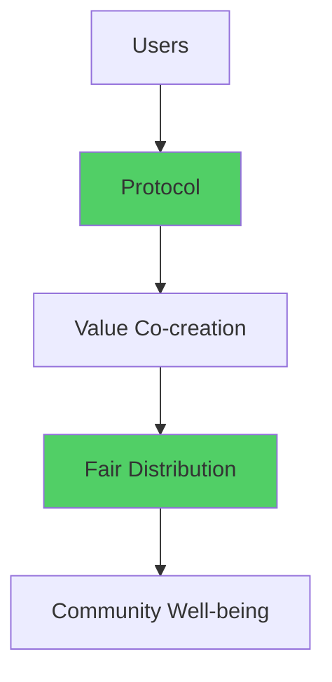
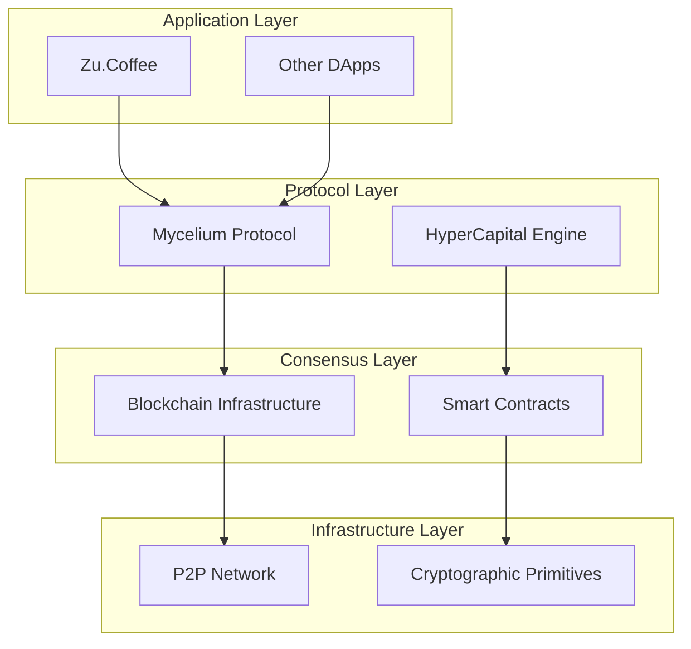
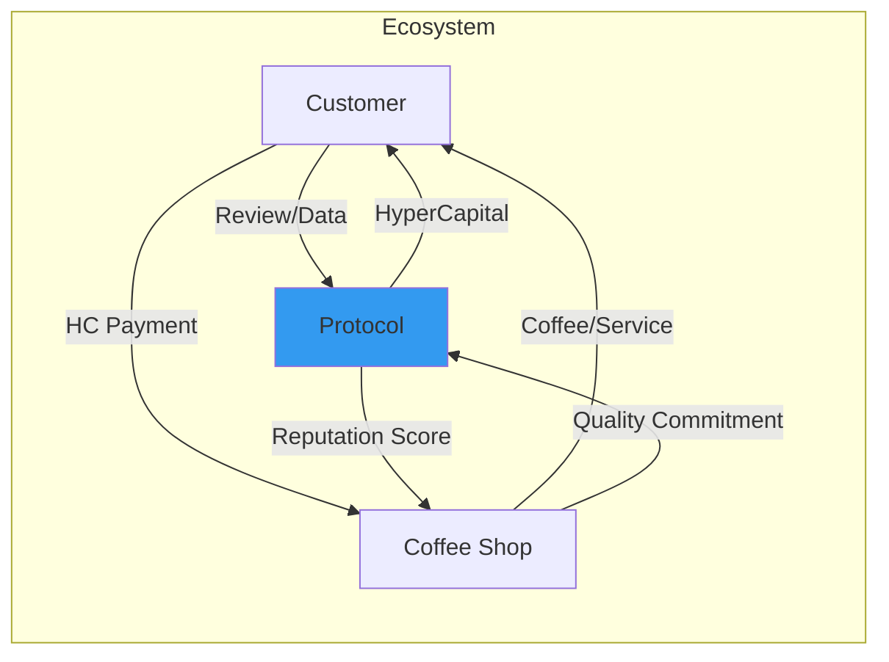
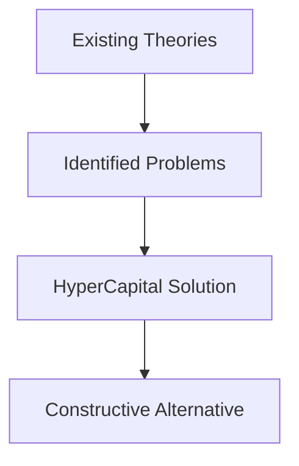
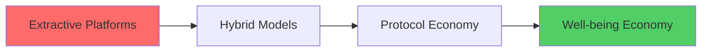

# HyperCapital: Building a Well-being Economy After Platform Capitalism
## Academic Conference Presentation (English Version)

---

## Slide 1: Title Page
# HyperCapital: Building a Well-being Economy After Platform Capitalism
## PhD Research Presentation

**Presenter:** [Your Name]  
**Conference:** [Academic Conference Name]  
**Date:** [Presentation Date]  
**Version:** v0.13

---

## Slide 2: Research Problem & Motivation
# The Crisis of Platform Capitalism

## Platform Capitalism Crisis
- **Value Extraction**: Google's 2023 ad revenue: $237.86 billion
- **Structural Inequality**: Users create value, platforms capture profits
- **Privacy Erosion**: Surveillance capitalism model
- **Innovation Suppression**: Monopolistic positions stifle social innovation

## Research Question
**How can we design a new digital economic paradigm to replace extractive platform capitalism, achieving fair authentication and value distribution of social capital, thereby building a more inclusive "well-being economy"?**

---

## Slide 3: Theoretical Innovation
# HyperCapital: A New Paradigm

## Definition
**HyperCapital**: A programmable, standardized digital asset based on decentralized consensus protocols, serving as a digital credit certificate that encapsulates and authenticates individuals' social capital contributions in digital networks.

## Core Attributes
1. **Verifiability** - Technical verification of contribution authenticity
2. **Quantifiability** - Mathematical models for value quantification
3. **Programmability** - Smart contract automation
4. **Transferability** - Cross-platform value circulation

---

## Slide 4: Measurement Model
# HyperCapital Computational Framework

## Mathematical Model
`HyperCapital Score = w₁×NPC + w₂×TRC + w₃×AIC + w₄×DCC + w₅×CCC`

## Five Dimensions
1. **NPC - Network Position Capital**
   - PageRank algorithm for network centrality
2. **TRC - Trust Reputation Capital**
   - Weighted scoring based on historical behavior
3. **AIC - Attention Influence Capital**
   - Content reach and interaction depth
4. **DCC - Data Contribution Capital**
   - Data quality, uniqueness, and usage frequency
5. **CCC - Collaboration Contribution Capital**
   - Collective action participation and project outcomes

---

## Slide 5: From Platform to Protocol
# Paradigm Transformation

## Platform Capitalism Model

## HyperCapital Protocol Model

---

## Slide 6: Research Methodology
# Design Science Research

## Six-Step Process Model
Based on Hevner et al. (2004) and Peffers et al. (2007)

1. **Problem Identification**
   - Extractive nature of platform capitalism
2. **Objective Definition**
   - Fair authentication and value distribution of social capital
3. **Design & Development**
   - HyperCapital theory + Mycelium Protocol
4. **Demonstration**
   - Zu.Coffee simulation case
5. **Evaluation**
   - Case analysis and theoretical comparison
6. **Communication**
   - Academic publication

---

## Slide 7: Mycelium Protocol Architecture
# Nature-Inspired Collaborative Framework

## Design Philosophy
Inspired by mycelial networks in nature - distributed, resilient, collaborative

## Core Components
- **Proof of Contribution** - Verify and validate contributions
- **Reputation Algorithm** - Dynamic trust scoring system
- **Value Circulation Module** - Economic incentive mechanisms

---

## Slide 8: Zu.Coffee Case Study
# Micro-Well-being Economy Prototype

## Scenario Description
Urban coffee enthusiast community - testing HyperCapital in real-world context

## Value Flow Model

## Key Innovations
- **No Platform Commission** - Direct value exchange
- **User Data Monetization** - Users earn from their contributions
- **Community Value Loop** - Closed-loop value circulation

---

## Slide 9: Simulation Results
# 30-Day Experiment Data

## Quantitative Results

| Metric | Value | Analysis |
|--------|-------|----------|
| Active Users | 150 | Shows initial market appeal |
| Participating Merchants | 12 | Core business coverage |
| HC Generated | 50,000 HC | High community activity |
| HC Circulated | 35,000 HC | 70% circulation rate |
| Coffee Redemptions | 280 | Effective value medium |
| Avg. Review Reward | 15 HC | Quantified digital labor |

## Qualitative Evidence
> *"With Mycelium Protocol, I no longer pay 30% platform commission. I use the savings to offer free upgrades for quality feedback customers. It's win-win."*
> - Participating Coffee Shop Owner

---

## Slide 10: Theoretical Contributions
# Advancing Social Capital Theory

## 1. Social Capital Evolution
- **From Bourdieu to Digital Era**: Extending traditional theory
- **Technical Authentication**: Converting embedded relationships to independent value
- **Operationalization**: From sociological concept to economic tool

## 2. Response to Platform Capitalism
- **Surveillance Capitalism**: Constructive response to Zuboff (2019)
- **Digital Labor**: Solution to Fuchs (2014) unpaid labor problem
- **Network Effects**: From extractive to generative paradigm

## 3. Well-being Economics
- **Goal Transformation**: From profit maximization to well-being optimization
- **Value Redefinition**: Incentivizing collaboration over zero-sum games

---

## Slide 11: Dialogue with Existing Theories
# Critical Theoretical Engagement

## Critical Responses

### vs. Surveillance Capitalism (Zuboff, 2019)
- **Problem**: Behavioral surplus value unilaterally extracted
- **Response**: HyperCapital returns value to users

### vs. Platform Capitalism (Srnicek, 2017)
- **Problem**: Extractive platform characteristics
- **Response**: Generative collaborative alternative

### vs. Digital Labor Theory (Fuchs, 2014)
- **Problem**: User unpaid digital labor
- **Response**: Converting unpaid labor to quantifiable assets

---

## Slide 12: Ethical Considerations
# Risk Assessment & Mitigation

## Ethical Risks
1. **Over-quantification**
   - Commercialization of social interactions
   - Erosion of altruistic relationships

2. **Privacy Concerns**
   - Data usage transparency
   - User control mechanisms

## Mitigation Strategies
1. **Complementary Mechanisms**
   - Non-tradable "community badges"
   - Higher weights for altruistic behaviors

2. **Governance Safeguards**
   - DAO community governance
   - Algorithm transparency requirements

3. **Value Balance**
   - Economic incentives + intrinsic value
   - Diversified evaluation systems

---

## Slide 13: Practical Implications & Applications
# Real-World Impact

## Transformation Pathway

## Application Domains
- **Content Platforms**: Creator value return
- **Social Networks**: User data sovereignty
- **Sharing Economy**: De-platformized collaboration
- **Digital Healthcare**: Data collaboration incentives
- **Education**: Knowledge sharing monetization

## Policy Implications
- Digital property rights legal framework
- Decentralized governance mechanisms
- New economic model regulation

---

## Slide 14: Future Research & Conclusion
# Looking Forward

## Research Limitations
- **Theoretical Stage**: Lack of large-scale empirical data
- **Technical Implementation**: Need deeper architectural design
- **Macroeconomic Impact**: Insufficient systemic impact assessment

## Future Research Directions
1. **Prototype Development**
   - Zu.Coffee MVP development and empirical testing
2. **Interdisciplinary Integration**
   - Law, political science, computer science, anthropology
3. **Policy Research**
   - Supportive public policies and legal frameworks

## Key Takeaways
- **Theoretical Innovation**: HyperCapital as new social capital paradigm
- **Technical Path**: Deep integration of blockchain + collaborative economy
- **Practical Value**: Constructive alternative for post-platform era
- **Social Significance**: From extractive to generative economy

**Thank you for your attention!**  
**Questions & Discussion Welcome!** 