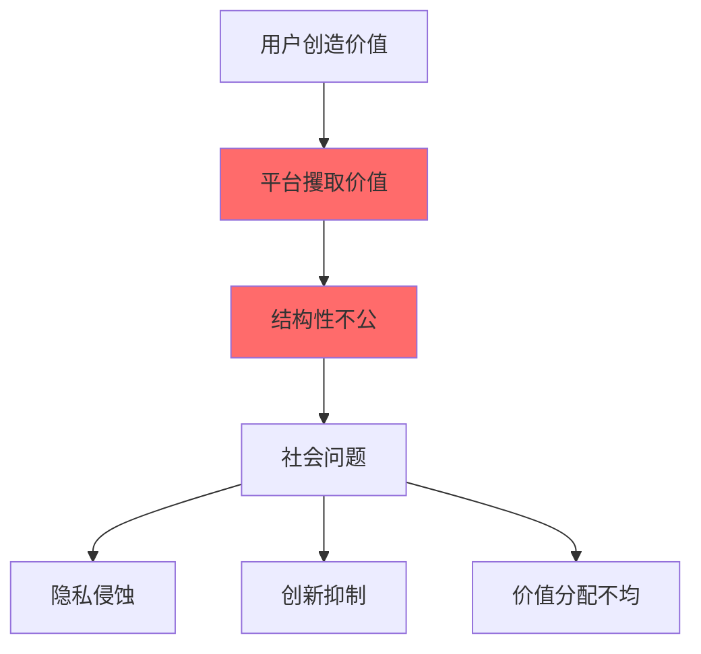
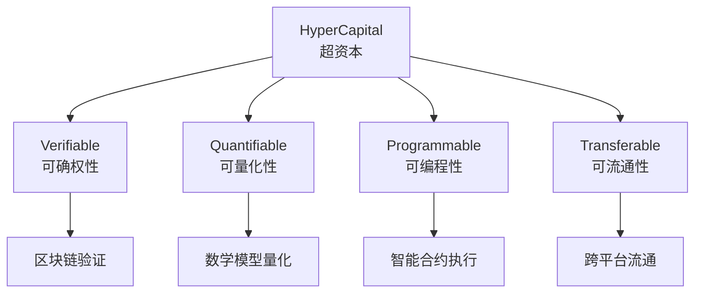
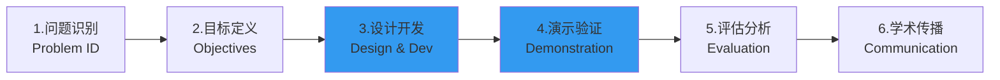
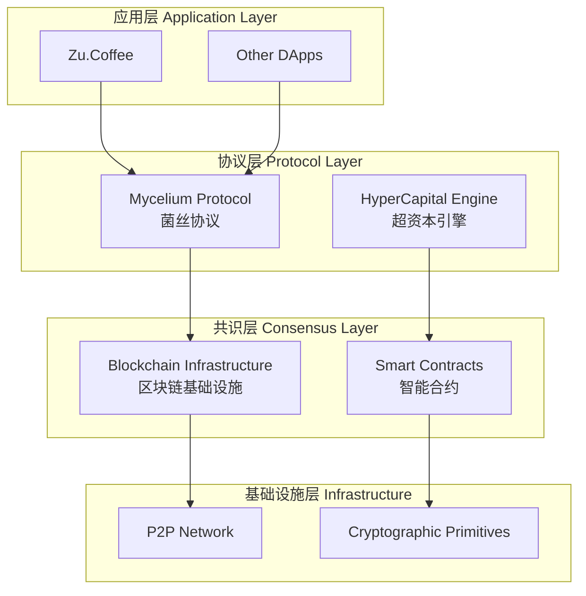
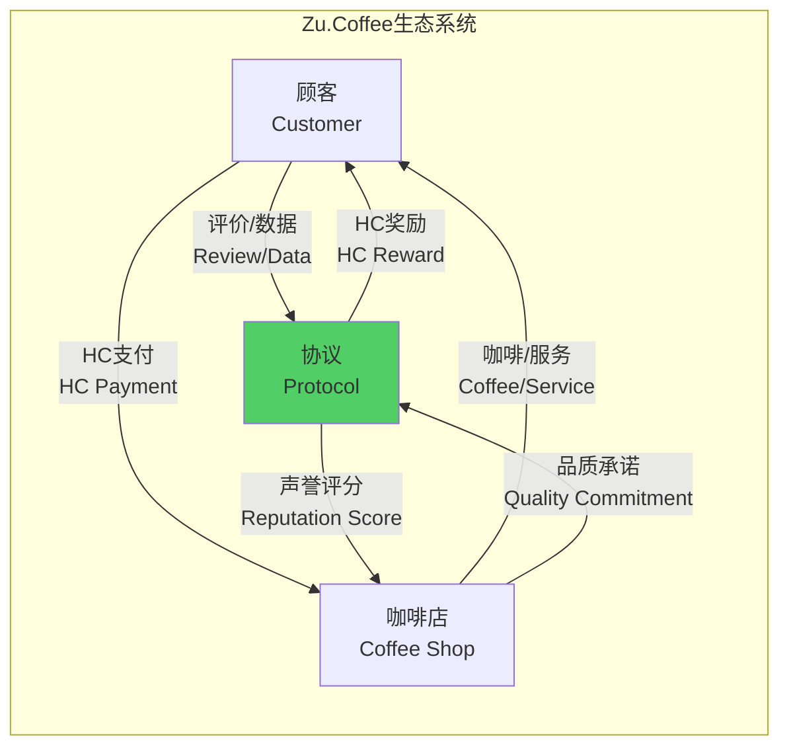
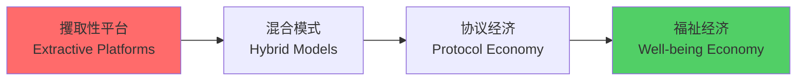

# HyperCapital: 平台资本主义之后的福祉经济构建
## 学术会议演示文稿 (优化版)

---

## Slide 1: Title
# HyperCapital: 平台资本主义之后的福祉经济构建
## Building a Well-being Economy After Platform Capitalism

**作者：** [Huifeng Jiao] | **导师：** [Dr. Nathapon Udomlertsakul]  
**机构：** [International College of Digital Innovation, Chiang Mai University]  
**会议：** [Accademic Communication] | **版本：** v0.13

---

## Slide 2: 5 分钟核心要点 Core Points in 5 Minutes
# 研究核心一览

## 🎯 研究问题 Research Problem
**如何用技术手段实现社会资本的公平确权，取代平台垄断？**

## 🔬 研究方法 Methodology  
**设计科学研究 (DSR)** - 构建 HyperCapital 理论 + 协议验证

## 💡 核心创新 Key Innovation
**HyperCapital** - 可确权、可量化、可编程、可流通的社会资本数字化

## 📊 验证方式 Validation
**Mycelium 协议 + Zu.Coffee 案例** - 理论到实践的完整闭环

---

## Slide 3: 问题陈述 Problem Statement
# 平台资本主义的结构性危机

## 关键数据 Key Statistics
- **Google 2023**: They crawl free pages and get Ad revenue $237.86B (77.8% total revenue) in one year.
- **Meta 2023**: They collect personal information in a closed system and get user data monetization $117.9B for a year.
- **平台佣金**: 通常 30-50% 的价值攫取

## 核心矛盾
**用户创造价值 ≠ 用户获得价值**

---

## Slide 4: 理论创新 Theoretical Innovation
# HyperCapital: 社会资本的数字化演进

## 定义 Definition
> **HyperCapital (超资本)**: **一种基于去中心化共识协议的、可编程的、标准化的数字资产，其本质是对个体在数字网络中贡献的社会资本（信息、数据、影响力、声誉信用等）进行封装和确权的数字信用凭证。**

> 与传统社会资本的核心区别在于，HyperCapital 旨在通过技术手段，将原本内嵌于特定社会关系、难以剥离和流通的社会资本，转化为一种具有普遍性、可独立流通的价值载体。

## 四大核心属性 Four Core Attributes

---

## Slide 5: DSR 方法论 Design Science Research
# 六步研究流程

## DSR 核心要素 Core DSR Elements
1. **IT Artifact**: HyperCapital 理论 + Mycelium 协议
2. **Design Process**: 从抽象理论到具体实现
3. **Evaluation**: 多维度案例分析和理论对比
4. **Knowledge Contribution**: 新的数字经济范式

---

## Slide 6: 测量模型 Measurement Model
# HyperCapital 五维计算框架

## 数学模型 Mathematical Framework
### `HC = w₁×NPC + w₂×TRC + w₃×AIC + w₄×DCC + w₅×CCC`

| 维度 | 含义 | 测量方式 |
|------|------|----------|
| **NPC** | 网络位置资本 | PageRank 算法 |
| **TRC** | 信任声誉资本 | 历史行为加权 |
| **AIC** | 注意力影响资本 | 传播范围×互动深度 |
| **DCC** | 数据贡献资本 | 质量×独特性×使用频率 |
| **CCC** | 协作贡献资本 | 项目成果×同行评议 |

## 创新点 Innovation
- **动态权重**: DAO 投票调整权重参数
- **多维评估**: 避免单一指标偏差
- **可验证性**: 链上数据确保透明

---

## Slide 7: Mycelium 协议架构
# 仿生学启发的技术实现

## 核心组件 Core Components
- **贡献证明 PoC**: 验证用户真实贡献
- **声誉算法**: 动态信任评分系统  
- **价值循环**: 经济激励闭环机制

---

## Slide 8: Zu.Coffee 案例研究
# 微型福祉经济验证

## 价值流转模型 Value Flow Model

## 核心创新 Key Innovation
✅ **去平台化**: 无 30% 平台佣金  
✅ **数据确权**: 用户数据变现 15HC/评价  
✅ **价值循环**: 社区内封闭价值流转  

---

## Slide 9: 实验结果 Experimental Results
# 30 天模拟数据验证

## 定量结果 Quantitative Results
| 指标 | 数值 | 意义 |
|------|------|------|
| 🙋‍♂️ 活跃用户 | 150 人 | 社区接受度验证 |
| 🏪 参与商户 | 12 家 | 商业可行性证明 |
| 💰 HC 生成量 | 50,000 HC | 价值创造活跃度 |
| 🔄 HC 流转率 | 70% | 经济流动性良好 |
| ☕ 咖啡兑换 | 280 次 | 实际使用价值 |

## 质性证据 Qualitative Evidence
> **商户反馈**: "节省 30% 佣金，用于奖励高质量评价用户，双赢！"  
> **用户反馈**: "我的评价有了真正的价值，感觉成为社区建设者"

---

## Slide 10: 理论贡献 Theoretical Contributions
# 学术创新点

## 1️⃣ 社会资本理论扩展
- **从 Bourdieu 到数字时代**: 经典理论的技术化演进
- **可操作化转换**: 社会学概念→经济学工具

## 2️⃣ 平台资本主义批判回应  
- **Zuboff 监控资本主义**: 从攫取→回馈的解决方案
- **Srnicek 平台理论**: 从攫取性→生成性的范式转换

## 3️⃣ 福祉经济学构建
- **目标重定义**: 利润最大化→福祉最优化
- **激励机制**: 零和博弈→协作共赢

## 4️⃣ 技术 - 社会融合创新
- **区块链 + 协作经济**: 技术可行性与经济可持续性双重支撑

---

## Slide 11: 实践意涵 Practical Implications
# 转型路径与应用前景

## 转型路径 Transformation Path

## 应用领域 Application Domains
🎨 **内容创作**: 创作者价值直接回归  
📱 **社交网络**: 用户数据主权确立  
🚗 **共享经济**: 去平台化直接协作  
🏥 **数字医疗**: 数据贡献激励机制  
📚 **在线教育**: 知识共享价值变现  

---

## Slide 12: 研究局限与未来方向
# 诚实的学术态度

## 研究局限 Limitations
⚠️ **理论阶段**: 缺乏大规模实证数据  
⚠️ **技术细节**: 协议实现需进一步完善  
⚠️ **宏观影响**: 系统性经济影响评估不足  

## 未来研究方向 Future Research
🔬 **MVP 开发**: Zu.Coffee 原型产品实证测试  
🔗 **跨学科整合**: 法学 + 政治学 + 计算机科学 + 经济学  
📋 **政策研究**: 监管框架与法律支持体系  
🌍 **规模化验证**: 更大范围的社区试点  

## 学术价值 Academic Value
**为后平台时代数字经济治理提供理论框架和实践路径**

---

## Slide 13: 结论 Conclusion
# 核心贡献总结

## 🎯 解决的问题
将不可见的社会资本转化为可确权、可交易的数字资产

## 🔧 提供的方案  
HyperCapital 理论 + Mycelium 协议 + DSR 验证方法

## 📈 证明的可行性
小范围社区的福祉经济模型初步验证成功

## 🌟 开创的方向
从攫取性经济向生成性经济的范式转换路径

## 📚 Related Research
Meta: [Meta](https://docs.google.com/document/d/1PTJXOvMPLNOVBF50sEyNrlGJiOKYUN4ipRfYd00KQv8/edit?usp=sharing)
Google: [Google](https://docs.google.com/document/d/1sFz241Kfi0m-INTJBcXnZo63rhPpmyvfRY8iHhd15qM/edit?usp=sharing)
Well-being Economics: [Well-being Economics](https://docs.google.com/document/d/1NFwBYs9IRuNPtUyCi-3cFR1cTLX9yKFgXuJWliOF8D0/edit?usp=sharing)
Social Capital&HyperCapital: [Social Capital&HyperCapital](https://docs.google.com/document/d/1ItawYmm0fu5F-_nZYE1JY7rjhOnEy_R_PSUNrDbqevw/edit?usp=sharing)
Platform Capitalism&Surveillance Capitalism: [Platform Capitalism&Surveillance Capitalism](https://docs.google.com/document/d/17uifkIVAkudLRAEvuESxFwx55AHq13WnpkbBnvPzQG4/edit?usp=sharing)

---

## Slide 14: 感谢与讨论
# Thank You & Discussion

## 🙏 致谢 Acknowledgments
- 导师和研究团队的指导支持
- 参与 Zu.Coffee 模拟的社区成员
- 审阅专家的宝贵意见

## 💭 讨论议题 Discussion Topics
1. **技术实现**: 区块链协议的具体设计挑战？
2. **经济模型**: 如何防止 HyperCapital 投机化？  
3. **规模化**: 从小社区到大平台的扩展路径？
4. **监管框架**: 需要什么样的政策支持？

## 📧 联系方式 Contact
**Email**: [huifeng_jiao@cmu.ac.th](huifeng_jiao@cmu.ac.th)  
**CV Page**: [https://www.aastar.io/me](https://www.aastar.io/me)

**欢迎深入交流讨论！** 