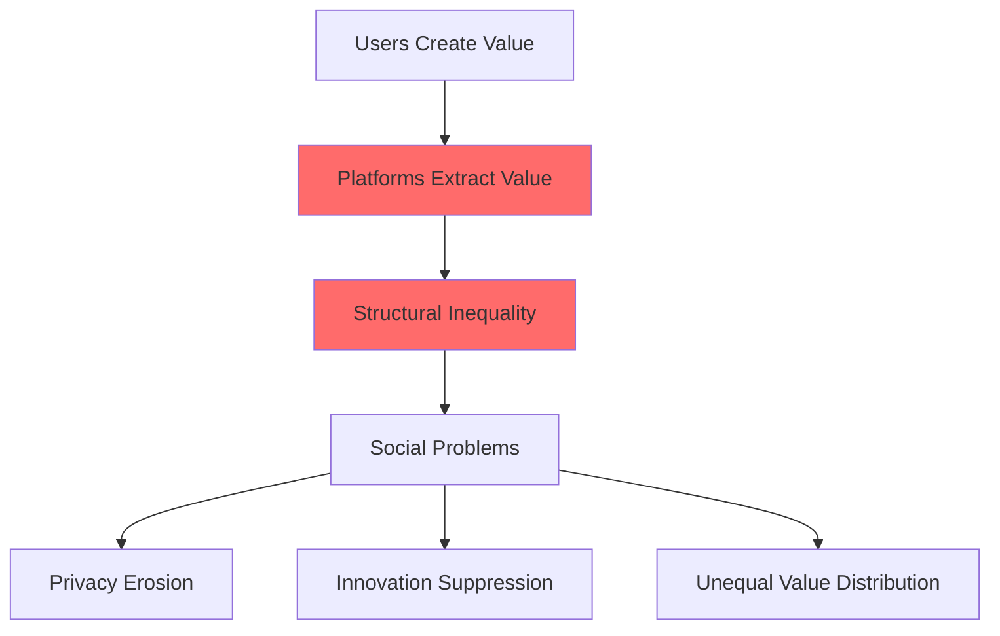
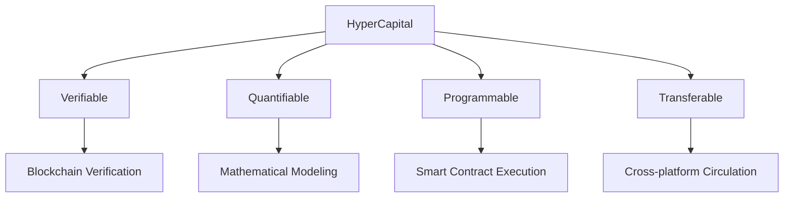
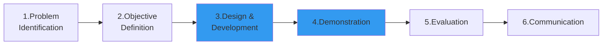
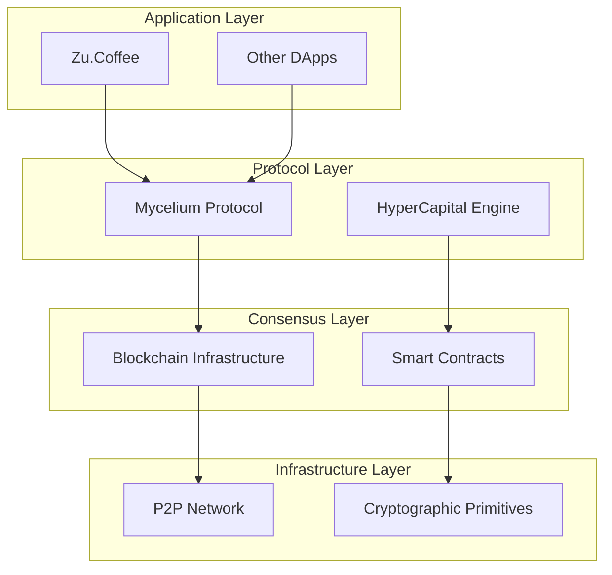
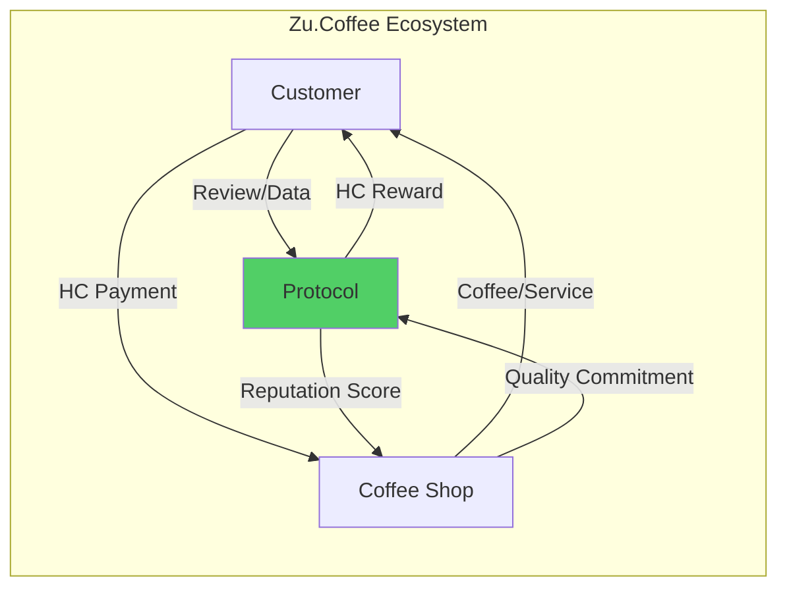

# HyperCapital: Building a Well-being Economy After Platform Capitalism
## Academic Conference Presentation (Optimized)

---

## Slide 1: Title Page
# HyperCapital: Building a Well-being Economy After Platform Capitalism
## PhD Research Presentation

**Researcher:** [Huifeng Jiao] | **Advisor:** [Dr. Nathapon Udomlertsakul]  
**Institution:** [International College of Digital Innovation, Chiang Mai University]  
**Conference:** [Accademic Communication] | **Version:** v0.13

---

## Slide 2: 5-Minute Core Overview
# Research At-a-Glance

## 🎯 Research Problem
**How to achieve fair authentication of social capital through technology, replacing platform monopolization?**

## 🔬 Methodology  
**Design Science Research (DSR)** - Build HyperCapital Theory + Protocol Validation

## 💡 Core Innovation
**HyperCapital** - Verifiable, Quantifiable, Programmable, Transferable digitization of social capital

## 📊 Validation Approach
**Mycelium Protocol + Zu.Coffee Case** - Complete theory-to-practice loop

---

## Slide 3: Problem Statement
# Structural Crisis of Platform Capitalism

## Key Statistics
- **Google 2023**: They crawl free pages and get Ad revenue $237.86B (77.8% total revenue) in one year.
- **Meta 2023**: They collect personal information in a closed system and get user data monetization $117.9B for a year.
- **Platform Commission**: Typically 30-50% value extraction

## Core Contradiction
**Users Create Value ≠ Users Capture Value**

---

## Slide 4: Theoretical Innovation
# HyperCapital: Digital Evolution of Social Capital

## Definition
> **HyperCapital**: **A decentralized consensus protocol-based, programmable, standardized digital asset that essentially serves as a digital credit certificate encapsulating and certifying an individual's social capital (information, data, influence, reputation and credit, etc.) contributed within a digital network.**

> The core difference from traditional social capital is that HyperCapital aims to transform social capital embedded in specific social relationships into a value carrier with universal and independent liquidity through technical means.

## Four Core Attributes

---

## Slide 5: DSR Methodology
# Six-Step Research Process

## Core DSR Elements
1. **IT Artifact**: HyperCapital Theory + Mycelium Protocol
2. **Design Process**: From abstract theory to concrete implementation
3. **Evaluation**: Multi-dimensional case analysis and theoretical comparison
4. **Knowledge Contribution**: New digital economic paradigm

---

## Slide 6: Measurement Model
# HyperCapital Five-Dimensional Framework

## Mathematical Model
### `HC = w₁×NPC + w₂×TRC + w₃×AIC + w₄×DCC + w₅×CCC`

| Dimension | Meaning | Measurement Method |
|-----------|---------|-------------------|
| **NPC** | Network Position Capital | PageRank Algorithm |
| **TRC** | Trust Reputation Capital | Historical Behavior Weighting |
| **AIC** | Attention Influence Capital | Reach × Interaction Depth |
| **DCC** | Data Contribution Capital | Quality × Uniqueness × Usage |
| **CCC** | Collaboration Contribution Capital | Project Outcomes × Peer Review |

## Innovation Points
- **Dynamic Weights**: DAO voting adjusts weight parameters
- **Multi-dimensional Assessment**: Avoids single-metric bias
- **Verifiability**: On-chain data ensures transparency

---

## Slide 7: Mycelium Protocol Architecture
# Nature-Inspired Technical Implementation

## Core Components
- **Proof of Contribution (PoC)**: Verify authentic user contributions
- **Reputation Algorithm**: Dynamic trust scoring system  
- **Value Circulation**: Economic incentive closed-loop mechanism

---

## Slide 8: Zu.Coffee Case Study
# Micro-Well-being Economy Validation

## Value Flow Model

## Key Innovations
✅ **De-platformization**: No 30% platform commission  
✅ **Data Authentication**: User data monetization 15HC/review  
✅ **Value Loop**: Closed community value circulation  

---

## Slide 9: Experimental Results        
# 30-Day Simulation Data Validation

## Quantitative Results
| Metric | Value | Significance |
|--------|-------|--------------|
| 🙋‍♂️ Active Users | 150 | Community acceptance validation |
| 🏪 Participating Merchants | 12 | Business viability proof |
| 💰 HC Generated | 50,000 HC | Value creation activity |
| 🔄 HC Circulation Rate | 70% | Good economic liquidity |
| ☕ Coffee Redemptions | 280 | Actual usage value |

## Qualitative Evidence
> **Merchant Feedback**: "Saved 30% commission, used to reward high-quality review users, win-win!"  
> **User Feedback**: "My reviews have real value, feel like a community builder"

---

## Slide 10: Theoretical Contributions
# Academic Innovation Points

## 1️⃣ Social Capital Theory Extension
- **From Bourdieu to Digital Era**: Technical evolution of classical theory
- **Operationalization**: Sociological concept → Economic tool

## 2️⃣ Platform Capitalism Critique Response  
- **Zuboff's Surveillance Capitalism**: Solution from extraction → return
- **Srnicek's Platform Theory**: Paradigm shift from extractive → generative

## 3️⃣ Well-being Economics Construction
- **Goal Redefinition**: Profit maximization → Well-being optimization
- **Incentive Mechanism**: Zero-sum games → Collaborative win-win

## 4️⃣ Techno-Social Integration Innovation
- **Blockchain + Collaborative Economy**: Dual support for technical feasibility and economic sustainability

---

## Slide 11: Practical Implications
# Transformation Path & Application Prospects

## Transformation Pathway

## Application Domains
🎨 **Content Creation**: Direct value return to creators  
📱 **Social Networks**: User data sovereignty establishment  
🚗 **Sharing Economy**: De-platformized direct collaboration  
🏥 **Digital Healthcare**: Data contribution incentive mechanisms  
📚 **Online Education**: Knowledge sharing monetization  

---

## Slide 12: Research Limitations & Future Directions
# Honest Academic Attitude

## Research Limitations
⚠️ **Theoretical Stage**: Lack of large-scale empirical data  
⚠️ **Technical Details**: Protocol implementation needs further refinement  
⚠️ **Macro Impact**: Insufficient systematic economic impact assessment  

## Future Research Directions
🔬 **MVP Development**: Zu.Coffee prototype empirical testing  
🔗 **Interdisciplinary Integration**: Law + Political Science + Computer Science + Economics  
📋 **Policy Research**: Regulatory framework and legal support system  
🌍 **Scale Validation**: Larger community pilots  

## Academic Value
**Providing theoretical framework and practical pathways for post-platform era digital economic governance**

---

## Slide 13: Conclusion
# Core Contribution Summary

## 🎯 Problem Solved
Transforming invisible social capital into verifiable, tradeable digital assets

## 🔧 Solution Provided  
HyperCapital Theory + Mycelium Protocol + DSR Validation Method

## 📈 Feasibility Demonstrated
Initial validation success of small-scale community well-being economic model

## 🌟 Direction Pioneered
Paradigm transformation path from extractive to generative economy

## 📚 Related Research
Meta: [Meta](https://docs.google.com/document/d/1PTJXOvMPLNOVBF50sEyNrlGJiOKYUN4ipRfYd00KQv8/edit?usp=sharing)
Google: [Google](https://docs.google.com/document/d/1sFz241Kfi0m-INTJBcXnZo63rhPpmyvfRY8iHhd15qM/edit?usp=sharing)
Well-being Economics: [Well-being Economics](https://docs.google.com/document/d/1NFwBYs9IRuNPtUyCi-3cFR1cTLX9yKFgXuJWliOF8D0/edit?usp=sharing)
Social Capital&HyperCapital: [Social Capital&HyperCapital](https://docs.google.com/document/d/1ItawYmm0fu5F-_nZYE1JY7rjhOnEy_R_PSUNrDbqevw/edit?usp=sharing)
Platform Capitalism&Surveillance Capitalism: [Platform Capitalism&Surveillance Capitalism](https://docs.google.com/document/d/17uifkIVAkudLRAEvuESxFwx55AHq13WnpkbBnvPzQG4/edit?usp=sharing)

---

## Slide 14: Thank You & Discussion
# Thank You & Discussion

## 🙏 Acknowledgments
- Guidance and support from advisors and research team
- Community members participating in Zu.Coffee simulation
- Valuable feedback from review experts

## 💭 Discussion Topics
1. **Technical Implementation**: Specific design challenges of blockchain protocols?
2. **Economic Model**: How to prevent HyperCapital speculation?  
3. **Scaling**: Expansion path from small communities to large platforms?
4. **Regulatory Framework**: What kind of policy support is needed?

## 📧 Contact Information
**Email**: [huifeng_jiao@cmu.ac.th](huifeng_jiao@cmu.ac.th)  
**CV Page**: [https://www.aastar.io/me](https://www.aastar.io/me)

**Welcome to in-depth discussion and exchange!** 