# Expert Evaluation Material: SuperPaymaster System

---

## 1. Executive Summary

**To our respected experts,**

Thank you for dedicating your valuable time to this evaluation. This document provides a concise overview of our research project, **SuperPaymaster**, a novel system designed to address a critical barrier to Web3 mass adoption: the complexity and cost of blockchain transaction fees (gas).

*   **The Problem:** Mainstream users find the process of acquiring and paying for gas to be confusing, expensive, and a significant deterrent. This usability gap, rooted in deep HCI challenges, prevents widespread use of decentralized applications.

*   **Our Solution:** We propose **SuperPaymaster**, a decentralized gas payment system built on Ethereum's Account Abstraction (ERC-4337). The core innovation is the use of a familiar user metaphor—the **"Gas Card"**—to abstract away all technical complexity. This system creates a competitive, open market for gas sponsorship, aiming to make transactions seamless and significantly cheaper for the end-user.

*   **Our Request:** We sincerely invite you to leverage your expertise in Human-Computer Interaction (HCI), User Experience (UX), and/or Blockchain Technology to evaluate the effectiveness of our proposed design and its technical feasibility. Your feedback is invaluable to the academic rigor and practical impact of this work.

---

## 2. Core Innovation: Simplifying the User Workflow

The most critical design goal of SuperPaymaster is to drastically reduce the cognitive load and number of steps required for a user to interact with a decentralized application. The following diagram compares the standard, multi-step workflow with our proposed simplified workflow.

**This is the primary artifact for evaluating the effectiveness of the "Gas Card" metaphor and its impact on user experience (RQ3).**

```mermaid
%%{init: {'flowchart': {'nodeSpacing': 50, 'rankSpacing': 70}}}%%
graph TD
    %% SuperPaymaster Flow
    subgraph SuperPaymaster Optimized Interaction [SuperPaymaster Optimized Interaction]
        A2([Start]) --> B2[S1: Hold a Gas Card]
        
        B2 --> C2[S2: Set up or connect ERC-4337 wallet with Email]
        
        C2 --> D2[S3: Interact with any dApp or contract seamlessly]
        
        D2 --> E2{Continue interacting?}
        E2 -->|Yes| D2
        E2 -->|No| F2([End])
    end

    %% Traditional Flow Part 1
    subgraph TraditionalPart1 [Traditional Workflow - Setup]
        A([Start]) --> B{New User?}
        B -->|Yes| C[S1. CEX/DEX<br/>❌ Exchanges] 
        C --> D[S1 KYC<br/>❌ Exchanges] 
        D --> E[S2 Buy ETH<br/>❌ Native Token] 
        E --> F[S3. Wallet<br/>❌ Create Account] 
        F --> G[S4. Transfer<br/>❌ Cross Chains] 
        G --> I[S4 Cross-chain?]
        B -->|No| H[S5. Access<br/> Old Users] 
        H --> I
    end
    
    %% Traditional Flow Part 2
    subgraph TraditionalPart2 [Traditional Workflow - Transaction]
        J[S3.2 Cross-chain?] -->|Yes| K[S4 Bridge<br/>❌ Cross Chains] 
        K --> L[S5. Init TX]
        J -->|No| L
        L --> M[S2. Gas<br/>❌ Fragmentation] 
        M --> N[S5. Sign<br/>❌ Wallet Complex] 
        N --> O[S6. Submit] 
        O --> P[S7 Wait<br/>❌ Transaction Complex]  --> Q[Done] 
        P --> Q[Done] 
        Q --> R{More?}
        R -->|Yes| L
        R -->|No| S([End])
    end
    
    %% Style Definitions
    classDef start_end fill:#f5f5f5,stroke:#666,stroke-width:2px,rx:25;
    classDef decision fill:#f9f0ff,stroke:#9645c4,stroke-width:2px;
    classDef problem fill:#fff0f0,stroke:#e88,stroke-width:1px;
    classDef action fill:#f0f8ff,stroke:#88e,stroke-width:1px;
    classDef benefit fill:#e6ffe6,stroke:#4a90e2,stroke-width:2px;
    
    %% Apply Styles
    class A,S,A2,F2 start_end;
    class B,I,J,R,E2 decision;
    class C,D,E,F,G,H,K,M,N,P problem;
    class L,O,Q action;
    class B2,C2,D2 benefit;
```

*Figure 7 from the paper: A comparison of the multi-step traditional user workflow versus the simplified SuperPaymaster workflow.*

---

## 3. System Architecture Overview

To assess the technical feasibility of our proposed solution (RQ4), the following diagram provides a high-level overview of the SuperPaymaster system architecture, illustrating the key actors and their interactions within the decentralized network.

*Figure 8 from the paper: A high-level overview of the SuperPaymaster system flow, showing the interaction between users, dApps, and the decentralized network of service nodes.*

---

Thank you again for your time and expertise. Please proceed to the evaluation questionnaire at your convenience.

**[Link to Google Forms Questionnaire]**

---

## 4. Sample Questionnaire

*This section provides the questionnaire that will be sent to experts. It is designed to be concise and effective, capturing both quantitative scores and deep qualitative insights.*

### Part 1: Expert Background

**1. Please indicate your primary field(s) of expertise (select all that apply):**
- [ ] Human-Computer Interaction (HCI) / User Experience (UX) Design
- [ ] Blockchain Protocol / dApp Development
- [ ] Product Design / Management
- [ ] Academic Research in a related field

### Part 2: Design Evaluation (Scale: 1 = Strongly Disagree, 5 = Strongly Agree)

**2. The "Gas Card" metaphor is effective at abstracting the complexity of gas fees.**

   1 □ | 2 □ | 3 □ | 4 □ | 5 □

**3. The proposed 2-step workflow represents a significant simplification over traditional blockchain interactions.**

   1 □ | 2 □ | 3 □ | 4 □ | 5 □

**4. The technical architecture appears feasible and robust for achieving its decentralization goals.**

   1 □ | 2 □ | 3 □ | 4 □ | 5 □

### Part 3: Qualitative Feedback

**5. From your perspective, what is the single greatest advantage or innovation of the SuperPaymaster design?**

   `________________________________________________________________`

**6. What do you see as the most significant potential risk, challenge, or weakness of this system?**

   `________________________________________________________________`

**7. Do you have any other comments or suggestions for improvement?**

   `________________________________________________________________`