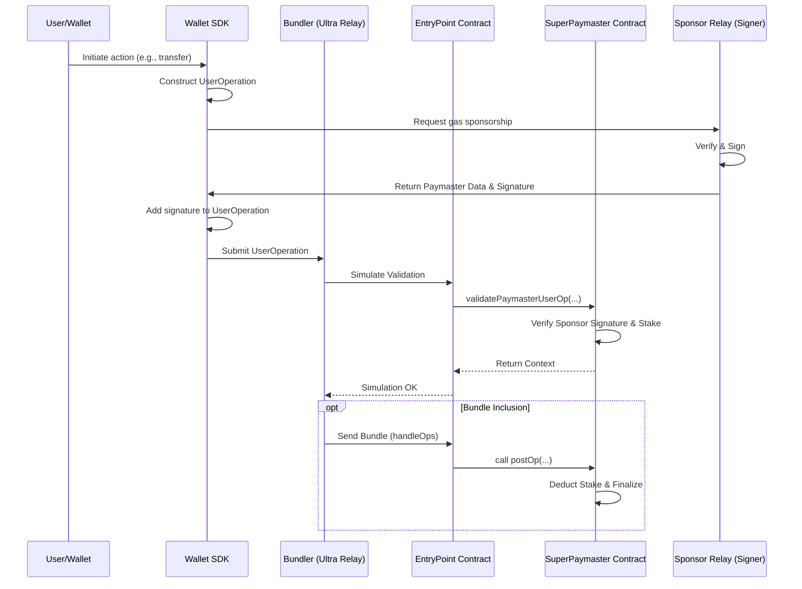
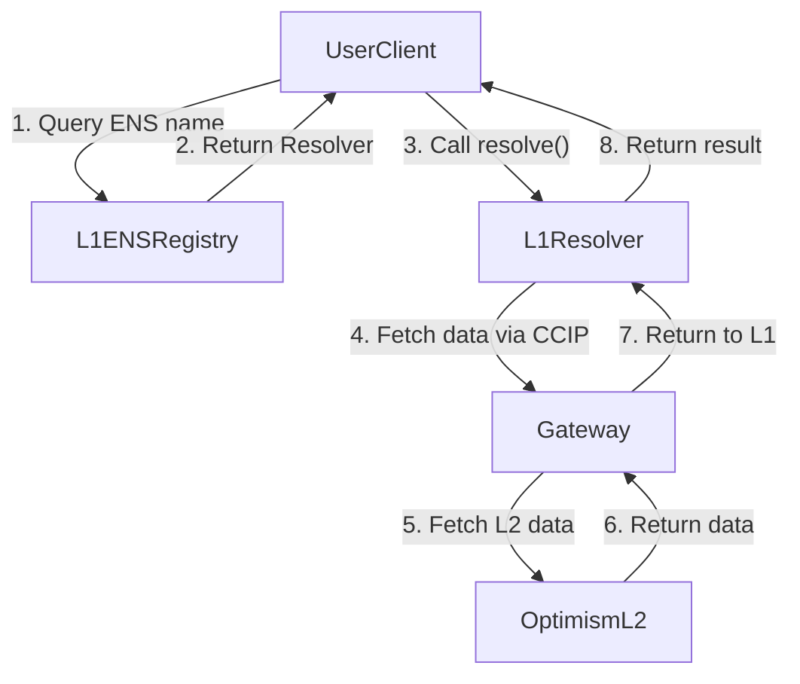

## Chapter 5: Implementation (Proof of Concept)

To validate the feasibility of our proposed design (Chapter 4), we developed a functional Proof-of-Concept (PoC) of the SuperPaymaster system. This chapter details the instantiation of the core components, serving as an existence proof that the architecture is technically sound and implementable. The implementation focused on realizing the key mechanisms, including the on-chain smart contracts, the decentralized service discovery, and the backend relay services.

Our PoC was built using a standard Web3 technology stack to ensure robustness and interoperability: **Solidity** (with the Foundry framework) for smart contracts, **Next.js (React/Node.js)** for frontend interfaces and SDKs, and **Go/Rust** for backend services, with components containerized via **Docker**.

### 5.1 On-Chain Contract Implementation

The on-chain component is the trust anchor of the system. We implemented the `SuperPaymaster.sol` contract, which is responsible for the core logic of the gas sponsorship market.

- **Stake Management:** To ensure economic security and fulfill the **Reliability** requirement, the contract includes functions to manage the registration and collateral (stake) of gas sponsors. This ensures that any sponsorship promise is economically backed, preventing abuse.
- **Signature and Payment Verification:** To meet the **Security** requirement, the core function, `validatePaymasterUserOp`, is implemented to securely verify the off-chain signature from a registered sponsor against a `UserOperation`. It calculates the maximum potential cost and ensures the sponsor has sufficient stake before allowing the transaction to proceed via the global EntryPoint contract. This entire process is illustrated in the sequence diagram below.

*Figure 10: The core interaction flow of the SuperPaymaster contract, from UserOperation creation to on-chain validation and post-transaction settlement.*

### 5.2 Backend and Service Discovery Implementation

To support the on-chain contracts, we implemented the necessary backend infrastructure, focusing on decentralization and open participation.

- **SuperPaymaster Relay Server:** A backend service was developed to act as a gas sponsor. It exposes an API for dApps to request sponsorship, and upon validating the request, signs the `UserOperation` with its registered key. This service is designed to be lightweight and easily deployable by any community member wishing to become a sponsor, thus addressing the **Distributed Operation** requirement.

- **Decentralized Service Discovery:** To avoid a centralized registry of sponsors and meet the **Censorship Resistance** requirement, we utilized the Ethereum Name Service (ENS). As shown in Figure 11, each sponsor node can register its service endpoint and supported tokens within an ENS text record. This allows dApps and users to discover available sponsors permissionlessly by querying the public, censorship-resistant ENS infrastructure, which is critical for fostering a competitive market.

*Figure 11: The cross-chain service discovery flow using ENS and CCIP, enabling dApps to find active paymaster nodes without a central registry.*

### 5.3 Open-Source Availability

The complete implementation of our Proof-of-Concept, including the Solidity smart contracts, backend relay services, and a demonstration SDK, is available as an open-source repository. This ensures full transparency and allows for the reproducibility of our results, fulfilling a key tenet of the Design Science Research methodology.

- **Repository URL:** https://github.com/aastarcommunity/SuperPaymaster
