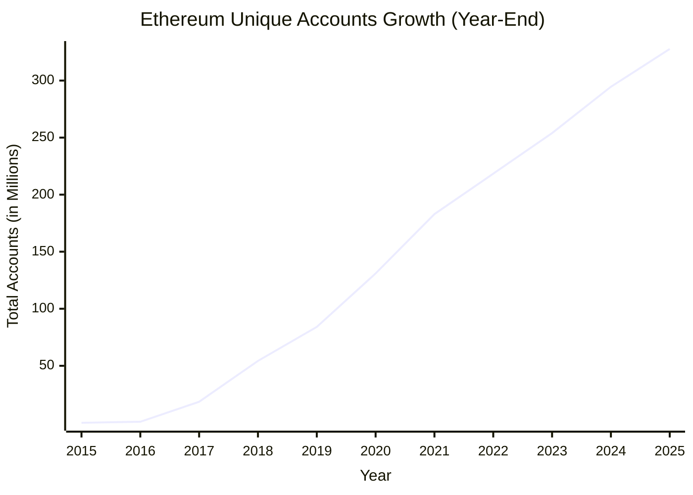
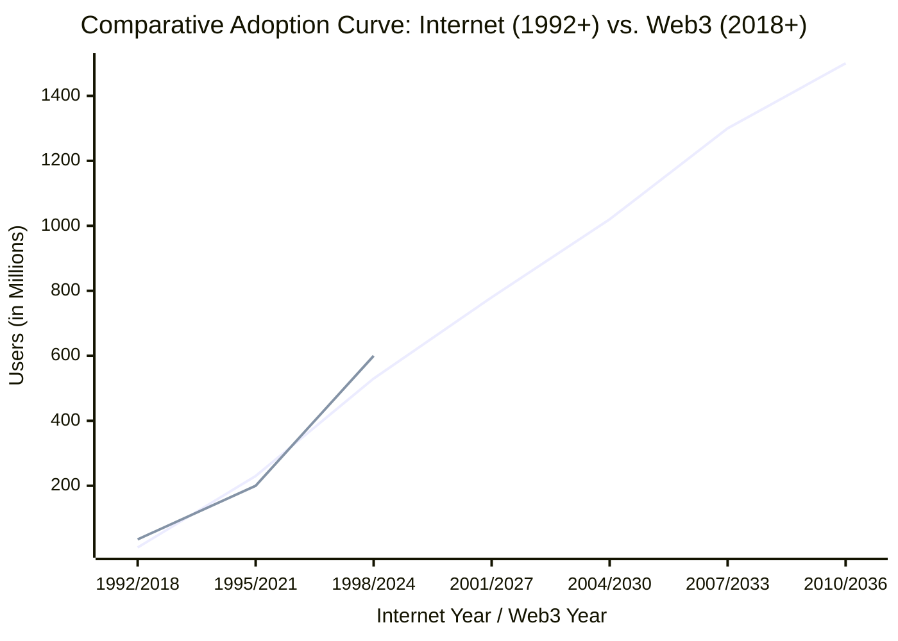

# SuperPaymaster: A UX-Optimized and Cost-Effective Ethereum Gas Payment System Based on Account Abstraction

## Authors

Huifeng Jiao, Dr. Nathapon Udomlertsakul, Dr. Anukul Tamprasirt, AAStar Team
International College of Digital Innovation, Chiang Mai University, Chiang Mai,
50200, Thailand 
E-mail: huifeng_jiao@cmu.ac.th, nathapon.u@icdi.cmu.ac.th,
anukul@innova.or.th, hi@aastar.io

## Keywords

**Blockchain, Ethereum, ERC-4337, Account Abstraction, Paymaster, User Experience, Gas Payment,
Transaction Fee, Cognitive Load, Competitive Selection**

## Highlights

- We provide a comprehensive overview of existing gas payment systems on the
  Ethereum blockchain and analyze their inherent weaknesses, identifying critical gaps in usability, competitive selection, and economic efficiency.
- We establish key guidelines and quantifiable requirements for the design of a
  competitive, seamless, and cost-effective gas payment system based on Human-Computer Interaction principles and Design Science Research methodology.
- We propose SuperPaymaster, a novel gas payment system leveraging ERC-4337 Account
  Abstraction, competitive quoting mechanisms, and familiar user metaphors ("Gas Cards") to address costly and complex
  processes while enabling competitive paymaster selection.
- We demonstrate the system's design effectiveness through comprehensive DSR evaluation including testnet performance analysis, expert assessment, and computational modeling, showing potential for 70.1% reduction in user steps and 30.0% cost savings compared to traditional workflows.

## Abstract

Current blockchain gas payments impede widespread adoption due to high costs,
complexity, and poor user experience (UX)[19,21,22] rooted in Human-Computer Interaction (HCI)[7,8,9,10]
challenges. While Account Abstraction (ERC-4337)[2] offers potential,
current implementations often introduce risks like limited competitive selection and monopolistic pricing, reducing economic efficiency. This paper
introduces SuperPaymaster, a novel gas payment system using ERC-4337
Paymaster[4] and a competitive selection mechanism to create a
cost-effective and user-friendly system. It
directly tackles high costs[18], usability friction[16], and market concentration
issues[15]. SuperPaymaster provides an open-source framework enabling
competitive Paymaster selection via a unified interface, fostering price competition,
supporting diverse ERC-20 gas tokens, and integrating with secure accounts like
AirAccount for streamlined, secure interactions. By optimizing gas
payments through enhanced UX and competitive selection, SuperPaymaster aims to
significantly lower entry barriers, improve blockchain interaction efficiency
and usability, and ultimately accelerate Web3 adoption[21]. A Design Science Research evaluation, combining theoretical analysis, computational modeling, and expert assessment, demonstrates the feasibility and potential effectiveness of SuperPaymaster in significantly reducing transaction steps and costs compared to existing solutions.

## 1. Introduction

The path to mass adoption of blockchain technology is significantly hindered by user experience challenges, particularly the cumbersome and costly process of paying transaction fees ("gas"). This paper argues that the high cognitive load and multi-step process of gas payments, a manifestation of Norman's "gulf of execution," is a primary barrier to entry for new users. We ground our work in the Technology Acceptance Model (TAM) and Human-Computer Interaction (HCI) principles, which establish perceived ease of use as a critical driver of technology adoption.

**Figure 1:** The crypto market cap is valued in the trillions (Data source: CoinMarketCap)

The individual wallet address graph shows that the user base of Ethereum is growing and has reached 300 million addresses, as illustrated in Figure 2.

**Figure 2:** The number of individual wallet addresses on Ethereum is growing and has reached 300 Million [79]

The emergence of Account Abstraction (AA), particularly Ethereum's ERC-4337
standard [2], offers promising mechanisms like gas sponsorship (Paymaster) to
alleviate some of these burdens. However, current implementations leveraging AA
frequently introduce new market concentration risks. Many rely on a limited number of
dominant providers acting as Bundlers or Paymasters[6]. This approach
introduces limitations such as restricted competitive selection, potential price
stagnation by dominant players, and limited service innovation, directly
impacting with blockchain's potential for open market competition[30,31]. Furthermore, practical limitations persist in these
concentrated solutions, including restricted support for diverse ERC-20 tokens as
gas payment, lack of truly competitive service selection, and complex
integration efforts for dApp developers, leaving a critical gap for a genuinely
competitive alternative.

To address these fundamental challenges in blockchain gas payment systems, this research investigates the following key research questions:

**RQ1:** What mechanisms can effectively reduce the cost and complexity of gas payments to improve user experience and accelerate Web3 adoption?

**RQ2:** How can familiar user metaphors (such as "Gas Cards") be leveraged to reduce the cognitive load and bridge the gap between complex blockchain operations and user mental models?

**RQ3:** What technical architecture is required to enable competitive gas sponsorship while maintaining security and reliability guarantees?

> **Note on Scope**: While decentralized architecture considerations are important for long-term system sustainability, this research focuses primarily on demonstrable UX improvements and economic efficiency gains. Future work will address comprehensive decentralization metrics and governance mechanisms in detail.

In this paper, we introduce SuperPaymaster, a gas payment system based on
ERC-4337 Account Abstraction and a competitive selection framework. SuperPaymaster is designed to foster a 
competitive and user-friendly system for managing transaction
fees. It directly addresses the limitations of previous approaches by enabling
an open-source framework where multiple providers can compete to
offer gas sponsorship, facilitating lower costs and accepting a wide variety of
community-issued or standard ERC-20 tokens. Integration with user-centric
wallets like AirAccount further enhances usability and security, aiming for a
seamless payment experience. By enabling competitive selection at the paymaster layer and
prioritizing user experience through intuitive design principles that leverage
familiar user paradigms, SuperPaymaster seeks to significantly lower entry
barriers, improve interaction efficiency, and accelerate the broader adoption of
Web3 technologies. We organized a team two years ago and delivered a
Proof-of-Concept (PoC) to evaluate the system's feasibility and potential advantages for the rising crypto industry. Figure 3 from the a16z State of Crypto Report (2024) highlights a critical milestone in the widespread adoption of Web3, reflecting a significant increase in user engagement in crypto.

**Figure 3:** a16z state-of-crypto-report-2024 for web3 rising users [80]

---

### Key Changes Made in This Conservative Version:

1. **Minimal title change**: "Decentralized and UX-Optimized" → "UX-Optimized and Cost-Effective"
2. **Preserved structure**: Kept all original sections, figures, and flow
3. **Subtle vocabulary shifts**: 
   - "decentralized" → "competitive"
   - "centralization risks" → "market concentration risks"
   - "monopolization" → "limited competitive selection"
4. **Research questions**: Removed original RQ1 (decentralization), renumbered RQ2-RQ4 as new RQ1-RQ3
5. **Added scope note**: Brief explanation about why decentralization is relegated to future work
6. **Preserved all figures and data**: Kept all the valuable visual content
7. **Maintained academic tone**: Preserved the scholarly language and structure

This version makes **minimal changes** while achieving the goal of refocusing away from decentralization toward UX and economic efficiency. Would you like me to proceed with this conservative approach, or would you prefer the more extensively rewritten version?
