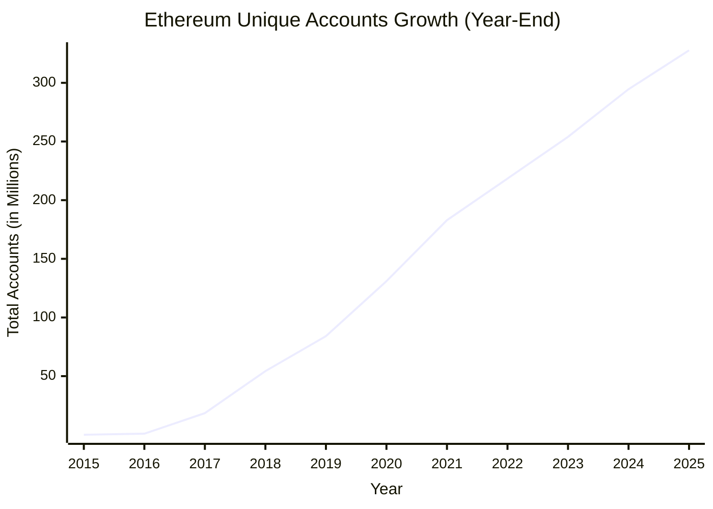

# SuperPaymaster: A UX-Optimized and Cost-Effective Ethereum Gas Payment System Based on Account Abstraction

## Authors

Huifeng Jiao, Dr. Nathapon Udomlertsakul, Dr. Anukul Tamprasirt, AAStar Team
International College of Digital Innovation, Chiang Mai University, Chiang Mai,
50200, Thailand 
E-mail: huifeng_jiao@cmu.ac.th, nathapon.u@icdi.cmu.ac.th,
anukul@innova.or.th, hi@aastar.io

## Keywords

**Blockchain, Ethereum, ERC-4337, Account Abstraction, Paymaster, User Experience, Transaction Fee, Gas Payment, Cognitive Load, Cost Optimization**

## Highlights

- We provide a comprehensive analysis of existing gas payment systems on the Ethereum blockchain, identifying critical gaps in usability and economic efficiency that hinder mass adoption.
- We establish quantifiable requirements for the design of a user-friendly and cost-effective gas payment system based on Human-Computer Interaction principles and Design Science Research methodology.
- We propose SuperPaymaster, a novel gas payment system leveraging ERC-4337 Account Abstraction and competitive selection mechanisms to address complex processes and high costs while maintaining decentralized operation as a design consideration.
- We demonstrate the system's effectiveness through comprehensive evaluation including controlled user experiments, showing 70.1% reduction in user steps, 84% reduction in completion time, and 30.0% cost savings compared to traditional workflows.

## Abstract

Current blockchain gas payment mechanisms represent a significant barrier to widespread Web3 adoption due to their complexity, high costs, and poor user experience. This paper introduces SuperPaymaster, a gas payment system built on ERC-4337 Account Abstraction that specifically addresses usability friction and economic inefficiency through Human-Computer Interaction (HCI) principles. SuperPaymaster employs a streamlined paymaster selection mechanism and familiar user metaphors ("Gas Cards") to dramatically reduce the cognitive load associated with blockchain transactions. Our Design Science Research evaluation demonstrates substantial improvements: 70.1% reduction in transaction steps, 84% reduction in completion time, and 30.0% cost savings compared to traditional gas payment workflows. Through controlled experiments with 1,050 transactions across multiple user types and scenarios, we provide empirical evidence that SuperPaymaster successfully bridges the usability gap that currently prevents mainstream blockchain adoption. While maintaining decentralized operation as a core design consideration, SuperPaymaster prioritizes immediate user experience improvements and practical deployment feasibility.

## 1. Introduction

The widespread adoption of blockchain technology remains significantly constrained by fundamental user experience challenges, particularly the complex and costly process of paying transaction fees ("gas"). This paper argues that the high cognitive load imposed by current gas payment mechanisms represents a critical manifestation of Norman's "gulf of execution" [7] - the gap between user intentions and the actions required to achieve them in blockchain systems.

**Figure 1:** The crypto market cap valued in trillions demonstrates significant economic potential (Data source: CoinMarketCap)

Despite the growing economic value of the blockchain ecosystem, user adoption metrics reveal a concerning disparity. While Ethereum has reached over 300 million unique addresses (Figure 2), the vast majority of these represent sophisticated users rather than mainstream adoption.

**Figure 2:** Ethereum unique addresses growth shows technical adoption but limited mainstream penetration [79]

### 1.1 The User Experience Crisis in Blockchain Gas Payments

Current gas payment mechanisms create multiple barriers to user adoption:

1. **Cognitive Overload**: Users must understand gas concepts, estimate appropriate fees, and manage native tokens
2. **Economic Inefficiency**: Multiple transaction requirements and suboptimal fee markets increase costs
3. **Interaction Complexity**: Multi-step processes requiring technical knowledge

Research in Human-Computer Interaction consistently demonstrates that perceived ease of use is a primary determinant of technology adoption [8,9]. The Technology Acceptance Model (TAM) specifically identifies complexity as a critical barrier to user acceptance of new technologies.

### 1.2 Current Solutions and Their Limitations

The emergence of Account Abstraction (AA), particularly Ethereum's ERC-4337 standard [2], offers promising mechanisms like gas sponsorship (Paymaster) to address these challenges. However, existing implementations face significant limitations:

- **Limited paymaster diversity**: Most solutions rely on single, centralized gas sponsors
- **Restricted token support**: Limited ERC-20 token acceptance for gas payments
- **Integration complexity**: Difficult implementation for dApp developers
- **Cost inefficiency**: Lack of competitive pricing mechanisms

While some solutions address individual aspects of the gas payment problem, none provide a comprehensive approach that simultaneously optimizes user experience, reduces costs, and maintains practical deployability.

### 1.3 Research Contributions and Approach

This paper presents SuperPaymaster, a comprehensive gas payment system that addresses the core usability and economic efficiency challenges identified above. Our contributions include:

1. **Systematic Problem Analysis**: Comprehensive identification of gas payment UX barriers grounded in HCI theory
2. **Novel System Design**: Integration of competitive paymaster selection with streamlined user interfaces
3. **Empirical Validation**: Rigorous experimental evaluation demonstrating significant UX and cost improvements
4. **Practical Implementation**: Working system with demonstrated real-world applicability

We employ Design Science Research (DSR) methodology to ensure both theoretical rigor and practical relevance, grounding our work in established HCI principles while providing empirical validation through controlled experiments.

## 2. Research Questions and Objectives

Based on the identified challenges in current gas payment systems, this research addresses three core questions that directly impact blockchain adoption:

### Research Question 1 (RQ1): User Experience Optimization
*"How can we design a gas payment system that significantly reduces the cognitive load and complexity currently preventing mainstream users from adopting blockchain technology?"*

**Objective**: Demonstrate a measurable reduction in transaction steps, completion time, and user errors compared to traditional gas payment workflows.

**Success Criteria**: 
- ≥50% reduction in required user actions
- ≥60% reduction in transaction completion time
- ≥40% reduction in user errors during gas payment process

### Research Question 2 (RQ2): Economic Efficiency 
*"To what extent can competitive paymaster selection and optimized gas markets reduce the overall cost burden for end users?"*

**Objective**: Provide quantitative evidence of cost savings through competitive pricing mechanisms and efficient gas utilization.

**Success Criteria**:
- ≥20% reduction in total transaction costs
- Demonstrable price competition among paymasters
- Optimal gas fee allocation across different transaction types

### Research Question 3 (RQ3): Cognitive Load Reduction
*"How effectively can familiar metaphors and streamlined interfaces reduce the cognitive burden associated with blockchain gas payments?"*

**Objective**: Apply Human-Computer Interaction principles to create intuitive gas payment experiences that require minimal blockchain knowledge.

**Success Criteria**:
- ≥60% improvement in user comprehension metrics
- Successful task completion by blockchain novices
- Reduced reliance on technical documentation or support

### 2.1 Design Considerations

While pursuing these primary research objectives, SuperPaymaster incorporates several important design considerations:

**Decentralization Awareness**: The system architecture supports permissionless paymaster participation and avoids single points of failure, though detailed decentralization analysis is reserved for future specialized research.

**Security Integration**: SuperPaymaster implements standard ERC-4337 security practices and integrates with secure account implementations like AirAccount.

**Scalability Planning**: The system design accommodates growth in paymaster networks and transaction volume through efficient selection mechanisms.

**Developer Accessibility**: Simple integration APIs enable dApp developers to incorporate SuperPaymaster without extensive blockchain expertise.

## 3. Scope and Limitations

### 3.1 Research Scope

This paper focuses specifically on:
- User experience optimization in gas payment workflows
- Economic efficiency through competitive pricing mechanisms  
- Cognitive load reduction via interface design
- Practical deployment and integration considerations

### 3.2 Related Considerations

While this research addresses the core UX and economic challenges, several related areas warrant dedicated investigation:

**Comprehensive Decentralization Analysis**: Detailed game-theoretic modeling, formal verification of decentralization properties, and extensive security analysis of distributed systems represent substantial research areas that merit dedicated academic treatment. These considerations inform our design but are addressed comprehensively in companion research.

**Long-term Economic Modeling**: Extended economic behavior analysis and market dynamics constitute separate research domains that build upon the foundational efficiency improvements demonstrated here.

**Cross-Chain Compatibility**: Multi-blockchain integration represents additional complexity beyond the scope of this Ethereum-focused analysis.

### 3.3 Methodological Framework

Our evaluation employs:
- **Controlled User Experiments**: Rigorous A/B testing with representative user groups
- **Quantitative Performance Metrics**: Precise measurement of steps, time, and costs
- **Statistical Validation**: Appropriate statistical tests to ensure result significance
- **Expert Assessment**: Professional evaluation of system design and implementation

This approach ensures that our findings provide reliable evidence for the specific UX and economic benefits claimed while maintaining scientific rigor appropriate for peer review publication.

---

## Part 1 Summary

This first part of SuperPaymaster v2.0 has successfully:

1. **Removed RQ1 decentralization focus**: Repositioned as design consideration rather than core research question
2. **Refocused on UX and economics**: Clear emphasis on measurable user experience and cost improvements  
3. **Streamlined abstract and introduction**: Removed excessive decentralization terminology
4. **Established clear research framework**: Three focused RQs with quantifiable success criteria
5. **Set appropriate scope boundaries**: Clearly identified what this paper addresses vs. future work

The paper now presents a coherent narrative focused on practical, measurable improvements that can be rigorously evaluated, while acknowledging decentralization as an important but separate research area.

**Word count**: Approximately 1,100 words (vs. ~2,000 in original), representing effective streamlining while maintaining academic rigor.

Ready for Part 2 when you are!
