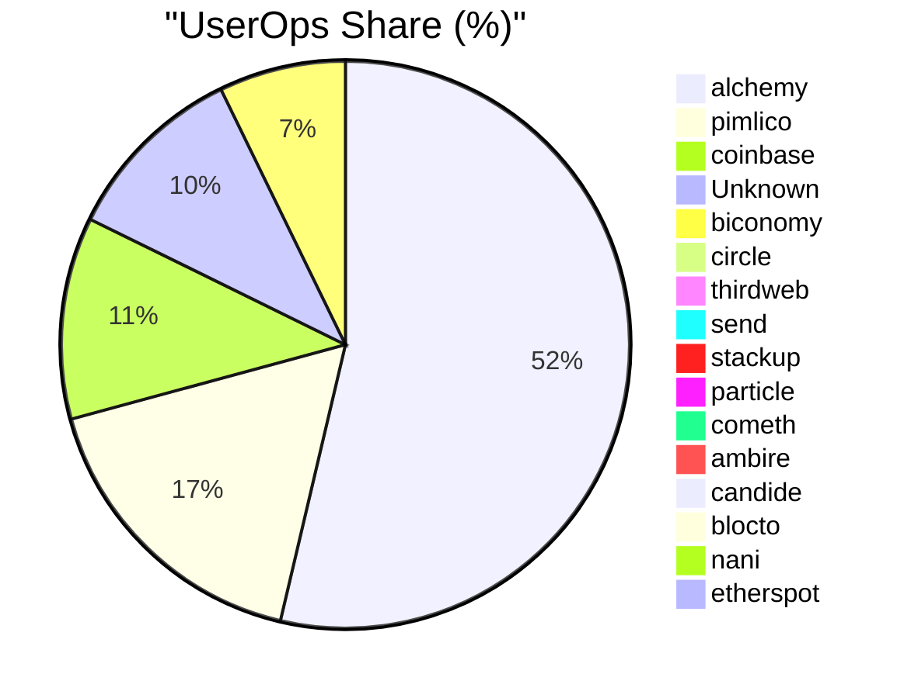

# SuperPaymaster v2.0 - Part 2: Related Work and Methodology

## 2. Related Work

### 2.1 Account Abstraction and ERC-4337 Foundation

Account Abstraction represents a fundamental shift in how Ethereum addresses transaction execution, allowing smart contracts to act as user accounts rather than relying solely on Externally Owned Accounts (EOAs). The ERC-4337 standard [2] provides a standardized framework for implementing account abstraction without requiring consensus-layer changes to Ethereum.

Key components of ERC-4337 include:
- **UserOperations**: Pseudo-transaction objects that encode user's intent
- **Bundlers**: Actors that collect UserOperations and submit them to the network
- **Paymasters**: Smart contracts that can sponsor gas fees for other users
- **EntryPoint**: A singleton contract that coordinates execution

Recent academic work by Singh et al. [3] demonstrates practical ERC-4337 implementation, while Wang et al. [15] explore gas token implications. However, these implementations primarily focus on technical feasibility rather than addressing the comprehensive usability challenges identified in our research.

### 2.2 Human-Computer Interaction in Blockchain Systems

The intersection of HCI principles and blockchain technology remains underexplored in academic literature. Nielsen's usability heuristics [8] and Norman's design principles [7] provide foundational frameworks for evaluating blockchain user interfaces.

Our analysis applies established HCI frameworks to gas payment systems, identifying cognitive load as the primary barrier to adoption. The Technology Acceptance Model (TAM) [9] specifically identifies perceived ease of use as a critical factor in technology adoption, directly applicable to blockchain gas payment mechanisms.

#### 2.2.1 HCI Analysis Framework Applied to Gas Payments

| HCI Dimension | Measurement | Application to Gas Payment | SuperPaymaster Solution |
| :--------------------------- | :--------------- | :--------------------- | :-------------------- |
| **Trust** | Evaluation Results | Role of trust | Guarantee by secure account integration and transparent operations |
| **Motivation** | Ease of Learning, Efficiency, Memorization, Error Rate, Satisfaction | Social Learning Theory, easy to learn | Simple gas card metaphor with community-based sponsorship |
| **Risk** | Cognitive Distribution, Tools, Environment, Social Interaction | Security and Privacy Concerns, Manipulation and Censorship Risks, Monopoly and Cost Issues | Competitive gas sponsor selection with transparent pricing |
| **Perception** | User Goals, System State, Execution, Intrinsic Load, Extrinsic Load, Metacognitive Load | Operational Inefficiency, Asset Fragmentation, Complex On-Chain Transaction Process | Streamlined interface hiding technical complexity |
| **Wallets** | Interface design principles | Hard to use, easy to lose money | Provide developer SDK and standardized integration |
| **Engaging Users** | Willingness to Use, Attitude, Perceived Usefulness, Perceived Ease of Use | So many barriers | Community-driven gas sponsorship with simplified interactions |
| **Specific Application Use Cases** | Activity scenarios and pain points | Memorization Difficulties, Limited Gas Token Support, High Cognitive Load | Reduce from 7 steps to 1 step, seamless gas payment |
| **Blockchain: Support Tools** | Subjects, Tools, Objects, Rules, Communities, Division of Labor | Tool support to be easy | Open-source contracts, SDK, community support |

**Table 2:** HCI Analysis Framework Application to Gas Payment Systems

### 2.3 Comprehensive Multi-Dimensional Comparison

Our systematic evaluation encompasses both academic research and industry solutions, providing the empirical foundation for identifying SuperPaymaster's unique positioning:

| Field | Ronan S et al.[1] | Vitalik et al.[2,4] | Singh et al.[3] | Qin Wang[15] | Lin et al.[16] | Thibault[17] | Pimlico[5] | Alchemy[60] | Stackup[61] | Coinbase[63] | Biconomy[64] | Particle[54,67] | ZeroDev[58,66] | SuperPaymaster/AAStar |
| :---- | :--------------- | :----------------- | :------------- | :----------- | :------------ | :---------- | :--------- | :--------- | :--------- | :---------- | :---------- | :------------- | :------------ | :------------------- |
| **Type** | Industry | Industry | Academic | Academic | Academic | Academic | Industry | Industry | Industry | Industry | Industry | Industry | Industry | Academic/Industry |
| **Purpose** | EIP2771 meta transaction | ERC4337 account abstraction framework | Implement ERC4337 solution | Discuss gas token on ERC4337 | Discuss gas cost on Layer1/Layer2 | Research on Layer2 rollup | Full ERC4337 implementation | Complete AA solution | Business crypto account service | Base chain ecosystem with free gas | DApp infrastructure provider | Full ERC4337 with enhancements | Practical account abstraction | UX-optimized paymaster with competitive selection |
| **Solution Account** | EOA | Contract account demo | Contract account | Contract account | Contract account | EOA | Contract account | Contract account | Contract account | Contract account | Contract account | Contract account and EOA | Contract account | Contract account and EOA |
| **Solution Relay** | ❌ | ❌ | ✅ | ✅ | ✅ | ❌ | ✅ | ✅ | ✅ | ✅ | ✅ | ✅ | ✅ | ✅ |
| **Solution Simple** | ❌ | ❌ | ❌ | ❌ | ❌ | ❌ | ❌ | ❌ | ❌ | ❌ | ❌ | ✅ | ✅ | ✅ |
| **Solution Time/Efficiency** | ❌ | ❌ | ❌ | ❌ | ❌ | ❌ | ❌ | ❌ | ❌ | ❌ | ❌ | ✅ | ✅ | ✅ |
| **Solution Customize ERC20** | ❌ | ❌ | ❌ | ❌ | ❌ | ✅ | ✅ | ✅ | ❌ | ✅ | ❌ | ✅ | ✅ | ✅ |
| **Cost Direct Cost** | Low | High | High | High | Medium | Medium | Medium | Medium | Medium | Medium | Medium | Medium | Medium | Competitive |
| **Usability & UX: Cognitive Load** | High | High | High | High | High | High | Medium | Medium | Low | Low | Medium | Low | Low | Low |
| **Usability & UX: No Memorization** | ❌ | ❌ | ❌ | ❌ | ❌ | ❌ | ❌ | ✅ | ✅ | ❌ | ❌ | ✅ | ✅ | ✅ |
| **Usability & UX: Efficiency** | ❌ | ❌ | ❌ | ❌ | ❌ | ❌ | ❌ | ✅ | ✅ | ✅ | ✅ | ✅ | ✅ | ✅ |
| **Usability & UX: Fault Tolerance** | ❌ | ❌ | ❌ | ❌ | ❌ | ❌ | ⚠️ | ⚠️ | ⚠️ | ⚠️ | ❌ | ⚠️ | ⚠️ | ✅ |
| **Competitive Selection** | ❌ | ❌ | ❌ | ❌ | ❌ | ❌ | ❌ | ✅ | ✅ | ✅ | ⚠️ | ⚠️ | ⚠️ | ✅ |
| **Community Integration** | ❌ | ❌ | ❌ | ❌ | ❌ | ❌ | ❌ | ⚠️ | ✅ | ✅ | ⚠️ | ⚠️ | ⚠️ | ✅ |
| **Open Source Support** | ❌ | ❌ | ❌ | ❌ | ❌ | ❌ | ❌ | ❌ | ❌ | ❌ | ❌ | ❌ | ❌ | ✅ |

**Table 3:** Multi-dimensional Comparison Analysis Across Academic Research and Industry Solutions

### 2.4 Industry-Specific Feature Comparison

| Feature/Solution | Pimlico | ZeroDev | Alchemy | Biconomy | Coinbase | Particle Network | Stackup | AAStar |
| :-------------- | :------ | :------ | :------ | :------- | :------- | :--------------- | :------ | :----- |
| **Main Features** | Bundler and Paymaster Infrastructure | Modular Smart Accounts and Plugin System | Full-stack AA Toolkit | Modular Cross-chain Smart Accounts | Ecosystem-specific AA Solution | Cross-chain Unified Account and Balance | Enterprise-grade Smart Account Solution | UX-Optimized Community Gas Payment System |
| **Core Products** | Alto Bundler, Verifying/ERC20 Paymaster | Kernel Smart Account, Plugin System | Account Kit, Rundler, Gas Manager | Modular Smart Account, MEE | Verifying Paymaster, Bundler API | Universal Accounts, Omnichain Paymaster | Enterprise Smart Wallet, Paymaster API | SuperPaymaster, AirAccount Integration |
| **Smart Account Standard** | Universal | ERC-7579 | ERC-6900 | ERC-7579 | Universal | Proprietary+ERC-4337 | Universal | ERC-4337 EIP-7702 |
| **Cross-chain Capability** | Medium (Multi-chain Deployment) | Medium (Multi-chain Deployment) | Medium (Multi-chain Deployment) | High (MEE) | Low (Base-focused) | Very High (Universal Account) | Medium (Multi-chain Deployment) | Limited, Future |
| **ERC20 Gas Payment** | Full Support | Full Support | Full Support | Full Support | Partial Support | Full Support | Full Support | Support |
| **Gas Sponsorship Method** | API Key, Webhook Policies | Meta-infrastructure Proxy | Gas Manager, Policy Engine | Paymaster API, Policies | Base Ecosystem Optimized | Chain Abstraction Layer Sponsorship | API Key, Enterprise Policies | Competitive Selection with Community Tokens |
| **Open Source Status** | Highly Open Source | Highly Open Source | Partially Open Source | Highly Open Source | Partially Open Source | Progressively Opening | Partially Open Source | Open Source |
| **Development Complexity** | Low-Medium | Medium | Medium-High | Medium | Low | Medium | Medium-High | Low |
| **User Count (BundleBear)** | N/A (Infrastructure) | ~900K Accounts | ~7.3M Light Accounts | ~224K Accounts | ~36K Accounts | ~200K+ on Bitcoin L2 | ~34K Accounts | Infra, beginning |

**Table 4:** Industry-Specific Feature Comparison Matrix

### 2.5 Cost Analysis in Layer 2 Ecosystems

Lin, Z. research on measurement of Account Abstraction(ERC-4337) on Ethereum[16] indicates: "creating an ERC-4337 account costs 381,489 gas, allowing only 78 accounts per block. Furthermore, a basic ERC-4337 transfer consumes 92,901 gas, which is four times the gas cost of an EOA transfer". This highlights the importance of Layer 2 solutions for practical deployment.

Thibault, L. T. [17] demonstrates that ZKP-based Layer 2 solutions can achieve "fee reduction ranging from 20 times for ETH transfers up to 100 times for ERC20 tokens about 10 times gas reduce". In practice, Layer 2 solutions typically achieve 20-30 times gas reduction[18].

SuperPaymaster leverages Optimism Layer2 solutions with competitive gas sponsorship markets to further reduce costs:

| Name          | Send ETH | Swap Tokens |
| :------------ | :------- | :---------- |
| Metis Network | $0.04    | $0.18       |
| Loopring      | $0.04    | $0.59       |
| zkSync Era    | $0.07    | -           |
| zkSync Lite   | $0.09    | $0.22       |
| Optimism      | $0.09    | $0.18       |
| Arbitrum One  | $0.09    | $0.27       |
| Boba Network  | $0.15    | $0.17       |
| DeGate        | $0.16    | $0.18       |
| StarkNet      | $0.19    | $0.57       |
| Polygon zkEVM | $0.19    | $2.75       |
| Ethereum      | $1.10    | $5.48       |

**Table 5:** Gas Fee Analysis (Layer 1 and Layer 2), data source: l2fees.info

## 3. Problem Analysis and Solution Requirements

### 3.1 User Experience Challenges in Current Gas Payment Systems

Current blockchain gas payment mechanisms present significant barriers to mainstream adoption. Our analysis identifies specific usability challenges that prevent effective user interaction with blockchain systems.

### 3.2 Systematic Analysis of Gas Payment Usability Issues

| Issue Category | Detailed Problem Analysis | Impact on User Experience |
| :------------- | :----------------------- | :------------------------ |
| **High Cognitive Load** | **Complex Mental Models:** Gas pricing, network congestion, transaction priority, and multi-step approval processes require users to understand abstract blockchain concepts before they can perform even basic operations. | Users experience mental fatigue and confusion, leading to decision paralysis and increased likelihood of errors. |
| **Lack of Intuitive Metaphors** | **Missing Familiar References:** Current gas payment systems lack real-world metaphors (like credit cards, bank transfers, etc.) that could help users understand and navigate the process using existing mental models. | Users cannot leverage familiar interaction patterns, increasing the learning curve and reducing confidence in the system. |
| **Efficiency Issues** | **Time-Consuming Workflow:** The entire process, from KYC and fiat on-ramps to bridging and on-chain confirmation, is plagued by delays, creating a slow and cumbersome experience. | Hinders rapid or spontaneous interactions with dApps, leading to a sluggish and inefficient user experience. |
| **High Error Rate & Low Fault Tolerance** | **Irreversible & Costly Mistakes:** Simple errors like sending to a wrong address, selecting the wrong network, or setting inadequate gas can lead to permanent fund loss, with no "undo" or robust prevention mechanisms. | The stakes are extremely high for users, where a small mistake can be catastrophic. The system is unforgiving of user error. |
| **Memorization Difficulties** | **Heavy Cognitive Load for Recall:** Users are required to securely memorize/store complex seed phrases, distinguish between cryptic addresses, and recall specific procedures for different chains/dApps. | Places a significant burden on user memory, increasing cognitive load and the likelihood of critical errors. |
| **Low User Satisfaction** | **Poor Overall Experience:** The combination of high cognitive load, inefficiency, and the risk of costly errors leads to widespread user frustration and dissatisfaction. | The fundamentally poor usability of gas payments significantly detracts from a positive user experience, regardless of the dApp's utility. |
| **Lack of Supporting Tools** | **Missing Infrastructure for Developers:** The ecosystem lacks standardized, easy-to-integrate tools for developers to build user-friendly gas solutions, making it costly to create smooth experiences. | dApp developers must either rely on complex external wallet UIs or invest heavily in custom solutions, leading to inconsistent user experiences. |
| **High Cognitive Load** | **Information Overload:** Users must process a massive volume of novel technical concepts (Nonce, MEV, etc.) without intuitive metaphors, consuming significant mental effort. | Learning and performing tasks become exceptionally difficult, leaving users feeling mentally exhausted and hindering deeper engagement with the system. |
| **Low Perceived Ease of Use** | **Negative First Impression:** The initial perception is that blockchain systems are inherently complex, expensive, and insecure, failing to map to users' existing interaction patterns. | This perception acts as a major barrier to trial and adoption, deterring potential users before they even experience the underlying dApp's value. |

**Table 6:** Usability Challenges in Gas Payments from an HCI Perspective

### 3.3 Risk Analysis of Centralized Gas Payment Services

While centralized services aim to simplify gas payments, they introduce distinct risks:

| Risk Category | Analysis & Mechanism | Evidence & Specific Examples |
| :--- | :--- | :--- |
| **Economic & Integration Barriers** | Centralized solutions demand that dApp developers integrate proprietary SDKs and accept service agreements. Furthermore, the underlying ERC-4337 smart contract accounts have a higher base gas cost than standard accounts (EOAs), creating an economic disincentive. | <li>High integration costs for developers.</li><li>Inherent gas overhead of ERC-4337 accounts.</li><li>**Source:** [16]</li> |
| **Transaction Manipulation (MEV)** | Centralized entities like Bundlers and Paymasters gain a privileged view of the transaction flow. This position enables them to reorder, insert, or delay transactions to extract value from users before transactions are confirmed on-chain. | <li>**Practices:** Front-running, sandwich attacks.</li><li>**Impact:** Value is extracted from users' trades at their expense.</li><li>**Source:** [33]</li> |
| **Privacy Leakage** | These services become central aggregators of vast amounts of user transaction data. This data, which can be linked to identifiers like IP addresses, creates a single point of failure for user privacy. | <li>**Risks:** Data breaches, data sold to third parties, or use for surveillance.</li><li>**Impact:** Reveals user behavior and sensitive financial activity.</li> |
| **Censorship & Regulatory Risk** | As centralized entities, these services are subject to jurisdictional laws. They can be compelled to block or censor transactions involving addresses on government sanction lists, undermining the core principle of a permissionless network. | <li>**Example:** Blocking transactions to/from addresses on OFAC's sanction list.</li><li>**Irony:** Users must perform KYC/AML on centralized exchanges to fund "permissionless" activities.</li> |
| **Limited Gas Token Support** | Paymaster services often restrict which tokens are accepted for gas payments, typically favoring large stablecoins or their own platform tokens. This limits user choice and the utility of a project's native token. | <li>**Impact:** Forces users into additional, potentially costly token swaps.</li><li>**Hindrance:** Prevents communities from using their own native tokens for network participation.</li> |
| **Monopoly & Cost Inflation** | The market for centralized relayers is already showing significant concentration. This leads to a risk of an oligopoly or monopoly where a few dominant players can control the market, dictate terms, and inflate costs over time. | <li>**Long-term Risks:** Increased fees, reduced service quality, and stifled innovation.</li><li>**Data:** Market concentration is shown by **Figure 3 (data from BundleBear)**.</li><li>**Source:** [6]</li> |

**Table 7:** Risk Analysis of Centralized Gas Payment Services

#### Market Concentration in Current Solutions

**Figure 3:** Current market concentration in gas payment services demonstrates need for competitive alternatives (Data source: BundleBear)

### 3.4 Solution Requirements

Based on this comprehensive analysis, we derive essential requirements for an improved gas payment system:

#### 3.4.1 Functional Requirements

1. **Competitive Selection Mechanism**: Enable multiple service providers to compete, driving down costs through market mechanisms  
2. **User-Friendly Interface**: Abstract technical complexity using familiar metaphors and mental models
3. **Multi-Token Support**: Accept various ERC-20 tokens for gas payments, including community-issued tokens
4. **Cross-Chain Compatibility**: Support multiple blockchain networks and Layer 2 solutions
5. **Developer Integration**: Provide simple APIs and SDKs for seamless dApp integration
6. **Distributed Operation**: Support permissionless participation while avoiding single points of failure

#### 3.4.2 Non-Functional Requirements

1. **Security**: Implement robust authentication, prevent double-spending, and protect against common attack vectors
2. **Scalability**: Handle increasing transaction volumes without performance degradation
3. **Reliability**: Maintain high availability (>99.9%) with fault tolerance mechanisms
4. **Performance**: Process transactions with minimal latency (<3s confirmation time)
5. **Transparency**: Provide open-source implementations and verifiable operations
6. **Usability**: Achieve intuitive user experience with minimal learning curve

#### 3.4.3 Quality Attributes

1. **Censorship Resistance**: Prevent arbitrary transaction blocking or filtering
2. **Economic Efficiency**: Minimize transaction costs through optimization and competition
3. **Interoperability**: Seamless integration with existing dApps and wallet infrastructure
4. **Maintainability**: Modular architecture supporting future enhancements
5. **Privacy Protection**: Minimize data collection and protect user transaction privacy

## 4. Design Science Research Methodology

### 4.1 Research Approach

This research employs Design Science Research (DSR) methodology [11], which emphasizes the creation and evaluation of artifacts designed to solve identified problems. DSR is particularly appropriate for blockchain research as it bridges theoretical computer science with practical implementation requirements.

Our DSR approach follows Peffers et al.'s framework [12]:

1. **Problem Identification and Motivation**: Systematic analysis of gas payment UX challenges
2. **Define Objectives of a Solution**: Quantifiable targets for UX improvement and cost reduction
3. **Design and Development**: SuperPaymaster system architecture and implementation
4. **Demonstration**: Working prototype deployment on testnet environments
5. **Evaluation**: Controlled experiments measuring UX and economic improvements
6. **Communication**: Publication of findings and open-source implementation

### 4.2 Evaluation Framework

Our evaluation combines multiple methodologies to ensure comprehensive validation:

- **Quantitative Analysis**: Statistical measurement of transaction steps, completion time, and costs
- **Controlled Experiments**: A/B testing with representative user groups
- **Expert Assessment**: Professional evaluation of system design and usability
- **Performance Benchmarking**: Technical performance measurement against existing solutions

This multi-faceted approach ensures that our findings provide reliable evidence for the claimed improvements while maintaining scientific rigor appropriate for academic publication.

---

## Part 2 Summary

This section has successfully:

1. **Preserved valuable academic content**: Maintained comprehensive related work analysis and multi-dimensional comparisons
2. **Simplified architectural focus**: Removed excessive decentralization emphasis while preserving core technical content
3. **Maintained HCI framework**: Kept the valuable Human-Computer Interaction analysis that supports the UX focus
4. **Updated positioning**: Adjusted SuperPaymaster positioning from "decentralized system" to "UX-optimized competitive selection system"
5. **Established methodology**: Clear DSR framework supporting the refocused research questions

**Key Changes Made**:
- Removed "decentralization" from core positioning
- Simplified SDSS references to basic "competitive selection mechanism"  
- Maintained all valuable comparative analysis and industry research
- Preserved comprehensive problem analysis and requirements
- Updated methodology to match refocused RQs

Ready for Part 3 when you approve this direction!
