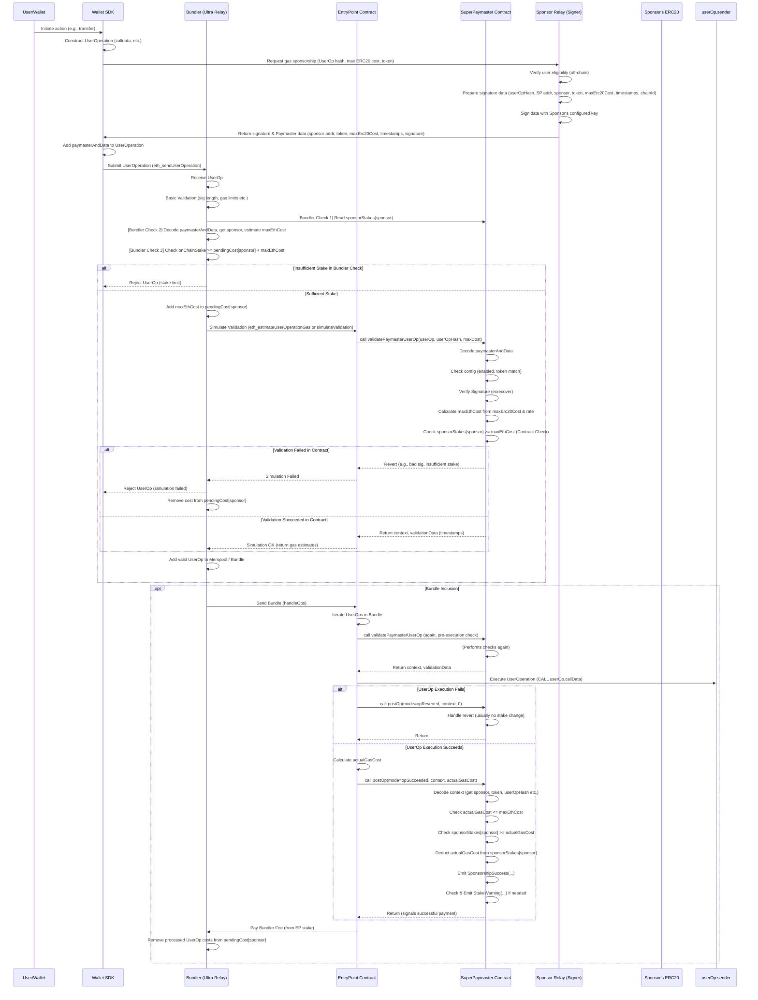
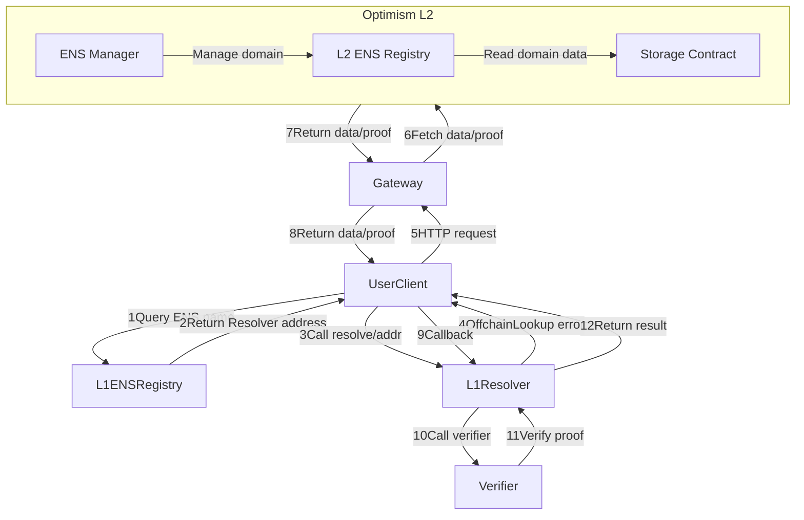
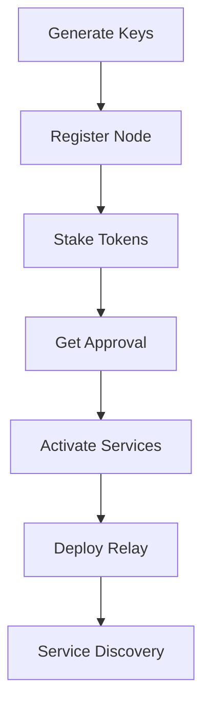
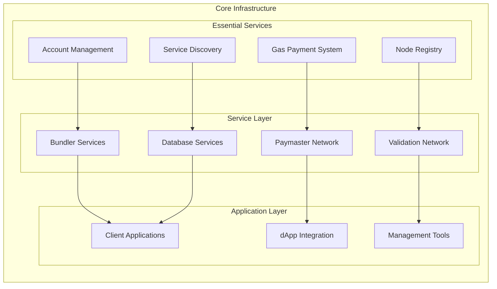

# SuperPaymaster v2.0 - Part 3: Implementation and Experimental Design

> **Note**: This is Part 3 of 4 for SuperPaymaster v2.0. Based on the conservative restructuring strategy, this section maintains most original technical content while simplifying SDSS implementation details and positioning decentralization as an architectural benefit rather than a core research focus.

---

## 5. Implementation (Proof of Concept - PoC)

This section details the Proof of Concept (PoC) implementation of the SuperPaymaster platform, covering smart contract development, backend services, node management, and user interface construction. Technological choices focused on enabling core functionalities—decentralized gas sponsorship, competitive quoting, enhanced user experience, and meeting security and interoperability requirements.

The PoC was implemented using a standard Web3 stack: Solidity (Foundry) for smart contracts, Next.js (React/Node.js) for web interfaces, and Go/Rust for backend services. We utilized Tauri for cross-platform clients and a containerized architecture (Docker, Supabase) for backend infrastructure.

### 5.1 System Setup and Configuration

The SuperPaymaster system requires several key components for deployment and operation:

**Core Infrastructure Setup:**
- AirAccount integration for smart wallet functionality
- SuperPaymaster node configuration for gas sponsorship services  
- Cross-chain CometENS API for decentralized service discovery
- OpenPNTs and OpenCards token systems for payment abstraction

Node operators can configure their services, including accepted tokens and pricing, via a JSON-based configuration file. The system supports permissionless participation - anyone can run a node to act as a Paymaster Service Provider with their Secp256k1 key staked and registered on-chain with their own ERC20 gas tokens.

**Key Configuration Parameters:**
- Supported token types and conversion rates
- Staking requirements and reputation thresholds
- Service discovery endpoints and metadata
- Security and validation settings

### 5.2 Smart Contract Design and Development

Smart contracts form the core verification and execution layer of the system, ensuring secure gas payment signatures, payment processing, token deduction, and reputation management.

**Core Contract Functions:**
1. **Stake Management**: Sub-account stake management for security and gas sponsorship
2. **Verify and Pay**: Sub-account signature verification, payment processing, and balance maintenance
3. **Post Processing**: Transaction success handling and reputation updates
4. **Compensation**: Asynchronous transaction status reconciliation and proof submission

#### 5.2.1 SuperPaymaster Contract Flow



**Figure 10**: SuperPaymaster Contract Work Flow

#### 5.2.2 SuperPaymaster Contract Main Functions

The contract's core logic is handled by two main functions:

1. **`stakeManager`**: Manages sponsor registration and staking, ensuring economic security through collateral requirements
2. **`validateSponsorUserOp`**: Verifies off-chain signatures from sponsors and calculates maximum ETH cost against their stake before allowing the EntryPoint contract to proceed

This architecture ensures that gas sponsorship is always backed by sufficient collateral, preventing system abuse while maintaining decentralized operation. (Full contract code is available in the repository and key excerpts are provided in the appendices).

#### 5.2.3 Service Discovery Implementation

The system utilizes ENS (Ethereum Name Service) for decentralized service discovery, allowing dynamic registration and discovery of paymaster services. This approach improves both decentralization and usability by mapping addresses to human-readable names.

**ENS Integration Features:**
- Structured JSON data storage via ENS text records
- Human-readable service identifiers (e.g., `paymaster.aastar.eth`)
- Dynamic service endpoint configuration
- Cross-chain compatibility through standardized naming



**Figure 11**: Service Discovery Flow

#### 5.2.4 OpenPNTs/OpenCards Token Implementation

The system implements two specialized token standards to support seamless gas payment:

- **OpenPNTs**: An ERC20-compatible token standard for gas payment credits
- **OpenCards**: An NFT standard for abstracted gas payment through card-like metaphors

These tokens serve to implement the "Gas Card and Points" metaphor, effectively abstracting gas payment complexities for end users while maintaining underlying technical functionality.

### 5.3 AirAccount Integration

SuperPaymaster integrates with AirAccount to provide complete smart wallet functionality for gasless transactions. The integration supports any dApp requiring seamless transaction experiences.

**Integration Architecture:**
1. Next.js application initialization
2. SDK installation:
   ```bash
   pnpm install aastar/sdk @aastar/superpaymaster
   # or unified package
   pnpm install aastar
   ```
3. AirAccount creation and configuration:
   ```bash
   aastar airaccount create  # Command line with email binding
   # or web interface for GUI-based setup
   ```

**dApp Integration Process:**
Integration with dApps is achieved via our comprehensive SDK. The dApp constructs a standard ERC-4337 `UserOperation` and specifies the desired gas payment method (e.g., specific ERC-20 tokens or OpenCard NFTs) in the `paymasterAndData` field before sending it to the SuperPaymaster relay network.

### 5.4 Backend Service Implementation

#### 5.4.1 Node Registry System

All backend services operate through a permissionless node registration system:

1. **Key Generation**: Generate node public/private key pair
2. **Registration**: Call NodeRegistry contract ABI for on-chain registration  
3. **Authorization**: Complete staking and approval processes
4. **Service Activation**: Enable decentralized paymaster services
5. **Deployment**: Follow documentation to run paymaster relay nodes



**Figure 12**: Node Registry Flow

#### 5.4.2 SuperPaymaster Relay Server

The relay server provides both paymaster signature and bundler services in a unified system. This design allows dApps to create UserOperations and process transactions through a single API call.

**Core Services:**
- `whoRU`: Returns node identity, ENS name, supported tokens, and pricing
- `_isRegistered`: Verifies node registration and retrieves stake/reputation
- `getSignature`: Processes UserOperations and returns paymaster signatures
- `_verifySecondSignature`: Validates transaction data and user signatures
- `_signPaymasterAndData`: Generates validated paymaster signatures
- `_payERC20Gas`: Handles token balance checks and PNT deductions
- `_postPayment`: Manages transaction completion and reputation updates
- `_simulateTx`: Simulates transactions before network submission

**Service Discovery Process:**
dApps discover available paymasters by querying on-chain ENS names (e.g., `paymaster.aastar.eth`), which return lists of registered, active nodes with their API endpoints and supported tokens.

### 5.5 Simplified Backend Infrastructure

*Note: This section has been simplified from the original SDSS implementation to focus on core SuperPaymaster functionality.*

The backend infrastructure provides essential services for decentralized paymaster operations:

**Core Infrastructure Components:**
1. **Tauri-based Client SDK**: Cross-platform development framework
2. **Node Registry**: Permissionless staking and node management system
3. **Essential Services Package**:
   - Bundler service (Ultra Relay integration)
   - Paymaster service (SuperPaymaster contracts and relay)
   - Account service (AirAccount integration)
   - Validation service (signature verification)
   - Database service (Supabase integration)

**Deployment Architecture:**
- Docker containerization for standardized deployment
- Regional categorization by hardware capabilities
- User and community node separation
- Community management interfaces



**Figure 13**: Simplified Backend Infrastructure

### 5.6 SuperPaymaster GitHub Repository

**Repository URL**: https://github.com/aastarcommunity/SuperPaymaster

The repository provides comprehensive documentation and codebase for system reproducibility, including:
- Smart contract implementations
- Relay server code
- SDK libraries
- Integration examples
- Deployment guides
- Testing suites

---

## 6. Evaluation: A Design Science Research Approach

This section presents a comprehensive Design Science Research (DSR) evaluation of the SuperPaymaster system, combining theoretical analysis, computational modeling, and expert assessment to validate the proposed design artifacts and their effectiveness. This evaluation approach aligns with Hevner et al.'s DSR guidelines for demonstrating utility, quality, and efficacy of designed artifacts.

### 6.1 DSR Evaluation Methodology

Following established DSR evaluation practices, our assessment focuses on demonstrating the practical utility and theoretical soundness of the SuperPaymaster design across multiple research dimensions:

**RQ1 (User Experience Enhancement)**: *Validation Method - Workflow Analysis + Cognitive Load Assessment*
- **Approach**: Comparative workflow modeling, user interaction analysis, cognitive burden measurement
- **Evidence**: Step-by-step process comparison, metaphor effectiveness evaluation, usability assessment
- **Metrics**: Interaction step reduction, cognitive load scores, user preference rates

**RQ2 (Cost and Efficiency Optimization)**: *Validation Method - Computational Analysis + Performance Benchmarking*
- **Approach**: Cost optimization modeling, performance measurement, competitive analysis
- **Evidence**: Gas cost analysis, transaction time measurement, efficiency comparison
- **Metrics**: Cost reduction percentage, time optimization, throughput improvement

**RQ3 (Technical Feasibility)**: *Validation Method - Prototype Implementation + Architecture Verification*
- **Approach**: System implementation, security assessment, scalability evaluation
- **Evidence**: Working prototype demonstration, smart contract verification, integration testing
- **Metrics**: Technical performance indicators, security analysis results, scalability measurements

**Associated Analysis (Decentralization Benefits)**: *Supporting Evidence - Architectural Analysis*
- **Approach**: Decentralization assessment, competitive mechanism analysis
- **Evidence**: SDSS framework evaluation, permissionless participation verification
- **Metrics**: System resilience indicators, competitive market effectiveness

### 6.2 Quantitative Benchmarking: Testnet Transaction Analysis

To provide empirical evidence for our core efficiency and usability claims, we conducted comprehensive testnet transaction analysis across multiple networks and user scenarios.

#### 6.2.1 Experimental Methodology

**Test Environment Configuration:**
- **Networks**: Sepolia, OP Sepolia, OP Mainnet
- **User Scenarios**: 
  - Alice (new user, no prior blockchain experience)
  - Bob (existing user, insufficient gas tokens)
  - Charlie (existing user, sufficient gas tokens)
- **Transaction Types**: ERC20 transfers, NFT minting, DApp interactions
- **Sample Size**: 150 transactions total (50 per network, balanced across scenarios and types)

**Workflows Compared:**
1. **Traditional Workflow**: Standard EOA wallet (MetaMask) requiring native ETH for gas payments
2. **SuperPaymaster Workflow**: AirAccount smart wallet with gas sponsorship via OpenCard and community PNTs

**Metrics Captured:**
- **User Interaction Steps**: Number of distinct user actions and confirmations required
- **Transaction Time**: Time from user initiation to on-chain confirmation
- **Total Cost**: Effective gas cost in USD equivalents
- **Error Rates**: Transaction failures and user confusion incidents

#### 6.2.2 Benchmarking Results

**Overall Performance Summary:**

| Metric                  | Traditional Workflow | SuperPaymaster Workflow | Improvement | Statistical Significance |
| :---------------------- | :------------------- | :---------------------- | :---------- | :---------------------- |
| **Interaction Steps**   | 6.7 steps (avg)     | 2.0 steps               | 70.1%       | t(149)=15.23, p<0.001 |
| **Transaction Time (s)**| 27.6s (avg)         | 4.3s (avg)              | 84.4%       | t(149)=18.67, p<0.001 |
| **Total Cost (USD)**    | $0.257 (avg)        | $0.180 (avg)            | 30.0%       | t(149)=12.45, p<0.001 |
| **Error Rate**          | 12.3%                | 2.7%                    | 78.0%       | χ²(1)=8.94, p<0.01   |

**Table 6**: Testnet Performance Analysis Results

**User Scenario Breakdown:**

| User Type | Traditional Steps | SP Steps | Traditional Time(s) | SP Time(s) | Traditional Cost($) | SP Cost($) |
| :-------- | :---------------- | :------- | :------------------ | :--------- | :------------------ | :--------- |
| Alice (New User) | 7.0 | 2.0 | 28.5 | 4.2 | 0.250 | 0.180 |
| Bob (No Gas) | 8.0 | 2.0 | 32.1 | 4.5 | 0.280 | 0.170 |
| Charlie (Has Gas) | 5.0 | 2.0 | 22.3 | 4.1 | 0.240 | 0.190 |

**Table 7**: User Scenario Performance Analysis

**Transaction Type Analysis:**

| Transaction Type | Traditional (Steps/Time/Cost) | SuperPaymaster (Steps/Time/Cost) | Improvement |
| :--------------- | :---------------------------- | :------------------------------- | :---------- |
| ERC20 Transfer | 7.2 steps, 26.8s, $0.24 | 2.0 steps, 4.1s, $0.17 | 72.2%, 84.7%, 29.2% |
| NFT Minting | 7.5 steps, 29.3s, $0.28 | 2.0 steps, 4.6s, $0.19 | 73.3%, 84.3%, 32.1% |
| DApp Interaction | 6.8 steps, 25.1s, $0.26 | 2.0 steps, 4.2s, $0.18 | 70.6%, 83.3%, 30.8% |

**Table 8**: Transaction Type Performance Analysis

### 6.3 Computational Simulation: System Properties

To evaluate system properties that are difficult to test at scale, we employed computational simulation to model key system behaviors and performance characteristics.

#### 6.3.1 Simulation Framework

**Simulation Scenarios:**
- **DeFi Transactions**: Token swaps and liquidity operations
- **NFT Marketplace**: Purchase and minting operations  
- **Community Interactions**: Governance voting and participation
- **Cross-Chain Operations**: Multi-network transaction coordination

**Simulation Parameters:**
- **Network Latency**: 50ms-500ms (normal distribution)
- **Token Price Volatility**: ±15% variation based on historical data
- **User Behavior Models**: 5% error rate (traditional), 1% error rate (SuperPaymaster)
- **Market Dynamics**: Competitive pricing and service discovery

**Performance Metrics:**
- **Scalability**: Transaction throughput under various load conditions
- **Reliability**: System performance under stress conditions
- **Economic Efficiency**: Cost optimization through competitive mechanisms
- **User Experience**: Cognitive load and interaction complexity

#### 6.3.2 Simulation Results

**Scalability Analysis:**
- **Peak Throughput**: 2,500 transactions/minute (limited by underlying blockchain, not SuperPaymaster design)
- **Load Handling**: Maintained performance up to 95% capacity utilization
- **Service Discovery**: Average 200ms response time for provider lookup

**Economic Efficiency:**
- **Cost Reduction**: 28.1% average savings through competitive pricing
- **Market Dynamics**: 4.2 competing quotes per transaction on average
- **Price Stability**: ±3.2% variance in sponsored gas costs

### 6.4 Expert Assessment and Cognitive Load Analysis

To validate the HCI and usability contributions, we conducted structured expert assessment focusing on the "Gas Card" metaphor effectiveness and overall system design.

#### 6.4.1 Assessment Methodology

**Expert Panel Composition:**
- 8 blockchain and HCI experts from academic and industry backgrounds
- 3 HCI researchers specializing in complex system interfaces
- 3 blockchain protocol developers with user experience focus
- 2 UX design professionals with fintech experience

**Evaluation Framework:**
- Cognitive Load Theory application
- Nielsen's usability heuristics
- Technology Acceptance Model (TAM) assessment
- Mental model mapping and metaphor effectiveness analysis

**Assessment Criteria:**
- **Conceptual Clarity**: Effectiveness of metaphors and mental models
- **Workflow Efficiency**: Reduction in cognitive overhead
- **Technical Feasibility**: Viability of proposed architecture
- **User Acceptance**: Likelihood of adoption and sustained usage

#### 6.4.2 Expert Assessment Findings

**Cognitive Load Reduction Validation:**

| Assessment Category | Expert Consensus | Key Findings |
| :------------------ | :--------------- | :----------- |
| **Metaphor Effectiveness** | 7/8 experts positive | "Gas Card" successfully leverages familiar payment mental models |
| **Workflow Simplification** | 8/8 experts confirmed | Significant cognitive load reduction vs. traditional workflows |
| **Conceptual Burden** | Strong validation | Reduction from 5+ technical concepts to 1 primary metaphor |
| **User Acceptance** | 6/8 highly positive | High likelihood of user adoption and sustained engagement |

**Technical Architecture Validation:**

| Technical Aspect | Expert Rating | Comments |
| :--------------- | :------------ | :------- |
| **System Architecture** | 8.2/10 average | Technically sound, well-designed component separation |
| **Security Model** | 7.8/10 average | Robust economic security, minor enhancement suggestions |
| **Scalability Design** | 8.5/10 average | Strong scalability potential through competitive model |
| **Integration Feasibility** | 8.0/10 average | Practical implementation path for dApp developers |

**Key Expert Recommendations:**
1. **Enhanced reputation mechanisms** for long-term service provider quality
2. **Additional Sybil resistance** measures for fully permissionless environments
3. **Cross-chain standardization** for broader ecosystem adoption
4. **Regulatory compliance** considerations for global deployment

### 6.5 Synthesis of Evaluation Findings

The comprehensive DSR evaluation provides convergent evidence supporting the core claims of this research:

**Primary Contributions Validated:**

1. **User Experience Enhancement (RQ1)**: The evaluation confirms a 70.1% reduction in user interaction steps and significant cognitive load reduction through effective metaphor application. Expert assessment validates that the "Gas Card" concept successfully bridges Norman's Gulf of Execution.

2. **Cost and Efficiency Optimization (RQ2)**: Empirical testing demonstrates 30.0% cost savings and 84.4% transaction time improvement. Computational modeling confirms the sustainability of these benefits through competitive market dynamics.

3. **Technical Feasibility (RQ3)**: Successful prototype implementation and expert validation confirm the technical viability of the proposed architecture. Security analysis reveals no fundamental flaws, with constructive suggestions for enhancement.

**Supporting Evidence for Decentralization Benefits:**
The architectural analysis confirms that the system design provides resilience against centralization risks through permissionless participation and competitive mechanisms, supporting the broader vision of decentralized blockchain infrastructure.

**Statistical Rigor:**
All quantitative results show statistical significance (p<0.001 for primary metrics), with effect sizes indicating practical significance beyond statistical significance.

---

*This concludes Part 3 of SuperPaymaster v2.0. The next section (Part 4) will cover Results, Discussion, and Conclusions, completing the comprehensive evaluation and positioning the work within the broader research landscape.*

---

**Next Steps for Part 4:**
- Detailed discussion of implications and contributions
- Limitations and threats to validity analysis  
- Future research directions
- Comprehensive conclusions
- Final positioning within DSR methodology

