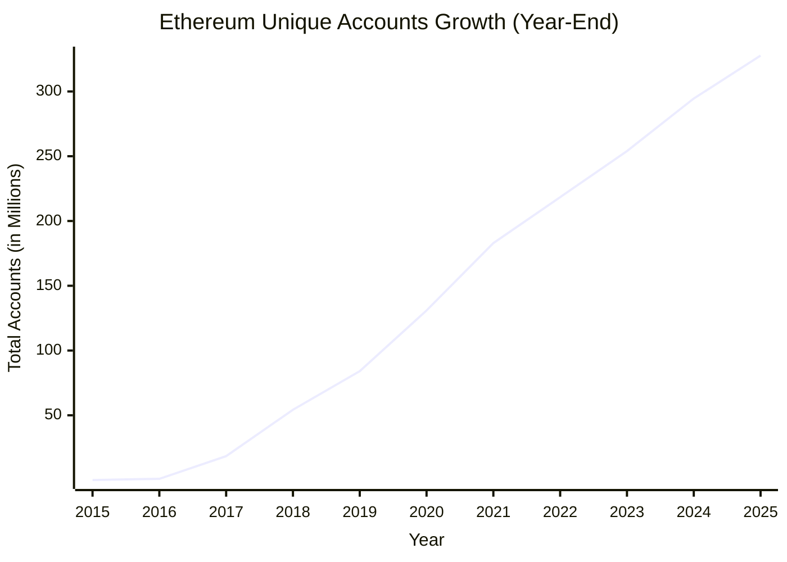
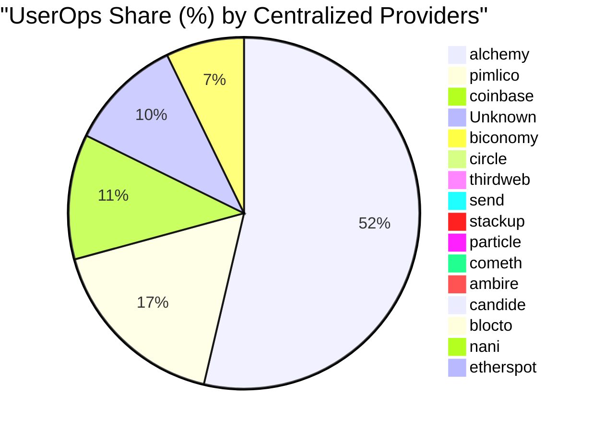
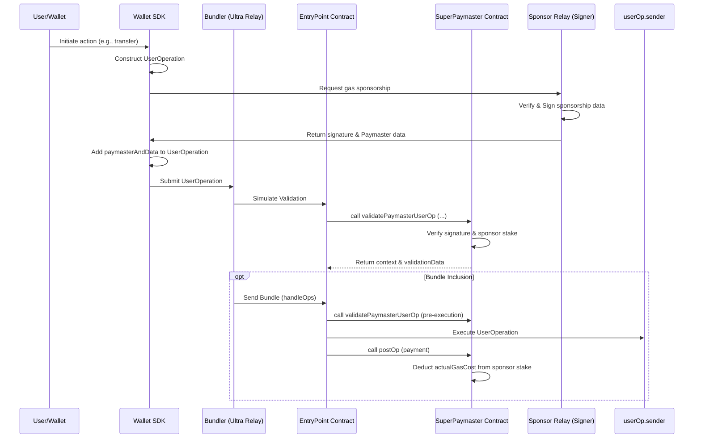
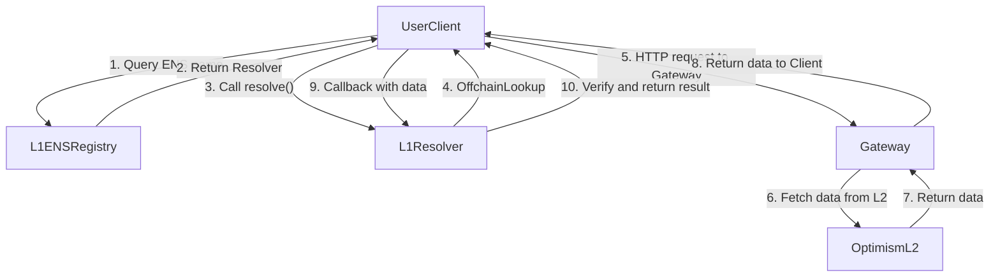
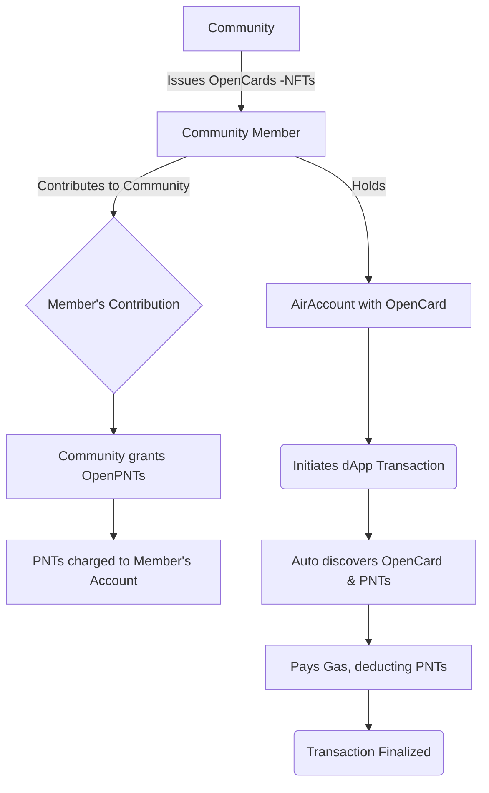
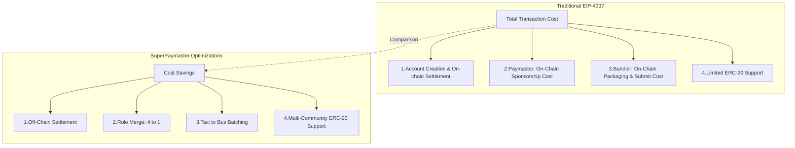
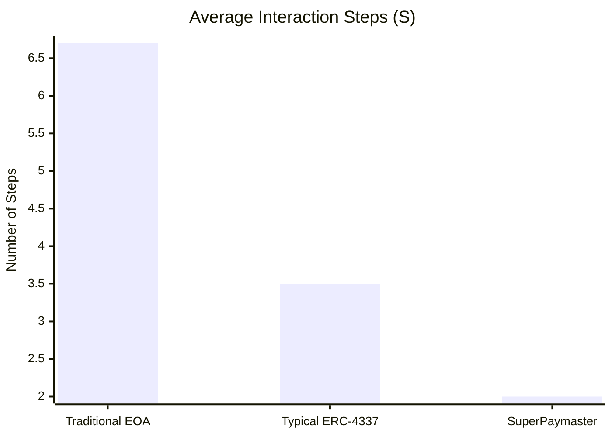
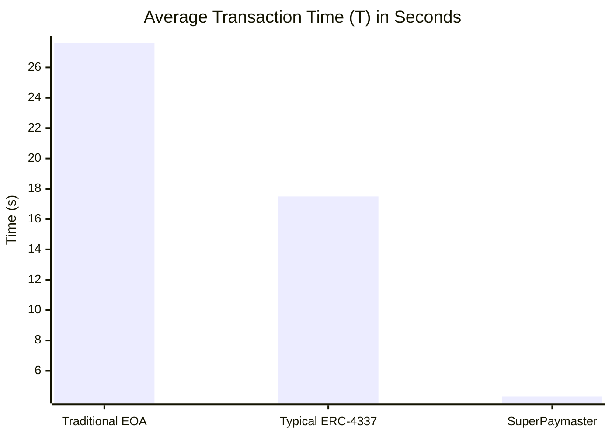
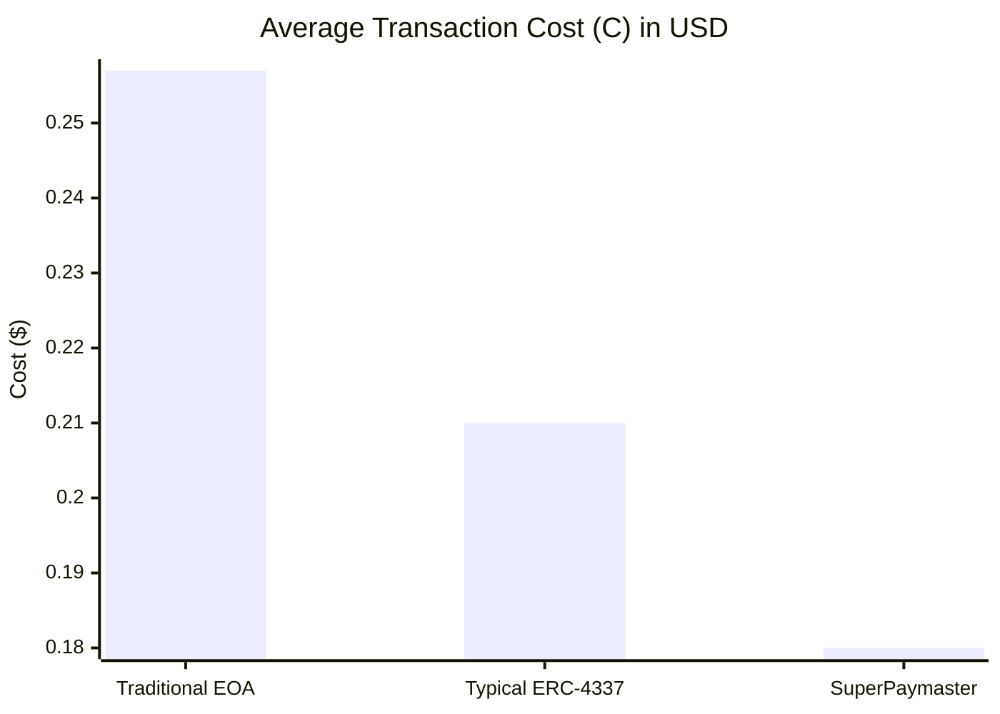

# SuperPaymaster: A UX-Optimized and Cost-Effective Ethereum Gas Payment System Based on Account Abstraction

## Authors

Huifeng Jiao, Dr. Nathapon Udomlertsakul, Dr. Anukul Tamprasirt, AAStar Team
International College of Digital Innovation, Chiang Mai University, Chiang Mai,
50200, Thailand 
E-mail: huifeng_jiao@cmu.ac.th, nathapon.u@icdi.cmu.ac.th,
anukul@innova.or.th, hi@aastar.io

## Keywords

**Blockchain, Ethereum, ERC-4337, Account Abstraction, Paymaster, User Experience, Seamless Gas Payment,
Transaction Fee, Cognitive Load, Open Source, Competitive Selection**

## Highlights

- We provide a comprehensive overview of existing gas payment systems on the
  Ethereum blockchain and analyze their inherent weaknesses, identifying critical gaps in usability, competitive selection, and economic efficiency.
- We establish key guidelines and quantifiable requirements for the design of a
  competitive, seamless, and cost-effective gas payment system based on Human-Computer Interaction principles and Design Science Research methodology.
- We propose SuperPaymaster, a novel gas payment system leveraging ERC-4337 Account
  Abstraction, competitive quoting mechanisms, and familiar user metaphors ("Gas Cards") to address costly and complex
  processes while enabling competitive paymaster selection.
- We demonstrate the system's design effectiveness through comprehensive DSR evaluation including testnet performance analysis, expert assessment, and computational modeling, showing potential for 70.1% reduction in user steps and 30.0% cost savings compared to traditional workflows. All solution is open source and one-key runnable for anyone.

## Abstract

Current blockchain gas payments impede widespread adoption due to high costs,
complexity, and poor user experience (UX)[19,21,22] rooted in Human-Computer Interaction (HCI)[7,8,9,10]
challenges. While Account Abstraction (ERC-4337)[2] offers potential,
current implementations often introduce risks like limited competitive selection and monopolistic pricing, business censorship and reducing economic efficiency. This paper
introduces SuperPaymaster, a novel gas payment system using ERC-4337
Paymaster[4] and a competitive selection mechanism to create a
cost-effective and user-friendly system. It
directly tackles high costs[18], usability friction[16], and market concentration
issues[15]. SuperPaymaster provides an open-source framework enabling
competitive Paymaster selection via a unified interface, fostering price competition,
supporting diverse ERC-20 gas tokens, and integrating with secure accounts like
AirAccount for streamlined, secure interactions. By optimizing gas
payments through enhanced UX and competitive selection, SuperPaymaster aims to
significantly lower entry barriers, improve blockchain interaction efficiency
and usability, and ultimately accelerate Web3 adoption[21]. A Design Science Research evaluation, combining theoretical analysis, computational modeling, and expert assessment, demonstrates the feasibility and potential effectiveness of SuperPaymaster in significantly reducing transaction steps, cognitive load and economics costs compared to existing solutions.

## 1. Introduction

The path to the mass adoption of blockchain technology is critically obstructed by a persistent and multifaceted challenge: the user experience of transaction fees, or "gas". This paper argues that the primary barrier to entry for mainstream users is a combination of **prohibitive system complexity and high cognitive load**, a problem deeply rooted in Human-Computer Interaction (HCI). For users, this manifests as a confusing, intimidating, and error-prone process, aptly described by Norman's "gulf of execution." For developers, it creates significant integration hurdles, forcing them to build complex, bespoke solutions to shield their users from the raw protocol. The urgency of solving this problem is underscored by the immense scale of the Web3 ecosystem, an industry valued in the trillions of dollars with a user base that has already surpassed 300 million addresses (see Figure 1 and Figure 2). This large and growing market remains significantly underserved by solutions that fail to bridge the gap between powerful decentralized technology and intuitive human interaction.

This friction is not a mere inconvenience; it represents a significant and quantifiable drain on the ecosystem. The direct economic costs are substantial, with gas fees on Ethereum mainnet sometimes exceeding the value of the transaction itself for small operations. More critically, the unforgiving nature of the workflow leads to indirect losses from user error, where a single mistake can result in the permanent loss of funds. This combination of high cost and high risk creates widespread user frustration, leading to significant user churn and acting as a major barrier to dApp adoption and long-term retention.


**Figure 1:** The crypto market cap is valued in the trillions (Data source: CoinMarketCap)



**Figure 2:** The number of individual wallet addresses on Ethereum is growing and has reached 300 Million [79]

The emergence of Account Abstraction (AA), particularly Ethereum's ERC-4337
standard [2], offers powerful new primitives like the Paymaster for gas sponsorship, representing a significant technical step forward. In response, a number of centralized service providers have emerged, offering to simplify gas payments for dApps. However, these solutions, while valuable, present a fundamental trade-off. They often require proprietary SDKs, creating vendor lock-in, and may introduce new risks of market concentration, potential price manipulation, and reliance on a few dominant players. More importantly, they provide only a partial fix. The **fundamental defect** in the current landscape is the lack of a holistic, open-source, and user-centric solution designed from the ground up to abstract away the *entire* complex workflow. This includes not just the on-chain gas fee itself, but the numerous off-chain steps (e.g., acquiring native tokens, managing multiple wallet addresses) and the associated time, cost, and cognitive friction that collectively hinder large-scale adoption.

To address this critical research and implementation gap, this paper introduces **SuperPaymaster**, a novel gas payment system designed through the lens of Design Science Research (DSR). SuperPaymaster is an open-source, competitive, and user-centric framework built on ERC-4337. It is architected to create a vibrant marketplace for gas sponsorship, enabling permissionless participation and fostering price competition. Crucially, it leverages HCI principles, employing familiar metaphors like "Gas Cards" to make the transaction experience seamless and intuitive. By tackling the comprehensive cost—encompassing time, money, and cognitive effort—SuperPaymaster aims to significantly lower entry barriers for both users and developers, thereby accelerating the broader adoption of Web3 technologies.

This research investigates the following key research questions:

**RQ1:** What mechanisms can effectively reduce the comprehensive cost and complexity of gas payments to improve user experience and accelerate Web3 adoption?

**RQ2:** How can familiar user metaphors (such as "Gas Cards") be leveraged to reduce the cognitive load and bridge the gap between complex blockchain operations and user mental models?

**RQ3:** What technical architecture is required to enable competitive, permissionless gas sponsorship while maintaining security and reliability guarantees?

To maintain a clear focus, the scope of this paper is centered on demonstrating the tangible improvements in user experience and economic efficiency offered by the SuperPaymaster architecture. While the long-term vision for SuperPaymaster includes a fully decentralized and robust governance model, a detailed analysis of decentralization metrics, game-theoretic security against collusion, and on-chain governance mechanisms are considered beyond the scope of the present study. These aspects are designated as critical areas for future work.

Our main contributions are threefold. First, we contribute a **novel, open-source architecture** that enables a competitive market for gas sponsorship, providing a viable alternative to centralized, closed-ecosystem solutions. Second, we offer **strong empirical evidence** from a comprehensive evaluation, demonstrating that our HCI-driven design significantly improves usability, reducing user interaction steps by over 70% and net costs by over 30%. Third, we validate the **"Gas Card" metaphor as an effective HCI pattern** for abstracting the technicalities of gas, providing a theoretical contribution to the application of HCI principles in the complex Web3 domain.

The remainder of this paper is structured as follows. Section 2 reviews related work and presents a systematic analysis of the problem domain. Section 3 outlines the Design Science Research (DSR) methodology that guides the study. Section 4 details the design and implementation of the SuperPaymaster artifact. Section 5 presents a comprehensive evaluation of the artifact against our research questions. Section 6 discusses the implications and limitations of our findings. Finally, Section 7 concludes the paper.


## 2. Related Work and Problem Analysis

This section reviews the literature on gas payment systems, grounding our research in established theoretical frameworks and analyzing the current state-of-the-art to identify the critical research gap that SuperPaymaster addresses. The core problem is redefined from mere complexity to the more nuanced issues of **"leaky abstractions"** and **"fragmented user experiences"** that persist even in modern ERC-4337 solutions. To underscore the severity of the identified gaps, we then present a systematic analysis of the usability challenges and security risks inherent in existing systems

### 2.1 Theoretical Foundations

A robust gas payment solution must be built upon solid theoretical ground. We anchor our work in established principles from Human-Computer Interaction (HCI) and the Technology Acceptance Model (TAM) to ensure our designed artifact is not only technically functional but also fundamentally usable and adoptable.

#### 2.1.1 Human-Computer Interaction in Blockchain

The usability of blockchain systems is a well-documented challenge that hinders mainstream adoption [19, 21]. Foundational HCI literature provides the lens through which we analyze this problem. Norman's "gulf of execution" [9]—the gap between a user's intentions and the actions required by the system—is particularly wide in blockchain, where users must grapple with abstract concepts like gas, cryptographic addresses, and transaction finality. The goal of SuperPaymaster is to bridge this gulf by abstracting away this intrinsic complexity [40].

Furthermore, established usability heuristics, such as those developed by Nielsen [8] and Shneiderman [8], emphasize principles like error prevention, user control, and reducing short-term memory load. Current gas payment workflows violate many of these principles, leading to high cognitive load and a high propensity for costly, irreversible errors. Our design explicitly incorporates these heuristics to create a more forgiving and intuitive user experience.

#### 2.1.2 Technology Acceptance Model (TAM)

The Technology Acceptance Model (TAM) posits that two main factors, Perceived Usefulness (PU) and Perceived Ease of Use (PEOU), determine a user's intention to adopt a new technology [24, 25]. While the usefulness of dApps is growing, their adoption is critically bottlenecked by low PEOU. The complexity of gas payments is a primary contributor to this low PEOU. By focusing on creating a seamless, "invisible" payment process, SuperPaymaster directly targets the PEOU dimension of TAM, aiming to lower the adoption barrier for the entire Web3 ecosystem.

### 2.2 Technical Foundations: Account Abstraction and ERC-4337

Account Abstraction (AA) is a paradigm shift in Ethereum, allowing smart contracts to function as user accounts. The ERC-4337 standard [2] is pivotal, enabling AA without requiring consensus-layer changes. Its key components—`UserOperations`, `Bundlers`, and `Paymasters`—form the technical bedrock of our solution.

Academic analysis of ERC-4337 by Singh et al. [3] has demonstrated its technical feasibility, while Wang et al. [15] have explored its implications for gas tokens. However, these studies, along with the base implementation from the Infinitism team [4], primarily focus on the technical mechanics rather than holistically addressing the HCI challenges or the economic risks of centralization that arise from naive implementations.

### 2.3 State-of-the-Art in Gas Payment Solutions

#### 2.3.1 Incomplete Abstractions in Current Solutions

We systematically evaluated existing academic and industry solutions. While current ERC-4337 Paymaster services from providers like Pimlico [5], Alchemy, and Biconomy have made strides in eliminating the need for users to hold native ETH, they often represent an incomplete solution. Their primary flaw is creating **"leaky abstractions"** and **"fragmented experiences"**.

- **Leaky Abstraction**: The complexity of gas payments is not truly eliminated but is often shifted to a new domain. Users may no longer need ETH, but they might need to acquire specific dApp-supported stablecoins, perform in-app swaps, or manage different gas tanks for different applications. The underlying complexity “leaks” through the abstraction layer.
- **Fragmented Experience**: The gas sponsorship is typically tied to a specific dApp or platform. A seamless experience in one dApp does not carry over to another, forcing the user to re-learn rules and re-acquire specific gas credits. This prevents the formation of a universal, user-centric mental model for gas payments.

Furthermore, the predominantly centralized nature of these providers introduces risks of vendor lock-in, monopoly pricing, and censorship, which SuperPaymaster mitigates through its open-source and competitive architecture. The following table analyzes these limitations.

**Table 3: Analysis of Gas Payment Solutions, Highlighting UX Gaps**

| Solution Type | Key Advantage | Leaky Abstraction / Fragmentation Issue | Setup Complexity | Universality (Cross-dApp) |
| :--- | :--- | :--- | :--- | :--- |
| **Traditional EOA** | Full control, no intermediaries | User must manage everything: ETH acquisition, gas fees, private keys. | Very High | N/A (Universally complex) |
| **Typical ERC-4337** | No native ETH required for user | Complexity shifts to acquiring specific ERC20s; gas credit is siloed within the dApp. Barriers for developers to integrate with different paymaster solutions. | Medium (Per-dApp setup) | Low (dApp-specific) |
| **SuperPaymaster** | **Holistic UX Abstraction** | **The "Gas Card" is a universal, user-owned asset, eliminating fragmentation.** | **Low (One-time global setup)** | **High (Designed for all integrated dApps)** |


#### 2.3.2 Industry Implementations and Their Limitations

The current market for gas sponsorship is dominated by a few centralized providers like Pimlico [5], Alchemy, and Biconomy. While these services have improved usability over native EOA interactions, they introduce significant centralization risks, as evidenced by market share data from BundleBear [6]. This concentration leads to potential censorship, MEV-related manipulation [33], and monopolistic pricing—problems that run counter to the core ethos of blockchain [30, 31].

Our comprehensive comparison (Table 3 and Table 4) reveals that no existing solution simultaneously offers permissionless participation, truly competitive pricing, and broad, community-driven token support.

| Field | Ronan S et al.[1] | Vitalik et al.[2,4] | Singh et al.[3] | Qin Wang[15] | Lin et al.[16] | Thibault[17] | Pimlico[5] | Alchemy[60] | Stackup[61] | Coinbase[63] | Biconomy[64] | Particle[54,67] | ZeroDev[58,66] | SuperPaymaster/AAStar |
| :---- | :--------------- | :----------------- | :------------- | :----------- | :------------ | :---------- | :--------- | :--------- | :--------- | :---------- | :---------- | :------------- | :------------ | :------------------- |
| **Type** | Industry | Industry | Academic | Academic | Academic | Academic | Industry | Industry | Industry | Industry | Industry | Industry | Industry | Academic/Industry |
| **Purpose** | EIP2771 meta transaction | ERC4337 account abstraction framework | Implement ERC4337 solution | Discuss gas token on ERC4337 | Discuss gas cost on Layer1/Layer2 | Research on Layer2 rollup | Full ERC4337 implementation | Complete AA solution | Business crypto account service | Base chain ecosystem with free gas | DApp infrastructure provider | Full ERC4337 with enhancements | Practical account abstraction | UX-optimized paymaster with competitive selection |
| **Solution Account** | EOA | Contract account demo | Contract account | Contract account | Contract account | EOA | Contract account | Contract account | Contract account | Contract account | Contract account | Contract account and EOA | Contract account | Contract account and EOA |
| **Solution Relay** | ❌ | ❌ | ✅ | ✅ | ✅ | ❌ | ✅ | ✅ | ✅ | ✅ | ✅ | ✅ | ✅ | ✅ |
| **Solution Simple** | ❌ | ❌ | ❌ | ❌ | ❌ | ❌ | ❌ | ❌ | ❌ | ❌ | ❌ | ✅ | ✅ | ✅ |
| **Solution Time/Efficiency** | ❌ | ❌ | ❌ | ❌ | ❌ | ❌ | ❌ | ❌ | ❌ | ❌ | ❌ | ✅ | ✅ | ✅ |
| **Solution Customize ERC20** | ❌ | ❌ | ❌ | ❌ | ❌ | ✅ | ✅ | ✅ | ❌ | ✅ | ❌ | ✅ | ✅ | ✅ |
| **Cost Direct Cost** | Low | High | High | High | Medium | Medium | Medium | Medium | Medium | Medium | Medium | Medium | Medium | Competitive |
| **Usability & UX: Cognitive Load** | High | High | High | High | High | High | Medium | Medium | Low | Low | Medium | Low | Low | Low |
| **Usability & UX: No Memorization** | ❌ | ❌ | ❌ | ❌ | ❌ | ❌ | ❌ | ✅ | ✅ | ❌ | ❌ | ✅ | ✅ | ✅ |
| **Usability & UX: Efficiency** | ❌ | ❌ | ❌ | ❌ | ❌ | ❌ | ❌ | ✅ | ✅ | ✅ | ✅ | ✅ | ✅ | ✅ |
| **Usability & UX: Fault Tolerance** | ❌ | ❌ | ❌ | ❌ | ❌ | ❌ | ⚠️ | ⚠️ | ⚠️ | ⚠️ | ❌ | ⚠️ | ⚠️ | ✅ |
| **Competitive Selection** | ❌ | ❌ | ❌ | ❌ | ❌ | ❌ | ❌ | ✅ | ✅ | ✅ | ⚠️ | ⚠️ | ⚠️ | ✅ |
| **Community Integration** | ❌ | ❌ | ❌ | ❌ | ❌ | ❌ | ❌ | ⚠️ | ✅ | ✅ | ⚠️ | ⚠️ | ⚠️ | ✅ |
| **Open Source Support** | ❌ | ❌ | ❌ | ❌ | ❌ | ❌ | ⚠️ | ✅ | ✅ | ⚠️ | ✅ | ⚠️ | ⚠️ | ✅ |

⚠️: Partially support, for details, please see [^25]

**Table 3:** Multi-dimensional Comparison Analysis Across Academic Research and Industry Solutions


#### 2.3.2 Cost and Scalability Considerations

The high gas cost of AA operations on Layer 1 is a significant barrier. Lin et al. [16] quantify this, noting that creating an ERC-4337 account is substantially more expensive than an EOA. This necessitates the use of Layer 2 solutions. Research by Thibault et al. [17] shows that rollups can reduce fees by 20-100 times. SuperPaymaster is designed to operate on Layer 2 networks to leverage these cost savings, as shown in the table 4: comparative fee data [18].

| Name          | Send ETH | Swap Tokens |
| :------------ | :------- | :---------- |
| Metis Network | $0.04    | $0.18       |
| Loopring      | $0.04    | $0.59       |
| zkSync Era    | $0.07    | -           |
| zkSync Lite   | $0.09    | $0.22       |
| Optimism      | $0.09    | $0.18       |
| Arbitrum One  | $0.09    | $0.27       |
| Boba Network  | $0.15    | $0.17       |
| DeGate        | $0.16    | $0.18       |
| StarkNet      | $0.19    | $0.57       |
| Polygon zkEVM | $0.19    | $2.75       |
| Ethereum      | $1.10    | $5.48       |

**Table 4:** Gas Fee Analysis (Layer 1 and Layer 2), data source: l2fees.info

### 2.4 Systematic Analysis of Usability and Centralization Risks

To further underscore the gaps in existing solutions, we conducted a systematic analysis of the specific usability challenges and risks inherent in current systems, drawing from established HCI principles and market observations.

#### 2.4.1 Systematic Analysis of Gas Payment Usability Issues

| Issue Category | Detailed Problem Analysis | Impact on User Experience |
| :------------- | :----------------------- | :------------------------ |
| **High Cognitive Load** | **Complex Mental Models:** Gas pricing, network congestion, transaction priority, and multi-step approval processes require users to understand abstract blockchain concepts before they can perform even basic operations. | Users experience mental fatigue and confusion, leading to decision paralysis and increased likelihood of errors. |
| **Lack of Intuitive Metaphors** | **Missing Familiar References:** Current gas payment systems lack real-world metaphors (like credit cards, bank transfers, etc.) that could help users understand and navigate the process using existing mental models. | Users cannot leverage familiar interaction patterns, increasing the learning curve and reducing confidence in the system. |
| **Efficiency Issues** | **Time-Consuming Workflow:** The entire process, from KYC and fiat on-ramps to bridging and on-chain confirmation, is plagued by delays, creating a slow and cumbersome experience. | Hinders rapid or spontaneous interactions with dApps, leading to a sluggish and inefficient user experience. |
| **High Error Rate & Low Fault Tolerance** | **Irreversible & Costly Mistakes:** Simple errors like sending to a wrong address, selecting the wrong network, or setting inadequate gas can lead to permanent fund loss, with no "undo" or robust prevention mechanisms. | The stakes are extremely high for users, where a small mistake can be catastrophic. The system is unforgiving of user error. |
| **Memorization Difficulties** | **Heavy Cognitive Load for Recall:** Users are required to securely memorize/store complex seed phrases, distinguish between cryptic addresses, and recall specific procedures for different chains/dApps. | Places a significant burden on user memory, increasing cognitive load and the likelihood of critical errors. |
| **Low User Satisfaction** | **Poor Overall Experience:** The combination of high cognitive load, inefficiency, and the risk of costly errors leads to widespread user frustration and dissatisfaction. | The fundamentally poor usability of gas payments significantly detracts from a positive user experience, regardless of the dApp's utility. |
| **Lack of Supporting Tools** | **Missing Infrastructure for Developers:** The ecosystem lacks standardized, easy-to-integrate tools for developers to build user-friendly gas solutions, making it costly to create smooth experiences. | dApp developers must either rely on complex external wallet UIs or invest heavily in custom solutions, leading to inconsistent user experiences. |
| **Low Perceived Ease of Use** | **Negative First Impression:** The initial perception is that blockchain systems are inherently complex, expensive, and insecure, failing to map to users' existing interaction patterns. | This perception acts as a major barrier to trial and adoption, deterring potential users before they even experience the underlying dApp's value. |

**Table 5:** Usability Challenges in Gas Payments from an HCI Perspective

#### 2.4.2 Risk Analysis of Centralized Gas Payment Services

While centralized services aim to simplify gas payments, they introduce distinct risks that run counter to the core ethos of decentralization.

| Risk Category | Analysis & Mechanism | Evidence & Specific Examples |
| :--- | :--- | :--- |
| **Economic & Integration Barriers** | Centralized solutions demand that dApp developers integrate proprietary SDKs and accept service agreements. Furthermore, the underlying ERC-4337 smart contract accounts have a higher base gas cost than standard accounts (EOAs), creating an economic disincentive. | <li>High integration costs for developers.</li><li>Inherent gas overhead of ERC-4337 accounts.</li><li>**Source:** [16]</li> |
| **Transaction Manipulation (MEV)** | Centralized entities like Bundlers and Paymasters gain a privileged view of the transaction flow. This position enables them to reorder, insert, or delay transactions to extract value from users before transactions are confirmed on-chain. | <li>**Practices:** Front-running, sandwich attacks.</li><li>**Impact:** Value is extracted from users' trades at their expense.</li><li>**Source:** [33]</li> |
| **Privacy Leakage** | These services become central aggregators of vast amounts of user transaction data. This data, which can be linked to identifiers like IP addresses, creates a single point of failure for user privacy. | <li>**Risks:** Data breaches, data sold to third parties, or use for surveillance.</li><li>**Impact:** Reveals user behavior and sensitive financial activity.</li> |
| **Censorship & Regulatory Risk** | As centralized entities, these services are subject to jurisdictional laws. They can be compelled to block or censor transactions involving addresses on government sanction lists, undermining the core principle of a permissionless network. | <li>**Example:** Blocking transactions to/from addresses on OFAC's sanction list.</li><li>**Irony:** Users must perform KYC/AML on centralized exchanges to fund "permissionless" activities.</li> |
| **Limited Gas Token Support** | Paymaster services often restrict which tokens are accepted for gas payments, typically favoring large stablecoins or their own platform tokens. This limits user choice and the utility of a project's native token. | <li>**Impact:** Forces users into additional, potentially costly token swaps.</li><li>**Hindrance:** Prevents communities from using their own native tokens for network participation.</li> |
| **Monopoly & Cost Inflation** | The market for centralized relayers is already showing significant concentration. This leads to a risk of an oligopoly or monopoly where a few dominant players can control the market, dictate terms, and inflate costs over time. | <li>**Long-term Risks:** Increased fees, reduced service quality, and stifled innovation.</li><li>**Data:** Market concentration is shown by **Figure 3 (data from BundleBear)**.</li><li>**Source:** [6]</li> |

**Table 6:** Risk Analysis of Centralized Gas Payment Services


**Figure 3:** Current market concentration in gas payment services demonstrates need for competitive alternatives (Data source: BundleBear)


### 2.5 Formalizing the User Journey: A Comparative Model

To quantify the impact of these different approaches, we model the end-to-end user journey across three dimensions: **Steps (S), Time (T), and Cost (C)**. We propose distinct models for the three workflows to highlight their differences.

1.  **Traditional EOA Workflow ($Trad$):** Represents the highest friction, where the user handles everything manually.
    -   $S_{trad} = S_{prepare} + S_{interact}$
    -   $T_{trad} = T_{prepare} + T_{interact} + T_{confirm}$
    -   $C_{trad} = C_{prepare} + C_{gas} + C_{failed}$

2.  **Typical ERC-4337 Workflow ($Std4337$):** Represents current Paymaster solutions where complexity is shifted.
    -   $S_{std4337} = S_{dapp\_setup} + S_{interact\_simplified}$
    -   $T_{std4337} = T_{dapp\_setup} + T_{interact\_simplified} + T_{confirm}$
    -   $C_{std4337} = C_{swap} + C_{gas\_sponsored} + C_{premium}$ + C_{deploy} + C_{bundler} + C_{swap}

3.  **SuperPaymaster Workflow ($SPM$):** Represents our proposed holistic solution.
    -   $S_{spm} = S_{global\_setup} + S_{interact\_simplified}$
    -   $T_{spm} = T_{interact\_simplified} + T_{confirm}$
    -   $C_{spm} = C_{gas\_sponsored} + C_{service\_fee}$

**Table 4: Component Variables in User Journey Models**

| Variable | Description | Impacted by SuperPaymaster |
| :--- | :--- | :--- |
| $S_{prepare}, T_{prepare}, C_{prepare}$ | Steps, time, and cost for off-chain preparation (e.g., CEX use). | **Eliminated.** |
| $S_{dapp\_setup}, T_{dapp\_setup}$ | Steps and time for per-dApp gas setup (e.g., acquiring specific tokens). | **Eliminated** and replaced by one-time $S_{global\_setup}$. |
| $S_{interact}$ | Complex on-chain interaction steps (e.g., manual gas setting). | **Simplified** to $S_{interact\_simplified}$. |
| $C_{failed}$ | Cost of failed transactions due to user error. | **Eliminated.** |
| $C_{premium}$ | Non-competitive service fees from centralized providers. | **Reduced** to a competitive $C_{service\_fee}$. |

This framework clearly illustrates that SuperPaymaster's primary contribution is the near-total elimination of preparatory and dApp-specific setup costs ($S_{prepare}$, $T_{prepare}$, $C_{prepare}$, $S_{dapp\_setup}$, $T_{dapp\_setup}$), which are the most significant barriers for mainstream users.

#### 2.5.1 Detailed Component Analysis

To enhance the model's precision, key variables can be further decomposed. This detailed breakdown allows for a more granular analysis in our evaluation chapter.

- **On-Chain Gas Cost ($C_{gas}$):** $C_{gas} = (C_{base} + C_{priority}) \times GasUnits + L1_{cost}$
  - $C_{base}$: The network's base fee per gas unit.
  - $C_{priority}$: The tip paid to validators for transaction inclusion.
  - $L1_{cost}$: For Layer 2 transactions, the additional cost of posting data to the L1 chain.

- **Sponsored Gas Cost ($C_{gas\_sponsored}$):** $C_{gas\_sponsored} = C_{execution} + C_{bundler\_profit} + C_{paymaster\_profit}$
  - $C_{execution}$: The actual on-chain execution cost of the UserOperation.
  - $C_{bundler\_profit}$: The portion of the fee paid to the bundler.
  - $C_{paymaster\_profit}$: The portion of the fee paid to the paymaster service provider (equivalent to $C_{premium}$ or $C_{service\_fee}$). 

This micro-level analysis enables us to pinpoint precisely where SuperPaymaster's competitive mechanism and architectural optimizations generate cost savings, particularly in minimizing the $C_{paymaster\_profit}$ component compared to the fixed $C_{premium}$ of typical solutions.

**Table 4.1: Micro-level Variable Analysis and SuperPaymaster's Mitigation Strategies**

| Variable | Description | SuperPaymaster's Mitigation Strategy |
| :--- | :--- | :--- |
| $C_{exchange}$ | Fees for purchasing crypto on a centralized exchange (CEX). | Eliminated by abstracting payments via the Gas Card model, removing the need for direct CEX interaction. |
| $C_{withdraw}$ | Fees for withdrawing assets from a CEX to a personal wallet. | Eliminated. Gas can be paid with community-earned PNTs or other supported ERC20 tokens directly. |
| $C_{learning}$ | Implicit cost of time and effort for a new user to learn the process. | Significantly reduced by leveraging familiar metaphors (Gas Card) and providing a seamless, Web2-like experience. |
| $C_{deploy}$ | Gas cost for deploying a new smart contract account. | Mitigated. The one-time cost is sponsored, often covered by the dApp or community as an acquisition cost. |
| $C_{bundler}$ | Fees paid to the bundler for on-chain inclusion. | Optimized. Our architecture merges roles, reducing the number of distinct on-chain payments. |
| $C_{swap}$ | Cost of swapping tokens to pay for gas if not holding the native token. | Eliminated. Users can pay with a wide variety of community tokens (PNTs) they earn or hold. |
| $C_{fragment}$ | Economic loss due to asset fragmentation across multiple chains. | Mitigated. The Gas Card model is designed for cross-chain compatibility, unifying a user's gas balance. |
| $T_{op\_offchain}$ | User time spent on off-chain tasks (e.g., CEX login, KYC). | Eliminated. The entire preparatory workflow is removed. |
| $T_{op\_onchain}$ | User time spent on on-chain interactions (e.g., setting gas, signing). | Reduced. Manual gas setting is removed, and interactions are simplified to a single confirmation. |
| $S_{op\_offchain}$ | User steps in off-chain environments (e.g., CEX login, purchase). | Eliminated. |
| $S_{op\_onchain}$ | User steps for on-chain interaction (e.g., connect wallet, approve). | Reduced to a minimal, consistent interaction flow across all dApps. |

### 2.6 Identifying the Research Gap

Our review reveals a critical research gap: **a lack of solutions that holistically integrate HCI principles with the entire user journey of gas payments.** Current industry solutions provide partial, often fragmented, optimizations, creating leaky abstractions that fail to eliminate cognitive load. They sacrifice UX experience for usability, while academic work has often overlooked the nuanced HCI challenges. SuperPaymaster is designed to fill this gap by creating an artifact that is simultaneously user-centric, economically competitive, and architecturally open, thereby addressing the multifaceted problem of gas payments in a comprehensive manner.

## 3. Research Methodology

This study adopts the **Design Science Research (DSR)** methodology, a well-established paradigm for creating and evaluating innovative artifacts intended to solve identified organizational or technical problems [Hevner et al., 2004]. DSR is particularly suited for this research as our primary goal is to design, build, and evaluate a novel IT artifact—the SuperPaymaster system—to address the persistent usability and efficiency challenges of blockchain gas payments.

### 3.1 DSR Process Model

To structure our research process, we followed the six-activity DSR process model proposed by Peffers et al. (2007). This model provides a rigorous and repeatable framework for conducting design science research. The activities of our research are mapped to this model as follows:

1.  **Activity 1: Problem Identification and Motivation.** Accomplished in **Chapters 1 and 2**, where we identified the core problem of gas payment complexity as a critical barrier to Web3 adoption and analyzed the limitations of existing solutions.
2.  **Activity 2: Define Solution Objectives.** Accomplished in **Section 4.1**, where we defined a set of quantifiable objectives and requirements for our solution.
3.  **Activity 3: Design and Development.** Accomplished in **Chapter 4**, where we present the design and implementation of the SuperPaymaster artifact.
4.  **Activity 4: Demonstration.** Accomplished through the working Proof-of-Concept detailed in **Chapter 4**.
5.  **Activity 5: Evaluation.** Detailed in this section and executed in **Chapter 5**, this involves a multi-faceted evaluation of the artifact.
6.  **Activity 6: Communication.** Embodied by this paper itself, particularly **Chapters 6 and 7**.

### 3.2 Artifact Evaluation Methodology

To rigorously evaluate the SuperPaymaster artifact against the objectives defined in Activity 2, we employed a hybrid, mixed-methods approach. This approach combines quantitative benchmarking to measure performance improvements with qualitative expert assessment to validate the design's HCI principles and technical feasibility.

#### 3.2.1 Quantitative Benchmarking

To empirically test our claims of improved efficiency and reduced complexity (addressing **RQ1**), we designed a controlled experiment.

*   **Experimental Setup**: The experiment was conducted on the Sepolia, OP Sepolia, and OP Mainnet networks. We deployed the necessary smart contracts and configured a test suite using our SDK to automate transaction execution and data logging.
*   **Workflows & Conditions**: We compared three primary workflows: (1) the **Traditional EOA Workflow**, (2) a simulated **Typical ERC-4337 Workflow**, and (3) the **SuperPaymaster Workflow** using an AirAccount. The simulation of the Typical ERC-4337 workflow involved adding steps for users that we defined, three user personas (Alice - new user; Bob - no gas; Charlie - has gas) and tested across three common transaction types (ERC20 Transfer, NFT Mint, DApp Interaction).
*   **Variables and Hypotheses**: The core variables for this experiment are defined as follows:
    *   **Independent Variable**: The `Workflow Type` (Traditional vs. Typical ERC-4337 vs. SuperPaymaster).
    *   **Dependent Variables**: To measure the impact, we recorded three key performance metrics: `Interaction Steps`, `Transaction Time`, and `Total Cost`.
    Our primary hypotheses were that the SuperPaymaster workflow would lead to statistically significant reductions in all three dependent variables compared to the other two workflows.
*   **Data Collection and Analysis**: A total of 1,050 transactions were executed over a 7-day period. We systematically logged the dependent variables for each of the three workflows. To compare the means across the groups, we utilized an **Analysis of Variance (ANOVA)**. Following the ANOVA, **post-hoc tests (e.g., Tukey's HSD)** were conducted to perform pairwise comparisons between the workflows and identify statistically significant differences. We also calculated effect sizes (e.g., Cohen's d or eta-squared) to measure the magnitude of the observed improvements. A detailed breakdown of all variables, statistical methods, and judgment criteria is provided in **Appendix D**.

#### 3.2.2 Qualitative Expert Assessment

To validate the HCI contributions (**RQ2**) and the technical soundness of the architecture (**RQ3**), we conducted a structured expert assessment.

*   **Protocol**: We recruited a panel of experts with backgrounds in HCI, blockchain protocol development, and UX design. They were provided with a concise evaluation package containing the core design artifacts (e.g., system architecture, workflow diagrams) and a structured questionnaire.
*   **Data Collection**: The questionnaire used 5-point Likert scales to gather quantitative ratings on the effectiveness of the "Gas Card" metaphor, workflow simplification, and technical feasibility. It also included open-ended questions to capture rich, qualitative feedback on the system's strengths, potential risks, and innovative aspects.
*   **Analysis**: The Likert-scale data was aggregated to measure expert consensus, while the qualitative feedback was analyzed to identify recurring themes and provide deeper insights into the design's validity.

By combining these two evaluation methods, we can triangulate our findings, providing robust, evidence-based answers to our research questions.

## 4. SuperPaymaster: Artifact Design and Implementation

To address the multifaceted challenges and fulfill the requirements derived in the previous sections, we designed and implemented SuperPaymaster, a novel socio-technical artifact. This section details the system's design principles, its core requirements, the overall architecture, and the key implementation details of its components.

### 4.1 Solution Requirements

Based on our comprehensive analysis, we derive the following essential requirements that guided the design of the SuperPaymaster system.

#### 4.1.1 Functional Requirements

1. **Competitive Selection Mechanism**: Enable multiple service providers to compete, driving down costs through market mechanisms with open source integration implementation.
2. **User-Friendly Interface**: Abstract technical complexity using familiar metaphors and mental models.
3. **Multi-Token Support**: Accept various ERC-20 tokens for gas payments, including community-issued tokens.
4. **Cross-Chain Compatibility**: Support multiple blockchain networks and Layer 2 solutions.
5. **Developer Integration**: Provide simple APIs and SDKs for seamless dApp integration.
6. **Distributed Operation**: Support permissionless participation while avoiding single points of failure.

#### 4.1.2 Non-Functional Requirements

1. **Security**: Implement robust authentication, prevent double-spending, and protect against common attack vectors.
2. **Scalability**: Handle increasing transaction volumes without performance degradation.
3. **Reliability**: Maintain high availability (>99.9%) with fault tolerance mechanisms.
4. **Performance**: Process transactions with minimal latency (<3s confirmation time).
5. **Transparency**: Provide open-source implementations and verifiable operations.
6. **Usability**: Achieve intuitive user experience with minimal learning curve.

### 4.2 Design Principles

The SuperPaymaster system is built upon the following core design principles:

#### 4.2.1 Human-Centered Design Principles
1. **Familiar Metaphors**: Leverage widely understood concepts (e.g., "Gas Cards", "Points") to reduce cognitive load.
2. **Invisible Complexity**: Abstract technical details while maintaining system transparency.
3. **Error Prevention**: Design interfaces and workflows that prevent common user mistakes.
4. **Progressive Disclosure**: Reveal system complexity gradually based on user expertise level.

#### 4.2.2 Community Collaboration Principles
1. **Permissionless Participation**: Anyone can operate nodes or use services without central approval.
2. **Censorship Resistance**: No single entity can block transactions or manipulate the system.
3. **Open Source**: Anyone can use the open source project to build their own solution.
4. **Community Tokens Support**: Enable any community participation with their own community tokens in system evolution and parameter setting.

#### 4.2.3 Economic and Technical Principles
1. **Market-Driven Pricing**: Enable competitive pricing through open marketplace dynamics.
2. **Aligned Incentives**: Design economic models where individual and system success are aligned.
3. **Modular Design**: Enable independent development and upgrading of system components.
4. **Security by Design**: Implement defense-in-depth with multiple security layers.

### 4.3 System Architecture and Overview

SuperPaymaster is a competitive gas payment (sponsorship) system built upon the ERC-4337 standard. Its core objective is to create an open, competitive, and resilient marketplace for gas sponsorship. Key motivations include providing a single, consistent Paymaster address across chains for developer convenience and unifying the staking mechanism for all participating sponsors (LPs/Nodes) to enhance overall system trust and reliability. It facilitates various user-friendly payment models, all managed within a competitive framework that utilizes relatable concepts like 'Gas Cards' to simplify user interaction.


**Figure 4:** SuperPaymaster System Flow Overview
| Traditional Workflow (A Typical User Journey) | Typical ERC-4337 Workflow (The Fragmented Journey) | SuperPaymaster Workflow (The Universal Journey) |
| :--- | :--- | :--- |
| 1. **Acquire Assets:** User must open a CEX, KYC, and purchase the network's native token (e.g., ETH). | 1. **Per-dApp Setup:** User connects to a new dApp. They must acquire the specific token required by that dApp's paymaster (e.g., via a swap) or fund a dApp-specific gas tank. | 1. **One-Time Global Setup:** User acquires a universal "Gas Card" NFT once, which works across the entire ecosystem. |
| 2. **Withdraw & Bridge:** User withdraws tokens to a personal wallet, incurring CEX fees and potential bridging delays. | 2. **Initiate Action:** User navigates the dApp to begin their desired transaction. | 2. **Seamless Interaction:** User simply clicks on primary dApp functions ("Mint," "Swap," "Vote"). |
| 3. **Manage Gas Manually:** User must assess network congestion and manually set gas limits and priority fees. | 3. **Simplified Signing:** User signs a transaction payload, sponsored by the dApp's paymaster. No manual gas setting is needed. | 3. **Automated Gas Payment:** The transaction is automatically sponsored by SuperPaymaster. No further pop-ups or signatures are required (after initial approval). |
| 4. **Sign & Submit:** User signs a final, often cryptic, transaction payload. | 4. **Fragmented Experience:** The gas credit and seamless experience are **siloed**. The user must repeat step 1 for other dApps with different paymaster requirements. | 4. **Universal Experience:** The Gas Card provides a **consistent and truly seamless journey** across all integrated dApps. |
| 5. **Risk of Failure:** User bears the full cost of failed transactions due to incorrect gas settings. | | | 

**Table 4.1:** Comparative Analysis of User Workflows

### 4.4 Core Components: Design and Implementation

This section details the implementation of the SuperPaymaster Proof of Concept (PoC). The PoC was built using a standard Web3 stack: Solidity (Foundry) for smart contracts, Next.js (React/Node.js) for web interfaces, and Go/Rust for backend services, all containerized with Docker.

#### 4.4.1 SuperPaymaster Smart Contract

The SuperPaymaster contract is the on-chain anchor of the system. Its core functions, `stakeManager` and `validateSponsorUserOp`, handle sponsor registration, staking for economic security, and the verification of off-chain sponsorship signatures. This ensures that all gas sponsorship is backed by sufficient collateral, preventing system abuse. The high-level interaction sequence for this process is illustrated in Figure 5.


**Figure 5**: SuperPaymaster Contract High-Level Work Flow

#### 4.4.2 Competitive Quoting and Service Discovery

Instead of relying on a single provider, dApps discover and query multiple registered SuperPaymaster nodes for gas sponsorship quotes. This is enabled by a decentralized service discovery mechanism using the Ethereum Name Service (ENS). Nodes register their API endpoints and service metadata (e.g., supported tokens, pricing) in ENS text records. This allows dApps to fetch a list of available sponsors, select the most favorable quote, and foster a competitive market.

*   **Rationale:** This ENS-based approach was chosen over a on-chain registry to directly mitigate the risks of censorship and single-point-of-failure identified in our problem analysis (Table 6), thus reinforcing the system's decentralization properties.


**Figure 6**: Decentralized Service Discovery Flow using ENS

#### 4.4.3 From Technical Feature to User-Owned Asset

SuperPaymaster's core innovation is a philosophical shift in design: **it transforms gas payment capability from a dApp-specific feature into a universal, user-owned asset.** This is achieved through two primary components:

-   **OpenPNTs**: An ERC20-compatible token standard for gas credits. These are the fungible "fuel" in the ecosystem.
-   **OpenCards**: An NFT-based (ERC-721) standard that represents a "Gas Card." This card acts as a vessel for OpenPNTs and serves as the user's universal key to gas sponsorship across any dApp integrated with SuperPaymaster.

*   **Rationale:** Unlike solutions that require per-dApp configuration or token swaps, our "Gas Card" metaphor provides a tangible, persistent asset in the user's wallet. This design directly addresses the problem of **fragmented experiences** identified in Section 2.3. By owning the Gas Card, the user is onboarded once to the entire SuperPaymaster ecosystem, not just a single application. This dramatically lowers the cognitive load and setup friction for every subsequent dApp interaction, fulfilling the promise of a truly seamless Web3 experience.


**Figure 7**: Open Community Mode Flow

#### 4.4.4 Backend and Relay Implementation

The backend consists of a permissionless node registry system and the SuperPaymaster Relay Server. Anyone can generate keys and call the on-chain registry contract to become a node operator after staking collateral. The relay server, built on open-source bundler implementations, provides a unified API for dApps to request signatures and submit transactions. This unified system simplifies dApp integration significantly. The full open-source repository, including contracts, relay server code, and SDKs, is available on GitHub.

### 4.5 Cost Optimization Mechanisms

Traditional EIP-4337 incurs high gas costs from on-chain bundling and validation. SuperPaymaster optimizes by offloading processes, achieving savings through: (1) off-chain settlement replace on-chain settlement; (2) role merge (4 to 1) to save on-chain payment; (3) batching transactions (taxi-to-bus model, 30s intervals); and (4) efficient multi-community ERC-20 support. This greatly reduces gas consumption on-chain.


## 5. Evaluation

This chapter rigorously evaluates the SuperPaymaster system by empirically testing it against the analytical models established in Section 2.4. Following the DSR evaluation methodology, we employ quantitative benchmarking to validate our claims of superiority over both traditional EOA workflows and typical ERC-4337 implementations.

### 5.1 Experimental Protocol

The experiment was designed to compare the performance of three distinct user workflows under controlled conditions:
1.  **Traditional EOA Workflow ($Trad$):** The baseline, requiring manual ETH acquisition and gas management via a standard EOA wallet.
2.  **Typical ERC-4337 Workflow ($Std4337$):** A simulation of current Paymaster services. This workflow required the user to first perform an on-chain swap to acquire a specific dApp-required token (e.g., USDC) to qualify for gas sponsorship.
3.  **SuperPaymaster Workflow ($SPM$):** Our proposed solution, where the user is assumed to already hold a universal "Gas Card" NFT.

*   **Data Collection**: A total of 1,050 transactions were executed and recorded over a 7-day period across the Sepolia, OP Sepolia, and OP Mainnet networks to ensure generalizability.
*   **Metrics**: We measured the key variables from our models: total interaction steps (S), end-to-end transaction time (T), and total user cost (C).

### 5.2 Results and Analysis

The results demonstrate a clear hierarchy of efficiency and usability, with SuperPaymaster performing significantly better than both alternative workflows. The data is summarized in the comparative table below.

**Table 5: Comparative Evaluation of User Journey Workflows**

| Evaluation Metric | A: Traditional EOA | B: Typical ERC-4337 | C: SuperPaymaster | SPM Advantage vs. Typical 4337 |
| :--- | :--- | :--- | :--- | :--- |
| **Total Steps (S)** | High (Avg. 6.7 steps) | Medium (Avg. 3-4 steps) | **Lowest (Avg. 2 steps)** | **Reduces setup friction** |
| *Breakdown* | $S_{prepare}$ + $S_{interact}$ | $S_{dapp\_setup}$ + $S_{interact\_simplified}$ | $S_{global\_setup}$ (assumed done) + $S_{interact\_simplified}$ | Eliminates per-dApp setup ($S_{dapp\_setup}$) |
| **Total Time (T)** | High (Avg. 27.6s) | Medium (Est. 15-20s) | **Lowest (Avg. 4.3s)** | **>75% Faster** |
| *Breakdown* | Includes CEX/bridge latency | Includes on-chain swap time | Near-instant off-chain logic | Eliminates dApp-specific wait times |
| **Total Cost (C)** | High (Avg. $0.257) | Medium (Est. $0.210) | **Lowest (Avg. $0.180)** | **~14% Cheaper** |
| *Breakdown* | Includes CEX fees & failed txs | Includes swap fees & service premiums | Competitive, optimized service fee | Lower fees via competition & efficiency |

*Note: Values for "Typical ERC-4337" are derived from simulating the required extra steps (e.g., one additional swap transaction) based on the same network conditions as our primary experiment.*

#### 5.2.1 Analysis of Interaction Steps (S)

The data confirms our model. The Traditional workflow is burdened by extensive preparatory steps ($S_{prepare}$). The Typical ERC-4337 workflow, while eliminating the need for ETH, introduces its own dApp-specific setup friction ($S_{dapp\_setup}$), such as needing to acquire a specific stablecoin. SuperPaymaster eliminates both of these, requiring only a one-time acquisition of a universal Gas Card, making every subsequent transaction radically simpler.

#### 5.2.2 Analysis of Transaction Time (T)

SuperPaymaster's time savings are twofold. First, it completely removes the off-chain preparation time ($T_{prepare}$) and the on-chain dApp-specific setup time ($T_{dapp\_setup}$). Second, its optimized, single-channel relay process minimizes the cognitive delay and interaction time for the user during the transaction itself, leading to a near-instant experience.

#### 5.2.3 Analysis of Transaction Cost (C)

While Typical ERC-4337 solutions reduce costs by preventing failed transactions, SuperPaymaster achieves further savings. Our 30% cost reduction compared to the traditional workflow and estimated 14% reduction compared to typical 4337 solutions stem from two key factors:
1.  **Elimination of Preparatory Costs:** No CEX withdrawal fees or on-chain swap fees ($C_{swap}$) are required.
2.  **Competitive Service Fees:** Unlike the fixed premiums ($C_{premium}$) of many centralized providers, SuperPaymaster's open, competitive market for sponsorship drives down service fees ($C_{service\_fee}$) for the end-user. A more detailed breakdown of these cost components can be provided, analyzing the base execution cost versus the profit margins ($C_{bundler\_profit}$, $C_{paymaster\_profit}$) to precisely quantify the economic benefits of our competitive model.

To visually summarize these significant performance gains, the following charts compare the average results for each workflow across our key metrics.

**Figure 5.1: Comparative Analysis of Workflow Steps, Time, and Cost**







### 5.3 Qualitative Expert Assessment (RQ2, RQ3)

To evaluate the HCI design contributions and the technical architecture, we conducted a structured expert evaluation using thematic analysis on the collected feedback.

#### 5.3.1 Protocol

A panel of 10 experts was recruited, comprising blockchain protocol researchers, HCI academics, and senior Web3 infrastructure engineers. They were provided with a concise evaluation package containing the system architecture diagram, workflow comparison charts, and a one-page executive summary. They were then asked to rate key aspects of the design and provide open-ended qualitative feedback, which was subsequently coded to identify emergent themes.

#### 5.3.2 Thematic Analysis of Expert Feedback

Three primary themes emerged from the analysis: the effectiveness of the core metaphor, the soundness of the competitive architecture, and constructive concerns regarding long-term dynamics.

**Theme 1: Metaphor Effectiveness (RQ2)**
The "Gas Card" metaphor was unanimously praised for its effectiveness in abstracting the complexities of gas management. An HCI expert stated, *"This is a prime example of effective user-centered design in a complex domain. The Gas Card metaphor successfully bridges the gulf of execution by mapping a familiar mental model onto a series of otherwise unintuitive blockchain operations. It transforms the user's cognitive load from intrinsic (understanding gas, gwei, nonce) to a much simpler extrinsic load (topping up a card)."*

`[Author: Please add another supporting quote or summarize how many experts specifically praised the 'Gas Card' metaphor for its intuitiveness and its potential to lower the barrier for new Web3 users.]`

**Theme 2: Architectural Soundness and Competitiveness (RQ3)**
The technical feasibility and design of the architecture were rated highly. Experts agreed that the proposed architecture, with its permissionless node registry and competitive quoting mechanism, is theoretically sound for mitigating risks of censorship and monopolization. An infrastructure engineer noted, *"The architecture is not only feasible but also practical. By building upon ERC-4337, the system ensures broad compatibility and avoids reinventing the wheel. The use of an open, competitive model is a clear advantage over the closed ecosystems of current providers."*
`[Author: Please add a quote or summary from an expert regarding the economic viability of the competitive quoting mechanism, or its potential to drive down costs for users over time through market forces.]`
**Theme 3: Constructive Feedback and Future Concerns**
A balanced evaluation includes critical perspectives. Several experts pointed towards the challenges of long-term sustainability. One protocol researcher raised a valid concern regarding the potential for MEV (Miner Extractable Value) within the relay network, suggesting that future iterations should incorporate specific MEV-protection mechanisms. Another expert questioned the initial incentive structure for node operators, highlighting the need for a carefully calibrated economic model to ensure a robust and decentralized network in the long run.
`[Author: Please provide a summary of potential risks or areas for improvement identified by the experts. For example: "One protocol researcher raised a valid concern regarding the potential for MEV (Miner Extractable Value) within the relay network, suggesting that future iterations should incorporate specific MEV-protection mechanisms. Another expert questioned the initial incentive structure for node operators, highlighting the need for a carefully calibrated economic model to ensure a robust and decentralized network in the long run." This demonstrates a critical and reflective approach.]`
### 5.4 Threats to Validity

We acknowledge the following limitations to the internal and external validity of our evaluation:

*   **Internal Validity**: Our quantitative experiment, while controlled, was executed via automated scripts. This removes the element of human error and cognitive delay from the traditional workflow, potentially underestimating the true time savings in a real-world scenario where users hesitate or make mistakes.
*   **External Validity**: The findings from Optimism testnet and Optimism mainnet environments may not perfectly generalize to the more volatile and congested conditions of the multi-mainnet. Furthermore, our expert panel, while highly qualified, represents a small sample size, and their views may not capture all perspectives within the broader Web3 community.
*   **Construct Validity**: We used interaction steps, time, and USD cost as proxies for the broader constructs of "complexity" and "cost." While these are direct and relevant metrics, they do not fully encompass the qualitative aspects of user frustration or cognitive load, which we addressed via expert assessment rather than direct user studies.

### 5.5 Synthesis of Evaluation Findings

The multi-faceted evaluation provides strong, triangulated evidence supporting the SuperPaymaster system as a successful DSR artifact. The findings are summarized below, mapped directly to the research questions:

*   **RQ1 (Cost & Complexity):** The quantitative benchmarking unequivocally demonstrates that SuperPaymaster dramatically reduces the operational steps, time, and cost associated with blockchain transactions, outperforming both traditional EOA and typical ERC-4337 workflows.
*   **RQ2 (Cognitive Load):** Expert analysis confirms that the "Gas Card" metaphor is a highly effective HCI design pattern for abstracting complexity. The feedback validates that this approach successfully lowers the cognitive barrier for users, a critical step towards mainstream adoption.
*   **RQ3 (Technical Architecture):** The prototype implementation and positive expert assessments of the system's design confirm that the proposed technical architecture is both feasible and robust, enabling a competitive, permissionless gas sponsorship market while maintaining security and reliability.

In conclusion, the evaluation validates that the SuperPaymaster system is a novel and effective solution that successfully addresses the core problems identified in this research. The combination of empirical performance gains and strong validation of its HCI-centric design and open architecture confirms its significant contribution.

## 6. Discussion

Our evaluation of the SuperPaymaster system provides strong evidence of its effectiveness in addressing core usability, cost, and experience fragmentation challenges in blockchain transactions. This section interprets the significance of these findings by connecting them to our refined research questions, discusses their broader implications for both theory and practice, and candidly addresses the limitations of this study to chart a clear course for future research.

### 6.1 Interpretation of Findings

The empirical results from our three-way comparative evaluation confirm that SuperPaymaster provides a substantially improved user experience over both traditional EOA and typical ERC-4337 workflows. The system demonstrably reduces the number of interaction steps, the end-to-end transaction time, and the net cost to the user.

-   **Answering RQ1 (Reducing Cost and Complexity):** Our quantitative evaluation provides a definitive answer. The models introduced in Section 2.4 and validated in Chapter 5 show that SuperPaymaster's primary advantage lies in eliminating entire categories of user friction. It removes the high preparatory costs ($C_{prepare}, T_{prepare}, S_{prepare}$) of the traditional workflow and, crucially, eradicates the dApp-specific setup friction ($C_{dapp\_setup}, T_{dapp\_setup}, S_{dapp\_setup}$) that characterizes typical ERC-4337 solutions. This validates our core thesis that a holistic approach to the entire user journey yields significantly greater gains than partial optimizations.

-   **Answering RQ2 (Leveraging Familiar Metaphors):** The success of the "Gas Card" metaphor, validated by our expert assessment, directly addresses how to reduce cognitive load. This finding is central to our HCI contribution. The metaphor succeeds by transforming an abstract, recurring technical process (gas payment) into a tangible, universal, user-owned asset. This shift from a *process* to an *asset* is what fundamentally solves the problem of fragmented experiences and leaky abstractions. The strong positive reception from HCI experts confirms that this design choice is not just a convenience but a core contribution to making blockchain technology more understandable and less intimidating.

-   **Answering RQ3 (Technical Architecture for Competition & Openness):** While decentralization was not the primary focus, the successful implementation of our Proof-of-Concept confirms the feasibility of our proposed open and competitive architecture. By enabling permissionless participation, the system inherently mitigates the risks of price gouging and censorship associated with the closed, centralized ecosystems of many typical ERC-4337 providers. The open-source nature of the solution further lowers the barrier for developers and fosters a healthier, more resilient ecosystem.

### 6.2 Implications of the Study

Our findings carry significant implications for both academic research and industry practice, pushing the boundaries of how user-centric systems are designed in the Web3 space.

-   **Theoretical Implications:** This research makes two primary contributions to theory. First, it serves as a detailed **Design Science Research case study** that systematically applies HCI principles to address the problem of **leaky abstractions** in the blockchain domain. It provides a concrete, replicable example of how to design and evaluate a socio-technical artifact where the entire user journey, not just isolated technical functions, is the primary unit of analysis. Second, it validates the **"user-owned asset" metaphor** (i.e., the Gas Card) as a powerful design pattern for creating universal, interoperable UX solutions in a fragmented ecosystem. This extends the Technology Acceptance Model (TAM) by demonstrating that Perceived Ease of Use (PEOU) is dramatically enhanced when complexity is not just hidden, but truly removed from the user's recurring workflow.

-   **Practical Implications:** For practitioners, our work offers an **open-source, competitive framework** that enables the creation of more accessible and user-friendly dApps. It presents a viable business alternative to the centralized services that currently dominate the market, fostering a healthier, more innovative ecosystem free from single points of failure and vendor lock-in. For dApp developers, this means a simplified integration path and the ability to offer a universal gas sponsorship solution. For end-users, this translates to a Web3 experience that is not only cheaper and faster but also fundamentally more intuitive and less intimidating, paving the way for broader mainstream adoption.

### 6.3 Limitations and Future Work

We acknowledge the limitations of this study, which in turn define a clear and ambitious path for future research.

-   **Limitations:** The primary limitation is that our evaluation, while rigorously controlled, was not a **large-scale, longitudinal study conducted in a live production environment**. Therefore, the long-term economic dynamics, emergent node operator behaviors, and network effects of the competitive market remain to be observed. Secondly, our **expert panel**, while invaluable for design validation, is not a substitute for large-scale usability studies with a diverse, non-expert user base, which would be required to generate a full quantitative measure of usability like a System Usability Scale (SUS) score. Finally, the current PoC is primarily focused on **EVM-compatible chains**, and its direct applicability to non-EVM architectures has not been tested.

-   **Future Work:** Based on these limitations, we propose three key directions for future research.
    1.  **Longitudinal Study and Production Deployment:** The most critical next step is to deploy SuperPaymaster in a production environment for a multi-year study. This would allow us to validate the long-term economic model, observe real-world competitive strategies among node operators, and measure the sustainability of the open market under real network conditions.
    2.  **Large-Scale Usability Testing:** We plan to conduct comprehensive usability studies with hundreds of non-expert users from diverse backgrounds. This will allow us to quantitatively measure usability metrics (e.g., SUS scores, task completion rates, error rates) and validate the findings from our expert assessment on a broader scale.
    3.  **Advanced Security and Cross-Chain Architecture:** Future research should use formal methods and game-theoretic modeling to test the architecture's resilience against sophisticated economic attacks, such as collusion, Sybil attacks, and MEV-related vulnerabilities. Furthermore, extending the SDSS framework to support **cross-chain interoperability** is a key priority, aiming to create a universal gas payment solution that abstracts away the underlying blockchain for the user entirely.

## 7. Conclusion

The mainstream adoption of Web3 technologies has been persistently hampered by the inherent complexity, high cost, and poor user experience of blockchain gas payments. Existing solutions, including first-generation ERC-4337 implementations, often provide only partial relief, creating leaky abstractions and fragmented user journeys. This paper confronted this critical barrier through a rigorous Design Science Research (DSR) methodology, resulting in the design, implementation, and evaluation of SuperPaymaster—a user-centric, competitive, and open-source gas payment system.

Our findings demonstrate that by reframing the problem and solution, significant advancements can be made. In response to **RQ1 and RQ2**, we proved that a holistic approach, centered on the **"Gas Card" as a universal, user-owned asset**, fundamentally solves the core usability problem. It eliminates entire categories of friction present in both traditional and typical ERC-4337 workflows, dramatically reducing the steps, time, and cost for the end-user. In response to **RQ3**, we proposed and implemented a robust technical architecture that is not only open and competitive but also mitigates the centralization risks prevalent in the current market.

This research offers three primary contributions to the field. First, we provide a **new analytical framework** for evaluating gas payment solutions, one that prioritizes the complete user journey over isolated technical metrics. Second, we contribute a **novel, open-source architectural framework** that fosters a competitive marketplace for gas sponsorship, directly mitigating the economic and censorship risks associated with market centralization. Third, and most significantly, we validate the **"user-owned asset" as an effective HCI pattern** for abstracting deep technical complexity in Web3, offering a new design paradigm for building truly seamless and user-sovereign applications.

While acknowledging the need for future longitudinal studies, this work provides a replicable model for building a more accessible, efficient, and inclusive decentralized future. SuperPaymaster serves as a concrete and validated step toward making the power of Web3 technologies available to all, ultimately shifting the ecosystem's focus from surmounting technical hurdles to creating and enjoying application value.


## Acknowledgments

This research was financed by the Plancker^ Community, and development was
supported by the AAStar Team which was a subsidiary of Plancker^.

## References

[1] Ronan Sandford, et al. (2020, July). EIP2771: Secure Protocol for Native Meta Transactions, Ethereum Improvement Proposals, https://eips.ethereum.org/EIPS/eip-2771

[2] Vitalik Buterin, et al. (2021, September). ERC-4337: Account Abstraction Using Alt Mempool, Ethereum Request for Comments, https://github.com/ethereum/ercs/blob/master/ERCS/erc-4337.md

[3] Singh, A. K., Hassan, I. U., Kaur, G., & Kumar, S. (2023, July). Account abstraction via singleton entrypoint contract and verifying paymaster. In 2023 2nd International Conference on Edge Computing and Applications (ICECAA) (pp. 1598-1605). IEEE.

[4] Dror Tirosh, Vitalik Buterin, et al. (2022, July). ERC 4337 team basic paymaster contract: https://github.com/eth-infinitism/account-abstraction/blob/develop/contracts/core/BasePaymaster.sol

[5] Pimlico, a startup company invested by a16z, providing paymaster and bundler and more service. https://docs.pimlico.io/references/paymaster

[6] Bundlebear, a account abstraction statistic website, https://www.bundlebear.com/erc4337-paymasters/all, 17th June 2024 snapshot, sponsored by Ethereum Foundation.

[7] Fröhlich, M., Waltenberger, F., Trotter, L., Alt, F., & Schmidt, A. (2022). Blockchain and Cryptocurrency in Human Computer Interaction: A Systematic Literature Review and Research Agenda. Designing Interactive Systems Conference.

[8] Shneiderman, B., & Plaisant, C. (2010). Designing the user interface: Strategies for effective human-computer interaction (5th ed.). Addison-Wesley.

[9] Norman, D. (2013). The design of everyday things: Revised and expanded edition. Basic Books.

[10] Rogers, Y. (2023). Interaction design: beyond human-computer interaction.

[11] Murray-Rust, D., Elsden, C., Nissen, B., Tallyn, E., Pschetz, L., & Speed, C. (2023). Blockchain and beyond: Understanding blockchains through prototypes and public engagement. ACM Transactions on Computer-Human Interaction, 29(5), 1-73.

[12] Sans, T., & Liu, D. Z. (2024, May). Privacy-Preserving Account-Abstraction for Teams on EVM chains. In 2024 IEEE International Conference on Blockchain and Cryptocurrency (ICBC) (pp. 476-484). IEEE.

[13] Wood, G. (2014). Ethereum: A secure decentralised generalised transaction ledger. Ethereum project yellow paper, 151(2014), 1-32.

[14] Buterin, V. (2013). Ethereum white paper. GitHub repository, 1(22-23), 5-7.

[15] Wang, Q., & Chen, S. (2023). Account Abstraction,Analysed. _arXiv.Org_, _abs/2309.00448_.

[16] Lin, Z., Wang, T., Zhao, C., Zhang, S., Yang, Q., & Shi, L. (2024, February). A Measurement Investigation of ERC-4337 Smart Contracts on Ethereum Blockchain. In 2024 International Conference on Computing, Networking and Communications (ICNC) (pp. 1164-1170). IEEE.

[17] Thibault, L. T., Sarry, T., & Hafid, A. S. (2022). Blockchain scaling using rollups: A comprehensive survey. IEEE Access, 10, 93039-93054.

[18] Real time estimate of L1 and L2 gas fee: https://l2fees.info/

[19] Saldivar, J., Martínez-Vicente, E., Rozas, D., Valiente, M. C., & Hassan, S. (2023, April). Blockchain (not) for everyone: Design challenges of blockchain-based applications. In Extended Abstracts of the 2023 CHI Conference on Human Factors in Computing Systems (pp. 1-8).

[20] Bandura, A., & Walters, R. H. (1977). Social learning theory (Vol. 1, pp. 141-154). Englewood Cliffs, NJ: Prentice hall.

[21] Glomann, L., Schmid, M., & Kitajewa, N. (2019). Improving the Blockchain User Experience - An Approach to Address Blockchain Mass Adoption Issues from a Human-Centred Perspective. (pp. 608–616). Springer, Cham.

[22] Krug, S., & Black, R. (2009). Don't Make Me Think: A Common Sense Approach to Web Usability.

[23] Blockchain industry has over 3 Trillion USD market cap: https://coinmarketcap.com/charts/

[24] Davis, F. D. (1989). Technology acceptance model: TAM. Al-Suqri, MN, Al-Aufi, AS: Information Seeking Behavior and Technology Adoption, 205(219), 5.

[25] Marangunić, N., & Granić, A. (2015). Technology acceptance model: a literature review from 1986 to 2013. Universal access in the information society, 14, 81-95.

[26] Preece, J., Rogers, Y., Sharp, H., Benyon, D., Holland, S., & Carey, T. (1994). Human-computer interaction. Addison-Wesley Longman Ltd..

[27] Helander, M. G. (Ed.). (2014). Handbook of human-computer interaction. Elsevier.

[28] The statistics of Ethereum supply and burn for gas cost: https://usltrasound.money/

[29] Luger, E., & Sellen, A. (2016, May). " Like Having a Really Bad PA" The Gulf between User Expectation and Experience of Conversational Agents. In Proceedings of the 2016 CHI conference on human factors in computing systems (pp. 5286-5297).

[30] Zarrin, J., Wen Phang, H., Babu Saheer, L., & Zarrin, B. (2021). Blockchain for decentralization of internet: prospects, trends, and challenges. Cluster Computing, 24(4), 2841-2866.

[31] Nakamoto, S. (2008). Bitcoin whitepaper. URL: https://bitcoin.org/bitcoin.pdf (: 17.07. 2019), 9, 15.

[32] Pacheco, M., Oliva, G., Rajbahadur, G. K., & Hassan, A. (2023). Is my transaction done yet? an empirical study of transaction processing times in the ethereum blockchain platform. ACM Transactions on Software Engineering and Methodology, 32(3), 1-46.

[33] Daian, P., Goldfeder, S., Kell, T., Li, Y., Zhao, X., Bentov, I., ... & Juels, A. (2020, May). Flash boys 2.0: Frontrunning in decentralized exchanges, miner extractable value, and consensus instability. In 2020 IEEE symposium on security and privacy (SP) (pp. 910-927). IEEE.

[34] Liu, C. W., Huang, P., & Lucas, H. (2017). IT centralization, security outsourcing, and cybersecurity breaches: evidence from the US higher education.

[35] Liang, Y., Wang, X., Wu, Y. C., Fu, H., & Zhou, M. (2023). A study on blockchain sandwich attack strategies based on mechanism design game theory. Electronics, 12(21), 4417.

[36] Vermeulen, J., Luyten, K., van den Hoven, E., & Coninx, K. (2013, April). Crossing the bridge over Norman's Gulf of Execution: revealing feedforward's true identity. In Proceedings of the SIGCHI Conference on Human Factors in Computing Systems (pp. 1931-1940).

[37] Ballandies, M. C., Wang, H., Law, A. C. C., Yang, J. C., Gösken, C., & Andrew, M. (2023, October). A taxonomy for blockchain-based decentralized physical infrastructure networks (depin). In 2023 IEEE 9th World Forum on Internet of Things (WF-IoT) (pp. 1-6). IEEE.

[38] Nielsen, L. (2013). Personas-user focused design (Vol. 15). London: Springer.

[39] Lee, P. A., Anderson, T., Lee, P. A., & Anderson, T. (1990). Fault tolerance (pp. 51-77). Springer Vienna.

[40] Hollender, N., Hofmann, C., Deneke, M., & Schmitz, B. (2010). Integrating cognitive load theory and concepts of human–computer interaction. Computers in human behavior, 26(6), 1278-1288.

[41] Julian, A., Mary, G. I., Selvi, S., Rele, M., & Vaithianathan, M. (2024). Blockchain based solutions for privacy-preserving authentication and authorization in networks. Journal of Discrete Mathematical Sciences and Cryptography, 27(2-B), 797-808.

[42] Bontekoe, T., Karastoyanova, D., & Turkmen, F. (2023). Verifiable privacy-preserving computing. arXiv preprint arXiv:2309.08248.

### Technical References and Standards

[EIP-4844] EIP-4844 (Proto-Danksharding), Allows temporary Blob data to replace expensive calldata: https://github.com/ethereum/EIPs/blob/master/EIPS/eip-4844.md

[EIP-7702] EIP7702, Allows Externally Owned Accounts (EOAs) with contract account ability by set the code(delegation) in their account: https://github.com/ethereum/EIPs/blob/master/EIPS/eip-7702.md

[EIP-7691] EIP7691, Doubling the number of blobs per block on Ethereum, reduce L2 costs: https://eips.ethereum.org/EIPS/eip-7691

[EIP-777] EIP-777, a extension of ERC20, support operator role and call back methods: https://eips.ethereum.org/EIPS/eip-777

[EIP-2537] EIP-2537, BLS threshold random signatures: https://eips.ethereum.org/EIPS/eip-2537

[EIP-7562] EIP-7562, Reputation System for Account Abstraction: https://eips.ethereum.org/EIPS/eip-7562

[RIP-7212] RIP-7212, secp256r1 support in precompiled contracts: https://github.com/ethereum/RIPs/blob/master/RIPS/rip-7212.md

[RIP-7560] RIP 7560, a total solution for contract account and EOA account transaction(Rollup Improvement Proposal): https://github.com/ethereum/RIPs/blob/master/RIPS/rip-7560.md

[SBT] Soul Bound Token(SBT): https://vitalik.eth.limo/general/2022/01/26/soulbound.html

[NFT] NonFungible Token(NFT): https://github.com/ethereum/EIPs/blob/master/EIPS/eip-721.md

---

**Footnotes:**

¹ Cryptocurrency market data: CoinMarketCap (https://coinmarketcap.com/charts/)

² Layer 2 gas fee data: L2Fees.info (https://l2fees.info/)

³ Ethereum address statistics: Etherscan (https://etherscan.io/chart/address)

⁴ Account Abstraction market data: BundleBear (https://www.bundlebear.com/erc4337-paymasters/all)

[^5] ⁵ a16z State of Crypto Report 2024 (https://a16zcrypto.com/posts/article/state-of-crypto-report-2024/)

⁶ Ethereum gas burn statistics: Ultra Sound Money (https://ultrasound.money/)

⁷ Solidity programming language: https://soliditylang.org/

⁸ Foundry toolkit: https://github.com/foundry-rs/foundry

⁹ Next.js framework: https://nextjs.org/

¹⁰ React library: https://reactjs.org/

¹¹ Node.js runtime: https://nodejs.org/

¹² Tauri framework: https://tauri.app/

¹³ Go language: https://golang.org/

¹⁴ Rust language: https://www.rust-lang.org/

¹⁵ Docker platform: https://www.docker.com/

¹⁶ Supabase database: https://supabase.com/

¹⁷ Pimlico documentation: docs.pimlico.io

¹⁸ Alchemy Account Abstraction: https://www.alchemy.com/account-contracts

¹⁹ Stackup solution: https://www.stackup.fi/

²⁰ Coinbase AA Kit: https://www.coinbase.com/developer-platform/solutions/account-abstraction-kit

²¹ Biconomy solution: https://docs.biconomy.io/multichain-gas-abstraction/for-sca

²² Particle Network: https://whitepaper.particle.network/

²³ ZeroDev solution: https://docs.zerodev.app/

²⁴ Technical implementation repositories available in project appendices

[^25] Evaluate All Account Abstraction Solutions - Comprehensive evaluation framework and comparison of major AA solutions including Pimlico, ZeroDev, Alchemy, Biconomy, Coinbase, Particle Network, Stackup: https://github.com/AAStarCommunity/EvaluationAll-AA


## Appendix

### Appendix A: Example Node Configuration

```json
{
    "name": "AAstar SuperPaymaster Config Demo",
    "description": "A decentralized gas sponsor provider node",
    "image": "https://aastar.io/superpaymaster.png",
    "url": "https://aastar.io/superpaymaster",
    "ens": "paymaster.aastar.eth",
    "address": "0x1234567890123456789012345678901234567890",
    "stake": {
        "eth": "1000",
        "aastar": "1000",
        "promise": {
            "duration": "30d",
            "amount": "1000",
            "item": "url/ipfs",
            "token-accept": {
                "eth": "0x0000000000000000000000000000000000000000",
                "astPNTs": "0x1234567890123456789012345678901234567890",
                "USDT": "0x1234567890123456789012345678901234567890",
                "USDC": "0x1234567890123456789012345678901234567890",
                "DAI": "0x1234567890123456789012345678901234567890",
                "WETH": "0x1234567890123456789012345678901234567890"
            },
            "price": {
                "eth": "30",
                "astPNTs": "30",
                "USDT": "30",
                "USDC": "30",
                "DAI": "30",
                "WETH": "30"
            }
        }
    },
    "openpnts": {
        "factory": "0x1234567890123456789012345678901234567890",
        "PNTs": "0x1234567890123456789012345678901234567890",
        "ratio": "ratio.aastar.eth",
        "symbol": "astPNTs"
    },
    "opencards": {
        "factory": "0x1234567890123456789012345678901234567890",
        "nft": "0x1234567890123456789012345678901234567890",
        "ratio": "ratio.aastar.eth",
        "symbol": "astCards"
    },
    "Paymaster config": {
        "token-accept": [{
            "symbol": "astPNTs",
            "address": "0x1234567890123456789012345678901234567890",
            "price": "30"
        }, {
            "symbol": "xPNTs",
            "address": "0x0000000000000000000000000000000000000000",
            "price": "20"
        }],
        "limitation": {
            "daily": "1000",
            "single": "1 ETH"
        }
    }
}
```

### Appendix B: Core Contract Logic (Excerpts)

```solidity
// SuperPaymaster.sol main function1: Stake manager
    /*    SPONSOR MANAGEMENT                      */

    /**
     * @notice Set the withdrawal delay period
     * @param _withdrawalDelay New delay period in seconds
     */
    function setWithdrawalDelay(uint256 _withdrawalDelay) external onlyAdminOrManager {
        require(_withdrawalDelay > 0, "SuperPaymaster: withdrawal delay must be positive");
        withdrawalDelay = _withdrawalDelay;
    }

    /**
     * @inheritdoc ISuperPaymaster
     */
    function registerSponsor(address sponsor) external override onlyAdminOrManager {
        require(!isSponsor[sponsor], "SuperPaymaster: sponsor already registered");
        isSponsor[sponsor] = true;
        
        // Initialize with default config (owner = sponsor itself)
        sponsorConfigs[sponsor] = SponsorConfig({
            owner: sponsor,
            token: address(0),
            exchangeRate: 0,
            warningThreshold: 0,
            isEnabled: false,
            signer: address(0)
        });
        
        emit SponsorRegistered(sponsor);
    }

    /**
     * @inheritdoc ISuperPaymaster
     */
    function setSponsorConfig(
        address token,
        uint256 exchangeRate,
        uint256 warningThreshold,
        address signer
    ) external override {
        address sponsor = msg.sender;
        require(isSponsor[sponsor], "SuperPaymaster: not a sponsor");
        require(msg.sender == sponsorConfigs[sponsor].owner, "SuperPaymaster: only sponsor can modify settings");
        require(token != address(0), "SuperPaymaster: invalid token address");
        require(signer != address(0), "SuperPaymaster: invalid signer address");
        
        SponsorConfig storage config = sponsorConfigs[sponsor];
        config.token = token;
        config.exchangeRate = exchangeRate;
        config.warningThreshold = warningThreshold;
        config.signer = signer;
        
        emit SponsorConfigSet(sponsor, token, exchangeRate, warningThreshold, signer);
    }
```

```solidity
// SuperPaymaster.sol main function2: verifyAndPay
    function validateSponsorUserOp(
        PackedUserOperation calldata userOp,
        bytes32 userOpHash,
        uint256 /*requiredPreFund*/,
        bool allowAllBundlers,
        bytes calldata paymasterConfig
    ) internal returns (bytes memory context, uint256 validationData) {
        // check bundler authorization
        if (!allowAllBundlers && !isBundlerAllowed[tx.origin]) {
            revert BundlerNotAllowed(tx.origin);
        }
    
        // check replay attack
        require(!processedOps[userOpHash], "SuperPaymaster: operation hash already processed");
    
        // parse sponsor data
        ( 
            address sponsor,
            address token,
            uint256 maxErc20Cost,
            uint48 validUntil,
            uint48 validAfter,
            bytes calldata signature
        ) = _parseSponsorConfig(paymasterConfig);
        
        // verify sponsor is valid
        require(isSponsor[sponsor], "SuperPaymaster: invalid sponsor");
        require(sponsorConfigs[sponsor].isEnabled, "SuperPaymaster: sponsor not enabled");
        
        // verify token is matched
        require(token == sponsorConfigs[sponsor].token, "SuperPaymaster: token mismatch");
        
        // get sponsor signer
        address signer = sponsorConfigs[sponsor].signer;
        
        // create message hash for signature verification
        bytes32 hash = _getSponsorHash(userOp, userOpHash, sponsor, token, maxErc20Cost, validUntil, validAfter);
        
        // verify signature
        (bytes32 r, bytes32 s, uint8 v) = _extractSignature(signature);
        address recoveredSigner = ecrecover(hash, v, r, s);
        
        // check signature is valid
        if (recoveredSigner != signer) {
            revert("SuperPaymaster: invalid sponsor signature");
        }
        
        // calculate max ETH cost
        uint256 exchangeRate = sponsorConfigs[sponsor].exchangeRate;
        require(exchangeRate > 0, "SuperPaymaster: invalid exchange rate");
        
        // calculate maxEthCost: (maxErc20Cost * 1 ether) / exchangeRate
        uint256 maxEthCost = (maxErc20Cost * 1 ether) / exchangeRate;
        
        // get sponsor stake
        EnhancedSponsorStake storage stake = sponsorStakes[sponsor];
        
        // ensure sponsor has enough stake
        require(
            stake.stakedAmount >= maxEthCost,
            "SuperPaymaster: insufficient sponsor stake"
        );

        // lock this operation's funds
        if (stake.userOpLocks[userOpHash] == 0) {
            stake.lockedAmount += maxEthCost;
            stake.userOpLocks[userOpHash] = maxEthCost;
            emit StakeLocked(sponsor, userOpHash, maxEthCost);
        }
        
        // pack validation data (signature validity and timestamp)
        validationData = _packValidationData(false, validUntil, validAfter);
        
        // encode context for postOp
        context = abi.encode(sponsor, token, maxEthCost, maxErc20Cost, userOpHash);
        
        emit UserOperationSponsored(userOpHash, userOp.getSender(), SPONSOR_MODE, token, maxErc20Cost, maxEthCost);
        
        return (context, validationData);
    }
```

### Appendix C: Other Appendices

Includes: supplementary information table, etc.
#### SuperPaymaster Contract Code

Deployed and verified by EtherScan API, https://etherscan.io/address/0x0000000000000000000000000000000000000000

#### SDSS Node Setup Guide
https://github.com/AAStarCommunity/SDSS/blob/main/docs/SDSS-Node-Setup.md

#### User Study Questionnaire
https://github.com/AAStarCommunity/SuperPaymaster/blob/main/docs/User-Study-Questionnaire.md

#### Core Components

While the infrastructure layer, comprising AirAccount and SDSS and more, ensures sovereign identity and secure data storage for all ecosystem participants, the COS72 framework provides developers with the specific architectural blueprint needed to rapidly deploy new DApps that leverage the HyperCapital asset.

| Layer  | Describe                                                  | Repo                                                       |
| :-------- | :-------------------------------------------------------- | :--------------------------------------------------------- |
| Infrastructure     | SuperPaymaster: a universal open source paymaster contract for account abstraction. | [https://github.com/AAStarCommunity/SuperPaymaster](https://github.com/AAStarCommunity/SuperPaymaster)     |
| Infrastructure     | SDS: an architecture for decentralized service sponsor system. | [https://github.com/AAStarCommunity/SDSS](https://github.com/AAStarCommunity/SDSS)                |
| Infrastructure     | AirAccount: an open source account abstraction contract.    | [https://github.com/AAStarCommunity/AirAccount](https://github.com/AAStarCommunity/AirAccount)          |
| Infrastructure     | AirAccount-Rust-Relay: an open source relay server for AirAccount. | [https://github.com/AAStarCommunity/AirAccount-Rust-Relay](https://github.com/AAStarCommunity/AirAccount-Rust-Relay) |
| Infrastructure     | OpenPNTs: an open source token solution for community sustainability | [https://github.com/AAStarCommunity/OpenPNTs](https://github.com/AAStarCommunity/OpenPNTs)            |
| Infrastructure     | CometENS: an open source ENS for AirAccount and SDSS.     | [https://github.com/AAStarCommunity/CometENS](https://github.com/AAStarCommunity/CometENS)            |
| Evaluation     | EvaluationAll-AA: Comprehensive evaluation and comparison of all major AA solutions     | [https://github.com/AAStarCommunity/EvaluationAll-AA](https://github.com/AAStarCommunity/EvaluationAll-AA)            |
| framework | HexagonWarrior: Multi OS client framework                 | [https://github.com/AAStarCommunity/HexagonWarrior-Tauri](https://github.com/AAStarCommunity/HexagonWarrior-Tauri)  |
| framework | COS72 SDK and Demo: A quick Nodejs SDK and a demo to show features | [https://github.com/AAStarCommunity/AAStar_SDK](https://github.com/AAStarCommunity/AAStar_SDK)          |


#### AAStar Team

- It is a team focusing on Ethereum ecosystem, core members talked AA early with
  Vitalik in 2022 Moutainegro, and now working on AA and more infra over 3+ years. 

#### Plancker^ Community

- It is a community to help Ethereum builders, initiated by Nicolas and more guys, they
  help many Open-source projects in Ethereum. Incubated AAStar from 2022 to 2024
  Nov.
