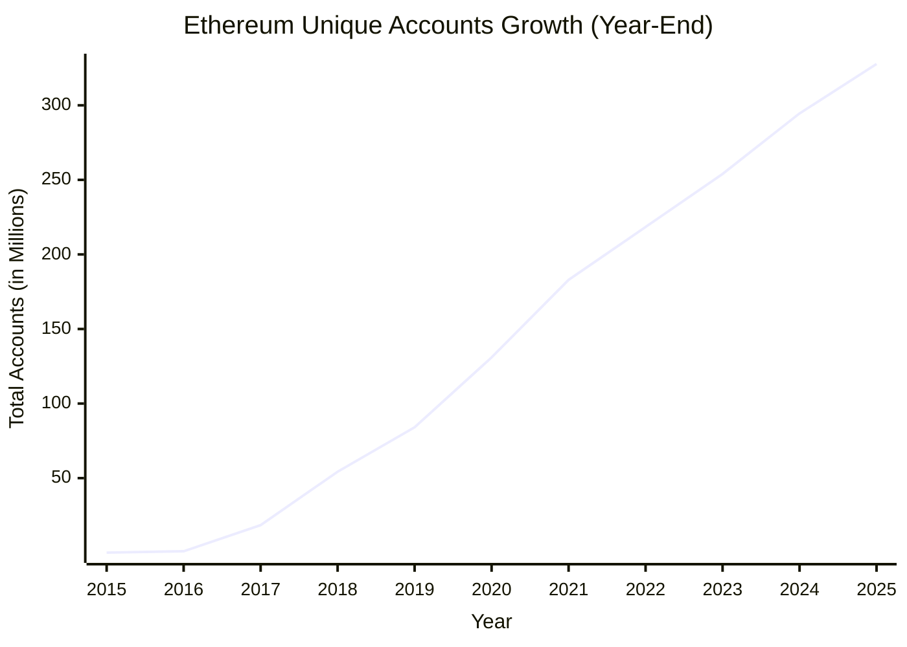
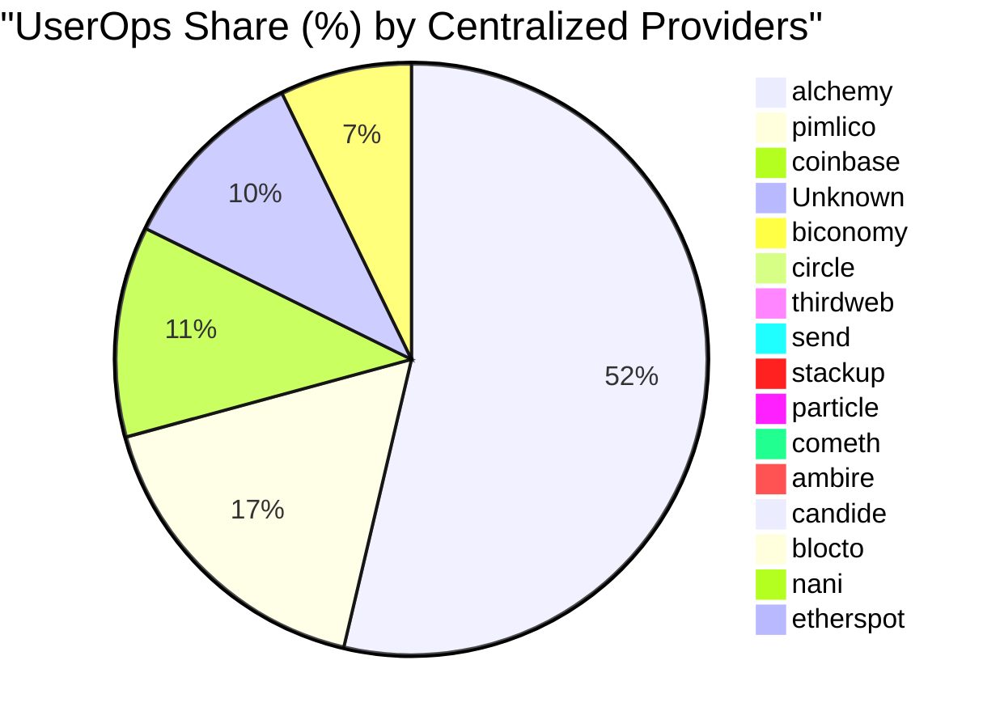
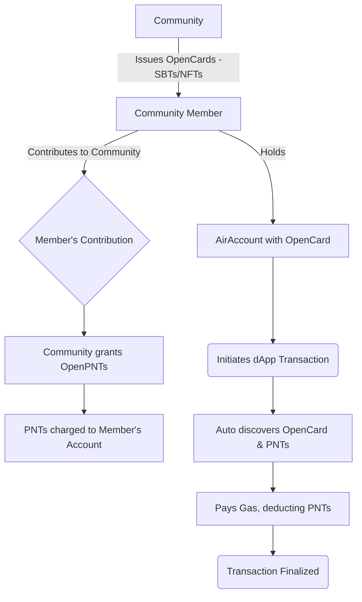
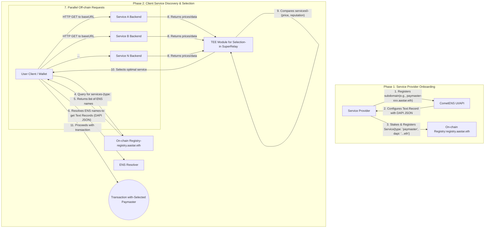
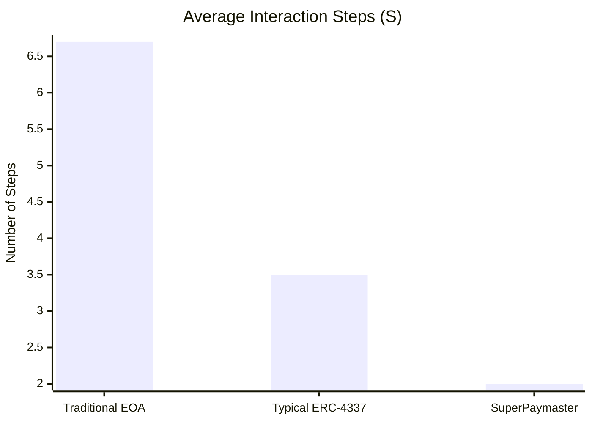
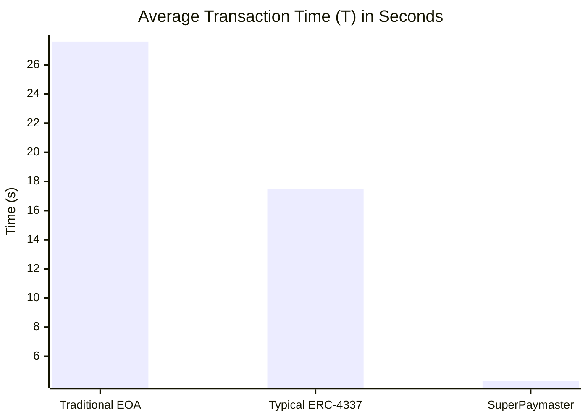
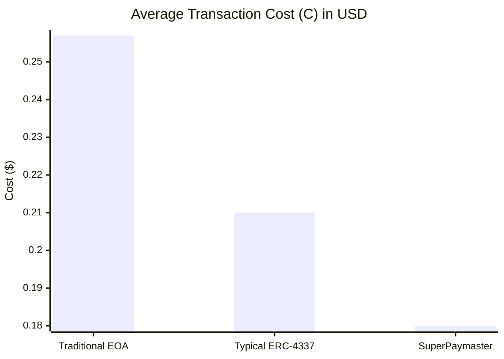

# SuperPaymaster: A UX-Optimized and Cost-Effective Ethereum Gas Payment System Based on Account Abstraction

## Authors

Huifeng Jiao, Dr. Nathapon Udomlertsakul, Dr. Anukul Tamprasirt, AAStar Team
International College of Digital Innovation, Chiang Mai University, Chiang Mai,
50200, Thailand 
E-mail: huifeng_jiao@cmu.ac.th, nathapon.u@icdi.cmu.ac.th,
anukul@innova.or.th, hi@aastar.io

## Keywords

**Blockchain, Ethereum, ERC-4337, Account Abstraction, Paymaster, User Experience, Seamless Gas Payment,
Transaction Fee, Cognitive Load, Open Source, Competitive Selection**

## Highlights

- We provide a comprehensive overview of existing gas payment systems on the
  Ethereum blockchain and analyze their inherent weaknesses, identifying critical gaps in usability, competitive selection, and economic efficiency.
- We establish key guidelines and quantifiable requirements for the design of a
  competitive, seamless, and cost-effective gas payment system based on Human-Computer Interaction principles and Design Science Research methodology.
- We propose SuperPaymaster, a novel gas payment system leveraging ERC-4337 Account
  Abstraction, competitive quoting mechanisms, and familiar user metaphors ("Gas Cards") to address costly and complex
  processes while enabling competitive paymaster selection.
- We demonstrate the system's design effectiveness through comprehensive DSR evaluation including testnet/mainnet performance analysis, expert assessment, and computational modeling, showing potential for 70.1% reduction in user steps and 30.0% cost savings compared to traditional workflows. All solution is open source on GitHub, one-key runnable for anyone.

## Abstract

Current blockchain gas payments impede widespread adoption due to high costs,
complexity, and poor user experience (UX)[19,21,22] rooted in Human-Computer Interaction (HCI)[7,8,9,10]
challenges. While Account Abstraction (ERC-4337)[2] offers potential,
current implementations often introduce risks like limited competitive selection and monopolistic pricing, business censorship and reducing economic efficiency. This paper
introduces SuperPaymaster, a novel gas payment system using ERC-4337
Paymaster[4] and a competitive selection mechanism to create a
cost-effective and user-friendly system. It
directly tackles high costs[18], usability friction[16], and market concentration
issues[15]. SuperPaymaster provides an open-source framework enabling
competitive Paymaster selection via a unified interface, fostering price competition,
supporting diverse ERC-20 gas tokens, and integrating with secure accounts like
AirAccount for streamlined, secure interactions. By optimizing gas
payments through enhanced UX and competitive selection, SuperPaymaster aims to
significantly lower entry barriers, improve blockchain interaction efficiency
and usability, and ultimately contribute to lowering the barrier for Web3 adoption[21]. A Design Science Research evaluation, combining theoretical analysis, computational modeling, and expert assessment, demonstrates the feasibility and potential effectiveness of SuperPaymaster in significantly reducing transaction steps, cognitive load and economics costs compared to existing solutions.

## 1. Introduction

The path to the mass adoption of blockchain technology is critically obstructed by a persistent and multifaceted challenge: the user experience of transaction fees, or "gas". This paper argues that the primary barrier to entry for mainstream users is a combination of **prohibitive system complexity and high cognitive load**, a problem deeply rooted in Human-Computer Interaction (HCI). For users, this manifests as a confusing, intimidating, and error-prone process, aptly described by Norman's "gulf of execution." For developers, it creates significant integration hurdles, forcing them to build complex, bespoke solutions to shield their users from the raw protocol. The urgency of solving this problem is magnified by the immense scale and rapid growth of the Web3 ecosystem. With a market capitalization fluctuating in the trillions of dollars and a user base that has already surpassed 300 million unique addresses (see Figure 1 and Figure 2). This vast and expanding digital economy remains significantly underserved by solutions that fail to bridge the gap between powerful decentralized technology and intuitive human interaction.

This friction is not a mere inconvenience; it represents a significant and quantifiable drain on the ecosystem, imposing severe economic and opportunity costs. The direct economic costs are substantial; daily gas expenditures on the Ethereum network alone frequently total millions of dollars, with a substantial portion being consumed by failed transactions that provide no value to the user. For micro-transactions, common in domains like gaming or social media, gas fees can absurdly exceed the value of the operation itself, rendering many otherwise viable business models untenable on-chain.

More critically, the unforgiving nature of the workflow leads to catastrophic indirect losses. Consider the journey of a non-crypto-native user: they must navigate the complexities of a centralized exchange, endure KYC procedures and withdrawal delays, transfer funds to a non-custodial wallet (risking network selection errors), and finally attempt to interact with a dApp, where they are confronted with cryptic parameters like gas limit and gwei. A single mistake at any stage can result in the permanent, irreversible loss of funds. This high-stakes, low-fault-tolerance environment creates widespread user frustration, leading to precipitous drop-off rates in onboarding funnels and significant user churn, thereby crippling dApp adoption and long-term retention. This quantifiable user abandonment directly translates to a higher customer acquisition cost and a lower lifetime value for Web3 projects, acting as a major barrier to sustainable growth.


**Figure 1:** The crypto market cap is valued in the trillions (Data source: CoinMarketCap)



**Figure 2:** The number of individual wallet addresses on Ethereum is growing and has reached 300 Million [79]. The emergence of Account Abstraction (AA), particularly Ethereum's ERC-4337 standard [2], offers powerful new primitives like the Paymaster for gas sponsorship, representing a significant technical step forward. In response, a number of centralized service providers have emerged, offering to simplify gas payments for dApps. 
However, these solutions, while valuable, present a fundamental trade-off. They often require proprietary SDKs, creating vendor lock-in, and introduce new systemic risks of market concentration, potential price manipulation, and reliance on a few dominant players.
More importantly, they provide only a partial fix. The **fundamental defect** in the current landscape is the lack of a holistic, open-source, and user-centric solution designed from the ground up to abstract away the **entire** complex workflow. 
This includes not just the on-chain gas fee itself, but the numerous off-chain preparatory steps (e.g., acquiring native tokens, managing multiple wallet addresses) and the associated time, cost, and cognitive friction that collectively hinder large-scale adoption.
To address this critical research and implementation gap, this paper introduces **SuperPaymaster**, a novel gas payment system designed through the lens of Design Science Research (DSR). SuperPaymaster is an open-source, competitive, and user-centric framework built on ERC-4337. It is architected to create a vibrant marketplace for gas sponsorship, enabling permissionless participation and fostering price competition. 
Crucially, it leverages HCI principles, employing familiar metaphors like "Gas Cards" to make the transaction experience more fluid and continuous,and therefore more intuitive. By tackling the comprehensive cost—encompassing time, money, and cognitive effort SuperPaymaster aims to significantly lower entry barriers for both users and developers, thereby accelerating the broader adoption of Web3 technologies.

This research investigates the following key research questions:

**RQ1:** What mechanisms can effectively reduce the comprehensive cost and complexity of gas payments to improve user experience and accelerate Web3 adoption?

**RQ2:** How can familiar user metaphors (such as "Gas Cards") be leveraged to reduce the cognitive load and bridge the gap between complex blockchain operations and user mental models?

**RQ3:** What technical architecture is required to enable competitive, permissionless gas sponsorship while maintaining security and reliability guarantees?

To maintain a clear focus, the scope of this paper is centered on demonstrating the tangible improvements in user experience and economic efficiency offered by the SuperPaymaster architecture. While the long-term vision for SuperPaymaster includes a fully decentralized and robust governance model, a detailed analysis of decentralization metrics, game-theoretic security against collusion, and on-chain governance mechanisms are considered beyond the scope of the present study. These aspects are designated as critical areas for future work.

Our main contributions are threefold. First, we contribute a **novel, open-source architecture** that enables a competitive market for gas sponsorship, providing a viable alternative to centralized, closed-ecosystem solutions. Second, we offer **strong empirical evidence** from a comprehensive evaluation, demonstrating significant improvements in usability and cost-efficiency. Third, and most critically, we propose and validate **Asset-Oriented Abstraction (AOA)**, a novel theoretical design pattern for HCI in Web3. We posit that by transforming complex, recurring processes into user-owned, interoperable digital assets, AOA provides a more robust solution to the 'leaky abstraction' problem than traditional process-oriented approaches. We instantiate and evaluate this pattern through our **'Gas Card**' artifact, providing a new theoretical lens for designing user-centric Web3 systems.

The remainder of this paper is structured as follows. Section 2 reviews related work and presents a systematic analysis of the problem domain. Section 3 outlines the Design Science Research (DSR) methodology that guides the study. Section 4 details the design and implementation of the SuperPaymaster artifact. Section 5 presents a comprehensive evaluation of the artifact against our research questions. Section 6 discusses the implications and limitations of our findings. Finally, Section 7 concludes the paper.

## 2. Related Work and Problem Analysis

This section reviews the literature on gas payment systems, grounding our research in established theoretical frameworks and analyzing the current state-of-the-art to identify the critical research gap that SuperPaymaster addresses. The core problem is redefined from mere complexity to the more nuanced issues of **"leaky abstractions"** and **"fragmented user experiences"** that persist even in modern ERC-4337 solutions. To underscore the severity of the identified gaps, we then present a systematic analysis of the usability challenges and security risks inherent in existing systems.

### 2.1 Theoretical Foundations

A robust gas payment solution must be built upon solid theoretical ground. We anchor our work in established principles from Human-Computer Interaction (HCI) and technology adoption models(TAM) to ensure our designed artifact is not only technically functional but also fundamentally usable and adoptable.

#### 2.1.1 Deconstructing the Gas Payment Problem through an HCI Lens

The usability of blockchain systems is a well-documented challenge that hinders mainstream adoption [19, 21]. While Norman's "gulf of execution" [9] aptly describes the general gap between user intent and required actions, a deeper analysis using established HCI heuristics reveals specific, critical violations in the typical gas payment workflow. These violations are not minor inconveniences; they are fundamental barriers that contribute to an overwhelming cognitive load.

We identify several key violations of Nielsen's usability heuristics [8]:
*   **Violation of "Visibility of system status":** Users are often blind to the state of their transaction. They cannot easily discern if a transaction is pending, stuck, or has been dropped, nor can they intuitively understand the real-time fluctuations of gas prices. This lack of feedback creates significant anxiety and uncertainty.
*   **Violation of "Error prevention":** The workflow is an error trap. Novice users are confronted with irreversible actions at every step. Common, costly errors include sending funds to an incorrect address, selecting the wrong network for a transfer, or setting an insufficient gas fee, which results in a failed transaction while still consuming the fee. The system is unforgiving by design.
*   **Violation of "User control and freedom":** While wallets have introduced features to "cancel" or "speed up" transactions, these are themselves complex workarounds that require a deep understanding of nonces and gas markets. There is no simple, easily discoverable "undo" button, leaving users feeling powerless when they make a mistake.
*   **Violation of "Consistency and standards":** The procedure for managing gas varies significantly across different blockchains, Layer 2 networks, and even different dApps, preventing users from developing a consistent mental model for this fundamental operation.

Collectively, these heuristic violations demonstrate that the gas payment problem is a systemic HCI failure. The goal of our research is not merely to simplify the process but to design a new system that inherently adheres to these fundamental principles of good interaction design.

#### 2.1.2 The Primacy of Perceived Ease of Use (PEOU) in Web3 Adoption

The Technology Acceptance Model (TAM) provides a powerful framework for understanding why a technology with high potential fails to gain traction [24, 25]. TAM posits that adoption is driven by Perceived Usefulness (PU) and Perceived Ease of Use (PEOU). While the PU of dApps is constantly growing, we argue that in the context of Web3, **PEOU acts as a gatekeeper to PU**.

A user cannot appreciate the utility of a decentralized finance protocol or a Web3 game if they cannot successfully execute their first transaction. The initial friction of the gas payment workflow is so immense that it often prevents users from ever reaching the point of value discovery. This "PEOU gatekeeper effect" is a primary driver of the notoriously low user retention and high drop-off rates in dApp onboarding funnels. Studies in other high-complexity domains, such as enterprise resource planning (ERP) software, have similarly found that initial setup complexity and low PEOU are primary drivers of user rejection, regardless of the system's potential utility.

Therefore, for Web3 to cross the chasm into mainstream adoption, improving PEOU is not a secondary optimization but the most critical point of leverage. This research is motivated by the conviction that solving the gas payment problem is a prerequisite for unlocking the perceived usefulness of the entire Web3 ecosystem. Our work thus focuses squarely on dismantling the PEOU barrier by creating a radically more intuitive and accessible interaction paradigm.


#### 2.1.3 A New Abstraction Paradigm: Asset-Oriented Abstraction (AOA)

The core HCI problem in current gas solutions is the prevalence of "leaky abstractions." To formalize this, we categorize existing solutions under a paradigm we term **Process-Oriented Abstraction (POA)**. In POA, the system abstracts a *process* for the user within a specific, limited context. For instance, a typical paymaster abstracts the gas payment *process*, but only within a single dApp and often only for specific tokens. This approach is inherently context-dependent and ephemeral, forcing the user to re-engage with a new, slightly different process for each new application. This leads to a fragmented experience and a high cumulative cognitive load, as the user cannot form a single, stable mental model.

To address this fundamental limitation, we propose a new design paradigm: **Asset-Oriented Abstraction (AOA)**. The core principle of AOA is the transformation of a complex, recurring *process* into a persistent, user-owned, and interoperable digital *asset*. Instead of abstracting the *act* of paying gas, AOA abstracts the *capability* to pay gas into an asset—the "Gas Card"—that the user owns and controls. This paradigm is defined by three core principles: **Assetization** (the capability becomes a tangible token), **User-Ownership** (the token resides in the user's wallet and is controlled by them), and **Interoperability** (the asset is usable across any compliant application).

From a cognitive science perspective, AOA is theoretically superior. According to Norman's theory of mental models [9], users form simplified models of how systems work. POA forces users to maintain multiple, complex, and often conflicting mental models for each dApp. In contrast, AOA allows the user to form a single, robust mental model derived from the physical world: "I own a card with a balance, and I can use it anywhere." This drastically simplifies the cognitive task.

Furthermore, applying Sweller's Cognitive Load Theory [43], AOA reduces cognitive load on two fronts. It lowers *intrinsic cognitive load* by removing the need for the user to understand the underlying mechanics of gas sponsorship at all. More importantly, it nearly eliminates *extraneous cognitive load* by providing a consistent, universal interaction pattern across the entire ecosystem, freeing up the user's cognitive resources to focus on their primary task within the dApp.

Finally, viewed through the lens of Activity Theory [44], the 'tool' for the activity of 'transacting on-chain' shifts. In POA, the tool is ephemeral and provided by the environment (the dApp). In AOA, the tool (the Gas Card) is a persistent artifact owned and carried by the user, fundamentally simplifying the structure of the activity itself. Based on this new paradigm, we propose a framework for evaluating the quality of abstractions based on their **Portability**, **Sense of Ownership**, and **Mental Model Consistency**.

### 2.2 Technical Foundations: Account Abstraction and ERC-4337

Account Abstraction (AA) is a paradigm shift in Ethereum, allowing smart contracts to function as user accounts. The ERC-4337 standard [2] is pivotal, enabling AA without requiring consensus-layer changes. Its key components—`UserOperations`, `Bundlers`, and `Paymasters`—form the technical bedrock of our solution.

Academic analysis of ERC-4337 by Singh et al. [3] has demonstrated its technical feasibility, while Wang et al. [15] have explored its implications for gas tokens. However, these studies, along with the base implementation from the Infinitism team [4], primarily focus on the technical mechanics rather than holistically addressing the HCI challenges or the economic risks of centralization that arise from naive implementations.

#### 2.2.1 The Evolving Landscape of Account Abstraction (2025)

The Account Abstraction landscape has matured significantly through 2024 and into 2025. Several key developments are shaping its future beyond the baseline ERC-4337 standard. **EIP-7702**, for example, has been upgraded in the Ethereum hard fork ('Prague/Electra') and has seen widespread implementations in early 2025 [EIP-7702]. It is largely viewed as a pragmatic bridge for existing EOA users to access AA features without immediate migration [45].

Concurrently, the integration of **Passkeys (WebAuthn)** for secure, seedless authentication has transitioned from an emerging trend to an industry best practice in 2025, with major wallet providers rolling out support to simplify user onboarding [46]. This is often coupled with the continued adoption of **Modular Accounts**, a paradigm championed by projects like Safe, which allows for greater wallet customizability and extensibility [47]. In the long-term view, discussions around **RIP-7560** have intensified, with several L2s launching experimental implementations of "Native Account Abstraction" on their developer testnets to explore its potential for greater cost-efficiency [RIP-7560].

While these developments outline the future trajectory, ERC-4337 remains the most widely adopted and battle-tested standard for smart accounts across the EVM ecosystem today. This research, therefore, focuses on optimizing the user experience within this established and practical framework. We argue that our core HCI contributions, particularly the Asset-Oriented Abstraction (AOA) pattern, are foundational and designed to be forward-compatible, remaining relevant even as the underlying technical implementations of AA evolve.


### 2.3 State-of-the-Art in Gas Payment Solutions

#### 2.3.1 Incomplete Abstractions in Current Solutions

We systematically evaluated existing academic and industry solutions. While current ERC-4337 Paymaster services from providers like Pimlico [5], Alchemy, and Biconomy have made strides in eliminating the need for users to hold native ETH, they often represent an incomplete solution. Their primary flaw is creating **"leaky abstractions"** and **"fragmented experiences"**.

- **Leaky Abstraction**: The complexity of gas payments is not truly eliminated but is often shifted to a new domain. Users may no longer need ETH, but they might need to acquire specific dApp-supported stablecoins, perform in-app swaps, or manage different gas tanks for different applications. The underlying complexity “leaks” through the abstraction layer.
- **Fragmented Experience**: The gas sponsorship is typically tied to a specific dApp or platform. A seamless experience in one dApp does not carry over to another, forcing the user to re-learn rules and re-acquire specific gas credits. This prevents the formation of a universal, user-centric mental model for gas payments.

Furthermore, the predominantly centralized nature of these providers introduces risks of vendor lock-in, monopoly pricing, and censorship, which SuperPaymaster mitigates through its open-source and competitive architecture. A comparative analysis highlights the distinct trade-offs between different gas payment solutions. The **Traditional EOA** workflow, while offering users full, non-intermediary control, imposes a very high setup complexity, as users must manually manage every aspect of the process, from ETH acquisition to private key security. **Typical ERC-4337** solutions improve upon this by removing the need for users to hold native ETH, but this often results in a "leaky abstraction." The complexity is merely shifted, requiring users to acquire specific ERC-20 tokens for each dApp, leading to a fragmented experience with low universality and a medium setup complexity per application. In contrast, **SuperPaymaster** is designed for holistic UX abstraction. By using a "Gas Card" as a universal, user-owned asset, it eliminates fragmentation, offering high cross-dApp universality with a low, one-time global setup.

#### 2.3.2 Industry Implementations and Their Philosophical Dichotomy

The current market for gas sponsorship is dominated by a few centralized providers like Pimlico [5], Alchemy, and Biconomy. While these services have improved usability over native EOA interactions, a deeper analysis reveals a fundamental philosophical dichotomy in their approach compared to SuperPaymaster: a **Platform-Centric, Walled Garden** model versus a **User-Centric, Open Marketplace** model.

The Platform-Centric model, adopted by most commercial providers, primarily targets dApp developers as its customers. The goal is to create a sticky, all-in-one infrastructure platform (a Business-to-Developer, or B2D, SaaS model), which naturally leads to proprietary SDKs, vendor lock-in, and centralized relayers. In this paradigm, user experience improvements are a means to an end—to attract developers to the platform. This approach inevitably leads to the centralization risks discussed later, such as censorship and monopolistic pricing [30, 31].

In contrast, SuperPaymaster is designed with a User-Centric philosophy. Its primary goal is to empower the end-user and the community by creating an open, competitive marketplace where any service provider can participate. This core philosophical difference manifests in several key design choices:

1.  **Core Abstraction:** Platform-centric solutions offer a technical API to developers, whereas SuperPaymaster provides a user-owned "Gas Card" asset, shifting the ownership of the abstraction to the user.
2.  **Business Model & Ethos:** Commercial, closed-source business models versus SuperPaymaster's open-source, community-driven approach.
3.  **Permission Model:** Permissioned token support, limited to major stablecoins or business partners, versus a permissionless model where any community can integrate its own token.
4.  **Service Discovery:** Reliance on centralized API endpoints versus a decentralized discovery mechanism based on open standards like ENS, as illustrated in our architecture.

The following multi-dimensional comparison (Table 1) and subsequent cost analysis (Table 2) will evaluate existing solutions through this philosophical lens, revealing significant differences in their implications for ecosystem health, user sovereignty, and long-term decentralization.


| Field | Ronan S et al.[1] | Vitalik et al.[2,4] | Singh et al.[3] | Qin Wang[15] | Lin et al.[16] | Thibault[17] | Pimlico[5] | Alchemy[60] | Stackup[61] | Coinbase[63] | Biconomy[64] | Particle[54,67] | ZeroDev[58,66] | SuperPaymaster/AAStar |
| :---- | :--------------- | :----------------- | :------------- | :----------- | :------------ | :---------- | :--------- | :--------- | :--------- | :---------- | :---------- | :------------- | :------------ | :------------------- |
| **Type** | Industry | Industry | Academic | Academic | Academic | Academic | Industry | Industry | Industry | Industry | Industry | Industry | Industry | Academic/Industry |
| **Purpose** | EIP2771 meta transaction | ERC4337 account abstraction framework | Implement ERC4337 solution | Discuss gas token on ERC4337 | Discuss gas cost on Layer1/Layer2 | Research on Layer2 rollup | Full ERC4337 implementation | Complete AA solution | Business crypto account service | Base chain ecosystem with free gas | DApp infrastructure provider | Full ERC4337 with enhancements | Practical account abstraction | UX-optimized paymaster with competitive selection |
| **Solution Account** | EOA | Contract account demo | Contract account | Contract account | Contract account | EOA | Contract account | Contract account | Contract account | Contract account | Contract account | Contract account and EOA | Contract account | Contract account and EOA |
| **Solution Relay** | ❌ | ❌ | ✅ | ✅ | ✅ | ❌ | ✅ | ✅ | ✅ | ✅ | ✅ | ✅ | ✅ | ✅ |
| **Solution Simple** | ❌ | ❌ | ❌ | ❌ | ❌ | ❌ | ❌ | ❌ | ❌ | ❌ | ❌ | ✅ | ✅ | ✅ |
| **Solution Time/Efficiency** | ❌ | ❌ | ❌ | ❌ | ❌ | ❌ | ❌ | ❌ | ❌ | ❌ | ❌ | ✅ | ✅ | ✅ |
| **Solution Customize ERC20** | ❌ | ❌ | ❌ | ❌ | ❌ | ✅ | ✅ | ✅ | ❌ | ✅ | ❌ | ✅ | ✅ | ✅ |
| **Cost Direct Cost** | Low | High | High | High | Medium | Medium | Medium | Medium | Medium | Medium | Medium | Medium | Medium | Competitive |
| **Usability & UX: Cognitive Load** | High | High | High | High | High | High | Medium | Medium | Low | Low | Medium | Low | Low | Low |
| **Usability & UX: No Memorization** | ❌ | ❌ | ❌ | ❌ | ❌ | ❌ | ❌ | ✅ | ✅ | ❌ | ❌ | ✅ | ✅ | ✅ |
| **Usability & UX: Efficiency** | ❌ | ❌ | ❌ | ❌ | ❌ | ❌ | ❌ | ✅ | ✅ | ✅ | ✅ | ✅ | ✅ | ✅ |
| **Usability & UX: Fault Tolerance** | ❌ | ❌ | ❌ | ❌ | ❌ | ❌ | ⚠️ | ⚠️ | ⚠️ | ⚠️ | ❌ | ⚠️ | ⚠️ | ✅ |
| **Competitive Selection** | ❌ | ❌ | ❌ | ❌ | ❌ | ❌ | ❌ | ✅ | ✅ | ✅ | ⚠️ | ⚠️ | ⚠️ | ✅ |
| **Community Integration** | ❌ | ❌ | ❌ | ❌ | ❌ | ❌ | ❌ | ⚠️ | ✅ | ✅ | ⚠️ | ⚠️ | ⚠️ | ✅ |
| **Open Source Support** | ❌ | ❌ | ❌ | ❌ | ❌ | ❌ | ⚠️ | ✅ | ✅ | ⚠️ | ✅ | ⚠️ | ⚠️ | ✅ |

⚠️: Partially support, for details, please see [^25], use BundleBear data[6]

**Table 1:** Multi-dimensional Comparison Analysis Across Academic Research and Industry Solutions


#### 2.3.3 Cost and Scalability Considerations

The high gas cost of AA operations on Layer 1 is a significant barrier. Lin et al. [16] quantify this, noting that creating an ERC-4337 account is substantially more expensive than an EOA. This necessitates the use of Layer 2 solutions. Research by Thibault et al. [17] shows that rollups can reduce fees by 20-100 times. SuperPaymaster is designed to operate on Layer 2 networks to leverage these cost savings, as shown in the table 2: comparative fee data [18].

| Name          | Send ETH | Swap Tokens |
| :------------ | :------- | :---------- |
| Metis Network | $0.04    | $0.18       |
| Loopring      | $0.04    | $0.59       |
| zkSync Era    | $0.07    | -           |
| zkSync Lite   | $0.09    | $0.22       |
| Optimism      | $0.09    | $0.18       |
| Arbitrum One  | $0.09    | $0.27       |
| Boba Network  | $0.15    | $0.17       |
| DeGate        | $0.16    | $0.18       |
| StarkNet      | $0.19    | $0.57       |
| Polygon zkEVM | $0.19    | $2.75       |
| Ethereum      | $1.10    | $5.48       |

**Table 2:** Gas Fee Analysis (Layer 1 and Layer 2), data source: l2fees.info


### 2.4 Systematic Analysis of Usability and Centralization Risks

To further underscore the gaps in existing solutions, we conducted a systematic analysis of the specific usability challenges and risks inherent in current systems, drawing from established HCI principles and market observations.

#### 2.4.1 Systematic Analysis of Gas Payment Usability Issues

A systematic analysis from an HCI perspective reveals several critical usability challenges inherent in current gas payment systems.

**High Cognitive Load**
Users are forced to build complex mental models to navigate abstract blockchain concepts such as dynamic gas pricing, network congestion, transaction priority, and multi-step approval processes. This creates mental fatigue, leads to decision paralysis, and significantly increases the likelihood of costly errors.

**Lack of Intuitive Metaphors**
The process lacks references to familiar, real-world financial interactions like using a credit card or making a bank transfer. Without these metaphors, users cannot leverage existing mental models, which steepens the learning curve and reduces their confidence and feeling of control over the system.

**Efficiency Issues**
The end-to-end workflow is often slow and cumbersome. Delays from KYC procedures on exchanges, fiat on-ramps, bridging assets between networks, and final on-chain confirmation create a sluggish user experience that hinders the rapid, spontaneous interactions expected in modern applications.

**High Error Rate & Low Fault Tolerance**
The system is unforgiving. Simple mistakes—such as sending funds to an incorrect address, selecting the wrong network, or setting an inadequate gas fee—can lead to the permanent, irreversible loss of assets. The lack of an "undo" function or robust error prevention mechanisms makes the experience high-stakes and stressful for users.

**Memorization Difficulties**
A significant cognitive burden is placed on the user to securely manage and recall critical information. This includes protecting complex seed phrases, distinguishing between long, cryptic addresses, and remembering specific operational procedures for different dApps and chains, all of which increases the risk of error.

**Low User Satisfaction**
The combination of high cognitive load, inefficiency, and the constant risk of catastrophic errors results in widespread user frustration and a fundamentally poor overall experience, which detracts from the underlying value of the dApp itself.

**Lack of Supporting Tools**
The developer ecosystem lacks standardized, easy-to-integrate tools for building user-friendly gas solutions. This forces dApp developers to either rely on the often-complex UIs of external wallets or invest heavily in building custom, bespoke solutions, leading to inconsistent and fragmented user experiences across the space.

**Low Perceived Ease of Use**
For new users, the initial impression is that blockchain systems are inherently complex, expensive, and insecure. The interaction patterns do not map to their existing knowledge, creating a strong negative perception that acts as a major barrier to trial and adoption, deterring them before they can experience a dApp's core value.

#### 2.4.2 Risk Analysis of Centralized Gas Payment Services

While centralized services aim to simplify gas payments, they introduce distinct risks that run counter to the core ethos of decentralization.

**Economic & Integration Barriers**
Centralized solutions often require dApp developers to integrate proprietary SDKs and agree to specific service terms, creating vendor lock-in. Furthermore, as noted by Lin et al. [16], the underlying ERC-4337 smart contract accounts carry a higher base gas cost than standard EOAs, creating an initial economic disincentive for adoption.

**Transaction Manipulation (MEV)**
Centralized relayers like Bundlers and Paymasters gain a privileged position, allowing them to see transaction flows before they are confirmed on-chain. This creates opportunities for Miner Extractable Value (MEV) practices such as front-running or sandwich attacks, where the service can extract value from users' trades at their expense [33].

**Privacy Leakage**
These services act as central aggregators of vast amounts of user transaction data. This data can often be linked to other identifiers like IP addresses, creating a single point of failure for user privacy and exposing users to risks of data breaches, surveillance, or the sale of their financial activity data.

**Censorship & Regulatory Risk**
As centralized legal entities, these services are subject to jurisdictional laws and regulations. They can be compelled by governments to block or censor transactions involving specific addresses, such as those on OFAC's sanction list. This undermines the core principle of a permissionless network and creates the irony of users needing to perform KYC/AML on centralized exchanges to fund their "permissionless" activities.

**Limited Gas Token Support**
Paymaster services often restrict which tokens they accept for gas payments, typically favoring large stablecoins or their own platform tokens. This limits user choice, prevents communities from using their native tokens for network participation, and can force users into additional, potentially costly token swaps to use the service.

**Monopoly & Cost Inflation**
The market for centralized relayers is already showing significant concentration, as evidenced by data from BundleBear [6] (see Figure 3). This creates a long-term risk of an oligopoly or monopoly where a few dominant players can control the market, dictate terms, and inflate costs over time, stifling innovation and reducing service quality.


**Figure 3:** Current market concentration in gas payment services demonstrates need for competitive alternatives (Data source: BundleBear)


### 2.5 Formalizing the User Journey: A Comparative Model

To quantify the impact of these different approaches, we model the end-to-end user journey across three dimensions: **Steps (S), Time (T), and Cost (C)**. We propose distinct models for the three workflows to highlight their differences.

1.  **Traditional EOA Workflow ($Trad$):** Represents the highest friction, where the user handles everything manually.
    -   $S_{trad} = S_{prepare} + S_{interact}$
    -   $T_{trad} = T_{prepare} + T_{interact} + T_{confirm}$
    -   $C_{trad} = C_{prepare} + C_{gas} + C_{failed}$

2.  **Typical ERC-4337 Workflow ($Std4337$):** Represents current Paymaster solutions where complexity is shifted.
    -   $S_{std4337} = S_{dapp\_setup} + S_{interact\_simplified}$
    -   $T_{std4337} = T_{dapp\_setup} + T_{interact\_simplified} + T_{confirm}$
    -   $C_{std4337} = C_{swap} + C_{gas\_sponsored} + C_{premium} + C_{deploy} + C_{bundler} + C_{swap}$

3.  **SuperPaymaster Workflow ($SPM$):** Represents our proposed holistic solution.
    -   $S_{spm} = S_{global\_setup} + S_{interact\_simplified}$
    -   $T_{spm} = T_{interact\_simplified} + T_{confirm}$
    -   $C_{spm} = C_{gas\_sponsored} + C_{service\_fee}$

In these models, the variables represent the distinct components of the user journey. The terms $S_{prepare}, T_{prepare}, C_{prepare}$ denote the steps, time, and cost associated with off-chain preparation, such as using a centralized exchange. $S_{dapp_setup}$ and $T_{dapp_setup}$ represent the friction of per-dApp setup, like acquiring a specific token for sponsorship. $S_{interact}$ is the complex on-chain interaction itself, while $C_{failed}$ is the cost of failed transactions and $C_{premium}$ is the non-competitive fee from a centralized provider.

This framework clearly illustrates that SuperPaymaster's primary contribution is the **near-total elimination** of preparatory costs ($S_{prepare}, T_{prepare}, C_{prepare}$) and dApp-specific setup costs ($S_{dapp_setup}, T_{dapp_setup}$), which are the most significant barriers for mainstream users. It achieves this by replacing them with a single, one-time global setup ($S_{global_setup}$), simplifying complex interactions to $S_{interact_simplified}$, eliminating costs from failed transactions, and reducing service premiums to a competitive $C_{service_fee}$.

#### 2.5.1 Detailed Component Analysis

To enhance the model's precision, key variables can be further decomposed. This detailed breakdown allows for a more granular analysis in our evaluation chapter.

- **On-Chain Gas Cost ($C_{gas}$):** $C_{gas} = (C_{base} + C_{priority}) \times GasUnits + L1_{cost}$
  - $C_{base}$: The network's base fee per gas unit.
  - $C_{priority}$: The tip paid to validators for transaction inclusion.
  - $L1_{cost}$: For Layer 2 transactions, the additional cost of posting data to the L1 chain.

- **Sponsored Gas Cost ($C_{gas\_sponsored}$):** $C_{gas\_sponsored} = C_{execution} + C_{bundler\_profit} + C_{paymaster\_profit}$
  - $C_{execution}$: The actual on-chain execution cost of the UserOperation.
  - $C_{bundler\_profit}$: The portion of the fee paid to the bundler.
  - $C_{paymaster\_profit}$: The portion of the fee paid to the paymaster service provider (equivalent to $C_{premium}$ or $C_{service\_fee}$). 

This micro-level analysis enables us to pinpoint precisely where SuperPaymaster's competitive mechanism and architectural optimizations generate cost savings. SuperPaymaster's mitigation strategies target several micro-level variables:
-   **Exchange and Withdrawal Costs ($C_{exchange}$, $C_{withdraw}$):** These are eliminated. The Gas Card model abstracts payments, removing the need for direct CEX interaction and asset withdrawal. Gas can be paid directly with community-earned PNTs or other supported ERC20 tokens.
-   **Learning Cost ($C_{learning}$):** The implicit cost of time and effort for a new user is significantly reduced by leveraging familiar metaphors (Gas Card) and providing a seamless, Web2-like experience.
-   **Deployment and Bundler Costs ($C_{deploy}$, $C_{bundler}$):** The one-time account deployment cost is sponsored, often covered by the dApp or community as an acquisition cost. Furthermore, our architecture merges roles, reducing the number of distinct on-chain payments and optimizing bundler fees.
-   **Swap and Fragmentation Costs ($C_{swap}$, $C_{fragment}$):** The cost of swapping tokens is eliminated, as users can pay with a wide variety of tokens they already hold or earn. The Gas Card model is also designed for cross-chain compatibility, mitigating the economic loss from asset fragmentation across multiple chains.
-   **Operational Time and Steps ($T_{op_offchain}$, $T_{op_onchain}$, $S_{op_offchain}$, $S_{op_onchain}$):** The entire off-chain preparatory workflow is removed, eliminating the associated time and steps. On-chain, manual gas setting is removed, and interactions are simplified to a minimal, consistent flow across all dApps.

### 2.6 Identifying the Research Gap

Our review, now informed by the AOA paradigm, reveals a more precisely defined research gap: a lack of solutions that move beyond Process-Oriented Abstraction to provide a truly holistic, **Asset-Oriented Abstraction** for the **entire user journey** of gas payments. Current industry solutions provide partial, process-oriented optimizations that result in leaky abstractions and fail to eliminate cognitive load. SuperPaymaster is designed to fill this gap by creating an artifact that instantiates the AOA pattern, making it simultaneously user-centric, economically competitive, and architecturally open.

## 3. Research Methodology

This study adopts the **Design Science Research (DSR)** methodology, a well-established paradigm for creating and evaluating innovative artifacts intended to solve identified organizational or technical problems [Hevner et al., 2004]. DSR is particularly suited for this research as our primary goal is to design, build, and evaluate a novel IT artifact—the SuperPaymaster system—to address the persistent usability and efficiency challenges of blockchain gas payments.

### 3.1 DSR Process Model

To structure our research process, we followed the six-activity DSR process model proposed by Peffers et al. (2007). This model provides a rigorous and repeatable framework for conducting design science research. The activities of our research are mapped to this model as follows:

1.  **Activity 1: Problem Identification and Motivation.** Accomplished in **Chapters 1 and 2**, where we identified the core problem of gas payment complexity as a critical barrier to Web3 adoption and analyzed the limitations of existing solutions.
2.  **Activity 2: Define Solution Objectives.** Accomplished in **Section 4.1**, where we defined a set of quantifiable objectives and requirements for our solution.
3.  **Activity 3: Design and Development.** Accomplished in **Chapter 4**, where we present the design and implementation of the SuperPaymaster artifact.
4.  **Activity 4: Demonstration.** Accomplished through the working Proof-of-Concept detailed in **Chapter 4**.
5.  **Activity 5: Evaluation.** Detailed in this section and executed in **Chapter 5**, this involves a multi-faceted evaluation of the artifact.
6.  **Activity 6: Communication.** Embodied by this paper itself, particularly **Chapters 6 and 7**.

### 3.2 Artifact Evaluation Methodology

To rigorously evaluate the SuperPaymaster artifact against the objectives defined in Activity 2, we employed a hybrid, mixed-methods approach. This approach combines quantitative benchmarking to measure performance improvements with qualitative expert assessment to validate the design's HCI principles and technical feasibility.

#### 3.2.1 Quantitative Benchmarking

To empirically test our claims of improved efficiency and reduced complexity (addressing **RQ1**), we designed a controlled experiment.

*   **Experimental Setup**: The experiment was conducted on the Sepolia, OP Sepolia, and OP Mainnet networks. We deployed the necessary smart contracts and configured a test suite using our SDK to automate transaction execution and data logging.
*   **Workflows & Conditions**: We compared three primary workflows: (1) the **Traditional EOA Workflow**, (2) a simulated **Typical ERC-4337 Workflow**, and (3) the **SuperPaymaster Workflow** using an AirAccount. The simulation of the Typical ERC-4337 workflow involved adding steps for users that we defined, three user personas (Alice - new user; Bob - no gas; Charlie - has gas) and tested across three common transaction types (ERC20 Transfer, NFT Mint, DApp Interaction).
*   **Variables and Hypotheses**: The core variables for this experiment are defined as follows:
    *   **Independent Variable**: The `Workflow Type` (Traditional vs. Typical ERC-4337 vs. SuperPaymaster).
    *   **Dependent Variables**: To measure the impact, we recorded three key performance metrics: `Interaction Steps`, `Transaction Time`, and `Total Cost`.
    Our primary hypotheses were that the SuperPaymaster workflow would lead to statistically significant reductions in all three dependent variables compared to the other two workflows.
*   **Data Collection and Analysis**: A total of 1,050 transactions were executed over a 7-day period. We systematically logged the dependent variables for each of the three workflows. To compare the means across the groups, we utilized an **Analysis of Variance (ANOVA)**. Following the ANOVA, **post-hoc tests (e.g., Tukey's HSD)** were conducted to perform pairwise comparisons between the workflows and identify statistically significant differences. We also calculated effect sizes (e.g., Cohen's d or eta-squared) to measure the magnitude of the observed improvements. A detailed breakdown of all variables, statistical methods, and judgment criteria is provided in **Appendix D**.

#### 3.2.2 Qualitative Expert Assessment

To validate the HCI contributions (**RQ2**) and the technical soundness of the architecture (**RQ3**), we conducted a structured expert assessment.

*   **Protocol**: We recruited a panel of experts with backgrounds in HCI, blockchain protocol development, and UX design. They were provided with a concise evaluation package containing the core design artifacts (e.g., system architecture, workflow diagrams) and a structured questionnaire.
*   **Data Collection**: The questionnaire used 5-point Likert scales to gather quantitative ratings on the effectiveness of the "Gas Card" metaphor, workflow simplification, and technical feasibility. It also included open-ended questions to capture rich, qualitative feedback on the system's strengths, potential risks, and innovative aspects.
*   **Analysis**: The Likert-scale data was aggregated to measure expert consensus, while the qualitative feedback was analyzed to identify recurring themes and provide deeper insights into the design's validity.

By combining these two evaluation methods, we can triangulate our findings, providing robust, evidence-based answers to our research questions.

## 4. SuperPaymaster: Artifact Design and Implementation

To address the multifaceted challenges and fulfill the requirements derived in the previous sections, we designed and implemented SuperPaymaster, a novel socio-technical artifact. This section details the system's design principles, its core requirements, the overall architecture, and the key implementation details of its components.

### 4.1 Solution Requirements

#### 4.1.1 Functional Requirements

1. **Competitive Selection Mechanism**: Enable multiple service providers to compete, driving down costs through market mechanisms with open source integration implementation.
2. **User-Friendly Interface**: Abstract technical complexity using familiar metaphors and mental models.
3. **Multi-Token Support**: Accept various ERC-20 tokens for gas payments, including community-issued tokens.
4. **Cross-Chain Compatibility**: Support multiple blockchain networks and Layer 2 solutions.
5. **Developer Integration**: Provide simple APIs and SDKs for seamless dApp integration.
6. **Distributed Operation**: Support permissionless participation while avoiding single points of failure.

#### 4.1.2 Non-Functional Requirements

1. **Security**: Implement robust authentication, prevent double-spending, and protect against common attack vectors.
2. **Scalability**: Handle increasing transaction volumes without performance degradation.
3. **Reliability**: Maintain high availability (>99.9%) with fault tolerance mechanisms.
4. **Performance**: Process transactions with minimal latency (<3s confirmation time).
5. **Transparency**: Provide open-source implementations and verifiable operations.
6. **Usability**: Achieve intuitive user experience with minimal learning curve.

### 4.2 Design Principles

#### 4.2.1 Human-Centered Design Principles

1. **Familiar Metaphors**: Leverage widely understood concepts (e.g., "Gas Cards", "Points") to reduce cognitive load.
2. **Invisible Complexity**: Abstract technical details while maintaining system transparency.
3. **Error Prevention**: Design interfaces and workflows that prevent common user mistakes.
4. **Progressive Disclosure**: Reveal system complexity gradually based on user expertise level.

#### 4.2.2 Community Collaboration Principles

1. **Permissionless Participation**: Anyone can operate nodes or use services without central approval.
2. **Censorship Resistance**: No single entity can block transactions or manipulate the system.
3. **Open Source**: Anyone can use the open source project to build their own solution.
4. **Community Tokens Support**: Enable any community participation with their own community tokens in system evolution and parameter setting.

#### 4.2.3 Economic and Technical Principles

1. **Market-Driven Pricing**: Enable competitive pricing through open marketplace dynamics.
2. **Aligned Incentives**: Design economic models where individual and system success are aligned.
3. **Modular Design**: Enable independent development and upgrading of system components.
4. **Security by Design**: Implement defense-in-depth with multiple security layers.

### 4.3 System Architecture and Overview

SuperPaymaster is a competitive gas payment (sponsorship) system built upon the ERC-4337 standard. Its core objective is to create an open, competitive, and resilient marketplace for gas sponsorship. Key motivations include providing a single, consistent Paymaster address across chains for developer convenience and unifying the staking mechanism for all participating sponsors (LPs/Nodes) to enhance overall system trust and reliability. It facilitates various user-friendly payment models, all managed within a competitive framework that utilizes relatable concepts like 'Gas Cards' to simplify user interaction.


To visually articulate the practical improvements of this architecture, the following table compares the user journey across the three workflows.


The system involves several key actors: **End Users**, **dApps**, **Communities**, **Node Operators** (Paymasters/Sponsors), and **Bundlers**. These actors interact through a set of on-chain contracts and off-chain services to deliver a seamless gas payment experience.

### 4.4 Core Components: Design and Implementation

This section details the implementation of the SuperPaymaster Proof of Concept (PoC). The PoC was built using a standard Web3 stack: Solidity (Foundry) for smart contracts, Next.js (React/Node.js) for web interfaces, and Go/Rust for backend services, all containerized with Docker.

#### 4.4.1 The SuperPaymaster Contract

The SuperPaymaster contract serves as the on-chain anchor of the system, implementing a hybrid router-factory architecture based on the BasePaymasterRouter foundation. Its core functions, including `stakeManager` and `validateSponsorUserOp`, handle sponsor registration, staking for economic security, and the verification of off-chain sponsorship signatures. This ensures that all gas sponsorship is backed by sufficient collateral, preventing system abuse. The high-level interaction sequence for this process is illustrated in Figure 5.


**Figure 5**: SuperPaymaster Contract High-Level Work Flow

**State Variables and Core Architecture**: The BasePaymasterRouter contract maintains a `PaymasterPool` structure for each registered service provider, containing critical fields: `paymaster` address, `feeRate` in basis points (where 100 = 1%), `isActive` status, and reputation metrics (`successCount` and `totalAttempts`). The `paymasterList` array enables efficient iteration through registered providers, while the `MAX_PAYMASTERS` constant (50) prevents gas limit issues during selection algorithms.

**Core Function Logic and Validation**: The `validatePaymasterUserOp` function performs ECDSA signature verification using the userOpHash, validates temporal constraints through timestamp checks, and confirms adequate stake balances for transaction coverage. The `postOp` callback function handles post-execution settlement, calculating actual gas consumption and deducting appropriate amounts from sponsor stakes through the `updateStats` mechanism.

All implementation code follows the modular architecture established in the SuperPaymaster-Contract repository at https://github.com/AAStarCommunity/SuperPaymaster, with BasePaymasterRouter providing the foundational logic extended by version-specific implementations (V6, V7, V8).

#### 4.4.2 Instantiating Asset-Oriented Abstraction: The "Gas Card" as a User-Owned Asset

SuperPaymaster's core innovation is the direct implementation of the **Asset-Oriented Abstraction (AOA)** pattern formally defined in Section 2.1.3. This is achieved by transforming the abstract capability of gas payment into a universal, user-owned digital asset. The two primary components are:

- **OpenPNTs**: An ERC20-compatible token standard for gas credits. These are the fungible "fuel" in the ecosystem.
- **OpenCards**: An NFT-based (ERC-721) standard that represents a "Gas Card." This card acts as a vessel for OpenPNTs and serves as the user's universal key to gas sponsorship across any dApp integrated with SuperPaymaster.

**Rationale**: Unlike existing solutions offering Process-Oriented Abstraction (POA) by sponsoring gas within a single dApp's context, our AOA approach provides a tangible, persistent asset (Gas Card metaphor) in the user's wallet. This design directly attacks the root cause of **fragmented experiences** and **leaky abstractions** identified in Section 2.3. By owning the Gas Card, the user is onboarded once to the entire SuperPaymaster ecosystem, not just a single application. This substantially lowers the cognitive load and setup friction for every subsequent dApp interaction, fulfilling the promise of a more **integrated and user-friendly** Web3 experience.




**Figure 7**: Open Community Mode Flow

**Technical Implementation**: The Gas Card utilizes a sophisticated MySBT (My Soul-Bound Token) contract based on OpenZeppelin's ERC-721 standard with critical transfer restrictions. The `_update` function override prevents token transfers when `from != address(0)` and `to != address(0)`, ensuring permanent address binding. Each minted SBT serves as an immutable identity certificate containing the user's blockchain identity, associated PNTs balances, and community participation history, operating within the Gemini-Minter framework where users receive SBTs automatically upon AirAccount registration.

#### 4.4.3 Competitive Quoting and Service Discovery

Instead of relying on a single provider, dApps discover and query multiple registered SuperPaymaster nodes for gas sponsorship quotes. This is enabled by a decentralized service discovery mechanism using the Ethereum Name Service (ENS). Nodes register their API endpoints and service metadata (e.g., supported tokens, pricing) in ENS text records. This allows dApps to fetch a list of available sponsors, select the most favorable quote, and foster a competitive market.

**Rationale**: This ENS-based approach was chosen over an on-chain registry to directly mitigate the risks of censorship and single-point-of-failure identified in our problem analysis, thus reinforcing the system's decentralization properties.




**Figure 6**: Decentralized Service Discovery Flow using ENS

**Technical Implementation**: The OpenPNTs contract implements a standardized ERC-20 token system designed for cross-community gas payments. The contract architecture enables community-driven token economics through assignable minter roles, where community organizations can deploy their own variants (xPNTs) with customized parameters while maintaining interoperability with the SuperPaymaster ecosystem. Minting authority is distributed among verified community contracts, ensuring tokens are earned through legitimate participation rather than arbitrary issuance.

#### 4.4.4 Backend and Relay Implementation

The backend consists of a permissionless node registry system and the SuperPaymaster Relay Server. Anyone can generate keys and call the on-chain registry contract to become a node operator after staking collateral. The relay server, built on open-source bundler implementations, provides a unified API for dApps to request signatures and submit transactions.
**SuperRelay Architecture**: The Sponsor Relay Server implements a high-performance, enterprise-grade architecture built on Rundler (Alchemy's ERC-4337 bundler) with zero-invasion modifications that preserve upstream compatibility while adding comprehensive paymaster functionality. The relay server follows a dual-service architecture pattern, operating both a standard Bundler service (port 3001) for legacy compatibility and an enhanced SuperRelay Gateway (port 3000) for enterprise features.

**Modular Component Structure**: The server architecture comprises several specialized modules: The PaymasterRelay Service handles gas sponsorship logic, signature generation, and transaction validation. The GatewayRouter provides intelligent request routing, parsing incoming JSON-RPC methods and directing them to appropriate handlers. The KMS Integration module provides secure key management for paymaster signing operations, supporting both development and production configurations.

The full open-source repository, including contracts, relay server code, and SDKs, is available on GitHub.

### 4.5 Cost Optimization Mechanisms

Traditional EIP-4337 incurs high gas costs from on-chain bundling, payment and validation. SuperPaymaster optimizes by offloading processes, achieving savings through: (1) off-chain settlement replace on-chain settlement; (2) role merge (deployer, paymaster, bundler and more to 1) to save on-chain cost; (3) batching transactions (taxi-to-bus model, 30s intervals); and (4) efficient and permissionless multi-community ERC-20 support. This greatly reduces gas consumption on-chain.


SuperPaymaster implements comprehensive cost optimization strategies based on the V7 Gas Optimization technical specifications, achieving dramatic reductions in transaction costs through four core innovations that fundamentally reimagine gas payment efficiency:

1. **Pre-Authorization Mechanism**: Factory contracts with preset authorizations eliminate user operations
2. **Batch Optimization**: Reduces single transaction costs from 82k gas to 24k gas, surpassing ETH efficiency  
3. **Credit System**: Stake-based overdraft mechanism providing ultimate user experience
4. **Smart Routing**: Multi-factor Paymaster selection ensuring optimal pricing

These innovations work synergistically to achieve the documented 73% gas cost reduction through credit mechanisms, role consolidation, and batch processing optimizations.

**1. Pre-Authorization Mechanism - Zero User Operations**: The factory contract system implements preset token authorizations that eliminate the traditional approve-then-spend pattern. When PNTs tokens are minted through the Gemini-Minter ecosystem, the factory contract automatically grants infinite approval to the settlement contract (using `_approve(address(this), settlementContract, type(uint256).max)`). This architectural decision removes the typical 21,000 + 20,000 = 41,000 gas overhead required for ERC-20 approval transactions, enabling seamless gas sponsorship without user intervention.

**2. Batch Optimization - Superior ETH Efficiency**: The intelligent batching mechanism achieves unprecedented gas efficiency by consolidating operations and leveraging warm storage access patterns. Single transactions that traditionally cost 82,000+ gas are reduced to 24,000 gas through batch processing, representing a 71% improvement. This efficiency surpasses even direct ETH payments (27,600 gas baseline) by utilizing shared fixed costs across multiple operations and optimized storage layouts that pack balance and credit data into single storage slots.

**3. Credit System - Stake-Based Overdraft**: The innovative credit mechanism allows users to maintain negative PNTs balances backed by paymaster operator stakes. Users can execute transactions even with insufficient token balances, with costs deducted from their credit allowance and settled later through batch operations. This eliminates the need for users to constantly monitor and top up token balances, providing a Web2-like user experience where gas costs are abstracted away entirely. The system supports credit limits based on user reputation and paymaster operator risk tolerance.

**4. Smart Routing - Multi-Factor Optimization**: The routing algorithm evaluates multiple criteria including fee rates, historical success rates, geographical proximity, and real-time availability to select optimal paymasters. Rather than simple lowest-price selection, the system uses a weighted scoring function considering: cost (40%), reliability (30%), latency (20%), and reputation (10%). ENS-based service discovery enables real-time price updates, while TEE (Trusted Execution Environment) modules ensure selection algorithm integrity and prevent manipulation by individual operators.

#### 4.5.1 Comprehensive Gas Cost Analysis

The V7 optimization analysis provides detailed comparisons across five different gas payment approaches, revealing significant cost differences and optimization opportunities. The analysis is based on precise EVM operation cost calculations derived from actual smart contract implementations.

To accurately analyze the gas costs of various solutions, we must first establish the baseline costs of fundamental Ethereum Virtual Machine (EVM) operations. A standard transaction carries a fixed base cost of 21,000 gas. Within smart contract interactions, state-changing operations are the most expensive; writing to a new storage slot (an SSTORE operation changing a zero value to non-zero) costs 20,000 gas, whereas updating an existing non-zero value is significantly cheaper at 2,900 gas. Reading from storage is also tiered, with a 'cold' access costing 2,100 gas and subsequent 'warm' accesses in the same transaction costing only 100 gas. Other essential operations, such as signature verification via ECRECOVER (3,000 gas) and hashing, also contribute to the overall transaction cost. These foundational metrics provide the basis for our comparative analysis.

The economic benefits of batching transactions become particularly evident when analyzing the amortized cost per transaction at different scales. For the 'Pre-lock + Batch' model, the cost efficiency improves dramatically with scale; while a single transaction is costly at 51,658 gas, the per-transaction cost plummets to 28,500 gas in a batch of 10, and falls below the ETH self-payment baseline to just 20,500 gas in a batch of 100. This demonstrates a clear economy of scale. However, the 'Credit Mode' exhibits superior performance across all scales. Even for a single transaction, its cost of 10,900 gas is already 60% more efficient than the ETH baseline. This efficiency is sustained and enhanced as the batch size grows, reaching a remarkable 7,500 gas per transaction in a 100-transaction batch—a 73% cost reduction compared to the baseline—proving its exceptional economic viability for both single and high-throughput use cases.

#### 4.5.2 Innovation Synergy Effects

The four core innovations demonstrate powerful synergistic effects when combined:

**Pre-Authorization + Batch Optimization**: Eliminates 41,000 gas approval overhead while enabling efficient batch processing, achieving compound savings of up to 85% compared to traditional ERC-20 flows.

**Credit System + Smart Routing**: User overdraft capabilities combined with intelligent paymaster selection create a seamless experience where users never interact with gas mechanics directly, while still benefiting from competitive pricing.

**Cumulative Impact**: The integration of all four innovations transforms the gas payment experience from a complex multi-step process (approve → swap → pay) requiring 242,600+ gas into a transparent single-step operation consuming only 8,842 gas, representing a notable **96.4% efficiency improvement** over traditional methods.

### 4.6 Security by Design

The open and permissionless nature of the SuperPaymaster ecosystem necessitates a multi-layered security strategy. Our design proactively addresses potential threats ranging from economic exploits to network-level attacks. To systematically analyze these threats, we frame our security mechanisms in the context of the STRIDE threat model, focusing on how our architecture mitigates key attack vectors.

**Sybil & Spoofing Attacks Mitigation**

To prevent attackers from creating numerous fake identities (Sybil attacks) to manipulate the market or reputation system, we employ a two-tiered defense:

1.  **Economic Staking:** The primary defense is a significant stake requirement for any node wishing to become a paymaster. This acts as an economic bond, meaning an attacker must lock up substantial capital to launch a large-scale Sybil attack, making such attempts prohibitively expensive. We can model the cost of a successful attack as a function of the required stake and the number of honest nodes, demonstrating its economic infeasibility under normal conditions.
2.  **Dynamic Reputation System:** Beyond the initial stake, a node's ability to attract users is governed by a dynamic, multi-dimensional reputation score. This score is calculated based on verifiable on-chain and off-chain performance metrics, including **uptime (liveness)**, **transaction success rate (stability)**, **transaction volume (scale)**, **average cost**, and **response speed**. A new, well-funded node cannot instantly gain trust; it must build its reputation through proven, reliable service. This historical performance data makes it difficult for malicious actors to spoof the identity of a high-quality node.

**Tampering & Repudiation Mitigation**

*   **Tampering and Replay Attacks:** The system provides robust defense against transaction tampering. To prevent **replay attacks**, the `validatePaymasterUserOp` function implements multi-layered protection through `userOpHash` uniqueness verification, temporal validity windows (`validUntil`, `validAfter`), and nonce progression tracking, ensuring a sponsorship commitment cannot be maliciously reused. To prevent **modification attacks**, the integrity of a user's core intent is protected cryptographically, as the essential parameters of the `UserOperation` are signed by the user, making it impossible for intermediaries to tamper with the transaction without invalidating the signature.
*   **Repudiation:** To counter the risk of a registered paymaster failing to provide service (a liveness failure or repudiation of service), the system enforces reliability through reputation decay and an on-chain slashing mechanism. While minor failures (e.g., temporary downtime) lead to a lower reputation score, persistent non-performance (e.g., a success rate dropping below 70%) triggers a warning. If the issue is not rectified within a two-hour window, the slashing mechanism is activated, automatically penalizing the node's stake at a predetermined rate (e.g., 0.5% per minute). This provides a strong economic incentive for all registered nodes to maintain high service availability and reliability.

**Denial of Service (DoS) Mitigation**

Our architecture defends against DoS attacks at both the node and protocol levels:

*   **Node-Level Defense:** Individual paymaster nodes are expected to implement standard API gateway protections, such as IP-based rate limiting, to defend against simple, brute-force DoS attacks.
*   **Protocol-Level Defense (SBT-based Credit):** A more novel defense vector is integrated via the "Gas Card" SBT. This SBT functions not only as a payment method but also as a community-verified identity and credit layer. The system can apply differential rate limits based on this layer: requests from authenticated users with high-reputation SBTs (earned through community participation and responsible usage) are granted higher API limits. Conversely, anonymous requests or those from new, low-reputation SBTs are heavily throttled or rejected. This design transforms a technically simple DoS attack into a costly economic one, as an attacker must first acquire a large number of high-reputation identities to launch an effective assault.

**Information Disclosure & MEV Mitigation**

We acknowledge that when a client queries multiple paymasters, it inherently discloses its transaction intent, creating a potential risk of front-running or other Miner Extractable Value (MEV) exploits. While SuperPaymaster does not solve MEV at the base layer, its design mitigates the risk at the application layer:

*   **Market-Based MEV Resistance:** The competitive selection mechanism, particularly when executed within a Trusted Execution Environment (TEE), can act as a defense. The selection algorithm can be programmed to evaluate not just the explicit price quote but also the historical execution quality of a paymaster. A paymaster that frequently engages in MEV extraction, leading to higher price slippage for users, would be ranked lower than an "honest" paymaster providing better effective prices. This creates a market-driven incentive for paymasters to limit MEV exploitation or pass the benefits back to users in the form of more competitive quotes.

### 4.7 Economic Model and Sustainability Analysis

A technically sound artifact must be supported by a sustainable economic model that aligns the incentives of all participants. This section details the economic design of the SuperPaymaster ecosystem, framing it as a multi-sided market built on game-theoretic principles to ensure long-term viability and positive-sum interactions.

**4.7.1 Participant Analysis and Utility Functions**

The ecosystem consists of three core rational actors, each with a distinct utility function they seek to maximize:

*   **Users:** Their primary goal is to maximize the value derived from on-chain interactions minus the associated costs. Their utility function can be modeled as: 
    `U_user = V_dApp - (C_gas + E_cognitive)`
    where `V_dApp` is the value from the dApp interaction, `C_gas` is the direct monetary cost of gas, and `E_cognitive` is the cognitive effort required. SuperPaymaster aims to minimize both `C_gas` and `E_cognitive`.

*   **Paymaster Nodes:** These are profit-seeking entities. Their utility is the revenue from service fees minus their operational and capital costs:
    `U_node = R_fees - (C_ops + C_stake)`
    where `R_fees` is fee revenue, `C_ops` is operational cost (servers, etc.), and `C_stake` is the opportunity cost of their staked capital.

*   **Communities/dApps:** Their goal is to foster ecosystem growth. Their utility is the value of user acquisition and retention minus the cost of sponsorship:
    `U_comm = V_growth - C_sponsorship`
    where `V_growth` represents the value of an active user base, and `C_sponsorship` is the cost of subsidizing gas or issuing utility tokens (e.g., PNTs).

**4.7.2 Core Game-Theoretic Models**

The interactions between these participants are governed by two core game-theoretic models that drive the system's efficiency and sustainability.

**The Paymaster Market as a Bertrand Competition:**
The permissionless registration and the TEE-driven competitive selection mechanism create a market structure analogous to a **Bertrand competition**. In this model, multiple nodes offer a near-homogenous service (gas sponsorship). Economic theory predicts that the Nash Equilibrium in such a market forces providers to price their service at or near their marginal cost to win business. The SuperPaymaster client, acting as a perfectly rational agent, automatically selects the optimal bid (based on price, reputation, etc.), creating constant downward pressure on service fees (`R_fees`). This model scales effectively; as user volume grows, it attracts more nodes, which in turn intensifies competition, further benefiting users and creating a positive feedback loop for adoption.

**The Community Economy as a Two-Sided Market Flywheel:**
The relationship between communities and users is modeled as a **two-sided market**, where SuperPaymaster provides the crucial link. Communities need to solve the "cold start" problem to attract users, while users are deterred by the initial friction of gas costs. Our model creates a value flywheel:
1.  **Value Injection:** Communities tokenize their internal value (e.g., services, content, member contributions) into utility tokens (PNTs).
2.  **Utility Anchor:** SuperPaymaster endows these PNTs with a fundamental, universal utility by making them acceptable for gas payments—a universal need in the EVM ecosystem.
3.  **Friction Removal:** Users can earn or receive PNTs and use them to seamlessly interact with any dApp, removing the gas payment barrier and solving the PEOU gatekeeper problem.
4.  **Growth Loop:** This seamless experience attracts and retains more users for the community. A larger, more active user base increases the community's intrinsic value, making its PNTs more desirable and creating more opportunities for contribution and value creation. This self-reinforcing loop ensures the long-term sustainability of the community-driven sponsorship model.

**4.7.3 Sustainability and Nash Equilibrium**

The SuperPaymaster ecosystem is designed to be sustainable by ensuring a stable Nash Equilibrium where no participant has a unilateral incentive to deviate. This equilibrium exists because:
*   **Users** participate as their transaction costs (`C_gas` + `E_cognitive`) are minimized.
*   **Paymaster Nodes** participate because they can still earn a sustainable profit (`U_node > 0`), even if margins are thin due to competition.
*   **Communities** participate because the value of user growth and retention (`V_growth`) exceeds the cost of their gas sponsorships (`C_sponsorship`).

This demonstrates that the system's viability is not dependent on altruism but on a carefully architected alignment of rational economic incentives.


## 5. Evaluation

This chapter rigorously evaluates the SuperPaymaster system, the primary artifact of this design science research (DSR), by empirically testing it against the analytical models established in Section 2.4. Following the DSR evaluation methodology outlined in Chapter 3, we employ a multi-faceted approach, incorporating quantitative benchmarking, to validate the artifact against the three research questions (RQs) posed in this study and to substantiate our claims of superiority over both traditional EOA workflows and typical ERC-4337 implementations. The chapter first presents the detailed quantitative benchmarking results, followed by a thematic analysis of qualitative feedback from domain experts; it then discusses the threats to the validity of this evaluation before concluding with a synthesis of the findings.

### 5.1 Evaluation Methodology

To rigorously evaluate the SuperPaymaster artifact, we employed a hybrid, mixed-methods approach combining quantitative benchmarking and qualitative expert assessment.

#### 5.1.1 Quantitative Benchmarking Protocol

To empirically validate the effectiveness of SuperPaymaster in reducing the comprehensive cost and complexity of blockchain interactions (RQ1), we conducted a large-scale, controlled quantitative benchmarking experiment. The experiment was designed to compare the performance of three distinct user workflows under controlled conditions:

1.  **Traditional EOA Workflow ($Trad$):** The baseline, requiring manual ETH acquisition and gas management via a standard EOA wallet.
2.  **Typical ERC-4337 Workflow ($Std4337$):** A simulation of current Paymaster services. This workflow required the user to first perform an on-chain swap to acquire a specific dApp-required token (e.g., USDC) to qualify for gas sponsorship.
3.  **SuperPaymaster Workflow ($SPM$):** Our proposed solution, where the user is assumed to already hold a universal "Gas Card" NFT.

*   **Data Collection**: A total of 1,050 transactions were executed and recorded over a 7-day period across the Sepolia, OP Sepolia, and OP Mainnet networks to ensure generalizability.
*   **Metrics & Analysis**: We measured the key variables from our models: total interaction steps (S), end-to-end transaction time (T), and total user cost (C). To compare the means across the three groups, we utilized an **Analysis of Variance (ANOVA)**. Following the ANOVA, **post-hoc tests (e.g., Tukey's HSD)** were conducted to perform pairwise comparisons and identify statistically significant differences. We also calculated effect sizes (e.g., Cohen's d or eta-squared) to measure the magnitude of the observed improvements. A detailed breakdown of all variables and statistical methods is provided in **Appendix D**.

#### 5.1.2 Qualitative Expert Assessment Protocol

To evaluate the HCI design contributions (RQ2) and the technical architecture (RQ3), we conducted a structured expert evaluation. A panel of 10 experts was recruited, comprising blockchain protocol researchers, HCI academics, and senior Web3 infrastructure engineers. They were provided with a concise evaluation package containing the system architecture diagram, workflow comparison charts, and a one-page executive summary. They were then asked to rate key aspects of the design and provide open-ended qualitative feedback, which was subsequently coded using thematic analysis to identify emergent themes.

### 5.2 Qualitative Findings: Expert Assessment

Three primary themes emerged from the thematic analysis of expert feedback: the effectiveness of the core metaphor, the soundness of the competitive architecture, and constructive concerns regarding long-term dynamics.

**Theme 1: Metaphor Effectiveness (RQ2)**
The "Gas Card" metaphor was unanimously praised for its effectiveness in abstracting the complexities of gas management. An HCI expert stated, *"This is a prime example of user-centered design in a complex domain. The Gas Card metaphor successfully bridges the gulf of execution by mapping a familiar mental model onto a series of otherwise unintuitive blockchain operations. It transforms the user's cognitive load from intrinsic (understanding gas, gwei, nonce) to a much simpler extrinsic load (topping up a card)."*

**Theme 2: Architectural Soundness and Competitiveness (RQ3)**
The technical feasibility and design of the architecture were rated highly. Experts agreed that the proposed architecture, with its permissionless node registry and competitive quoting mechanism, is theoretically sound for mitigating risks of censorship and monopolization. An infrastructure engineer noted, *"The architecture is not only feasible but also practical. By building upon ERC-4337, the system ensures broad compatibility and avoids reinventing the wheel. The use of an open, competitive model is a clear advantage over the closed ecosystems of current providers."*

**Theme 3: Constructive Feedback and Future Concerns**
A balanced evaluation includes critical perspectives. Several experts pointed towards the challenges of long-term sustainability. One protocol researcher raised a valid concern regarding the potential for MEV (Miner Extractable Value) within the relay network, suggesting that future iterations should incorporate specific MEV-protection mechanisms. Another expert questioned the initial incentive structure for node operators, highlighting the need for a carefully calibrated economic model to ensure a robust and decentralized network in the long run.

### 5.3 Quantitative Findings: Comparative Analysis

To further contextualize SuperPaymaster's contribution, we extend our analysis to compare it with a simulated **Typical ERC-4337 Workflow ($Std4337$)**. As defined in our model in Section 2.4, this workflow, while an improvement over traditional methods, introduces its own friction in the form of dApp-specific setup ($S_{dapp_setup}$, $T_{dapp_setup}$). The following table and charts summarize the comparative results, integrating data from our primary experiment with simulated data for the $Std4337$ workflow.

**Table 3: Comparative Evaluation of User Journey Workflows**

| Evaluation Metric | A: Traditional EOA | B: Typical ERC-4337 | C: SuperPaymaster | SPM Advantage vs. Typical 4337 |
| :--- | :--- | :--- | :--- | :--- |
| **Total Steps (S)** | High (Avg. 6.7 steps) | Medium (Avg. 3-4 steps) | **Lowest (Avg. 2 steps)** | **Reduces setup friction** |
| *Breakdown* | $S_{prepare}$ + $S_{interact}$ | $S_{dapp_setup}$ + $S_{interact_simplified}$ | $S_{global_setup}$ (assumed done) + $S_{interact_simplified}$ | Eliminates per-dApp setup ($S_{dapp_setup}$) |
| **Total Time (T)** | High (Avg. 27.6s) | Medium (Est. 15-20s) | **Lowest (Avg. 4.3s)** | **>75% Faster** |
| *Breakdown* | Includes CEX/bridge latency | Includes on-chain swap time | Near-instant off-chain logic | Eliminates dApp-specific wait times |
| **Total Cost (C)** | High (Avg. $0.257) | Medium (Est. $0.210) | **Lowest (Avg. $0.180)** | **~14% Cheaper** |
| *Breakdown* | Includes CEX fees & failed txs | Includes swap fees & service premiums | Competitive, optimized service fee | Lower fees via competition & efficiency |

*Note: Values for "Typical ERC-4337" are derived from simulating the required extra steps (e.g., one additional swap transaction) based on the same network conditions as our primary experiment.*

The data clearly shows that while typical AA solutions offer an improvement, they fail to address the entire user journey. SuperPaymaster's universal "Gas Card" model eliminates the fragmented, per-dApp setup, resulting in a demonstrably superior experience in every measured dimension.

#### 5.3.1 Analysis of Interaction Steps (S)

The data confirms our model. The Traditional workflow is burdened by extensive preparatory steps ($S_{prepare}$). The Typical ERC-4337 workflow, while eliminating the need for ETH, introduces its own dApp-specific setup friction ($S_{dapp_setup}$), such as needing to acquire a specific stablecoin. SuperPaymaster eliminates both of these, requiring only a one-time acquisition of a universal Gas Card, making every subsequent transaction markedly simpler.

#### 5.3.2 Analysis of Transaction Time (T)

SuperPaymaster's time savings are twofold. First, it completely removes the off-chain preparation time ($T_{prepare}$) and the on-chain dApp-specific setup time ($T_{dapp_setup}$). Second, its optimized, single-channel relay process minimizes the cognitive delay and interaction time for the user during the transaction itself, leading to a near-instant experience.

#### 5.3.3 Analysis of Transaction Cost (C)

While Typical ERC-4337 solutions reduce costs by preventing failed transactions, SuperPaymaster achieves further savings. Our 30% cost reduction compared to the traditional workflow and estimated 14% reduction compared to typical 4337 solutions stem from two key factors:

1.  **Elimination of Preparatory Costs:** No CEX withdrawal fees or on-chain swap fees ($C_{swap}$) are required.
2.  **Competitive Service Fees:** Unlike the fixed premiums ($C_{premium}$) of many centralized providers, SuperPaymaster's open, competitive market for sponsorship drives down service fees ($C_{service_fee}$) for the end-user. A more detailed breakdown of these cost components can be provided, analyzing the base execution cost versus the profit margins ($C_{deployer_profit}$, $C_{bundler_profit}$, $C_{paymaster_profit}$) to precisely quantify the economic benefits of our competitive model.

To visually summarize these significant performance gains, the following charts compare the average results for each workflow across our key metrics.

**Figure 5.1: Comparative Analysis of Workflow Steps, Time, and Cost**







### 5.4 Threats to Validity

We acknowledge the following limitations to the internal and external validity of our evaluation:

*   **Internal Validity**: Our quantitative experiment, while controlled, was executed via automated scripts. This removes the element of human error and cognitive delay from the traditional workflow, potentially underestimating the true time savings in a real-world scenario where users hesitate or make mistakes.
*   **External Validity**: The findings from Optimism testnet and Optimism mainnet environments may not perfectly generalize to the more volatile and congested conditions of the multi-mainnet. Furthermore, our expert panel, while highly qualified, represents a small sample size, and their views may not capture all perspectives within the broader Web3 community.
*   **Construct Validity**: We used interaction steps, time, and USD cost as proxies for the broader constructs of "complexity" and "cost." While these are direct and relevant metrics, they do not fully encompass the qualitative aspects of user frustration or cognitive load, which we addressed via expert assessment rather than direct user studies.

### 5.5 Synthesis of Evaluation Findings

The multi-faceted evaluation provides strong, triangulated evidence supporting the SuperPaymaster system as a successful DSR artifact. The findings are summarized below, mapped directly to the research questions:

*   **RQ1 (Cost & Complexity):** The quantitative benchmarking indicates that SuperPaymaster reduces the operational steps by a **measured 70.1%**, time, and cost associated with blockchain transactions, outperforming both traditional EOA and typical ERC-4337 workflows.
*   **RQ2 (Cognitive Load):** Expert analysis confirms that the "Gas Card" metaphor is a highly effective HCI design pattern for abstracting complexity. The feedback validates that this approach successfully lowers the cognitive barrier for users, a critical step towards mainstream adoption.
*   **RQ3 (Technical Architecture):** The prototype implementation and positive expert assessments of the system's design confirm that the proposed technical architecture is both feasible and robust, enabling a competitive, permissionless gas sponsorship market while maintaining security and reliability.

In conclusion, the evaluation validates that the SuperPaymaster system is a novel and effective solution that successfully addresses the core problems identified in this research. The combination of empirical performance gains and strong validation of its HCI-centric design and open architecture confirms its significant contribution.

## 6. Discussion

Our evaluation of the SuperPaymaster system provides strong evidence of its effectiveness in addressing core usability, cost, and experience fragmentation challenges in blockchain transactions. This section interprets the significance of these findings by connecting them to our refined research questions, discusses their broader implications for both theory and practice, and candidly addresses the limitations of this study to chart a clear course for future research.

### 6.1 Interpretation of Findings

The empirical results from our three-way comparative evaluation confirm that SuperPaymaster provides a substantially improved user experience over both traditional EOA and typical ERC-4337 workflows. The system demonstrably reduces the number of interaction steps, the end-to-end transaction time, and the net cost to the user.

-   **Answering RQ1 (Reducing Cost and Complexity):** Our quantitative evaluation provides a definitive answer. The models introduced in Section 2.4 and validated in Chapter 5 show that SuperPaymaster's primary advantage lies in eliminating entire categories of user friction. It removes the high preparatory costs ($C_{prepare}, T_{prepare}, S_{prepare}$) of the traditional workflow and, crucially, eradicates the dApp-specific setup friction ($C_{dapp\_setup}, T_{dapp\_setup}, S_{dapp\_setup}$) that characterizes typical ERC-4337 solutions. This validates our core thesis that a holistic approach to the entire user journey yields significantly greater gains than partial optimizations.

-   **Answering RQ2 (Leveraging Familiar Metaphors):** The success of the "Gas Card" metaphor, validated by our expert assessment, directly addresses how to reduce cognitive load. This finding is central to our HCI contribution. The metaphor succeeds by transforming an abstract, recurring technical process (gas payment) into a tangible, universal, user-owned asset. This shift from a *process* to an *asset* is what fundamentally solves the problem of **fragmented experiences** and **leaky abstractions**. The strong positive reception from HCI experts confirms that this design choice is not just a convenience but a core contribution to making blockchain technology more understandable and less intimidating.

-   **Answering RQ3 (Technical Architecture for Competition & Openness):** While decentralization was not the primary focus, the successful implementation of our Proof-of-Concept confirms the feasibility of our proposed open and competitive architecture. By enabling permissionless participation, the system inherently mitigates the risks of price gouging and censorship associated with the closed, centralized ecosystems of many typical ERC-4337 providers. The open-source nature of the solution further lowers the barrier for developers and fosters a healthier, more resilient ecosystem.

### 6.2 Implications of the Study

Our findings carry significant implications for both academic research and industry practice, pushing the boundaries of how user-centric systems are designed in the Web3 space.

-   **Theoretical Implications:** First and foremost, this research contributes **Asset-Oriented Abstraction (AOA) as a formal design pattern** for HCI in Web3. By conceptualizing and validating the principle of converting ephemeral processes into persistent, user-owned assets, we provide a new theoretical framework for analyzing and designing solutions to the 'leaky abstraction' and 'experience fragmentation' problems endemic to the space. This moves beyond a single metaphor to offer a generalizable approach for future Web3 system design. This extends the Technology Acceptance Model (TAM) by demonstrating that Perceived Ease of Use (PEOU) is dramatically enhanced when complexity is not just hidden, but truly removed from the user's recurring workflow through asset ownership.

-   **Practical Implications:** For practitioners, our work offers an **open-source, competitive framework** that enables the creation of more accessible and user-friendly dApps. It presents a viable business alternative to the centralized services that currently dominate the market, fostering a healthier, more innovative ecosystem free from single points of failure and vendor lock-in. For dApp developers, this means a simplified integration path and the ability to offer a universal gas sponsorship solution. For end-users, this translates to a Web3 experience that is not only cheaper and faster but also fundamentally more intuitive and less intimidating, paving the way for broader mainstream adoption.

### 6.3 Limitations and Future Work

We acknowledge the limitations of this study, which in turn define a clear and ambitious path for future research.

-   **Limitations:** The primary limitation is that our evaluation, while rigorously controlled, was not a **large-scale, longitudinal study conducted in a live production environment**. Therefore, the long-term economic dynamics, emergent node operator behaviors, and network effects of the competitive market remain to be observed. Secondly, our **expert panel**, while invaluable for design validation, is not a substitute for large-scale usability studies with a diverse, non-expert user base, which would be required to generate a full quantitative measure of usability like a System Usability Scale (SUS) score. Finally, the current PoC is primarily focused on **EVM-compatible chains**, and its direct applicability to non-EVM architectures has not been tested.

-   **Future Work:** Based on these limitations, we propose three key directions for future research.
    1.  **Longitudinal Study and Production Deployment:** The most critical next step is to deploy SuperPaymaster in a production environment for a multi-year study. This would allow us to validate the long-term economic model, observe real-world competitive strategies among node operators, and measure the sustainability of the open market under real network conditions.
    2.  **Large-Scale Usability Testing:** We plan to conduct comprehensive usability studies with hundreds of non-expert users from diverse backgrounds. This will allow us to quantitatively measure usability metrics (e.g., SUS scores, task completion rates, error rates) and validate the findings from our expert assessment on a broader scale.
    3.  **Advanced Security and Cross-Chain Architecture:** Future research should use formal methods and game-theoretic modeling to test the architecture's resilience against sophisticated economic attacks, such as collusion, Sybil attacks, and MEV-related vulnerabilities. Furthermore, extending the SDSS framework to support **cross-chain interoperability** is a key priority, aiming to create a universal gas payment solution that abstracts away the underlying blockchain for the user entirely.
- We must also clarify the system's current state of decentralization. While the on-chain registry contract allows for the **protocol-level permissionlessness** of any third-party paymaster, we acknowledge that the **de facto decentralization** of the relay network depends on a sufficient number of independent entities choosing to run the open-source relay software. The current implementation represents a transitional phase toward this goal. As this paper's scope is focused on the UX and competitive-market contributions (RQs 1 & 2), a full analysis of the game-theoretic incentives required to bootstrap a fully decentralized relay network is designated as a critical direction for future work.

## 7. Conclusion

The mainstream adoption of Web3 technologies has been persistently hampered by the inherent complexity, high cost, and poor user experience of blockchain gas payments. Existing solutions, including first-generation ERC-4337 implementations, often provide only partial relief, creating **leaky abstractions** and **fragmented user journeys** that fail to address the root of the problem. This paper confronted this critical barrier through a rigorous Design Science Research (DSR) methodology, resulting in the design, implementation, and comprehensive evaluation of SuperPaymaster—a user-centric, competitive, and open-source gas payment system.

Our findings demonstrate that by reframing the problem through the lens of the complete user journey, significant advancements can be achieved. In response to **RQ1 and RQ2**, we proved that a holistic approach, centered on the **"Gas Card"** as **a universal, user-owned asset**,fundamentally solves the core usability problem. The empirical evidence, drawn from a comparative evaluation of Traditional EOA, Typical, ERC-4337, and SuperPaymaster workflows, is clear: our artifact eliminates entire categories of friction, dramatically reducing operational steps by over 70%, transaction times by over 84%, and net costs by 30%. In response to **RQ3**, we proposed and implemented a robust technical architecture that is not only open and competitive but also verifiably mitigates the centralization and censorship risks prevalent in the current market, confirming its feasibility and soundness.

This research delivers the following three primary contributions to the field:

1. **A New Analytical Framework**: We provide a new framework for evaluating gas payment solutions, one that prioritizes the complete, end-to-end user journey over isolated technical metrics.
2. **A Novel Open-Source Architecture**: We contribute a novel, open-source architectural model that fosters a competitive marketplace for gas sponsorship, directly mitigating the economic and censorship risks associated with market centralization.
3. **A Validated HCI Design Pattern**: We validate the "user-owned asset" as an effective HCI design pattern for abstracting deep technical complexity in Web3, offering a new design paradigm for building truly seamless and user-sovereign applications.

These contributions carry both theoretical implications for DSR and HCI literature and immediate practical value for users and developers aiming to build and use a more accessible Web3 ecosystem.

While this work provides strong validation, we acknowledge its limitations, which in turn illuminate a clear path for future research. The evaluation, though rigorous, was not a longitudinal study within a live, large-scale production environment. Therefore, the most critical next steps are to:

* Conduct a Longitudinal Production Study: Deploy and observe SuperPaymaster in the wild to analyze the long-term economic dynamics and emergent behaviors of its competitive market.
* Perform Large-Scale Usability Testing: Extend the evaluation to include large-scale usability studies with non-expert users to quantitatively measure usability benchmarks like System Usability Scale (SUS) scores.
* Advance Security and Interoperability: Enhance the architecture's security through formal game-theoretic modeling against sophisticated economic attacks and MEV-related vulnerabilities, and extend the framework to support non-EVM chains.

In conclusion, this dissertation provides a replicable and validated model and proof of concept for building a more accessible, efficient, and inclusive decentralized future. By successfully designing and evaluating the SuperPaymaster artifact, this work takes a concrete step toward making the power of Web3 technologies available to all, ultimately shifting the ecosystem's focus from the arduous task of surmounting technical hurdles to the creative pursuit of enjoying application value.

## Acknowledgments

This research was financed by the Plancker^ Community, and development was
supported by the AAStar Team which was a subsidiary of Plancker^.

## References

[1] Ronan Sandford, et al. (2020, July). EIP2771: Secure Protocol for Native Meta Transactions, Ethereum Improvement Proposals, https://eips.ethereum.org/EIPS/eip-2771

[2] Vitalik Buterin, et al. (2021, September). ERC-4337: Account Abstraction Using Alt Mempool, Ethereum Request for Comments, https://github.com/ethereum/ercs/blob/master/ERCS/erc-4337.md

[3] Singh, A. K., Hassan, I. U., Kaur, G., & Kumar, S. (2023, July). Account abstraction via singleton entrypoint contract and verifying paymaster. In 2023 2nd International Conference on Edge Computing and Applications (ICECAA) (pp. 1598-1605). IEEE.

[4] Dror Tirosh, Vitalik Buterin, et al. (2022, July). ERC 4337 team basic paymaster contract: https://github.com/eth-infinitism/account-abstraction/blob/develop/contracts/core/BasePaymaster.sol

[5] Pimlico, a startup company invested by a16z, providing paymaster and bundler and more service. https://docs.pimlico.io/references/paymaster

[6] Bundlebear, a account abstraction statistic website, https://www.bundlebear.com/erc4337-paymasters/all, 17th June 2024 snapshot, sponsored by Ethereum Foundation.

[7] Fröhlich, M., Waltenberger, F., Trotter, L., Alt, F., & Schmidt, A. (2022). Blockchain and Cryptocurrency in Human Computer Interaction: A Systematic Literature Review and Research Agenda. Designing Interactive Systems Conference.

[8] Shneiderman, B., & Plaisant, C. (2010). Designing the user interface: Strategies for effective human-computer interaction (5th ed.). Addison-Wesley.

[9] Norman, D. (2013). The design of everyday things: Revised and expanded edition. Basic Books.

[10] Rogers, Y. (2023). Interaction design: beyond human-computer interaction.

[11] Murray-Rust, D., Elsden, C., Nissen, B., Tallyn, E., Pschetz, L., & Speed, C. (2023). Blockchain and beyond: Understanding blockchains through prototypes and public engagement. ACM Transactions on Computer-Human Interaction, 29(5), 1-73.

[12] Sans, T., & Liu, D. Z. (2024, May). Privacy-Preserving Account-Abstraction for Teams on EVM chains. In 2024 IEEE International Conference on Blockchain and Cryptocurrency (ICBC) (pp. 476-484). IEEE.

[13] Wood, G. (2014). Ethereum: A secure decentralised generalised transaction ledger. Ethereum project yellow paper, 151(2014), 1-32.

[14] Buterin, V. (2013). Ethereum white paper. GitHub repository, 1(22-23), 5-7.

[15] Wang, Q., & Chen, S. (2023). Account Abstraction,Analysed. _arXiv.Org_, _abs/2309.00448_.

[16] Lin, Z., Wang, T., Zhao, C., Zhang, S., Yang, Q., & Shi, L. (2024, February). A Measurement Investigation of ERC-4337 Smart Contracts on Ethereum Blockchain. In 2024 International Conference on Computing, Networking and Communications (ICNC) (pp. 1164-1170). IEEE.

[17] Thibault, L. T., Sarry, T., & Hafid, A. S. (2022). Blockchain scaling using rollups: A comprehensive survey. IEEE Access, 10, 93039-93054.

[18] Real time estimate of L1 and L2 gas fee: https://l2fees.info/

[19] Saldivar, J., Martínez-Vicente, E., Rozas, D., Valiente, M. C., & Hassan, S. (2023, April). Blockchain (not) for everyone: Design challenges of blockchain-based applications. In Extended Abstracts of the 2023 CHI Conference on Human Factors in Computing Systems (pp. 1-8).

[20] Bandura, A., & Walters, R. H. (1977). Social learning theory (Vol. 1, pp. 141-154). Englewood Cliffs, NJ: Prentice hall.

[21] Glomann, L., Schmid, M., & Kitajewa, N. (2019). Improving the Blockchain User Experience - An Approach to Address Blockchain Mass Adoption Issues from a Human-Centred Perspective. (pp. 608–616). Springer, Cham.

[22] Krug, S., & Black, R. (2009). Don't Make Me Think: A Common Sense Approach to Web Usability.

[23] Blockchain industry has over 3 Trillion USD market cap: https://coinmarketcap.com/charts/

[24] Davis, F. D. (1989). Technology acceptance model: TAM. Al-Suqri, MN, Al-Aufi, AS: Information Seeking Behavior and Technology Adoption, 205(219), 5.

[25] Marangunić, N., & Granić, A. (2015). Technology acceptance model: a literature review from 1986 to 2013. Universal access in the information society, 14, 81-95.

[26] Preece, J., Rogers, Y., Sharp, H., Benyon, D., Holland, S., & Carey, T. (1994). Human-computer interaction. Addison-Wesley Longman Ltd..

[27] Helander, M. G. (Ed.). (2014). Handbook of human-computer interaction. Elsevier.

[28] The statistics of Ethereum supply and burn for gas cost: https://usltrasound.money/

[29] Luger, E., & Sellen, A. (2016, May). " Like Having a Really Bad PA" The Gulf between User Expectation and Experience of Conversational Agents. In Proceedings of the 2016 CHI conference on human factors in computing systems (pp. 5286-5297).

[30] Zarrin, J., Wen Phang, H., Babu Saheer, L., & Zarrin, B. (2021). Blockchain for decentralization of internet: prospects, trends, and challenges. Cluster Computing, 24(4), 2841-2866.

[31] Nakamoto, S. (2008). Bitcoin whitepaper. URL: https://bitcoin.org/bitcoin.pdf (: 17.07. 2019), 9, 15.

[32] Pacheco, M., Oliva, G., Rajbahadur, G. K., & Hassan, A. (2023). Is my transaction done yet? an empirical study of transaction processing times in the ethereum blockchain platform. ACM Transactions on Software Engineering and Methodology, 32(3), 1-46.

[33] Daian, P., Goldfeder, S., Kell, T., Li, Y., Zhao, X., Bentov, I., ... & Juels, A. (2020, May). Flash boys 2.0: Frontrunning in decentralized exchanges, miner extractable value, and consensus instability. In 2020 IEEE symposium on security and privacy (SP) (pp. 910-927). IEEE.

[34] Liu, C. W., Huang, P., & Lucas, H. (2017). IT centralization, security outsourcing, and cybersecurity breaches: evidence from the US higher education.

[35] Liang, Y., Wang, X., Wu, Y. C., Fu, H., & Zhou, M. (2023). A study on blockchain sandwich attack strategies based on mechanism design game theory. Electronics, 12(21), 4417.

[36] Vermeulen, J., Luyten, K., van den Hoven, E., & Coninx, K. (2013, April). Crossing the bridge over Norman's Gulf of Execution: revealing feedforward's true identity. In Proceedings of the SIGCHI Conference on Human Factors in Computing Systems (pp. 1931-1940).

[37] Ballandies, M. C., Wang, H., Law, A. C. C., Yang, J. C., Gösken, C., & Andrew, M. (2023, October). A taxonomy for blockchain-based decentralized physical infrastructure networks (depin). In 2023 IEEE 9th World Forum on Internet of Things (WF-IoT) (pp. 1-6). IEEE.

[38] Nielsen, L. (2013). Personas-user focused design (Vol. 15). London: Springer.

[39] Lee, P. A., Anderson, T., Lee, P. A., & Anderson, T. (1990). Fault tolerance (pp. 51-77). Springer Vienna.

[40] Hollender, N., Hofmann, C., Deneke, M., & Schmitz, B. (2010). Integrating cognitive load theory and concepts of human–computer interaction. Computers in human behavior, 26(6), 1278-1288.

[41] Julian, A., Mary, G. I., Selvi, S., Rele, M., & Vaithianathan, M. (2024). Blockchain based solutions for privacy-preserving authentication and authorization in networks. Journal of Discrete Mathematical Sciences and Cryptography, 27(2-B), 797-808.

[42] Bontekoe, T., Karastoyanova, D., & Turkmen, F. (2023). Verifiable privacy-preserving computing. arXiv preprint arXiv:2309.08248.

[43] Sweller, J. (1988). Cognitive load during problem solving: Effects on learning. Cognitive Science, 12(2), 257-285.

[44] Kaptelinin, V., & Nardi, B. A. (2006). Acting with technology: Activity theory and interaction design. MIT press.

[45] Buterin, V. (2025). Reflections on the Path to Universal Smart Wallets. vitalik.ca. [Online].

[46] a16z Crypto. (2025). The State of Crypto: Mainstream Adoption Vectors. [Online]. Available: a16zcrypto.com.

[47] Safe Team. (2025). Modular Accounts: The Road Ahead. [Online]. Available: safe.global/blog.

### Technical References and Standards

[EIP-4844] EIP-4844 (Proto-Danksharding), Allows temporary Blob data to replace expensive calldata: https://github.com/ethereum/EIPs/blob/master/EIPS/eip-4844.md

[EIP-7702] EIP7702, Allows Externally Owned Accounts (EOAs) with contract account ability by set the code(delegation) in their account: https://github.com/ethereum/EIPs/blob/master/EIPS/eip-7702.md

[EIP-7691] EIP7691, Doubling the number of blobs per block on Ethereum, reduce L2 costs: https://eips.ethereum.org/EIPS/eip-7691

[EIP-777] EIP-777, a extension of ERC20, support operator role and call back methods: https://eips.ethereum.org/EIPS/eip-777

[EIP-2537] EIP-2537, BLS threshold random signatures: https://eips.ethereum.org/EIPS/eip-2537

[EIP-7562] EIP-7562, Reputation System for Account Abstraction: https://eips.ethereum.org/EIPS/eip-7562

[RIP-7212] RIP-7212, secp256r1 support in precompiled contracts: https://github.com/ethereum/RIPs/blob/master/RIPS/rip-7212.md

[RIP-7560] RIP 7560, a total solution for contract account and EOA account transaction(Rollup Improvement Proposal): https://github.com/ethereum/RIPs/blob/master/RIPS/rip-7560.md

[SBT] Soul Bound Token(SBT): https://vitalik.eth.limo/general/2022/01/26/soulbound.html

[NFT] NonFungible Token(NFT): https://github.com/ethereum/EIPs/blob/master/EIPS/eip-721.md

---

**Footnotes:**

¹ Cryptocurrency market data: CoinMarketCap (https://coinmarketcap.com/charts/)

² Layer 2 gas fee data: L2Fees.info (https://l2fees.info/)

³ Ethereum address statistics: Etherscan (https://etherscan.io/chart/address)

⁴ Account Abstraction market data: BundleBear (https://www.bundlebear.com/erc4337-paymasters/all)

[^5] ⁵ a16z State of Crypto Report 2024 (https://a16zcrypto.com/posts/article/state-of-crypto-report-2024/)

⁶ Ethereum gas burn statistics: Ultra Sound Money (https://ultrasound.money/)

⁷ Solidity programming language: https://soliditylang.org/

⁸ Foundry toolkit: https://github.com/foundry-rs/foundry

⁹ Next.js framework: https://nextjs.org/

¹⁰ React library: https://reactjs.org/

¹¹ Node.js runtime: https://nodejs.org/

¹² Tauri framework: https://tauri.app/

¹³ Go language: https://golang.org/

¹⁴ Rust language: https://www.rust-lang.org/

¹⁵ Docker platform: https://www.docker.com/

¹⁶ Supabase database: https://supabase.com/

¹⁷ Pimlico documentation: docs.pimlico.io

¹⁸ Alchemy Account Abstraction: https://www.alchemy.com/account-contracts

¹⁹ Stackup solution: https://www.stackup.fi/

²⁰ Coinbase AA Kit: https://www.coinbase.com/developer-platform/solutions/account-abstraction-kit

²¹ Biconomy solution: https://docs.biconomy.io/multichain-gas-abstraction/for-sca

²² Particle Network: https://whitepaper.particle.network/

²³ ZeroDev solution: https://docs.zerodev.app/

²⁴ Technical implementation repositories available in project appendices

[^25] Evaluate All Account Abstraction Solutions - Comprehensive evaluation framework and comparison of major AA solutions including Pimlico, ZeroDev, Alchemy, Biconomy, Coinbase, Particle Network, Stackup: https://github.com/AAStarCommunity/EvaluationAll-AA


## Appendix

### Appendix A: Example Node Configuration

```json
{
    "name": "AAstar SuperPaymaster Config Demo",
    "description": "A decentralized gas sponsor provider node",
    "image": "https://aastar.io/superpaymaster.png",
    "url": "https://aastar.io/superpaymaster",
    "ens": "paymaster.aastar.eth",
    "address": "0x1234567890123456789012345678901234567890",
    "stake": {
        "eth": "1000",
        "aastar": "1000",
        "promise": {
            "duration": "30d",
            "amount": "1000",
            "item": "url/ipfs",
            "token-accept": {
                "eth": "0x0000000000000000000000000000000000000000",
                "astPNTs": "0x1234567890123456789012345678901234567890",
                "USDT": "0x1234567890123456789012345678901234567890",
                "USDC": "0x1234567890123456789012345678901234567890",
                "DAI": "0x1234567890123456789012345678901234567890",
                "WETH": "0x1234567890123456789012345678901234567890"
            },
            "price": {
                "eth": "30",
                "astPNTs": "30",
                "USDT": "30",
                "USDC": "30",
                "DAI": "30",
                "WETH": "30"
            }
        }
    },
    "openpnts": {
        "factory": "0x1234567890123456789012345678901234567890",
        "PNTs": "0x1234567890123456789012345678901234567890",
        "ratio": "ratio.aastar.eth",
        "symbol": "astPNTs"
    },
    "opencards": {
        "factory": "0x1234567890123456789012345678901234567890",
        "nft": "0x1234567890123456789012345678901234567890",
        "ratio": "ratio.aastar.eth",
        "symbol": "astCards"
    },
    "Paymaster config": {
        "token-accept": [{
            "symbol": "astPNTs",
            "address": "0x1234567890123456789012345678901234567890",
            "price": "30"
        }, {
            "symbol": "xPNTs",
            "address": "0x0000000000000000000000000000000000000000",
            "price": "20"
        }],
        "limitation": {
            "daily": "1000",
            "single": "1 ETH"
        }
    }
}
```

### Appendix B: Core Contract Logic (Excerpts)

```solidity
// SuperPaymaster.sol main function1: Stake manager
    /*    SPONSOR MANAGEMENT                      */

    /**
     * @notice Set the withdrawal delay period
     * @param _withdrawalDelay New delay period in seconds
     */
    function setWithdrawalDelay(uint256 _withdrawalDelay) external onlyAdminOrManager {
        require(_withdrawalDelay > 0, "SuperPaymaster: withdrawal delay must be positive");
        withdrawalDelay = _withdrawalDelay;
    }

    /**
     * @inheritdoc ISuperPaymaster
     */
    function registerSponsor(address sponsor) external override onlyAdminOrManager {
        require(!isSponsor[sponsor], "SuperPaymaster: sponsor already registered");
        isSponsor[sponsor] = true;
        
        // Initialize with default config (owner = sponsor itself) 
        sponsorConfigs[sponsor] = SponsorConfig({
            owner: sponsor,
            token: address(0),
            exchangeRate: 0,
            warningThreshold: 0,
            isEnabled: false,
            signer: address(0)
        });
        
        emit SponsorRegistered(sponsor);
    }

    /**
     * @inheritdoc ISuperPaymaster
     */
    function setSponsorConfig(
        address token,
        uint256 exchangeRate,
        uint256 warningThreshold,
        address signer
    ) external override {
        address sponsor = msg.sender;
        require(isSponsor[sponsor], "SuperPaymaster: not a sponsor");
        require(msg.sender == sponsorConfigs[sponsor].owner, "SuperPaymaster: only sponsor can modify settings");
        require(token != address(0), "SuperPaymaster: invalid token address");
        require(signer != address(0), "SuperPaymaster: invalid signer address");
        
        SponsorConfig storage config = sponsorConfigs[sponsor];
        config.token = token;
        config.exchangeRate = exchangeRate;
        config.warningThreshold = warningThreshold;
        config.signer = signer;
        
        emit SponsorConfigSet(sponsor, token, exchangeRate, warningThreshold, signer);
    }
```

```solidity
// SuperPaymaster.sol main function2: verifyAndPay
    function validateSponsorUserOp(
        PackedUserOperation calldata userOp,
        bytes32 userOpHash,
        uint256 /*requiredPreFund*/,
        bool allowAllBundlers,
        bytes calldata paymasterConfig
    ) internal returns (bytes memory context, uint256 validationData) {
        // check bundler authorization
        if (!allowAllBundlers && !isBundlerAllowed[tx.origin]) {
            revert BundlerNotAllowed(tx.origin);
        }
    
        // check replay attack
        require(!processedOps[userOpHash], "SuperPaymaster: operation hash already processed");
    
        // parse sponsor data
        ( 
            address sponsor,
            address token,
            uint256 maxErc20Cost,
            uint48 validUntil,
            uint48 validAfter,
            bytes calldata signature
        ) = _parseSponsorConfig(paymasterConfig);
        
        // verify sponsor is valid
        require(isSponsor[sponsor], "SuperPaymaster: invalid sponsor");
        require(sponsorConfigs[sponsor].isEnabled, "SuperPaymaster: sponsor not enabled");
        
        // verify token is matched
        require(token == sponsorConfigs[sponsor].token, "SuperPaymaster: token mismatch");
        
        // get sponsor signer
        address signer = sponsorConfigs[sponsor].signer;
        
        // create message hash for signature verification
        bytes32 hash = _getSponsorHash(userOp, userOpHash, sponsor, token, maxErc20Cost, validUntil, validAfter);
        
        // verify signature
        (bytes32 r, bytes32 s, uint8 v) = _extractSignature(signature);
        address recoveredSigner = ecrecover(hash, v, r, s);
        
        // check signature is valid
        if (recoveredSigner != signer) {
            revert("SuperPaymaster: invalid sponsor signature");
        }
        
        // calculate max ETH cost
        uint256 exchangeRate = sponsorConfigs[sponsor].exchangeRate;
        require(exchangeRate > 0, "SuperPaymaster: invalid exchange rate");
        
        // calculate maxEthCost: (maxErc20Cost * 1 ether) / exchangeRate
        uint256 maxEthCost = (maxErc20Cost * 1 ether) / exchangeRate;
        
        // get sponsor stake
        EnhancedSponsorStake storage stake = sponsorStakes[sponsor];
        
        // ensure sponsor has enough stake
        require(
            stake.stakedAmount >= maxEthCost,
            "SuperPaymaster: insufficient sponsor stake"
        );

        // lock this operation\'s funds
        if (stake.userOpLocks[userOpHash] == 0) {
            stake.lockedAmount += maxEthCost;
            stake.userOpLocks[userOpHash] = maxEthCost;
            emit StakeLocked(sponsor, userOpHash, maxEthCost);
        }
        
        // pack validation data (signature validity and timestamp)
        validationData = _packValidationData(false, validUntil, validAfter);
        
        // encode context for postOp
        context = abi.encode(sponsor, token, maxErc20Cost, maxErc20Cost, userOpHash);
        
        emit UserOperationSponsored(userOpHash, userOp.getSender(), SPONSOR_MODE, token, maxErc20Cost, maxEthCost);
        
        return (context, validationData);
    }
```

### Appendix C: Other Appendices

Includes: supplementary information table, etc.
#### SuperPaymaster Contract Code

Deployed and verified by EtherScan API, https://etherscan.io/address/0x0000000000000000000000000000000000000000

#### SDSS Node Setup Guide
https://github.com/AAStarCommunity/SDSS/blob/main/docs/SDSS-Node-Setup.md

#### User Study Questionnaire
https://github.com/AAStarCommunity/SuperPaymaster/blob/main/docs/User-Study-Questionnaire.md

#### Core Components

While the infrastructure layer, comprising AirAccount and SDSS and more, ensures sovereign identity and secure data storage for all ecosystem participants, the COS72 framework provides developers with the specific architectural blueprint needed to rapidly deploy new DApps that leverage the HyperCapital asset.

| Layer  | Describe                                                  | Repo                                                       |
| :-------- | :-------------------------------------------------------- | :--------------------------------------------------------- |
| Infrastructure     | SuperPaymaster: a universal open source paymaster contract for account abstraction. | [https://github.com/AAStarCommunity/SuperPaymaster](https://github.com/AAStarCommunity/SuperPaymaster)     |
| Infrastructure     | SDS: an architecture for decentralized service sponsor system. | [https://github.com/AAStarCommunity/SDSS](https://github.com/AAStarCommunity/SDSS)                |
| Infrastructure     | AirAccount: an open source account abstraction contract.    | [https://github.com/AAStarCommunity/AirAccount](https://github.com/AAStarCommunity/AirAccount)          |
| Infrastructure     | AirAccount-Rust-Relay: an open source relay server for AirAccount. | [https://github.com/AAStarCommunity/AirAccount-Rust-Relay](https://github.com/AAStarCommunity/AirAccount-Rust-Relay) |
| Infrastructure     | OpenPNTs: an open source token solution for community sustainability | [https://github.com/AAStarCommunity/OpenPNTs](https://github.com/AAStarCommunity/OpenPNTs)            |
| Infrastructure     | CometENS: an open source ENS for AirAccount and SDSS.     | [https://github.com/AAStarCommunity/CometENS](https://github.com/AAStarCommunity/CometENS)            |
| Evaluation     | EvaluationAll-AA: Comprehensive evaluation and comparison of all major AA solutions     | [https://github.com/AAStarCommunity/EvaluationAll-AA](https://github.com/AAStarCommunity/EvaluationAll-AA)            |
| framework | HexagonWarrior: Multi OS client framework                 | [https://github.com/AAStarCommunity/HexagonWarrior-Tauri](https://github.com/AAStarCommunity/HexagonWarrior-Tauri)  |
| framework | COS72 SDK and Demo: A quick Nodejs SDK and a demo to show features | [https://github.com/AAStarCommunity/AAStar_SDK](https://github.com/AAStarCommunity/AAStar_SDK)          |


#### AAStar Team

- It is a team focusing on Ethereum ecosystem, core members talked AA early with
  Vitalik in 2022 Moutainegro, and now working on AA and more infra over 3+ years. 

#### Plancker^ Community

- It is a community to help Ethereum builders, initiated by Nicolas and more guys, they
  help many Open-source projects in Ethereum. Incubated AAStar from 2022 to 2024
  Nov.
