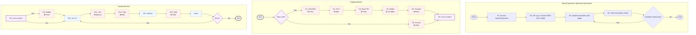

```mermaid
%%{init: {'flowchart': {'nodeSpacing': 50, 'rankSpacing': 70}}}%%
graph TD
    %% SuperPaymaster Flow
    subgraph SuperPaymaster Workflow [SuperPaymaster Optimized Interaction]
        A2([Start]) --> B2[S1: Access SuperPaymaster]
        
        B2 --> C2[S2: Set up or connect ERC-4337 wallet]
        
        C2 --> D2[S3: Initiate transaction with dApp]
        
        D2 --> E2[S4: View transaction result]
        
        E2 --> F2{Continue interacting?}
        F2 -->|Yes| D2
        F2 -->|No| G2([End])
    end

    %% Traditional Flow Part 1
    subgraph TraditionalPart1
        A([Start]) --> B{New User?}
        B -->|Yes| C[S1. CEX/DEX<br/>❌ Fees] 
        C --> D[S2. KYC<br/>❌ Wait] 
        D --> E[S3. Buy ETH<br/>❌ Fees] 
        E --> F[S4. Wallet<br/>❌ Complex] 
        F --> G[S5. Transfer<br/>❌ Fees] 
        G --> I[S8. Cross-chain?]
        B -->|No| H[S6. Access<br/>❌ Risk] 
        H --> I
    end
    
    %% Traditional Flow Part 2
    subgraph TraditionalPart2
        J[S8. Cross-chain?] -->|Yes| K[S9. Bridge<br/>❌ Fees] 
        K --> L[S10. Init TX]
        J -->|No| L
        L --> M[S11. Gas<br/>❌ Manual] 
        M --> N[S12. Sign<br/>❌ Risk] 
        N --> O[S13. Submit] 
        O --> P[S14. Wait<br/>❌ Slow] 
        P --> Q[Done] 
        Q --> R{More?}
        R -->|Yes| L
        R -->|No| S([End])
    end
    
    %% 样式定义
    classDef start_end fill:#f5f5f5,stroke:#666,stroke-width:2px,rx:25;
    classDef decision fill:#f9f0ff,stroke:#9645c4,stroke-width:2px;
    classDef problem fill:#fff0f0,stroke:#e88,stroke-width:1px;
    classDef action fill:#f0f8ff,stroke:#88e,stroke-width:1px;
    classDef benefit fill:#e6ffe6,stroke:#4a90e2,stroke-width:2px;
    
    %% 应用样式
    class A,S,T,Z start_end;
    class B,I,J,R,Y decision;
    class C,D,E,F,G,H,K,M,N,P problem;
    class L,O,Q action;
    class U,V,W,X benefit;
```