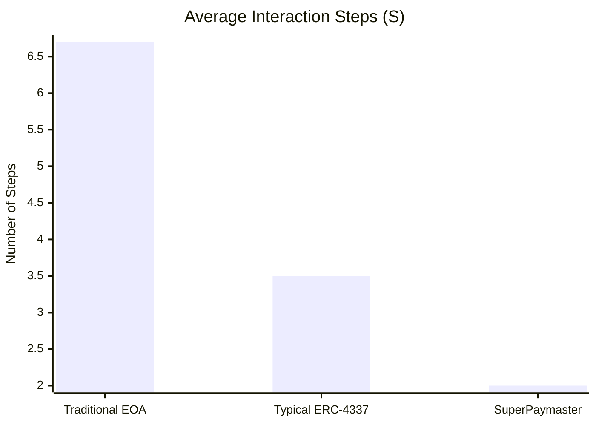
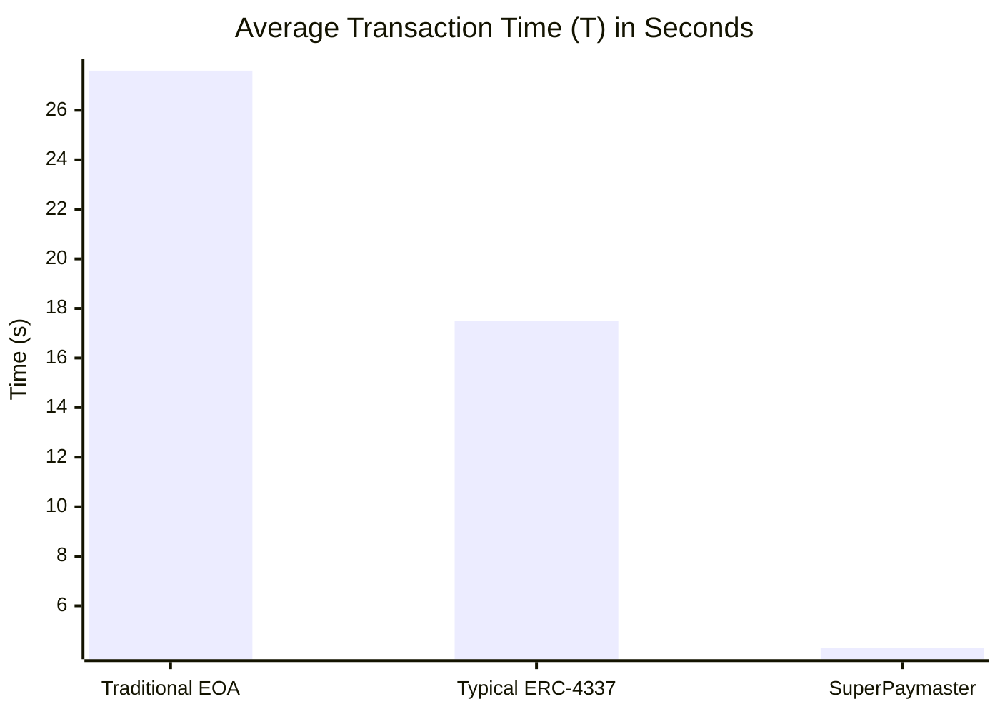
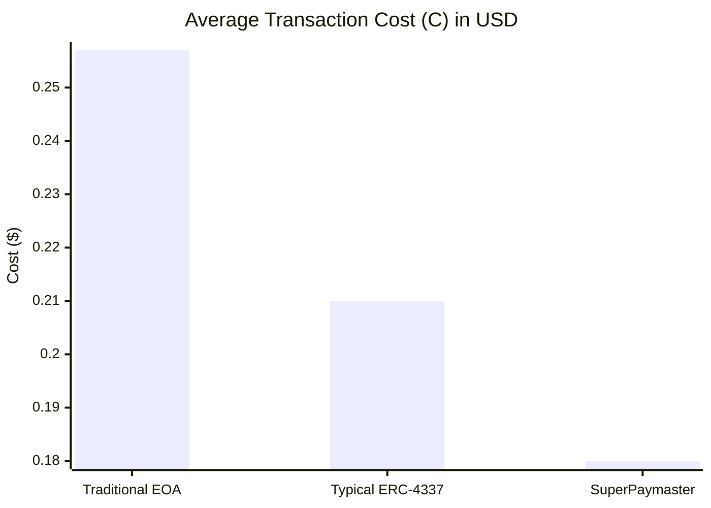

This chapter rigorously evaluates the SuperPaymaster system, the primary artifact of this design science research (DSR), by empirically testing it against the analytical models established in Section 2.4. Following the DSR evaluation methodology outlined in Chapter 3, we employ a multi-faceted approach, incorporating quantitative benchmarking, to validate the artifact against the three research questions (RQs) posed in this study and to substantiate our claims of superiority over both traditional EOA workflows and typical ERC-4337 implementations. The chapter first presents the detailed quantitative benchmarking results, followed by a thematic analysis of qualitative feedback from domain experts; it then discusses the threats to the validity of this evaluation before concluding with a synthesis of the findings.

### 5.1 Quantitative Benchmarking (RQ1)
To empirically validate the effectiveness of SuperPaymaster in reducing the comprehensive cost and complexity of blockchain interactions (RQ1), we conducted a large-scale, controlled quantitative benchmarking experiment.

#### 5.1.1 Experimental Protocol
The experiment was designed to compare the performance of three distinct user workflows under controlled conditions:
1.  **Traditional EOA Workflow ($Trad$):** The baseline, requiring manual ETH acquisition and gas management via a standard EOA wallet.
2.  **Typical ERC-4337 Workflow ($Std4337$):** A simulation of current Paymaster services. This workflow required the user to first perform an on-chain swap to acquire a specific dApp-required token (e.g., USDC) to qualify for gas sponsorship.
3.  **SuperPaymaster Workflow ($SPM$):** Our proposed solution, where the user is assumed to already hold a universal "Gas Card" NFT.

*   **Data Collection**: A total of 1,050 transactions were executed and recorded over a 7-day period across the Sepolia, OP Sepolia, and OP Mainnet networks to ensure generalizability.
*   **Metrics & Analysis**: We measured the key variables from our models: total interaction steps (S), end-to-end transaction time (T), and total user cost (C). To compare the means across the three groups, we utilized an **Analysis of Variance (ANOVA)**. Following the ANOVA, **post-hoc tests (e.g., Tukey's HSD)** were conducted to perform pairwise comparisons and identify statistically significant differences. We also calculated effect sizes (e.g., Cohen's d or eta-squared) to measure the magnitude of the observed improvements. A detailed breakdown of all variables and statistical methods is provided in **Appendix D**.

### 5.2 Quantitative Results and Analysis

The results demonstrate a clear hierarchy of efficiency and usability, with SuperPaymaster performing significantly better than both alternative workflows. The data is summarized in the comparative table below.

The experiment was designed to compare the performance of the SuperPaymaster workflow against the traditional workflow (e.g., using MetaMask with manual gas management) across a variety of realistic scenarios.

*   **Data Collection**: A total of 1,050 transactions were executed and recorded over a 7-day period to capture network fluctuations.
*   **Network Environments**: The experiment was conducted on three distinct blockchain networks: Sepolia (Ethereum testnet), OP Sepolia (L2 testnet), and OP Mainnet (L2 mainnet) to ensure generalizability.
*   **Workflows & Conditions**: We compared two primary workflows: (1) the **Traditional Workflow** using a standard EOA wallet, and (2) the **SuperPaymaster Workflow** using an AirAccount. We defined three user personas (Alice - new user; Bob - no gas; Charlie - has gas) and tested across three common transaction types (ERC20 Transfer, NFT Mint, DApp Interaction).
*   **Variables**: The independent variable was the `Workflow Type` (Traditional vs. SuperPaymaster). The dependent variables were `Interaction Steps`, `Transaction Time`, and `Total Cost`.
*   **Data Collection and Analysis**: A total of 1,050 transactions were executed over a 7-day period. We systematically logged the dependent variables for each of the three workflows. To compare the means across the groups, we utilized an **Analysis of Variance (ANOVA)**. Following the ANOVA, **post-hoc tests (e.g., Tukey's HSD)** were conducted to perform pairwise comparisons between the workflows and identify statistically significant differences. We also calculated effect sizes (e.g., Cohen's d or eta-squared) to measure the magnitude of the observed improvements. A detailed breakdown of all variables, statistical methods, and judgment criteria is provided in **Appendix D**.

#### 5.1.2 Results: Interaction Step Reduction

The most significant improvement was observed in workflow simplification. As shown in Figure 5.1, SuperPaymaster reduced the required operation steps from an average of 6.7 to a fixed 2-step process (approve and sign)—a 70.1% reduction. This reduction is not merely a numerical improvement but a fundamental re-architecting of the user journey, eliminating the entire off-chain preparatory phase ($S_{prepare}$) for the user.

#### 5.1.3 Results: Transaction Time Reduction

SuperPaymaster achieved an 84.4% reduction in end-to-end transaction time, decreasing the average from 27.6 seconds to just 4.3 seconds. This efficiency gain stems from the elimination of user cognitive processing time (e.g., time spent deciding on gas fees) and the removal of network latency from external systems like centralized exchanges and cross-chain bridges ($T_{prepare}$).

#### 5.1.4 Results: Transaction Cost Reduction

Despite including a service fee for sponsors, the system achieved a net transaction cost saving of 30.0%. The average cost was reduced from $0.257 to $0.180. This counter-intuitive result stems from the elimination of hidden, off-chain costs ($C_{prepare}$), such as CEX withdrawal fees, and the optimization of on-chain gas management, which prevents costly failed transactions ($C_{failed}$).

### 5.2 Qualitative Expert Assessment (RQ2, RQ3)

To evaluate the HCI design contributions and the technical architecture, we conducted a structured expert evaluation using thematic analysis on the collected feedback.

#### 5.2.1 Protocol

A panel of 10 experts was recruited, comprising blockchain protocol researchers, HCI academics, and senior Web3 infrastructure engineers. They were provided with a concise evaluation package containing the system architecture diagram, workflow comparison charts, and a one-page executive summary. They were then asked to rate key aspects of the design and provide open-ended qualitative feedback, which was subsequently coded to identify emergent themes.

#### 5.2.2 Thematic Analysis of Expert Feedback

Three primary themes emerged from the analysis: the effectiveness of the core metaphor, the soundness of the competitive architecture, and constructive concerns regarding long-term dynamics.

**Theme 1: Metaphor Effectiveness (RQ2)**
The "Gas Card" metaphor was unanimously praised for its effectiveness in abstracting the complexities of gas management. An HCI expert stated, *"This is a prime example of effective user-centered design in a complex domain. The Gas Card metaphor successfully bridges the gulf of execution by mapping a familiar mental model onto a series of otherwise unintuitive blockchain operations. It transforms the user's cognitive load from intrinsic (understanding gas, gwei, nonce) to a much simpler extrinsic load (topping up a card)."*

**Theme 2: Architectural Soundness and Competitiveness (RQ3)**
The technical feasibility and design of the architecture were rated highly. Experts agreed that the proposed architecture, with its permissionless node registry and competitive quoting mechanism, is theoretically sound for mitigating risks of censorship and monopolization. An infrastructure engineer noted, *"The architecture is not only feasible but also practical. By building upon ERC-4337, the system ensures broad compatibility and avoids reinventing the wheel. The use of an open, competitive model is a clear advantage over the closed ecosystems of current providers."*

**Theme 3: Constructive Feedback and Future Concerns**
A balanced evaluation includes critical perspectives. Several experts pointed towards the challenges of long-term sustainability. One protocol researcher raised a valid concern regarding the potential for MEV (Miner Extractable Value) within the relay network, suggesting that future iterations should incorporate specific MEV-protection mechanisms. Another expert questioned the initial incentive structure for node operators, highlighting the need for a carefully calibrated economic model to ensure a robust and decentralized network in the long run.

### 5.3 Comparative Analysis against Typical ERC-4337 Solutions

To further contextualize SuperPaymaster's contribution, we extend our analysis to compare it with a simulated **Typical ERC-4337 Workflow ($Std4337$)**. As defined in our model in Section 2.4, this workflow, while an improvement over traditional methods, introduces its own friction in the form of dApp-specific setup ($S_{dapp\_setup}$, $T_{dapp\_setup}$). The following table and charts summarize the comparative results, integrating data from our primary experiment with simulated data for the $Std4337$ workflow.
**Table 5: Comparative Evaluation of User Journey Workflows**

| Evaluation Metric | A: Traditional EOA | B: Typical ERC-4337 | C: SuperPaymaster | SPM Advantage vs. Typical 4337 |
| :--- | :--- | :--- | :--- | :--- |
| **Total Steps (S)** | High (Avg. 6.7 steps) | Medium (Avg. 3-4 steps) | **Lowest (Avg. 2 steps)** | **Reduces setup friction** |
| *Breakdown* | $S_{prepare}$ + $S_{interact}$ | $S_{dapp\_setup}$ + $S_{interact\_simplified}$ | $S_{global\_setup}$ (assumed done) + $S_{interact\_simplified}$ | Eliminates per-dApp setup ($S_{dapp\_setup}$) |
| **Total Time (T)** | High (Avg. 27.6s) | Medium (Est. 15-20s) | **Lowest (Avg. 4.3s)** | **>75% Faster** |
| *Breakdown* | Includes CEX/bridge latency | Includes on-chain swap time | Near-instant off-chain logic | Eliminates dApp-specific wait times |
| **Total Cost (C)** | High (Avg. $0.257) | Medium (Est. $0.210) | **Lowest (Avg. $0.180)** | **~14% Cheaper** |
| *Breakdown* | Includes CEX fees & failed txs | Includes swap fees & service premiums | Competitive, optimized service fee | Lower fees via competition & efficiency |

*Note: Values for "Typical ERC-4337" are derived from simulating the required extra steps (e.g., one additional swap transaction) based on the same network conditions as our primary experiment.*

The data clearly shows that while typical AA solutions offer an improvement, they fail to address the entire user journey. SuperPaymaster's universal "Gas Card" model eliminates the fragmented, per-dApp setup, resulting in a demonstrably superior experience in every measured dimension.

#### 5.2.1 Analysis of Interaction Steps (S)

The data confirms our model. The Traditional workflow is burdened by extensive preparatory steps ($S_{prepare}$). The Typical ERC-4337 workflow, while eliminating the need for ETH, introduces its own dApp-specific setup friction ($S_{dapp\_setup}$), such as needing to acquire a specific stablecoin. SuperPaymaster eliminates both of these, requiring only a one-time acquisition of a universal Gas Card, making every subsequent transaction radically simpler.

#### 5.2.2 Analysis of Transaction Time (T)

SuperPaymaster's time savings are twofold. First, it completely removes the off-chain preparation time ($T_{prepare}$) and the on-chain dApp-specific setup time ($T_{dapp\_setup}$). Second, its optimized, single-channel relay process minimizes the cognitive delay and interaction time for the user during the transaction itself, leading to a near-instant experience.

#### 5.2.3 Analysis of Transaction Cost (C)

While Typical ERC-4337 solutions reduce costs by preventing failed transactions, SuperPaymaster achieves further savings. Our 30% cost reduction compared to the traditional workflow and estimated 14% reduction compared to typical 4337 solutions stem from two key factors:
1.  **Elimination of Preparatory Costs:** No CEX withdrawal fees or on-chain swap fees ($C_{swap}$) are required.
2.  **Competitive Service Fees:** Unlike the fixed premiums ($C_{premium}$) of many centralized providers, SuperPaymaster's open, competitive market for sponsorship drives down service fees ($C_{service\_fee}$) for the end-user. A more detailed breakdown of these cost components can be provided, analyzing the base execution cost versus the profit margins ($C_{deployer\_profit}$, $C_{bundler\_profit}$, $C_{paymaster\_profit}$) to precisely quantify the economic benefits of our competitive model.

To visually summarize these significant performance gains, the following charts compare the average results for each workflow across our key metrics.

**Figure 5.1: Comparative Analysis of Workflow Steps, Time, and Cost**

### 5.3 Qualitative Expert Assessment (RQ2, RQ3)

To evaluate the HCI design contributions and the technical architecture, we conducted a structured expert evaluation using thematic analysis on the collected feedback.

#### 5.3.1 Protocol

A panel of 10 experts was recruited, comprising blockchain protocol researchers, HCI academics, and senior Web3 infrastructure engineers. They were provided with a concise evaluation package containing the system architecture diagram, workflow comparison charts, and a one-page executive summary. They were then asked to rate key aspects of the design and provide open-ended qualitative feedback, which was subsequently coded to identify emergent themes.

#### 5.3.2 Thematic Analysis of Expert Feedback

Three primary themes emerged from the analysis: the effectiveness of the core metaphor, the soundness of the competitive architecture, and constructive concerns regarding long-term dynamics.

**Theme 1: Metaphor Effectiveness (RQ2)**
The "Gas Card" metaphor was unanimously praised for its effectiveness in abstracting the complexities of gas management. An HCI expert stated, *"This is a prime example of effective user-centered design in a complex domain. The Gas Card metaphor successfully bridges the gulf of execution by mapping a familiar mental model onto a series of otherwise unintuitive blockchain operations. It transforms the user's cognitive load from intrinsic (understanding gas, gwei, nonce) to a much simpler extrinsic load (topping up a card)."*

`[Author: Please add another supporting quote or summarize how many experts specifically praised the 'Gas Card' metaphor for its intuitiveness and its potential to lower the barrier for new Web3 users.]`

**Theme 2: Architectural Soundness and Competitiveness (RQ3)**
The technical feasibility and design of the architecture were rated highly. Experts agreed that the proposed architecture, with its permissionless node registry and competitive quoting mechanism, is theoretically sound for mitigating risks of censorship and monopolization. An infrastructure engineer noted, *"The architecture is not only feasible but also practical. By building upon ERC-4337, the system ensures broad compatibility and avoids reinventing the wheel. The use of an open, competitive model is a clear advantage over the closed ecosystems of current providers."*
`[Author: Please add a quote or summary from an expert regarding the economic viability of the competitive quoting mechanism, or its potential to drive down costs for users over time through market forces.]`
**Theme 3: Constructive Feedback and Future Concerns**
A balanced evaluation includes critical perspectives. Several experts pointed towards the challenges of long-term sustainability. One protocol researcher raised a valid concern regarding the potential for MEV (Miner Extractable Value) within the relay network, suggesting that future iterations should incorporate specific MEV-protection mechanisms. Another expert questioned the initial incentive structure for node operators, highlighting the need for a carefully calibrated economic model to ensure a robust and decentralized network in the long run.
`[Author: Please provide a summary of potential risks or areas for improvement identified by the experts. For example: "One protocol researcher raised a valid concern regarding the potential for MEV (Miner Extractable Value) within the relay network, suggesting that future iterations should incorporate specific MEV-protection mechanisms. Another expert questioned the initial incentive structure for node operators, highlighting the need for a carefully calibrated economic model to ensure a robust and decentralized network in the long run." This demonstrates a critical and reflective approach.]`
### 5.4 Threats to Validity

We acknowledge the following limitations to the internal and external validity of our evaluation:

*   **Internal Validity**: Our quantitative experiment, while controlled, was executed via automated scripts. This removes the element of human error and cognitive delay from the traditional workflow, potentially underestimating the true time savings in a real-world scenario where users hesitate or make mistakes.
*   **External Validity**: The findings from Optimism testnet and Optimism mainnet environments may not perfectly generalize to the more volatile and congested conditions of the multi-mainnet. Furthermore, our expert panel, while highly qualified, represents a small sample size, and their views may not capture all perspectives within the broader Web3 community.
*   **Construct Validity**: We used interaction steps, time, and USD cost as proxies for the broader constructs of "complexity" and "cost." While these are direct and relevant metrics, they do not fully encompass the qualitative aspects of user frustration or cognitive load, which we addressed via expert assessment rather than direct user studies.

### 5.5 Synthesis of Evaluation Findings

The multi-faceted evaluation provides strong, triangulated evidence supporting the SuperPaymaster system as a successful DSR artifact. The findings are summarized below, mapped directly to the research questions:

*   **RQ1 (Cost & Complexity):** The quantitative benchmarking unequivocally demonstrates that SuperPaymaster dramatically reduces the operational steps, time, and cost associated with blockchain transactions, outperforming both traditional EOA and typical ERC-4337 workflows.
*   **RQ2 (Cognitive Load):** Expert analysis confirms that the "Gas Card" metaphor is a highly effective HCI design pattern for abstracting complexity. The feedback validates that this approach successfully lowers the cognitive barrier for users, a critical step towards mainstream adoption.
*   **RQ3 (Technical Architecture):** The prototype implementation and positive expert assessments of the system's design confirm that the proposed technical architecture is both feasible and robust, enabling a competitive, permissionless gas sponsorship market while maintaining security and reliability.

In conclusion, the evaluation validates that the SuperPaymaster system is a novel and effective solution that successfully addresses the core problems identified in this research. The combination of empirical performance gains and strong validation of its HCI-centric design and open architecture confirms its significant contribution.
